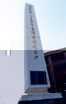
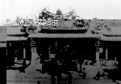
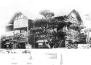
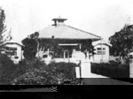
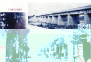
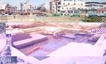

## 第一節 笨港簡史
---

笨港在十七世紀荷蘭人所繪的地圖中，稱為Ponkan。因為當時常有平埔族出沒其地，有人認為Ponkan乃是平埔族語，隨後閩粵移民稱此地為「笨港」，應從平埔族語音譯而來。

　笨港發展於笨港溪南北兩岸，對外通稱笨港。本身卻再分為笨南港、笨北港兩地。明朝天啟元年（1621），在日本經商的顏思齊因不滿日本幕府政府欺壓華僑，與結拜兄弟鄭芝龍等人密謀起義，不料事機洩露，眾人只好駕船逃逸，最後在笨港登陸，開始紮營設寨，開墾屯田。顏思齊在笨港建立十寨，大約在今日北港鎮及鄰近水林鄉一帶。一面可憑天險避免荷蘭人騷擾，一面又可抵禦平埔族人的侵襲。北港鎮圓環處有省政府在民國四十八年設立的「顏思齊開拓台灣紀念碑」，就是記載登陸笨港之事蹟。

| 1-1 顏思齊登台紀念碑 | 1-2 早年媽祖廟 | 1-3 義民塚 |
| ------------------ | ------------------ | ------------------ |
|  |  |  |

顏思齊病逝，鄭芝龍繼承領導地位，在明朝崇禎元年（1628）受招撫，為明朝守海疆。時值福建大旱，鄭芝龍乃號召福建沿海居民入墾台灣，此為漢人大規模移民台灣之開始。因移民需由笨港登陸，再往內陸開墾，許多用品、農具，甚至牛隻及車輛都必須在此採購；內陸的農產品、原住民的鹿皮，亦在此地交易，於是街市日見繁榮，成為台灣中南部對外門戶，僅次於府城台南。

　由於笨港人口漸多，地位漸形重要，清廷特別調撥台灣水師營駐守。康熙三十三年（1694）臨濟宗三十四世僧樹璧奉媽祖像入居笨港，三十九年建廟，此為笨港地區最早建立的媽祖廟。
　
　笨港因地理形勢良好，致使經濟迅速發展外，郊行林立亦是主因。當時主要的郊行有泉州郊、廈門郊、許姓的龍江郊等，此外糖郊、米郊及船行、油車亦十分興盛。由於商旅往來頻繁，康熙五十五年，居民集資合建公館，供應往來官差休息、投宿，平時還可宣講聖諭、申明條約或做為教育子弟的學堂，後因水患傾毀。公館原址在今日公館街一帶，行政區域上亦劃分為公館里。
　
　清雍正至乾隆中葉是笨港地區發展最快速的時期，笨港街肆隨人口增加被劃分為南、北二堡。北街屬大榔東堡，南街屬打貓西堡，但對外仍合稱笨港街。笨港街上貿易繁興，帶動地方繁榮。但商品價格的訂定、度量衡的標準、公共秩序的維護等問題，都需要有仲裁處置的場所。因此，泉州郊、廈門郊、龍江郊三郊合資在乾隆四年（1739）創建水仙宮為公所，處理商務、貿易問題，並兼祀水仙尊王。
　
　乾隆四十七年（1782）彰化地區之漳、泉百姓因口角發生械鬥，笨港因位於海道要衝，居民也受波及產生械鬥。乾隆五十一年底（1786）林爽文抗清事件發生，笨南港土反頭厝附近居民起而響應，北街居民因見爽文之師不足以完成復興大業，遂結壘自固。乾隆五十二年五月兩軍對陣，北街義勇遇害者108人。是年九月，林爽文軍遭官軍擊潰，笨港於焉收復。林爽文事件平定，北街居民建義民廟合祀遇害義勇軍。
　
　嘉慶二年（1797）台灣遭受颶颱侵襲，笨港溪泛濫成災，笨港地區災情慘重，浸毀廟宇、民宅頗多。嘉慶五年，笨北港街蔡秀捐款倡建北壇，以供暫厝亡者靈櫬。因此次風災，笨南港部分街肆遭沖毀，部分從事糖、米生產者逐漸遷往麻園寮暫居。嘉慶九年重建街庄，稱為「新南港街」，即今新港。由於笨北港街受災較為輕微，尚能維持貿易買賣，但笨南港街卻從此蕭條沒落。
　
　道光十二年（1832）嘉義店仔口莊人張丙起義抗清，部眾之一股侵入笨港，所幸王得祿率義勇軍破敵才解圍。同治元年（1862）戴潮春結合天地會作亂，其部眾亦進犯笨港。笨北港人集合義勇與之激戰，大敗戴潮春黨羽，但新街地區受創頗重。
　
　咸豐八年（1894）台灣正式開港，外商挾鉅資入台，購運茶、糖、樟腦，並在台灣販售鴉片。台灣銀兩大量外流，以致社會經濟情況日漸衰退。此後外夷多次入侵台灣，笨港因為距海較遠，始終倖免於難。直到光緒年間，貿易情況仍然昌盛，有「小台灣」之稱，街名則因在港之北，簡稱為「北港」。
　
　光緒二十年（1893）十月一日，北港街區發生大火，毀商店民宅近五成，致使商業衰頹。光緒二十一年，日本據台。爾後北港隸屬台南州，設北港郡。南港庄歸台南縣嘉義廳管轄。自此笨北港、笨南港開始分治。 [參圖 1-04 笨南 、北(含新港)史據變遷消長圖]

| 1-5 北港俱樂部 | 1-6 北港街役場 | 1-7 北港厚生院 |
| ------------------ | ------------------ | ------------------ |
|  |  |  |

日人據台導致社會不安，不願歸化日籍者紛紛返回大陸定居。日本興建高雄、基隆等港，逐漸將閩台貿易轉化為日台貿易，貿易權幾乎全由日人控制，北港貿易一落千丈，不復往日盛況。後來日人在北港興建新式糖廠，北港成為附近地區油、糖及農產品的集散中心，但人口外流情形仍很嚴重。
　
　日本據有台灣，在政治上採取高壓手段，但卻全力推動台灣現代化，建立預算、稅收制度，設立現代化學校，例如北港公學校、女子公學校、高等公學校等。另修築嘉南大圳，設立銀行、農會，推廣農民合作計畫，興建街役場（鎮公所）、厚生院（衛生所）、自來水廠等。並於昭和九年（1934）建北港大橋，使北港社會型態，由以貿易導向的社會，轉變為自給自足的社會。
　
　民國三十四年（1945）台灣光復，民國三十七年起在台實施三七五減租、公地放領、耕者有其田等政策，全台逐漸呈現蓬勃景象。民國三十八年政府遷台，重新劃分台灣行政區域，笨北港街改為雲林縣北港鎮，笨南港街則改為嘉義縣新港鄉管轄的南港村。
　
　北港鎮位於北港溪之滑走坡上，為嘉南平原近海的隆起平原，其心臟地帶為清時的北港街，即今東陽、光民等十五里，海拔約十公尺左右。明末清初為台灣西部通大陸各港之大商埠，有「小台灣」之稱。明崇禎十四年，荷人從安平北上在西海岸登陸，北征平埔族之行軍路線，即從紅毛路（水林鄉車港村）經笨港東進至貓兒干（今崙背豐榮村）等社。今大北里一帶舊稱大北門，即是南北陸運經笨港北上之大門。

　民國八十一年五月二十日，朝天宮前中央市場改建工程，在進行開挖地下室時，發現地下三公尺處有大量磚瓦、碎片及早期器物。笨港媽祖文教基金會緊急發函政府各相關單位，希望能採取搶救措施，但未被重視。
　
　李政隆古蹟寺廟研究室首先發動員工搶救，基金會及地方熱心人士適切支援，除了拍照、記錄、也撿拾散佈於工地之瓷器、陶器、建材、鐵器、土器等出土文物，其中大部分交由朝天宮或合和會保管。因許士能老師及合和會長吳俊彥共同向國家歷史文物館爭取出書，現已印刷成冊，此書將是研究北港歷史及先民生活最佳素材及見證。
　
　由出土文物證明，笨港在四百年前就有漢人居住，並與大陸通商。目前在北港復興鐵橋附近又發現崩溪缺古遺址，還好該遺址目前列為國家保護區，雲嘉兩縣政府都張貼公告，不得擅自挖取撿拾區內古物，以免觸法。笨港歷史的再進一步研究，可從此一地區著手。

| 1-8 北港街及北港大橋 | 1-9 北港出土文物及遺址 | 1-10 北港出土文物及遺址 |
| ------------------ | ------------------ | ------------------ |
|  |  |  |

在台灣經濟開始起飛後，工業逐漸取代農業，農村人口外流，北港鎮又漸趨沒落。所幸歷史悠久的朝天宮，是全台媽祖信仰中心，每年吸引數百萬香客到北港進香、觀光，對北港的繁榮有莫大助益。但北港要進步、要壯闊，除闢建宗教觀光區外，還需鎮民摒棄私心貢獻卓見，同心規劃建設屬於大家的北港才行。
