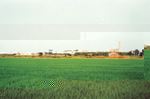
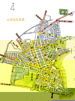

## 第三節 地形地勢
---

北港鎮屬雲林縣廿鄉鎮市之一，東與元長鄉、嘉義縣新港鄉交界，西鄰水林鄉，南以北港溪和嘉義縣為界，北則和四湖鄉、元長鄉 為鄰。面積41.499平方公里。

　本鎮共分為二十八里(圖1-13)。計有清時屬北港街，現在是鎮內心臟地區的東陽、光民、東華、南安、中和、義民、共榮、西勢、仁和、賜福、公館、大同、仁安、華勝、光復等十五里(圖1-12)，及新街、劉厝、後溝、新厝、府番、草湖、溝皂、番溝、大北、好收、樹腳、扶朝、水埔等十三里，面積最大為草湖里。地形大都是平原，愈東北工商愈發達、人口較密集。愈西地形略高，大部分為農田，人口不集中。近來工廠，人口漸向郊外西南發展。

　本鎮位於北港溪下游末端北岸之滑走坡上，為嘉南平原靠近之隆起平原，高度平均為海拔10公尺。地勢平坦自東北向西南傾斜，坡度僅有千分之1.25，灌溉水圳系統及排水溝都順地勢並列而行（參圖1-13 北港溪灌溉圖）。

　談到地勢高低，新街劉厝一帶為半月形沙丘之北麓，為本鎮地勢較高地段，海拔十公尺至十五公尺間。後溝、新厝、府番、溝皂等里位於心臟地區東北方二.二公里，是濁水溪大沖積扇平原之西南部，東臨北港溪，海拔十至十五公尺，里內有條大水溝，可能是乾隆十五年前之笨港溪河道。

　草湖地區是本鎮超過三平方公里的大里，離心臟區北北東約三.六公里，北距嘉南大圳幹線北港支線百餘公尺，海拔僅十公尺為本鎮較低的一里。番溝里、大北里距嘉南圳北港支線二百公尺，海拔約五公尺至十公尺。

　好收里口庄位於中心區五.六公里，海拔十公尺左右，是早期的客家聚落。樹腳里包涵大庄、頂庄、中庄、過溝仔、船頭埔、巨人中學、愛國新村都是，是本鎮很大的一里。扶朝里、水埔里地處中心區之西南西方一. 三公里，靠北港溪下游之西岸，海拔十公尺左右。

　本鎮地質屬於第四紀沖積層，主要由粘土、細沙、粗沙組成。土壤本為鹽土，但經長期改良，鹽分已低，適合農作物種植。新街、劉厝、樹腳里鹽分較高，但很多都是疏鬆的砂質土壤。 

（一）砂頁岩新沖積土：大部份分佈於本鎮西南新街、府番、扶朝、新厝等里，部份分佈於好收里等地，面積佔1、756公頃，此種土壤之排水佳，利於耕種。

（二）粘板岩與砂頁岩混合沖積土：大部分在北半部的番溝里、大北里、劉厝里等地面積約佔1、030公頃，土壤鹽份重，但因防鹽技術漸進步，仍可從事農業耕種。

（三）粘板岩與老沖積土：分佈於東北區，大部分在溝皂，有些分佈在草湖里四周，面積501公頃。乃由濁水溪沖積物沈積成，此類土壤容易積水，排水情況不佳。

　鎮內地勢以朝天宮及附近較高，次高為北高、北農、大同里，華勝里、共和里較低。北港土壤跟早期北港溪水患，及下游潟湖有關。如何改善土壤，是重要議題，適度休耕、輪耕值得探討，大量施肥亦有待商榷。

| 1-14 綠油油的郊野 | 1-15 北港鎮街道圖 |
| ------------------ | ------------------ |
|  |  |
