## 第六節 北港的交通
---

從顏思齊登陸笨港，北港溪曾創下商旅雲集，船桅不絕的盛況。但在河道日漸淤塞，海岸西移，距海日遠，繁華不再。北港地區曾依賴擺渡運輸貨物與民眾到嘉義縣的新港、六腳兩鄉，在北港大橋暢通後，仍有崩山村、土反頭厝的竹筏在黑濁髒臭的溪流上，日復一日輸送兩岸的客貨。曾幾何時，雲嘉大橋巍然聳立，擺渡者也隱然消失了。

| 1-20 北港大橋 | 1-21 早年的渡頭 |
| ------------------ | ------------------ |
| 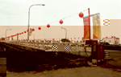 |  |

北港蕞爾小鎮，北港溪早失去運輸功能，既沒有高速公路、縱貫鐵路經過，卻有極為綿密的交通網路。為什麼？應該說是拜香火鼎盛的朝天宮之賜吧！從早期台糖鐵路時代，曾經打破台糖鐵道的載客量紀錄，到現在鐵路走入歷史，但仍是全省客運班次最頻密的地方，可見媽祖信仰力量之大了。
　
　北港的交通，主要以公路為主。北起彰化，南至台南市的台十九線，也就是「中央公路」。全線幾乎都是四線道，但從新街派出所到北港大橋卻因交通流量過大，特別是進香期湧進龐大人潮，常造成交通阻塞。中央公路也是嘉義縣及台南縣等離高速公路、西濱公路較遠鄉鎮的交通動脈。
　
　另從高速公路斗南交流道走縣一四五道路或從嘉義、大林、水上等交流道，都可從新港方向進入北港。台十七線或西濱快速道路來的民眾，則可從口湖、水林轉入一六四道路到北港。
　
　如此便捷的交通網，除自用車輛外，客運就擔負送往迎來的輸送任務。至於民國五十一年起，陸續興建的產業道路，負責鄉鎮村里與產業地區物產運輸，因縣政府重視此事，路面均為瀝青路面，對民眾通行載送農作物有極夸助益。
本地除歷史悠久或規模較大之嘉義客運、台西客運、統聯外，其他像大安行、大通行、泰安、日統、統一、統益等大型巴士之停靠站，都不約而同設在華勝路與大同路交叉口。無論往來台北、中壢、台南、高雄等地，上高速公路或經省道皆任君選擇。

|  | 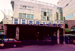 | 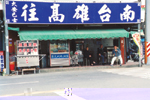 |
| ------------------ | ------------------ | ------------------ | 
|  | 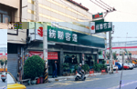 | 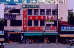 |

嘉義客運在文化路與公民路交叉口（俗稱林仔抱車），往來嘉義、民雄、新港、太保、東勢、台西、口湖、四湖。曾風光一時的台西客運，經營土庫斗六線經虎尾，是北港經營歷史最久的客運。車站最早設在郵局對面，因站地出售改建大樓，現與統聯、台中客運共租在中正路尾，靠近舊火車站。車班經台十九線往元長、麥寮、褒忠、虎尾、斗南、斗六等地。
　
　嘉義公車站設於鎮立圖書館前，往來嘉義、民雄、大林、梅山等地，一天亦有幾十班次。民國七十年加入營運的台汽客運，以中長程路線為主，但因不敵民營車班多、票價便宜、路線彈性大的優勢，在民國八十五年撤站。華勝路的大樓目前租給日統，徒留人去樓空的回憶給北港人。

| 1-28 公車站 | 1-29 第二停車場 | 1-30 第一停車場 |
| ------------------ | ------------------ | ------------------ | 
|  |  | 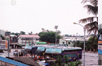 |

北港計程車行，幾乎都設在文化路上。近年來，競爭激烈，計程車在各車站及圓環附近招攬生意。客運、計程車、大巴士，將北港構成緊密的交通網。讓來往的旅客或到朝天宮膜拜的信徒，都便利無比。如果怕塞車，可由河堤公路或文仁路的外環道進入北港街頭，甚為方便。
　
　沿著北港溪興築的軍功堤防，除具有防洪，保障北港人安全的功能，因緊鄰市區和運動公園，一直都是民眾休閒運動的好去處。從八十七年起，水利處分期強化溪堤的安全，並闢防汛道路和市區相通，民眾沿著防汛道可直通元長、土庫，此對紓解進香期壅塞的交通情況有極大幫助 。
　
　至於進香客停車問題，可停放媽祖文化樓地下室、北港大橋附近的第一停車場、麥當勞旁的第二停車場，「龍華富貴市」地下室因出入口在市場，出入則較為不便。在進香旺季，農曆一月到三月，北港大橋、縣一六四、台十九都常出現塞車潮。為解決此一不便現象，有人倡議要儘快興建第二座北港大橋。
　
　北港曾是沿海各鄉鎮的交通樞紐，全省各地的香客像潮水湧進來，成就她一世繁華。但自從台19、松山大橋、雲嘉大橋、西濱公路陸續暢通，沿海鄉鎮南下北上都便捷無比，無需再經北港這中繼站，車潮、人潮漸減，已逐漸失去過去的榮景。高速公路全線通車，縮短香客行程，來去匆匆的香客潮，對此地的商機有莫大的影響。另外因路霸強收停車費、賣金紙，留給遊客負面印象，均值得北港人深思。
　
　據朝天宮總幹事吳祥說：「日據時代，日本人在北港建立訓練及戰鬥用兩個機場(圖1-31)。其中訓練機場北起口庄，東至劉厝、閹豬社、樹腳里；戰鬥機場從好收到西井、蒜頭寮、車巷口。日本有名的自殺部隊『神風特攻隊』常從此地機場起飛，機場人員的宿舍餐廳就在現在好收國小附近。從口庄有條道路可連接兩個機場。教練場的飛機練習完畢，常要推到竹林裡停放，避免盟機轟炸。附近的道路都種滿成排的木麻黃當防風林，行道樹是篦麻樹，日軍榨篦麻油當航空用油。」
　
　劉厝里的吳先生回憶建造機場的情景，他說：「機場以軍用為主。建造機場時，日本徵調農民徒步到民雄的溪邊撿雞蛋形的石頭，再用牛車載運回北港。為了方便管理，日軍規定每郡撿拾的數量，有時還故意弄翻牛車，但農民都沒有人敢吭聲。」
　
　吳先生接著又說：「兩個機場有道路相通。機場中央地勢高，低漥處所建的排水溝至今還存在。被徵收的農地在台灣光復時已經歸還農民了。」 現在滿目的綠野平疇，是再也看不見機場的蹤影。日軍蠻橫的事蹟隨著歲月的流轉，漸漸被人遺忘了。
　
　本地產業的優勢不再，北港溪、北港糖廠及其土地環繞，對北港的發展造成部份影響。如果老鎮無法新生，產業不能創意化，朝天宮附近的形象商圈無法開創商機，北港將可能走向沉寂。如果宗教觀光園區能早日動工，地方能結合附近觀光景點，或許北港尚有再展現昔日風華的一日。（圖1-32 北港交通路線圖）
　
### 五分車之旅

北港火車站創建於大正六年（1917），有北港─斗六、北港─嘉義、北港─朴子、北港─口湖、北港─三條崙等路線，其中北港嘉義線長二十二公里。民國五十左右，每日對開二十二班，香客時期另有直達車、汽油車、旅客列車與混合列車等。民國五十六、七年曾經締造每年盈餘二百萬元，為台糖鐵道之冠，是台糖著名的「黃金路線」。
　
　這條鐵路最早是台糖為了原料運送所敷設的專用線，後來因公共交通上需要，便開始兼營客運。因為運載原料甘蔗、糖蜜、蔗渣，洋溢甜蜜的味道，所以被稱為「甜蜜的五分仔車」，其中北港線從日據時期到七十一年為止，一直是五分車的黃金路線，主要是北港有座香火鼎盛的媽祖廟「朝天宮」。
　
　糖廠的小火車，扮演著運輸朝聖香客的任務。每年農曆三月，各地香客湧入此地，小火車班班客滿，車長必須爬到車頂剪票，成為當時的奇景。大家暱稱嘉義─北港這條路線為「進香鐵道」。
　
　除了載客外，這條鐵路也是沿途通學生必坐的路線。車廂內的通學生，每天看著火車冒著白煙、嗚嗚長笛，劃過天際。喘氣的火車頭，帶著長長的車廂，通過綠野平疇的嘉南平原，到牛斗山通過復興鐵橋，莫不滿懷快樂及期待進站。每個人都難以忘記在車廂內讀書、玩牌，及談戀愛的織夢歲月。（圖1-36 民國六十六年五分車路線圖）

> 註：五分仔車「五分」指的是「一半」。因為台糖小火車軌距六七二公釐，縱貫線軌距為一０六七公釐。在無精準測量的鄉下，即籠統將小一號的台糖小火車，稱做「五分仔車」。也有人認為台糖小火車軌距為歐美寬軌車一四三五公釐大約一半寬，所以稱為「五分仔車」。

| 1-33 昔日火車站 | 1-34 五分車鐵軌 | 1-35 五分車之旅 |
| ------------------ | ------------------ | ------------------ | 
| 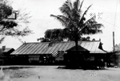 | 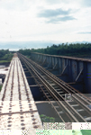 | 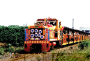 |

### 北港「復興鐵橋」 

全長八百七十公尺，創建於公元1911年的北港「復興鐵橋」是國內最長的運蔗鐵橋，串聯雲林縣北港鎮和嘉義縣新港鄉的土反頭村。只要是五、六十年代的人，永遠不會忘記五分仔車的歲月。學生到嘉義讀書、逛街，或要乘坐縱貫線鐵路，都要乘坐北港往嘉義的五分仔車。當年橫跨北港溪的復興鐵橋，載著成群進香客，浩浩蕩蕩到北港來拜媽祖，帶動北港的繁華和熱絡。
　
　這條重要交通命脈，曾發生嚴重斷橋意外。據顏連茂老師追憶：「約在民國三十三年左右，某天下午，一列滿載遊客要到北港的列車過橋之際，因山洪沖垮橋墩，列車全部掉落北港溪，造成死傷慘重的悲劇。當時四保頭保正曾人潛落水失蹤，南國民學校（現南陽國小）教師松永帶學生沿溪尋找，導致學生意外溺斃三人，校長中井和教師都被調職。」
　
　北港復興鐵橋於民國八十九年台糖停駛後，準備發包拆橋，因北港文史團體要求才保留。然台糖表示鐵橋早已報廢，要維修實有困難。最近堤防施工，河道整治，使橋墩成章魚腳，以致鐵橋岌岌可危，極需搶救。
　
　復興鐵橋造型特殊，尤其鐵橋繞彎，曲度之大，全台獨一無二，如能加以保留，對地方文化、古蹟及產業，都具有實質意義，也可讓鐵橋及境內的廢鐵道復活，五分仔車風華重現。

| 1-37 復興鐵橋一瞥 | 1-38 舊北港大橋 | 1-39 興建中的觀光大橋 |
| ------------------ | ------------------ | ------------------ | 
|  | 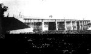 | 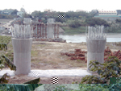 |

### 北港舊大橋及新大橋

康熙年代北港溪，還是個滾滾海港，當時交通都依靠船隻（帆船）運送貨物。然乾隆時北港溪屢次水患、改道，潟湖增多，使大陸行船漸漸無法靠岸。乾隆末期、嘉慶、咸豐等朝代，河道淤積更嚴重，導致笨港船隻無法進港，只靠外港。最後因無法通航，笨港溪兩岸往來就靠竹筏運送。
　
　初期朝天宮設義渡便民，後來只靠擺渡或涉水過溪。後來諸羅縣丞，在頂灣仔、下灣仔及土反頭厝多次設立擺渡，接送來往客人。並在舊大橋（今中山路尾）架上竹橋、木板橋，但容易損壞，也常被大水沖斷，實在麻煩又危險。
　
　民國廿六年，就在此地鋪架鋼筋水泥橋，長約四百多公尺。但水泥橋過於狹窄，又在熱鬧街頭，顯然不敷所需。雖曾一度拓寬，還是過於狹小。民國五十五年，在橋西一百多公尺處，建築長470公尺的北港大橋及引道陸橋長144.68公尺，隔年竣工同時拆除舊大橋。
　
　現在舊大橋墩猶在，準備架吊橋，直達南港以發展北港觀光事業。
　
　五十八年新大橋又拓寬十公尺，民國七十四年拓寬為二十五公尺，兩旁有行人及自行車專用道。北港大橋由省公路局興建，由周至柔省主席剪綵。鄰近的水林鄉、沿海各地經由北港大橋，往朴子、嘉義、六腳鄉、太保市都十分方便。故北港大橋為沿海地區，是條不可缺少的交通大動脈。