## 第七節 地名探源
---
笨港自顏思齊建立十寨形成聚落，迄今四百年。其間雖經不少天災人禍，但仍保留若干老街。清光緒二十年（1894）『雲林縣采訪冊』記載：「北港街及笨港，…….街分東西南北共八街，煙戶七千餘家。」（圖1-40 明清時代笨港八大古街）
　
　依據公元1971年洪敏麟教授調查所得，認為笨港八街即蜊仔街（今仁和路）宮口街（今中山路）中秋街（海關所在地）暗街仔、旌義街、打鐵街、東勢街（東勢箭）西勢街（西勢窯）豎街等等。

### 暗街仔

| 1-41 暗街仔 |
| ------------------ |
| 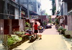 |

在笨港蕃簽市（今共和街）街尾，銜接一條東西小巷，即今安和街。每到晚上，這條巷道就漆黑無比，因此稱為「暗街仔」。據說此街是北港第一條街道，方圓百公尺內住著許多士紳，如顏謙源等。此巷子流行一首童謠：「暗街暗暝摸，貓鼠咬貓公，不怕貓鼠，怕王爺公。」
　為什麼不怕貓鼠，怕王爺公？原來這條巷子以前太暗了，又有蕃薯簽在附近拍賣，正是老鼠最好的藏身之地，看到老鼠出沒，已是司空見慣。他們最怕做壞事，被夜巡的王爺公抓個正著。這條巷子的浴室都建在前面，面對著道路，每間浴室具有透風斜砌的窗口，是不是這裡有王爺公，沒人敢窺伺，就不得而知了。

### 蜊仔街

| 1-42 昔日蜊仔街 | 1-43 現代蜊仔街 |
| ------------------ | ------------------ |
|  | 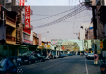 |

早期笨港出產蛤蜊，這條街道早期以蛤蜊殼填地因而得名，今為仁和路。據說街上都是大商人、郊行，交易熱絡。因此俗諺說：「走過蜊仔街，沒聽著銀聲也衰」。 

### 宮口街

| 1-44 不同時代宮口街 | 1-45 不同時代宮口街 | 1-46 現代宮口街 |
| ------------------ | ------------------ | ------------------ |
| 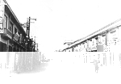 | 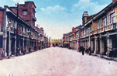 |  |

位於朝天宮正門前得名，今為中山路。日據時代拓寬，兩邊很多洋貨店及特產店。又有人稱大街或大通。

### 旌義街

| 1-47 旌義街 |
| ------------------ |
| 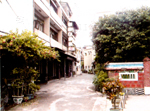 |

早期台灣有諺「三年一小反，五年一大反」。林爽文及戴潮春事件，民眾為保衛鄉里組義民團對抗，死難者建廟祀之，該街建有「義民廟」存有乾隆御賜「旌義」匾一個。

### 打鐵街

| 1-48 打鐵街 |
| ------------------ |
| 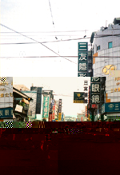 |

今民主路錦華齋店舖起至義民路口止，為笨港打鐵業集散地故名。

### 北埔路頭

亦稱「北埔渡頭」。聽說清嘉慶年間，此地有渡頭之故。日據時代稱「北埔路頭」。地點在北港大同路文化路交叉處往西一百公尺處，曾是北港街內外的分界線，亦是往樹腳里公墓必經之處，以前地方送葬常到此為止。往昔此地居民少，因民眾認為「看人出山會衰」，遇有喪葬隊伍，常緊閉家門以避邪事。隨著時代進步，此處地價高漲、商店林立。古早「哭路頭」「謝路頭」已不見蹤跡。

### 西勢窯、東勢窯

昔為窯業聚落。西勢窯在慈德堂一帶。東勢窯在笨港之東，亦是窯業聚落，現今北港第一水源地附近。東西兩窯，窯業興盛，專供嘉南一帶建材用。據說此兩窯所販賣磚瓦，瓦是自燒，磚則從福州隨船壓艙運來。一則壓在艙底，船航行較穩，一則販賣牟利。清雍正九年（1731），首任笨港縣丞胡光祖，原設官署在今東勢街。公元1734年遷移土反頭厝，官署建物於公元1895年遭地震傾毀。

### 車仔寮

昔時中秋路之別稱，因牛車運輸業聚居得名。日據時代，朝天宮附近攤販，於中秋節遷此營業故名。據說有輕便車通民雄。

### 竹圍仔內

位於新街西南方村庄，因周圍遍植竹林得名。

### 褒仔新街

咸豐年原名新興街。光緒年間，因蔡姓家族有媳被封為節婦，故名褒仔新街。又有一說「埔仔新街」，因其鄰近溪仔底之溪埔地，是新興市街故稱之。

### 蕃簽市

以今博愛路錦華齋門市部，金華山銀樓為起點，經集雅軒會館後之共和街，由北至南整條共和街皆屬於蕃簽市。內有清道光謙源行建築的甕牆。此街在乾隆十五年笨港溪變遷，南移至今博愛路溪仔底。嘉慶年間，河道內側河床形成蕃簽市集。北港四周農民或肩挑或竹筏載運至此販售蕃薯簽，因而得名。

### 溝仔墘

博愛路南段自光明路交叉點起，往南路面愈見狹窄。此路曾一度命名為永寧街，後改為博愛路。

### 溪仔底

| 1-49 溪仔底 |
| ------------------ |
| 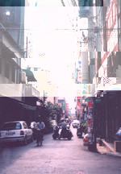 |

在今博愛路，介於中正路與民主路交界之地段。蔡相煇博士認為是街仔底之誤。

### 公竹巷

明鄭降清，清廷派水師千總曾駐紮營寨於此故名營盤口。即今公館里三民街與三興街間紮營寨，竹林遍植在當今仁和路北端三連街一帶擋風，營寨遷走後，竹林附近居民任意取用，故名「公竹巷」。

### 崩溪崎

在仁和路北端臨北港溪一帶，此處每遇豪雨或山洪爆發，溪水高漲，每每沖破堤岸，嘉慶年間水災沖毀此處，故名「崩溪崎」其意為「缺口」。

### 姓許街與四崁車仔

今復興街末稱為四崁車仔，崁即「店鋪」之稱。在清末之前有四間油車，專榨花生油，街民又都姓許，故又稱「姓許街仔」。

### 後尾崛

在今仁和里益安路東面處，清中葉這裡原住有大戶人家，其後有一大池塘，因而得名。

### 公館口

在今公館里之公館街、三民街、三興街三條窄小街道相交路口處，緊鄰四崁車仔。康熙五十六年諸羅志笨港街云：「台灣郡、鎮，此為最大。至康熙五十五年該地居民、貿易商共同捐資興建一座公館，供應往來旅客投宿外，並在無事之時，會集子弟，宣講聖訓，練武或申明條約，以維持地方安寧。」可見公館口除供住宿外，亦是貿易商共議之處，也具有教化功能。後遭水患傾毀，今公館街11. 13.15號，為古笨港公館舊址。

### 埔仔

在今賜福里義民路一帶，即今昭烈宮之東。明朝天啟元年，顏思齊登陸笨港，築十寨撫番、拓墾。埔仔是顏思齊兄弟陳衷紀開墾成『埔仔』部落，舊名沿用至今。

### 公量腳

在今義民廟前之防空洞處，即玉安銀樓之屋後，古時設有公秤，如雙方買賣斤兩疑有短少爭執情勢，在此過秤就知真偽。

### 應公埔

應公埔（非今溪畔有應公廟），即舊牛墟所在地，每逢三、六、九行市。這裡很熱鬧，構成特別景觀。當時曾是彰、雲、嘉、南地區牛隻集散地。

### 日據時代

日據時代地名，大都以行政機關或生產之相關事物為地名。（圖1-50 日據時代北港略圖）、（圖1-57 日據時代地名）

### 石頭仔路

| 1-51 石頭仔路 |
| ------------------ |
| 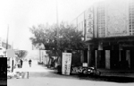 |

即今中正路，位於媽祖廟後東西向道路。日據時為北港最好之道路，北港僅這條從火車站一直鋪到媽祖廟後的石子路，因而得名。

### 郡役所

| 1-52 郡役所 |
| ------------------ |
| 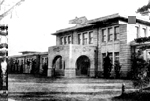 |

在今民主路土地銀行對面及現在良昌書局旁派出所、文化路這片廣大土地。郡役所如今日「警察局」。當時為北港一大建築物，民國十九年四月二十日竣工，建坪達三百十三坪多，中間入口三層樓高，左右二樓高總造價五萬四千五百五十五圓。

### 舊鎮公所

距媽祖廟後約十公尺處，由仁和路、公民路、博愛路三條街道所圍成之區域，今媽祖大樓之西面。日據時期稱「街役場」，面向仁和路，為當時北港宏偉之建築物，於民國五十四年拆除，鎮公所搬至現址。

### 舊登記所

與舊公所只隔公民路相鄰，也是面向仁和路，遺址還在，是日據時代土地登記買賣之處，如今日之地政事務所。光復後曾一度為青年反共救國團中心。曾有住家居住，裡面設有神壇供人膜拜。

### 公會堂與武德殿

| 1-53 公會堂 | 1-54 武德殿 |
| ------------------ | ------------------ |
| 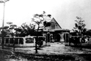 |  |

在今文化路、中正路、 民主路、義民路四條街道所圍成之方形區域。清末，此處為北港四大窪地之一，日據時代在此建有公會堂、武德殿、俱樂部。公會堂面向文化路，為北港當時最大集會所，光復後易名「中山堂」，民國五十六年拆除規劃為店鋪區。現有郵局、華僑銀行、意文餐廳、土地銀行及住家等。武德殿面向義民路，是日本警察柔道及劍道教練所，民國七十三年拆除。俱樂部面向中正路，是居民聊天、看報、下棋之場所。

### 牛車路

| 1-55 牛車路 |
| ------------------ |
| 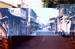 |

現今益安路及大同路。日據時代從鄉村到北港之牛車，不准走其他街道，怕壓壞路面，影響行走，因此牛車只走大同路接義民路到達牛墟。

### 老鼠仔衛生

今中山路、光明路交叉口之東南角。大正十一、二年間（1922-1923）鼠疫流行，此疫由老鼠傳染，日本政府下令每家要撲殺老鼠掩埋，老鼠尾巴剁掉，繳交至此處驗收，因而得名。

### 冰會社

在今北港戲院，復興街之北邊至堤防間土地皆是。日據時代有北港唯一大製冰廠，現已拆除，改建住宅及代天宮。

### 十八間仔

| 1-56 十八間仔 |
| ------------------ |
|  |

北港糖廠第一批員工國民住宅，位在北中後門。該批住宅有十八間，糖廠某一課室，有十八人申請中籤，故稱「十八間仔」。

### 沙崙仔

| 1-58 沙崙仔 |
| ------------------ |
| 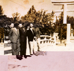 |

北港公園東面大同里太平路一帶，昔是一片沙崙得名。曾設立「日本神社」。現在北高亦是沙崙地帶之一，所以北高刊物叫「沙崗人」。後來神社被火焚毀，目前作為網球場。神社門口，清朝有北港溪流過，建有一磨石拱橋，昔稱「隱龜橋」已拆掉填平。

### 治水工事

位於民治路與文昌路交接處，聖安宮斜對角。原為道光十九年（1839）文昌祠所在地，曾培育人才無數。後因日人打壓漢學及大地震，文昌祠毀壞，文物捐給朝天宮。北港街長爭取設立水利工程處，稱為「治水工事」。
　台灣光復後成為台灣省水利局第五工程處用地，現在該單位已遷至八掌溪畔。目前為北港鎮托兒所園區。
　
### 笨港郊區地名

笨港郊區名稱大都以地形、交通、職業、產業關係而得名。（圖1-59 笨港郊區地名圖）

### 草湖

草湖里曾有許多池塘，形成十八處聚落，每處只有幾十戶人家。現草湖里由中央公路劃分為東湖、西湖。沿公路旁人口聚集漸多。諺語：「草湖十八簇，閹豬社一紙落」。表示草湖里居民分散，閹豬社只有一個部落，人口稀少。

### 媽祖湖

| 1-60 媽祖湖 |
| ------------------ |
| 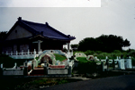 |

清光緒年間，興化店有一公墓，因為常被水淹，爾後墳墓就鄭到此處。據說有朝天宮歷代主持和尚，也從興化店公墓遷葬此處，人們就將此叫「媽祖湖」。據說下雨時，有條小路永不被淋濕。

### 閹豬社

現屬於溝皂里十三鄰，居民約有二十多
戶。以前住有平埔番，「閹豬社」為平埔語。以前有日本藏飛機的碉堡，現已拆掉，建為樓房。現留有一處公池。現住居民大部分從事建築板模、鐵工、土水之包商。

### 興化店

福建興化地區移民之處，由於人口不多，移入又晚於漳泉移民，故選在笨港街郊外西南，笨港溪下游處群居。光緒年間遭洪水沖毀，居民逐漸遷出，興化店終告廢庄。

### 三槺榔

今北港第一示範公墓一帶，及府番北部田地。滿清時期曾是富家郊商群居的地方，後因水災、瘟疫連連，因而遷徙流離，現已散庄。後來居民又於清末購地，建今之府番。據說有農夫在耕田、挖井、曾挖到舊屋瓦、古物、古瓷等。

### 船頭埔

船頭埔也是顏思齊登陸之處，是顏氏拓台十寨之一，名為「哨船寨」。據當地建築房屋時，常挖到船桅、壓石、石敢當等。周圍是樹腳里公墓，公墓內有安宅公、萬善同歸祠等。行政區劃歸樹腳里。

### 鹹水埔

北港鎮西南之水埔里，臨北港溪。位於笨港潟湖邊緣，也是笨港溪的出海口。此地打井需打十餘丈深，否則井水有鹹味故稱鹹水埔。

### 劉厝莊

據台灣文獻調查，此地最初有劉姓移民來此開墾，故而得名。另說：因房子老舊，叫「老厝莊 」。現住民大都姓吳或姓許，並無劉姓人家，是花生加工廠最多的地方。

### 大庄

| 1-61 大庄 |
| ------------------ |
|  |

為早期笨港周邊較大的村莊，居民大都姓高、姓姚，以前建有五福宮（現在北港溪溪底）嘉慶年間笨港溪氾濫，廟祠及房舍多毀於洪水，莊民部分遷移北岸牛稠腳和蘇厝寮，現村莊趨於荒蕪。現樹腳里另有一大庄部落。

### 牛稠腳

早期村民從事運輸業居多，家家戶戶必需養牛隻，因此處處都有牛稠。「腳」即是休息處所的意思，因而得名，現為扶朝里。內有朝陽國小。

### 新街

乾隆十五年，洪水氾濫沖毀部分街市，居民遷往笨港北郊，形成新街市，稱為「新街」。現新街里有媽祖教學醫院。街內有碧水寺，這裡蔡姓和戴姓最多。

### 蘇厝寮

明永曆35年（1681）福建泉州府南安縣蘇澤承帶領族人抵笨港南部腹地墾殖並定居，聚落以「蘇」姓為名，稱為「蘇厝村」。村中奉祀自大陸攜帶來的蘇府王爺及宋代詩人蘇洵、蘇軾、蘇轍父子三人，廟稱「朝安宮」為笨港地區唯一文人廟。

### 灣仔內

因位於北港西北方的北港溪沖積扇內得名。光緒年間屢遭水患，村民分別遷移南北兩岸，故有頂、下灣內之別。

### 新厝仔

今新厝里，因頂後溝仔毀村及下灣仔內等村落遷村於後溝仔西方建新村而得名。

### 撫番社

今為府番里，該地為當時原住民聚落，顏思齊、鄭芝龍登陸笨港曾築寨撫番故名「撫番社」。 

### 番仔溝

現為番溝里。因其為窪地，平埔族人居住當地，故名番仔溝。

### 大北門

現為大北里。係往昔笨港北上必經之大門戶。（顏思齊墾台，北寨所在地）

### 火燒庄

今為好收里，閩粵械鬥常有放火燒村現象，故稱「火燒莊」。也有一說：以前因住屋均為茅草，常發生火災得名，後雅化為「好收」。此庄曾因製作椅條出名被稱「椅條庄」。在建築業風光時代，以板模業維生者頗眾，也是有名的「板模庄」。

### 口庄

在好收東南，為往昔笨港貨物北運之交通口得名。該庄蔭豆芽菜出名，又稱「豆菜庄」。

### 樹仔腳

今為樹腳里，因墾荒築屋於樹下得名。含大庄、頂庄、中庄、過溝皂、蒜頭寮、頂埔、下埔。

### 過溝皂

在大庄之西，因走過大庄之溝漕即到達得名。村莊新建築物頗多。 

### 蒜頭寮

樹腳里過溝皂西南側，屬樹腳里一鄰。昔日有曬蒜頭買賣的人家。現該地雖無人從事此事業，但人們還是以「蒜頭寮」稱之。

### 頂竹仔腳

移民於竹林築屋所成的村落，因與嘉義六腳鄉竹林村舊名相同， 故加上頂字以便區別。屬扶朝里一鄰，位於里之北側。

### 溝皂

今溝皂里，村落頗廣。建村於細長水溝之北，水溝又做水漕，槽諧音為皂，故稱溝皂。有另一種說法，居民據說從元長龍岩厝(現龍岩村)和湖仔內附近(當時稱吳地)，的「頂溝皂」而來。當地曾佗有很多蔡姓人家，由於發生「吳蔡殺」，蔡姓一打輸，就往西邊遷徙。幾次的「吳蔡殺」之後，就搬到了現在的地方，將此地稱為「溝皂」。居民姓翁、蔡居多。村內有大皮革廠及香火鼎盛的真武殿，奉祀玄天上帝，聽說是由唐山，賣雜細帶來的。此外，溝皂以前是北港溪流經的地方，現今溝皂真武殿前的公窟，是北港溪的河道遺跡。

### 後溝里

因聚落建於大水溝之北而得名，此大水溝為舊笨港溪之河道，村內有一座聖平宮祀奉天上聖母媽祖。在其河道之北，當時有一村落稱頂後溝仔，民國六年被水災沖毀。

### 現代地名

北港地名從明清至日據時代，都有其歷史淵源、產業背景或地理因素，民國以後的「應東湖」和「第一城」也有其產生的淵源，值得一記。（圖1-62 民國以後街道圖）

### 應東湖

| 1-63 整建中的應東湖 |
| ------------------ |
| 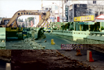 |

該地位文化路與公園路交叉口。民國六十年代火車輸運發達時，因路面與高架鐵軌安全距離不足，鎮長王應東將該路段施工挖深，方便車輛通行，但卻導致遇雨成湖，鎮民乃戲稱「應東湖」。九十一年，該路段填平，鐵軌也拆了，「應東湖」從此走入歷史。

### 第一城

「第一城」原是餐廳名，位於民樂路及文仁路交叉口，因位置欠佳，商機不好宣告歇業，但「第一城」則成該地的通稱。

### 水林路

現在的民生路，因為直接通往水林，所以許多人都以「水林路」稱之。

### 北港十大景點 

北港雖非繁華的都會，但幾個具有歷史性、宗教性的景點，能激發你我思古的幽情，並從中體會北港豐厚的文化內涵和自然人文景觀，值得你我細細品味。

| 1-64 媽祖廟夜景 | 1-65 金碧輝煌的媽祖廟全景 |
| ------------------ | ------------------ |
|  |  |

建於公元1694年，清朝就已經香火鼎盛的廟寺。每年進香團絡繹不絕，至今乃被稱為台灣媽祖信仰的中心，廟宇建築藝術冠全省。

### 義民廟

| 1-66 義民廟 |
| ------------------ |
| 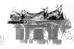 |

國家三級古蹟，祭祀保鄉衛民的義軍義犬。乾隆曾御賜「旌義」金匾，廟內古物具有歷史價值，浮雕壁畫均具古趣。

### 顏思齊紀念碑

| 1-67 昔日噴水圓環今之顏思齊紀念碑 | 1-68 昔日噴水圓環今之顏思齊紀念碑 |
| ------------------ | ------------------ |
|  |  |

建於公元1959年。該碑建立前原設有噴水池。顏思齊從北港附近登陸，設立十寨。又號召福建家鄉饑民開墾笨港及外九莊一帶，號稱中國人墾殖台灣的開路先鋒，高聳的紀念碑，鐫刻著歷史的紋路和墾殖痕跡。旁有十五層樓高之亞太慶光大樓，目前已停業。

### 媽祖景觀公園

| 1-69 媽祖景觀公園 |
| ------------------ |
|  |

建於公元1990年。位於朝天宮後仁和路旁，媽祖景觀大樓上，矗立媽祖石雕巨像，造景自有古趣，登高鳥瞰北港全景盡收眼底。

### 北港運動公園

| 1-70 北港運動公園 |
| ------------------ |
| 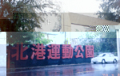 |

建於日據末期，草木繁盛，景色宜人，古木參天，是北港人休閒活動的最佳去處。

### 北港自來水塔

| 1-71 北港自來水塔 |
| ------------------ |
| 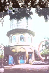 |

建於公元1929年，是日據時代的公共建築物。時隔70年，仍然屹立北港溪畔，河堤公園尾端，是散心最佳之地。

### 北港戲院

| 1-72 北港戲院 |
| ------------------ |
|  |

建於公元1937年，曾是雲嘉地區設備最齊全的戲院。隨著電影沒落，這座風光數十年的建築物已作他用。建物結構造形極具特色，值得品味。

### 北港糖廠

| 1-73 北港糖廠 |
| ------------------ |
|  |

建於公元1911年，為老鎮帶來朝氣，完善的員工休閒設施，曾羨煞許多人，如今是國內製造精糖糖廠之一。高二十層樓的大煙囪，聳立在北港溪旁，構成北港美麗的景點和地標。

### 復興鐵橋

| 1-74 復興鐵橋 |
| ------------------ |
| 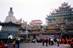 |

建於公元1911年，台糖鐵道往嘉義的鐵路橋樑，長870公尺，非常壯觀。橋附近的崩溪崎，近來發現很多出土文物，將是研究笨港歷史據點，是台省唯一彎形鐵橋，非常稀有。

### 武德宮（五路財神廟）

| 1-75 武德宮（五路財神廟） |
| ------------------ |
|  |

建於公元1970年，雄立華勝路旁（台道19），是後來居上的廟宇，佔地頗廣，建設富麗堂皇。有一座號稱天庫的古亭笨造型金爐，這座廟現已成為台省最大的財神廟及總本山。