# 第三節 本鎮廟宇簡介
---
以下僅就第二節所列七大類廟宇，一一介紹如下：

##（一）媽祖信仰

媽祖信仰是海洋舊文化的表徵。明朝末年滿清入關，閩粵地區烽火連天，旱災連年，中國沿海移民為逃避飢荒、戰禍，紛紛冒死橫渡波濤洶湧的黑水溝，來台尋求新的生機。當時唐山移民搭乘簡陋的舢舨舟，且無氣象預報與通訊設備，航行海上若遇船難，則葬身海底，由於對大海的恐懼與航行的不安，人們便將海神媽祖視為渡海移民心靈的依靠。台灣地區四面濱海，島上高山峻嶺、河川阻絕，早期交通運輸也是以海運為主，加上沿海居民多以捕魚為生，台灣俗話「行船討海三分命」，因此媽祖信仰日益普及，而台灣早期的媽祖廟也都是面向海洋。

　關於媽祖的身世眾說紛紜，且神話與史實落差甚鉅。傳說媽祖是興化府湄州人氏，父親任都巡檢，其妻樂善好施卻單傳一子，於是虔誠向觀世音菩薩祈求子嗣，一日其母夢見觀世音賜予優缽花(或謂藥丸)，吞食後懷胎十四個月產下媽祖。媽祖出世後逾月不哭，故取名為默娘。媽祖自幼聰敏好學且朝夕禮佛，而後得到玄通道人授予「玄微秘法」，又得神人之「銅符」，乃精通驅妖除魔之術。嗣後媽祖降服桃花山之妖怪千里眼與順風耳，並收為部將。廿八歲重陽節日，媽祖得道昇天。

　如按史料記載，媽祖原為巫覡信仰，原始文獻皆言媽祖為「巫」，眾人因其生前能預知吉凶禍福而祀之，後來才改稱「神女」。至宋徽宗賜其「順濟」廟匾即轉變成神。宋代媽祖之封號為「夫人」、「妃」，至元代因海運日趨發達乃冊封為「天妃」，並成為全國性信仰。明初封為「聖妃」，明成祖因派遣鄭和下西洋，為安定軍心，將之封為「天妃」。清康熙年間，原本冊封為「天上聖母」，至康熙廿二年(1683)因施琅攻克明鄭，假藉媽祖神助之說，乃冊封為「天后」。至此媽祖已成為地位最崇高之女神。

　媽祖信仰自宋代的女巫轉變到清代的天后，睽其緣故乃因海運的發達造成信仰的普及，又因政治的炒作才日漸蓬勃。台灣移墾之初仰賴航海，而初闢地區又是「三年一小反」、「五年一大亂」，治理台灣的各個政府也都會拉攏媽祖，以證明政權的合法性與行為的正當性。傳說媽祖曾經協助鄭成功擊退荷蘭人，也曾幫助施琅將軍打敗明鄭，又曾助清廷平定林爽文、蔡牽之變，但這些傳說都只是統治者利用媽祖信仰鼓舞士氣、籠絡民心，減少人民反抗的託詞。

　早期台灣媽祖按分靈祖廟可分為湄洲媽、溫陵媽與銀同媽。媽祖的造型則是按照「媽媽的形象」來塑造。隨著移民時間久遠，目前各地的媽祖廟多由台灣本土所分靈，媽祖名號也有北港媽、大甲媽、鹿港媽、關渡媽、松山媽及新港媽等在地化的窩謂，而中國大陸在文化大革命之後，各種宗教信仰已蕩然無存，想必媽祖也已投奔自由，因此台灣才是媽祖的新故鄉。

　媽祖崇拜原為航海之神，但媽祖來台之後，也隨著民眾的移墾，職責也有所轉化，台灣媽祖的任務有防止「番害」、驅逐瘟疫、防颱救災和協助農牧等新的職務。在二次大戰期間，許多地區都盛傳媽祖承接盟軍炸彈的神蹟，也有媽祖巡視海岸的傳說，因此媽祖還承攬國防和海防業。現在媽祖又包攬信徒的健康、考試、事業和感情等所有問題，媽祖已不僅是漁民、船員的守護神，儼然成為台灣人的守護神。媽祖就如同台灣的媽媽，四百年來護衛著台灣人民渡過台灣海峽，陪伴台灣人歷經荷西、明鄭、清廷、日本、國民政府政權，在人心最徬徨、無助的時候，媽祖婆的慈愛，總是台灣人民心靈最重要的依靠。

　本鎮以媽祖為主神的廟宇有以下三間，其特色分述如下：

### 朝天宮

|  |
| ------------------ |
| 教別：佛教 |
| 供奉主神：天上聖母（媽祖） |
| 陪祀神明：觀世音菩薩、五文昌帝君、三官大帝、聖父母、註生娘娘、境主公、福德正神 |
| 創建年代：康熙三十三年（1694） |
| 創建人：臨濟宗三十四代樹璧禪師 |
| 廟址：雲林縣北港鎮中山路178號 |
| 電話：（05）7830535 （05）7832055 |

笨港在清初即是諸羅縣轄的良港及大城鎮。康熙三十三年（1694），臨濟宗三十四世樹璧禪師從福建湄洲朝天閣，奉請媽祖神像來台。街民知曉，紛紛懇留奉祀膜拜，並請樹璧禪師主持香火。建廟之初，只有矮屋一椽，至為簡陋。後由開拓諸羅的紳商陳立勳捐地，勸募外九莊居民合力建廟，以瓦換茅，號稱「天妃廟」。

| 2-3 日據時代媽祖祭典燈會 | 2-4 媽祖廟夜景 | 2-5 民國39年媽祖廟廟埕 |
| ------------------ | ------------------ | ------------------ |
|  |  |  |

雍正八年（1730），媽祖神光屢現，百姓庇佑無窮，遂捐款重建，頗具規模，改稱「笨港天后宮」，香火日盛。至乾隆十六年，因丹青剝落，土埆間有傾圮，繼任主持再加修葺，廟貌煥然一新。乾隆三十九年（1774）笨港縣丞薛肇熿蒞廟，見宮廟樸卑，乃令當時淘生陳瑞玉、監生王希明、蔡大成等人率先捐俸，大修土木，才有主神殿二、拜殿二、東畔室二共六間。正殿奉祀媽祖，後殿奉祀觀音佛祖、十八羅漢，龍柱一對（台省僅留的清朝初年的作品），並撰文立碑（此碑石及龍柱尚留在聖父母殿廟埕及觀音殿），這是朝天宮首次大規模翻修及重建。

　道光十七年，因殿宇剝蝕，當時瑞合主持發心向各界募款重修，又適王得祿平定張丙、陳辨之亂，將之歸功于媽祖保佑。王得祿獻「海天靈貺」一匾，並奏請朝廷誥封媽祖為「護國庇民妙靈昭應宏仁普濟福佑群生誠感咸孚顯神戰順垂慈篤祐安瀾運澤覃海宇天后」。此次王將軍除捐款外，並贈梵鐘法鼓各一，榮譽輝煌，因而笨港媽祖遂成為全台媽祖信仰中心。

　咸豐四年，嘉義縣學訓導蔡如璋有感廟宇不敷使用，適世襲子爵特授江安十郡儲糧道王朝綸返台勸運米食，共議擴建，成為宮殿式建築，前為拜殿及東西二室，二進祀天后，三進祀觀音佛祖，四進祀聖父母，東廂註生娘娘，西廂祀福德正神及境主公。 

　光緒二十年，北港街內大火，本宮屹立不動，惟拜殿被焚。光緒三十一年嘉義大地震，大殿破損四垂亭倒壞。北港區區長蔡然標等地方士紳，倡議募捐重建。此次募款遍及全省，包含板橋家族林崇壽、林祖壽，從台北至高雄，從海內至海外各地皆有，由陳應彬主持重修工程。從光緒三十三年開工至民國元年竣工。佔地約千餘坪，即今五開間多廟並列的特殊格局，廟牆也是當時完成。前面廟牆上端的四海龍王，由板橋、高雄各地捐獻。民國四十七年，本宮改修正殿屋頂，至民國五十三年完工，延聘彰化江清露師傅製作，屋上各種剪粘裝飾，琳琅滿目，令人嘆為觀止。

　朝天宮於清朝中葉，成為本省媽祖信仰中心。據台灣府兵備道徐宗幹所著「壬癸後記」淋載：「前籍台人循舊俗，迎嘉邑北港廟中神像至郡城廟供奉。並巡歷城鄉內外而回，焚香迎送者，日千萬計。」乾隆二十三年，朝天宮已分靈至外九莊義竹鄉紹徵宮、大林甘蔗崙的聖母廟、彰化的南瑤宮、大甲鎮瀾宮、白沙屯拱天宮等廟宇，並有往朝天宮進香的活動。可見當時朝天宮媽祖分靈，早已遍及全省。　　

　清中葉以後笨港港口機能雖淌退，但朝天宮香火依然鼎盛，各地信徒還是成群結隊，不辭跋涉前來進香。日據時代嚴禁迎神賽會，並借此消除迷信而拆廟，但日本當局不但對朝天宮未予拆除，並善加保護禮遇。大正元年，朝天宮重修。全台三萬餘人熱烈捐款襄助，感動日人，遂稱朝天宮為「媽祖總本山」。台灣光復後香火更盛，經政府指定為宗教廟寺觀光區「國家二級古蹟」，香火為全省之冠。

　據堪輿界的說法：朝天宮之所以香火鼎盛，因處龍穴之故。府番里北側的沙丘是龍尾；龍口在廟前中山路南方，吸取四面八方之靈氣；左右兩口古井是龍的眼睛。廟內正殿有古井，為龍喉穴。虎井因道路拓寬在馬路中央被封，龍井在民宅，端午常有大批民眾搶著汲取午時水。

| 2-6 龍井 |
| ------------------ |
|  |

朝天宮信眾不僅遍布全台，亦分靈世界廿餘國，善男信女捐款和香油錢收入相當龐大，除經常開支外，朝天宮積極作社會服務如：

1. 貧民施醫：廟方自昭和十一年（1936）設立貧民診所於宮後的番仔樓。聘專業醫師駐所診治。凡是貧民一律免費施醫，其他民眾則收取成本費。台大帝醫畢業的黃玉銘醫師，從光復服務至九十一年十一月始退休，對提昇地方醫療品質有相當貢獻。往後朝天宮將聘媽祖醫院醫生輪流駐診，繼續造福鄉梓。

	| 2-7 民眾診療所藥袋 | 2-7-1 診療情形 |
| ------------------ | ------------------ |
|  |  |

2. 捐贈媽祖醫院：為提高地方醫療水準，朝天宮斥資四億餘元籌設媽祖醫院，並於民國六十六年完成硬體結構時，捐贈給中國醫藥學院。醫院占地四公頃，病床六百床，中西醫並存，對沿海地區醫療服務有極大助益。
3. 辦理社會救濟：在「救急不救窮」原則下，對天然災害或意外之受災者，常主動濟助。如九二一震災捐兩千萬，台中瓦斯爆炸、三峽礦災等均有百萬以上捐款，及家庭發生急難之濟助，不勝枚舉。
4. 文教及體育活動贊助：每年辦理花燈展、藝閣遊行；成立國樂團；辦理台灣區「媽祖盃」軟式網球錦標賽，發行《聖女春秋》月刊；成立「笨港媽祖文教基金會」，補助學生午餐費、教育活動、綠化美化環境等。

為讓大家認識朝天宮神祇，特別將各殿所祀的神明記述於下：

#### 聖母殿（前殿）

主祀：天上聖母計有七尊神像

| 2-8 正殿之天上聖母 |
| ------------------ |
|  |

1. 鎮殿媽（祀在神龕後排正中）
2. 祖媽（祀在神龕前排正中）
3. 二媽（祀在神龕中排正中）
4. 三媽（祀在二媽左側）
5. 四媽（祀在二媽右側）
6. 五媽（祀在三媽左側）
7. 六媽（祀在四媽右側）
 
配祀：

| 2-9-1 日據時代正殿神明 | 2-9 樹壁禪師恭請來台之媽祖 | 2-9-1u 萬年香火盧 |
| ------------------ | ------------------ | ------------------ |
|  |  |  |

1. 香花女
2. 金精將軍，通稱千里眼（祀在神龕前左方）
3. 水精將軍，通稱順風耳（神龕前右方）
4. 太子爺（祀在殿中長案）

#### 觀音殿（中殿中室）

主祀：觀音菩薩（祀於正面神龕）

從祀：

* 右側（東列）：
	1. 降龍尊者
	2. 百納尊者
	3. 進香尊者
	4. 彌勒尊者
	5. 志公禪師
	6. 開心尊者
	7. 達摩尊者
	8. 飛鈸尊者（一稱弄鈸尊者）
	9. 目蓮尊者（一稱飛杖尊者）
* 左側（西列）由左：
	1. 伏虎尊者
	2. 優婆尊者（一稱道悟尊者）
	3. 進花尊者
	4. 進燈尊者（一稱惠藏尊者）
	5. 梁武帝
	6. 長眉尊者
	7. 進果尊者
	8. 戲獅尊者
	9. 洗耳尊者（一稱摩訶尊者）

#### 聖父母殿

主祀：天上聖母父母及兄弟之神牌

1. 積慶衍澤林公暨夫人王氏神位（神龕正中）
2. 靈應仙官聖兄林公神位（神龕右側）
3. 慈惠夫人聖姊林氏神位（神龕左側）

#### 開山殿（後殿左室）

主祀：本宮歷代住持

#### 註生娘娘

主祀：註生娘娘（祀在神龕正中）生育之神或謂臨水夫人陳靖姑，

從祀：婆姐。

#### 境主土地公殿

主祀：

1. 境主公（神龕右側）
2. 土地公（神龕左側）

#### 三界公殿

主祀三官大帝

1. 天官（堯）一品紫微大帝（神龕中央），主賜福，誕辰上元節 
2. 地官（舜）二品清虛大帝（神龕右側），主赦罪，誕辰中元節
3. 水官（禹）三品洞虛大帝（神龕左側），主解厄，誕辰下元節

#### 五文昌夫子殿

主祀：文昌帝君

陪祀：周濂溪、程明道、程伊川、張橫渠、朱晦庵。

【古色古香　春秋二祭】

| 2-10 媽祖春秋祭 | 2-11 行上香禮 |
| ------------------ | ------------------ |
|  |  |

台灣「三月瘋媽祖」，因為農曆三月二十三日是媽祖林默娘的誕辰，所以信仰媽祖的人會在農曆三月舉辦進香、刈火及遶境等宗教活動，各地廟宇為了慶祝「媽祖生」，無不趁機舉辦舞龍、舞獅、南北管等民俗技藝活動，配合著大拜拜，達到人神同樂的目的。
　在北港，除了花樣繁複的廟會活動外，在三月二十三日這一天會依傳統舉辦媽祖祝壽活動及聖父母春祭。恭賀媽祖誕辰的祭儀完全依照古禮的「三獻禮」，儀式與祭孔相似，古色古香，莊嚴隆重，在悠揚古樂中，主祭、陪祭、執事、擁生均著長袍馬褂進行，各地媽祖廟派代表與祭，也有不少人會到場觀摩。至於農曆九月九日媽祖飛昇成道紀念日，會同時舉辦聖父母秋祭。無論媽祖誕辰或成道日，都會恭請聖父母神位到前殿，具有弘揚孝道和慎終追遠之意，祭典儀式和春祭時相同。
　根據史料記載，朝天宮舉行的媽祖誕辰或飛昇成道祭典，都是延續祖廟朝天閣的傳統辦理。在康熙五十九年（1720）清廷以「媽祖屢顯神威護國佑民，頗受民間敬仰，朝廷豈可漠視，此次遣使到琉球敕封又顯神威加護順利達成，為報神恩將祭祀媽祖列入朝廷祀典，於每年三月二十三日媽祖壽誕舉祭。」到了雍正十一年（1738）清廷通令全國各省建祠媽祖，春秋致祭，原為一年一祭增為春秋二祭，春祭仍於三月二十三日媽祖誕辰時舉行，秋祭擇定媽祖登湄峰悟道羽化飛昇的九月九日舉行，所有儀禮由祖廟朝天閣傳到笨港朝天宮，就此相沿下來，已有二百七十餘年的歷史。
　朝天宮誌有云：「清代祀典，最崇天后，每年春秋，笨港分縣及水師千總，必親典祭。是日，守土官具祝版備器，陳羊一，豕一，簠簋各二，籩豆各十，罏鐙具。殿中南設案供祝版，北設一案，陳帛一，香盤一，尊一，爵一。設樂於南階上，設洗於東階下之北，祭官拜位在階上正中，司祝，司香，司帛，司爵，典儀，掌燎，各以其職為位。」
　可見清代對媽祖春秋二祭的重視，及祭典中的祭禮和陳設的情形。日本據台之後，日人仍不敢輕忽深入民間的媽祖信仰，朝天宮依傳統舉行春秋二祭時，北港郡守必親自主祭，以攬人心。光復後，主祭由朝天宮董事會董事長擔任，北港鎮長、鎮民代表會主席等為陪祭，擴大與祭範圍到里鄰長、轎班會爐主及各媽祖會爐主等。
　
#### 茲附春秋祭典儀式程序以及祝文一篇於後，以為參考：

* 【就位】
	* 通唱：財團法人北港朝天宮天上聖母　　
	* 中華民國○○年歲次○○年媽祖誕辰　（成道暨聖父母）春（秋）祭
	* 通唱：典禮開始→鳴炮→樂禮生就位→執事者各執其事→監禮生就位
	* 通唱：陪祭就位→主祭就位→啟扉
	* 通唱：全體肅立→奏樂→瘞毛血（司毛血者捧毛血盤出宮，復位）
	* 通唱：主祭盥洗（主祭至盥洗所洗手）→行上香禮（主祭進前，司香遞香，主祭上香，行三跪九叩頭，復位）
* 【迎神】
	* 通唱：提燈爐迎神，行迎神禮（鐘鼓齊鳴，司燈、司爐、司旗、司傘、司旌、司節、司鈇、司鉞、司扇分列兩縱隊，下階，到拜殿由側門出，中門入，復位，主陪祭行三跪九叩頭禮，鐘鼓止鳴）
	* 通唱：全體與祭者向　天上聖母行三問訊禮
* 【初獻禮】
	* 通唱：行初獻禮「主祭至神案前跪，初獻爵（斟酒→獻酒），獻帛，三叩首，起，復位」
* 【讀祝禮】
	* 通唱：行讀祝禮（主祭至祝案前跪，讀祝文生就位跪，主陪祭俯伏，讀祝生讀祝文）
	* 讀祝文生：維中華民國ＯＯ年歲次ＯＯ三（九）月ＯＯ日，主祭ＯＯＯ，陪祭ＯＯＯ暨閣港紳商總董等，謹以剛鬣柔毛牲醴庶饈果品香楮金帛之儀，致祭於褒封天上聖母之神前曰：千秋大德，萬里慈航，濟世菩薩，補天阿皇，功德實同覆載，崇報祇宜優隆，逢降誕之吉辰，盡諸子之微衷，薦以金帛，奉以豆觴，神其來格，鋻此馨香，尚饗！（讀祝文生起，主陪祭平身，奏樂，六叩首，起，復位）
* 【亞獻禮】
	* 通唱：行亞獻禮「主祭至神案前跪，再獻爵（斟酒→獻酒），獻牲（豬肉），獻饌（八大碗的其中一碗），六叩首，起，復位」
* 【終獻禮】
	* 通唱：行終獻禮「主祭至神案前跪，三獻爵（斟酒→獻酒），獻羹，獻飯，獻金，滿叩首，起，復位」
	* 通唱：主祭行飲福酒受胙禮（主祭至香案前，主陪祭跪，主祭飲福酒，受福胙，滿叩首，起，復位）
	* 通唱：來賓行上香禮（來賓以簽到順序上香）
	* 通唱：全體與祭者向　天上聖母行三問訊禮
* 【送神】
	* 通唱：提燈爐送神，行送神禮（鐘鼓齊鳴，司燈、司爐、司旗、司傘、司旌、司節、司鈇、司鉞、司扇分列兩縱隊，下階，到拜殿由正門出，側門入，復位，主陪祭行三跪九叩頭禮，鐘鼓止鳴）
* 【望燎】
	* 通唱：焚金帛（讀祝者奉祝，司帛者奉帛依次出宮，交予執事焚化，望燎，復位）
	* 通唱：禮成→主祭退班→陪祭退班→監禮生退班→執事者退班
	* 通唱：恭祝風調雨順，國泰民安。

　另外，朝天宮西側有一個「五文昌夫子殿」，又名「聚奎閣」，主祀文昌帝君，陪祀周濂溪（敦頤）、程明道（顥）、程伊川（頤）、張橫渠（載）、朱晦庵（熹）五人，其由來乃是由於史記官書中有云：「斗為帝車，運於中央，……斗魁載匡六星，曰文昌宮……」所以古人奉祀文昌君的人已多。

　而在清道光十九年，笨港貢生蔡慶宗提議捐巨資於笨港街西建文昌祠，提昇北港文風，當時堂宇分為二進，前進奉祀文昌帝君，後進東西二廊則成為學子會文講課的地方，並成立有一社，名「聚奎社」，以為學子之間互相期勉之意，後來他們認為宋冷濂（周敦頤）、洛（程顥、程頤）ｙ關（張載）、閩（朱熹）四大家開啟文明機運，昌明教化，功勞甚大，所以亦奉祀這五人。到了光緒元年貢生陳櫻宏，光緒十三年里紳蔡慶元等人均有勸捐重修，日人據台之後，在北港設立學校，廢文昌祠，命令聚奎社諸主事將祠田贈與朝天宮，朝天宮另闢一五文昌殿奉祀文昌帝君及五文昌夫子，今日該殿對聯上仍嵌有「聚奎」二字，以示本源。

　古代因有科考，士大夫們對於「文昌帝君」甚為重視，民間百姓更是早已將之祀奉為神，每逢考試季節，為人父母者常代子女跪在文昌神前以求其金榜題名，於是天下學校均建祠祭祀之，清嘉慶六年（1801）乃正式列為祀典，通令天下學府建廟立祀，春秋則遣官致祭，而朝天宮沿襲此項傳統，在每年的農曆二月和八月擇定「丁日」舉行五文昌夫子的春、秋祭典，並依例敦請北港鎮內各級中學校長輪流擔任主祭與陪祭，各中小學資優教師擔任執事人員，各高中職及兩所國中學生代表參與祭祀典禮，所有主、陪祭及執事人員均須穿著長袍馬褂，很莊嚴隆重地依禮進行祭祀典禮。
　
#### 茲列祭典儀式如下：

* 【就位】
	* 通唱：中華民國○○年歲次○○五文昌夫子春（秋）祭
	* 通唱：典禮開始→擂鼓三通→揚炮→奏大樂→啟扉→陪祭就位→主祭就位
	* 通唱：執事者各執其事→全體肅立→瘞毛血（司毛血者捧毛血盤出宮，復位）
	* 通唱：主祭行盥洗禮（主祭至盥洗所洗手，復位）行上香禮（主陪祭跪，司香遞香，主祭上香，行三叩首，起立，復位）
* 【迎神】
	* 通唱：行迎神禮（鐘鼓齊鳴，主陪祭跪，叩首－再叩首－三叩首－興－跪－叩首－再叩首－六叩首－興－跪－叩首－再叩首－滿叩首－興，鐘鼓止鳴）
	* 通唱：全體與祭者向　五文昌夫子行最敬禮（脫帽，敬禮，戴帽，復位）
* 【初獻禮】
	* 通唱：行初獻禮（主祭至神案前跪，初獻爵（斟酒→獻酒），獻帛，三叩首，起，復位）
* 【讀祝禮】

	| 2-12 讀祝禮 |
| ------------------ |
|  |

	* 通唱：行讀祝禮（主祭至祝案前跪，讀祝文生就位跪，主陪祭俯伏，讀祝生就位跪讀祝文）
	* 讀祝文生：維中華民國○○年歲次○○朔越日，主祭○○○，陪祭○○○暨聚奎閣各校教員諸同仁等，謹以剛鬣柔毛牲醴庶饈果品香楮金帛之儀，致祭於五文昌夫子之神前曰：北斗之右六星縱橫，集計天道，掌握文衡，暨承象以燦列，復應運而篤生，揭儒宗之領袖，昭代以文明，神人一氣而相感，葇茹聯拔以彙征，彩筆丹篆踵前賢，而得夢秋闈春榜，魁多士以題名，維諸生之願望實有神之光榮，逢仲秋之吉日，盡諸子之微誠，薦以金帛，奉以禮牲，神其來格，鑒此馨香，以掌文籍諸神配祀，尚饗！（讀祝文生起，主陪祭平身，奏樂，六叩首，起，復位）

* 【亞獻禮】
	* 通唱：行亞獻禮（主祭至神案前跪，再獻爵（斟酒→獻酒），獻牲（豬肉），獻饌（八大碗的其中一碗），六叩首，起，復位）

* 【終獻禮】
	* 通唱：行終獻禮（主祭至神案前跪，三獻爵（斟酒→獻酒），獻羹，獻飯，獻金，滿叩首，起，復位）
	* 通唱：主祭行飲福酒受胙禮（主祭至香案前，主陪祭跪，主祭飲福酒，受福胙，滿叩首，起，復位）
	* 通唱：全體與祭者向五文昌夫子行最敬禮

* 【送神】

	| 2-13 送神 |
| ------------------ |
|  |

	* 通唱：行送神禮（鐘鼓齊鳴，主陪祭跪，叩首－再叩首－三叩首－興－跪－叩首－再叩首－六叩首－興－跪－叩首－再叩首－滿叩首－興，鐘鼓止鳴）

* 【望燎】

	* 通唱：焚金帛（讀祝者奉祝，司帛者奉帛依次出宮，交予執事焚化，望燎，復位）
	* 通唱：禮成→復位→禮畢退班

#### 朝天宮附「匾」特別多

朝天宮的匾額特別多，包含皇帝、總統、日本總督、地方首長所賜。這些匾額使朝天宮的名聲更響，也象徵朝天宮全省聞名。朝天宮的匾極為珍貴。其著名的有：

1. 神昭海表（在神龕上方）

	

	清雍正皇帝御筆。康熙六十年，藍廷珍平定朱一貴，藍將軍認為有媽祖保佑才能平亂，雍正四年正月十七日題請恩賜匾額，分別懸掛湄洲、台灣、廈門三地媽祖廟以答謝神明保佑。當年五月十一日，乃交由內閣頒下匾額御書「神昭海表」，經藍廷珍招工摹字作匾，分送三地製作懸掛，該年十一月二十八日，總兵林量會同文武百官恭迎致敬懸掛。北港朝天宮此匾，據雲林文獻記載，為雍正九年摹刻懸掛。

2. 慈雲灑潤

	

	清光緒帝御筆，光緒十二年，嘉義西門街恭迎本宮聖母賽會，適逢大旱，嘉義知縣羅建祥建壇求雨，見縣民奉北港媽祖神尊甚虔，乃齋戒三日，親身向媽祖祈禱，登壇未幾，大雨傾盆，四境均霑，乃經台灣巡撫劉銘傳咨部奏請欽賜匾額懸掛以垂示不朽。禮部奉准於十四年五月飭令知縣羅建祥、工部主事徐德欽奉匾額到朝天宮懸掛。

3. 人和年豐

	

	民國六十四年十二月二十二日，中華民國行政院長蔣經國親自送匾。他以為台灣發生經濟奇蹟最主要是因為有媽祖的保佑。六十八年間有三次颱風靠近台灣，都從台灣東部突然轉向北方海面直撲日本，使本省免遭損害，蔣經國認為都是媽祖保佑，乃指示省主席林洋港代表台灣一千萬同胞叩謝媽祖。蔣經國擔任總統，曾數次到朝天宮致敬。

4. 澤厚民豐

	

	民國七十九年四月中華民國總統李登輝頒贈給朝天宮。七十九年七月七日由台灣省主席連戰 代表前來懸掛起匾，是朝天宮第四塊國家元首題頒匾額。

5. 海天靈貺

	

	據雲林縣采訪冊記載：「道光十七年福建水師督王得祿統兵渡台，舟忽遇颱風，禱告媽祖，不久颱風停止，並一路順風，遂平台亂，上匾誌感。」但另有一說：道光十七年，並無匪亂。道光十二年、十六年，則分別有張丙、沈知之亂，王得祿均曾率兵平亂。
	
6. 享于克誠

	

	大正二年三月台灣總督陸軍大將佐久間佐馬太所贈。佐九間乃日本台灣總督府第五任總督。

7. 神恩浩蕩

	

	石塚英藏所贈，石塚乃日本台灣總督府第十三任總督，贈送時間約在民國十九年。

8. 光澤四海

	民國四十六年，台灣省政府主席周至柔敬贈。

9. 厚德歸民

	中華民國五十五年陳大慶所贈。陳大慶為陸軍上將，台省警備總司令，時任台灣省政府主席。

10. 笨港媽祖

	民國八十一年二月十七日，台灣省主席連戰與台灣省議會議長簡明景親至本宮共同主持元宵花燈及祥和社會藝文活動開幕剪綵時所贈。另有光緒七年十月十五日，光緒皇帝以神靈顯應，頒「與天同功」台灣天后廟奉刻懸掛也頗有名。

### 朝天宮的籤詩文化

在台灣的宗教中，寺廟的籤詩，是非常特殊的一種信仰文化。在現代，求籤解惑可能被斥為迷信，但卻不能否定在民智未開、經濟普遍困頓的年代，寺廟中的籤詩具有安定人心的力量。因之信徒遇到困頓挫折、事業不順、婚姻不如意、感情生變、健康亮紅燈等，都常到寺廟祈求籤詩，盼望從中獲得神祇的指引排難解惑一番。

　探討台灣民眾欲從籤詩中尋找生命明燈的原由，就必須從移民的背景說起。當大批群眾渡過遼闊深奧、惡浪滔天的黑水溝時，那種生死難卜、前途茫茫的不確定感，讓他們對神力無邊的神祇產生強烈的依賴。大多數人奉請故鄉神祇隨行，或攜帶香火在身，盼望行船的旅途、跋涉的過程獲得庇祐順利到達未知的他鄉。當平安抵達台灣，跟隨渡海來的神祇或香火，有的奉祀家中，有的搭草寮供聚集的民眾膜拜，漸漸靠著口耳相傳的靈驗事蹟，與信眾環境的改善，廟宇愈蓋愈雄偉。提供籤詩供信徒祈求，成為寺廟相當重要的特色。

| 2-21 錫製香火 | 2-22 六十甲子籤 |
| ----------------- | ----------------- |
|  |  |

「敬神如神在」凡夫俗子透過扶乩、擲杯、求籤與神明溝通對話，以求逢凶化吉、消災解厄、平安順遂等。一張不起眼的籤詩，學問可不小。無論求子、尋功名、定婚姻、問學業、看健康…都躍然紙上，明確點出人們所重視期盼的事項，對早期先民安定的力量，無疑是巨大無比。
籤詩通常分運籤和藥籤兩種。運籤含甲子籤、二十八星宿籤、百首籤、三十二首籤等。其中以甲子籤和廿八星宿籤最普遍。朝天宮的運籤採甲子籤，共六十首。

| 2-23 藥籤 | 2-24 運籤籤詩 |
| ------------------ | ------------------ |
|  |  |

藥籤含成人科120種、兒科60種、眼科84種。其中藥籤，雖不值得提倡，但在醫療資源欠缺的年代，確曾提供信眾醫療上的協助，至少因信仰所產生的安撫作用，應該能減輕疾病的痛苦，如果症狀輕微，當然就快速痊癒。故在醫藥發達的現仄，求藥籤人數雖大為減少，但仍可見許多長輩虔信地擲杯問神，試圖從籤筒中找出能賜給他們健康的籤支呢！

　所謂「心誠則靈」但要神明指點迷津，首先虔誠膜拜、並仔細說出心中想問之事。如「信女○○現年幾歲，出生於○年○日，宮住○○縣○○鎮○○路○○號，現在遇到○○事無法處理或極為困擾，特向聖母稟告，祈求聖母出示明籤指點迷津」。求藥籤則要特別說出症狀，請求神明是否同意賜籤，如獲應允則可依程序求籤。一般求籤要拜神約卅分鐘後才進行，讓神明有查詢的時間。求籤，每次僅求一事，同時要求多事，就需求多支籤。

| 2-25 籤筒 | 2-25-1 藥籤籤詩 |
| ----------------- | ------------------- |
|  |  |

求籤是否獲得神明同意，要看是否應允聖杯（一陰一陽）而定，有的神明要三個聖杯，有的一杯就過關。求籤時，信眾先以雙手握搖籤筒中的籤支再往上提後放下，如籤筒中有突出的籤支，即可取來放置神桌擲杯問神，如獲得聖杯同意，就可取詩條解詩，或請有經驗的廟務人員協助解釋。但未獲聖杯，則需再抽再求，直到同意為主。但有時出現笑杯，可能暗示不必求了。

　求得媽祖的藥籤，到中藥房抓藥回家煎煮治病。自從醫師法通過，衛生署以影響醫療品質為由，希望朝天宮能撤掉藥籤，但民間特殊的信仰文化，和信眾的需求，再且藥方份量相當輕，保健安撫重於治療，所以這些從清朝就傳承下來的藥籤，現在仍在朝天宮神案上為信眾健康做另類的醫療服務。

　解籤，要看求籤的時間，求籤的性別。因同樣的籤詩會因不同時間和不同性別所求有不同的解讀，單從字面上解釋是不夠的。

| 2-26 宣統三年之籤詩解 | 2-27 木刻籤詩版 |
| ----------------- | ----------------- |
|  |  |

籤詩內容以易經八卦為主，但因艱澀難懂，所以解籤者常根據耳熟能詳之民俗俚語、七俠五義、三國演義、水滸傳民間故事等加以解釋。早年因信眾識字有限，籤詩上常有圖案供解詩參考。

　以籤號、詩文為主，至於籤詩解、典故、圖案等內容則依甲子籤、廿八星宿籤等有異。解籤者根據字義、故事、圖案、拆字等解籤，無論一針見血、委婉含蓄、暗示解說，都希望問卜者能獲神助滿意而歸。好的解籤者能察言觀色，揣摩運用籤詩的療治作用，如同現代的諮商輔導人員一樣。

　除信眾會到寺廟求籤解惑外，朝天宮依例於正月初三深夜、初四凌晨，由董事長抽出公籤，依序為人口、水路、五穀、港運、六畜、生意六支。公籤原來以笨港新一年的運勢為主，但這些年，全台媽祖信徒均相當矚矢，甚至推估至國家運勢走向。朝天宮對公籤均不作解釋，信徒有見仁見智想法，均不足為奇。特舉九十年公籤供參考：

* 人口（丁巳籤）
　　十方佛法有靈通，大難禍福不相同；紅日當空長照耀，還有貴人到家堂。
* 水路（庚午籤）
　　平生富貴成祿位，君家門戶定光輝；此中必定無損失，夫妻百歲喜相隨。
* 五穀（庚辰籤）
　　意中若問神仙路，勸爾且退望高樓；寬心且守寬心坐，必然遇得貴人扶。
* 港運（甲寅籤）
　　於今此景正當時，看看欲吐百花魁；若能遇得春色到，一洒清吉脫塵埃。
* 六畜（甲寅籤）
　　於今此景正當時，看看欲吐百花魁；若能遇得春色到，一洒清吉脫塵埃。
* 生意（己未籤）
　　危險高山行過盡，莫嫌此路有重重；若見蘭桂漸漸發，去蛇反轉變為龍。

### 後溝聖平宮

|  |
| ----------------- |
| 教別：民間傳統信仰 |
| 供奉主神：天上聖母 |
| 從祀神明：千里眼、順風耳 |
| 同祀神明：註生娘娘、福德正神、中壇元帥、虎爺 |
| 創建年代：民國六十三年 |
| 祀典日期：農曆三月二十一日、九月十五日 |
| 廟址：雲林縣北港鎮後溝里74號 |
| 電話：（05）7821451 |

後溝里位居北港溪畔，里民素仰哪吒神武，民國六十二年間，得元帥諭示：興建媽祖廟。眾信乃籌資策劃，擇吉興工，於民國六十三年九月十五日竣工，命名為聖平宮。並專程至『北港朝天宮』祈得『天上聖母』聖尊恭迎入祀。

　聖平宮佔地約兩百餘坪，正脊尾翹，剪飾雙龍朝三星垂脊，側脊另飾人馬、車騎，皆靈活如生。聖平宮左廂闢為辦公室，另祀有「太祖先師」、「達摩祖師」、「白鶴先師」與江義梁山諸猛將神位。聖平宮右邊為後溝里民活動中心，宮前廣場鐵架膠棚搭構成拜庭，在左邊另搭竹棚，內置桌椅數張，為里民煮茗話舊之所，棚前設慈聖台，供慶典唱戲專用，宮側建有一座金亭，壁畫花鳥、仙人持柺在頂，表情詼諧十分有趣。每年農曆三月二十一日、九月十五日必分別為天上聖母、吳三王爺祝壽。如逢五榖豐收之年，里民慶賀之餘，感謝神靈護祐之恩，便虔誠組團赴北港、新港媽祖廟，或至「麻豆代天府」進香敬酬神恩。

### 府番三槺榔復興宮

| 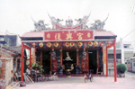 |
| ----------------- |
| 教別：民間傳統信仰 |
| 供奉主神：天上聖母 |
| 從祀神明：千里眼、順風耳 |
| 同祀神明：保生大帝、陳府千歲、池府千歲、福德正神、中壇元帥 |
| 祀典日期：農曆三月二十一日、七月十四日、十月十五日 |
| 創建年代：民國六十一年 |
| 廟址：雲林縣北港鎮府番里60號 |

復興宮位居北港鎮北郊，原名撫番。明天啟元年（1621），顏思齊、鄭芝龍率漳屬黎民於笨港登台，安營紮寨、鎮撫土番、從事墾殖之地。民國五十四年，台灣省文獻會廖漢臣、洪敏麟先生發現本里北郊即為笨港三木康榔之舊址，並掘出明末清初陶銅器及青銅玄天上帝神像，更足以證之。

　三木康榔是由刺子崙、燈篙崙、馬崙等三座大沙崙得名。清康熙二十二年（1684）設立台灣府，三木康榔是諸羅縣大木康榔堡，三木康榔原屬半月形沙土，常遭季風吹襲，洪水氾濫。道光十八年（1838）大水災，使本庄毀於一旦，庄民遷移各地，散居三木康榔庄附近的人，為感謝先民墾殖不易，乃結合庄民互相砥礪、戮力經營，並向台南府城的撫番鄉親承購住地，於光緒七年（1881）重新建居，為承先民墾殖之遺志，沿用撫番寨舊址，正名為府番。光緒十四年（1888）改隸雲林縣大木康榔東堡，光緒二十七年（1901）更為斗六廳大木康榔東頂堡後溝仔庄土名府番，民國九年十月又更為台南州北港郡後溝仔，字府番。民國三十四年台灣光復後尚隸屬台南縣北港區，迄三十九年九月公佈行政區域調整，便改為雲林縣北港鎮府番里。

　復興宮所祀之媽祖，是於三木康榔庄前之笨港溪發現，自大陸流來之上等樟木，加以雕刻金身，此木分刻三尊媽祖，命名為『三木康榔二媽』，庄民晨昏焚香膜拜，因道光十八年（1838）大水災，三尊媽祖亦因庄民避災而分散各地，其中一尊流至北港（今北港朝天宮仍有一尊刻有『三木康榔二媽』），一尊流至新港，另一尊則為復興宮之鎮殿媽。由於當時水災侵襲，媽祖只好暫置民宅奉祀，其後庄民甚感不便，民國六十年歲次辛丑，由籌備委員會召集人張神固等人，發起建廟之議，復經庄民一致同意共襄盛舉鼎力捐獻，終於民國六十一年竣工落成，並於農曆十月入火，供奉天上聖母、陳府千歲、池府千歲、保生大帝、福德正神、中壇元帥等，復興宮遂成庄民宗教信仰之地、精神寄託之所。

　每年農曆十二月二十四日，神明上天面聖。隔年正月四日子時在廣中擲茭，抽出是年庄運、人口、水路、生意、六畜、年閣等運勢。據說所抽出來的籤，年年和朝天宮出的籤一模一樣絲毫不差。
　
##（二）王爺信仰

在台灣，王爺的信仰分佈於西南沿海一帶，主要信奉者為泉州移民後裔。

　王爺在大陸本是瘟神，傳至台灣後，人們漸漸淡忘其瘟神本質，而成為與城隍類似的賞善罰惡之神。本鎮王爺廟甚多，茲介紹如下：

### 代天宮

|  |
| ----------------- |
| 教別：民間傳統信仰 |
| 主祀：五府千歲（李府、吳府、范府、池府、朱府） |
| 陪祀：註生娘娘、福德正神、中壇元帥、三寶佛 |
| 住址：雲林縣北港鎮公館里復興街20號 |
| 電話：7831256 |

代天宮五府千歲是公館里最早的神，原廟地小。民國六十七年二月間，重建新廟宇，由鄭江河、許己、蕭充智等多位熱心人士多方協力勸募，善男信女踴躍樂捐經費，使工程順利竣工。代天宮屋頂整修剪黏工程，則於民國七十六年四月間，由本鎮蕭充智、顏許與樞、黃蔡添花、顏鴻女等多位人士勸募集資修建完成，本宮牆壁有一特色就是在廟壁周圍刻有一幅幅孝順的浮雕，令人省思。

### 笨港鎮安宮（七王爺館）

| 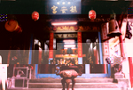 |
| ------------------- |
| 廟名：鎮安宮 |
| 教別：亦佛亦道 |
| 供奉主神：楊府七王爺、丁府八千歲 |
| 陪祀神明：觀音佛祖、三太子哪吒、福德正神 |
| 創建年代：清光緒十二年（1886） |
| 創建人：笨港三益境居民 |
| 改建年代：民國四十四年 |
| 廟址：雲林縣北港鎮館前街22號（西勢里） |
| 電話：（05）7837184 |

鎮安宮俗稱七王爺館，明鄭時期笨港屬於天興州轄，設立「行館」，清廷領台，這裡及鎮安宮附近土地，是收租納糧辦公的地方，後興建「笨港公館」即今址。因年久荒蕪，經居民修繕作為祠廟奉祀「楊府七千歲」，笨港居民不稱�爺廟，而稱「七千歲（王爺）」因此合稱「七王爺館」或「七仔爺館」，在台灣王爺是比較特殊的稱呼，也凸顯本宮的歷史背景。
　至清杖緒十二年（1886）正名「鎮安宮」。日據時代遭日本皇民化影響，神像一度藏匿居民家中，光復後居民迎回宮奉祀。然廟祠亦因地震傾毀顯得十分破爛，到民國四十年，「三益境」居民發起重修成今廟貌。主祀神明由「楊府七千歲」，增加「丁府八千歲」、「馬府千歲」三位主神，是笨港五大境「三益境」居民的保護神。
　楊府千歲，係早期居民自大陸移民迎至笨港奉祀。神像以竹為骨幹，身軀以紙為材料並彩繪，面部有鳳凰形狀，黑白色彩造型，雄偉剛毅，手執天戟頭戴王爺帽著龍袍，腳踏小鬼及神獸，善司伏魔消災解厄。早期醫藥未發達，廟中小兒科大人科藥籤很靈驗。神威曾達雲林虎尾、嘉義市、台中大里、台北地區，都有本宮的分靈廟及神壇。
　丁府八千歲，分靈自下崙福安宮。相傳清末，地方曾發生流行病，王爺前來地方消災庇佑。事平，居民懇留丁王爺安奉本宮。神像斯文有禮，穩重若文官，右手執筆，具福相狀，令人肅然。
　馬府千歲，神像威猛碩壯，環目腮鬚，身背八位童子，雙手突出，形成九頭十八隻手形體，面黝黑戴將帽。據傳馬府神明，是早期先民自大陸移居笨港，迎奉自家鄉的守護神。相傳清代笨港溪氾濫成災，本境因地處低漥，居民每遭水患，馬府千歲便顯靈化草木救助災民無數。因此每有天災，居民無不呼「馬府千歲」與「媽祖」聖號庇佑，常逢凶化吉，神蹟流為美談。
　鎮安宮歷經三百餘年變遷， 迄今雖處小巷中，香火仍維持不墜。每年都浩浩蕩蕩往南鯤鯓與下崙進香，開辦信徒安奉太歲，庇佑境裡平安。為發揚三益境楊府七千歲神威，每年千歲誕辰晚上七點，會舉行「代天巡狩」夜間遶境活動，上元節則舉行猜燈謎、提燈踩街活動。中元節放水燈，憑弔祖先及讓孤魂野鬼安息。
　
### 巡天宮（新街里）

|  |
| ----------------- |
| 教別：道教 |
| 供奉主神：蕭府千歲（蕭何） |
| 陪祀神明：關聖帝君、地藏王菩薩、觀音佛祖 |
| 創建年代：民國五十九年 |
| 創建人：何地 |
| 廟址：雲林縣北港鎮新街里華勝路571號 |
| 電話：（05）7821766 |

巡天宮的蕭府千歲在清同治年間出巡，繞過境內山仔腳庄時，指示庄民他願意鎮守護庄，庄民十分高興，於是迎入香火、雕裝紙神像，奉祀在何地先生的家中。後來神像改用綢造，繼續奉祀，神蹟顯著。
　到了光緒八年，信徒聚資雕塑金身，仍安座何宅。民國五十六年，北港信徒王頂枝等人發起集資，擇定現址購買土地，創建巡天宮，恭迎蕭府千歲鎮殿供奉，蕭府千歲才算有了正式的家。王頂枝雖然倡導建廟，但建廟未竣，卻不幸逝世，幸賴何地等其他信徒繼續努力興建，才於民國五十九年順利完工，何家並將此廟捐獻出來成為公廟。
　民國七十六年，巡天宮成立了第一屆管理委員會，新建牌樓、涼亭，逐漸具有現代規模。此宮目前是新街錦陞社集合地點。

### 武四宮

| 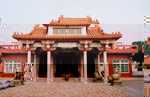 |
| ----------------- |
| 教別：道教 |
| 供奉主神：四府千歲、池府千歲 |
| 陪祀：三官大帝、註生娘娘、土地公 |
| 創建年代：清乾隆年間 |
| 廟址：雲林縣北港鎮樹腳里過溝51號 |
| 電話：（05）7832947 |

本宮主神四府千歲、池府千歲，康熙元年（1661）由福建安溪渡台，神船順流漂至苗栗後龍外埔港邊，被黃天基、朱宴二人發現，見船內安奉四座軟身神像，並書有神號－四府、池府、黃府、顏府，即迎奉回家奉祀。因屢次顯靈，披澤百姓，因此善男信女日益增多。
本宮奉祀四府千歲、池府千歲、黃府千歲、顏府千歲都是唐朝三十六進士官爺。里內有病者請求指示醫治醫院及尋找失物，都能痊癒及失物復得。因甚為靈驗，廟名大噪，成為樹腳里後來居上的大廟。
　本宮建築都由信徒捐獻，除里內、鎮上外，遠自板橋、府城皆有，廟壁刻有捐獻大德芳名。在對睹牆上左鐫有「武境康寧千歲緬懷神威德」右鐫有「四民樂業萬世承佑萬家春」。正門左刻「武挾國祚興盛德恩昭蘇萬類」右刻「四季民安樂神威浩氣澤」屬文筆雄厚，正氣凜然之佳構，亦可看出建廟脈絡及信徒廣泛。

### 順天宮（水埔里）

| 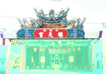 |
| ----------------- |
| 教別：道教 |
| 供奉主神：五府千歲（朱、李、池、吳、范）、玄天上帝 |
| 陪祀：福德正神、註生娘娘 |
| 創立人：蘇良元、蘇清河家氏祖先 |
| 廟址：北港鎮水埔里42之1號 |
| 電話：（05）7821766 |

雍正年間，蘇良元和蘇清河之曾祖父從大陸請來朱、李王金身在民間受人膜拜，玄天上帝原在大庄溪底五福宮受人祭祀，後因水災連年，以至廟毀，水埔里百姓請回玄天大帝跟五府千歲同祀建廟，後又從南鯤鯓恭請池、吳、范千歲安座，共享香火。現廟壁彩繪頗多，廟壁有九天聖母昇天、豐收圖、桃花山收二妖、薛仁貴救駕等大型彩繪。
　朱府千歲祭典時，陳總統曾送匾慶賀。玄天上帝常被村里請去輪流祭拜，五府千歲遶境，除妖滅魔，保佑平安，靈驗無比。五府千歲祭日，全村熱熱鬧鬧的祭拜，一片溫馨。
　註：傳說玄天上帝原為屠夫，有一天突然頓悟，放下屠刀，乃自剖身體，取出臟腑棄海中。後皈依觀音座下，成為天神，而他所棄的臟腑竟化為龜蛇危害人間，後來才被玄天上帝收服。因屢顯靈救人，因而很受百姓崇拜。

### 順天宮（番溝里）

| 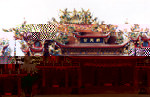 |
| ----------------- |
| 教別：道教 |
| 供奉主神：耿府千歲 |
| 陪祀：觀音佛祖、福德正神 |
| 創建年代：民國八十八年 |
| 廟址：北港鎮番溝里172-2號 |
| 電話：（05）7920706 |

耿府千歲是褒忠鄉馬鳴山鎮安宮五年千歲十二金尊之一，民國七十六年，恭請入番溝社區活動中心供村民拜祀，因神威靈赫，香火鼎盛，活動中心不敷使用。時由鎮民代表大會主席朱福田發動，於民國八十年開始填池造地興建，歷經八年完成前後殿、金亭、香客大樓、六角亭以及廟前城樓，八十八年十一月十二日舉行安座大典，由縣長張榮味及各級民意代表剪綵啟禮，以祈風調雨順，國泰民安。

　五年千歲係殷商年代民族英雄，即張、徐、侯、耿、吳、何、薛等十二神將，老君弟子康續部下十二巨人，因輔周伐紂有功於國家社稷，立譽於世上造福社會大眾，故在生時為英豪，死後成神靈。至漢代張天師倡行道法，五年千歲則顯現靈異奇蹟。相傳受玉皇上帝束力命為代天巡狩十二天王，主宰民間善惡，驅瘟除魔，世人遇有年災月惡，常舉行建醮祈安植福法會，需虔請十二天王五年千歲，降臨法壇，主司法事，掃除邪魔以保安靈。

　民國七十五年，本里里民蔡清良因家中不平安，恭請馬鳴山鎮安宮耿府千歲前來鎮宅，辦理家事，經過半年，鎮安宮發現神尊秉沒有請回，時常前來催討，但是在神尊面前擲杯，耿府千歲就是不回鎮安宮。

　民國七十六年，社區成立長壽俱樂部，會館就設在社區活動中心。因老一輩認為會館所在地，常發生莫名其妙的事情，所以商議恭請五年千歲坐鎮保平安，於是從蔡清良家中恭請耿府千歲，並設立順天壇供人膜拜。因耿府千歲顯靈的事蹟時常發生，里民常來祈求耿府千歲保平安，因而成為里民信仰中心。沒多久，鄰近各村里，甚至台北、高雄各地都有信徒前來膜拜，祈求平安。

　因為善信愈來愈多，香火愈來愈旺，地方賢達就商議興建廟宇，因此公推朱福田先生為主任委員，開始商議興建事宜。奉耿府千歲旨意選中番北社區的魚塘作為建廟用地，於是展開填土建廟工作。廟成雄偉壯觀，光華奪目，琉璃映輝，美不勝收。據聞該村里很多靈異怪事，從此雲消霧散，在外從事商業蒸蒸日上，村里都歸功於耿府千歲的保佑。

　如今耿府千歲及觀音佛祖、福德正神，都供奉在這清靜優雅，廟貌巍巍的殿堂，保佑信眾。耿府千歲卯年值歲，農曆五月初七誕辰。

### 鎮北宮蔡府千歲

|  |
| ----------------- |
| 教別：道教 |
| 供奉主神：蔡府千歲 |
| 陪祀：觀音佛祖、福德正神、城隍爺 |
| 創建年代：民國八十九年 |
| 廟址：北港鎮大北里92號 |

三百多年前，大北里是荷蘭人及平埔族必爭之地，曾發生大北里戰爭。後來貓兒干笆籬竿的蔡家，遷到本地建部落。蔡家奉祀蔡府千歲（本名蔡端），因屢次顯靈漸成為村里居民祀拜的神祇。

　據當地耆老蔡水車說：蔡端本是朝廷命官，被調至唐山偏僻地區。有感於交通不便，欲建橋，因款項無著，病倒在床。某日，河中出現一美女坐於船上，大聲說：「誰能用元寶，壓住船隻，就嫁給誰？」村民爭先恐後擲元寶到船中，終於壓住船隻。當村人欲上船娶親，卻不見該女倩影，只從天上傳來：「吾乃觀音化身，此款用來造橋是也」蔡端之病因而轉好，橋亦建竣。蔡端因勤政愛民，死後被當地民眾奉為千歲膜拜。蔡府千歲乃蔡家祖先從唐山分靈而來。

　民國八十九年，蔡火土捐地建駑，當年八月九日安座入火，本尊降旨稱為「鎮北宮」。因為非常靈驗，鄰近村里紛紛前來朝香，本宮遂成為里民精神支柱。

### 鎮安宮

|  |
| ----------------- |
| 教別：道教 |
| 供奉主神：朱府千歲、李府千歲、池府千歲、吳府千歲、范府千歲 |
| 陪祀：地藏王菩薩、福德正神 |
| 創建年代：民國四年 |
| 創建人：吳全 |
| 廟址：雲林縣北港鎮溝皂里13鄰217號 |
| 電話：（05）7921457 |

本宮創始於民國四年，由吳廷先生由雲林縣口湖鄉外埔奉請朱府千歲到此鎮宅。因神威顯赫，村民集資興建本宮。現奉祀五府千歲為主神。陪祀有地藏王菩薩、福德正神等諸位神駕，並各有誕辰紀念日，依時祭祀。

　本宮位於北港鎮溝皂里十三鄰，是單獨村落（閹豬社）。住家二十多戶共同集資興建本宮。原稱為朱李池鎮安宮，只供奉李、池、朱三位主神，稱三王爺廟，改建後增為五府千歲。本宮規模不大，但有八十多年的歷史，是當地的信仰中心。

### 新厝受天宮

| 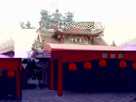 |
| ----------------- |
| 教別：傳統民間信仰 |
| 供奉主神：五府千歲－大周府千歲、二周府千歲、溫府千歲、侯府千歲、秦府千歲 |
| 陪祀神明：武德英侯、福德正神、五營將軍、黑虎大將軍 |
| 創建年代：民國六十七年 |
| 廟址：雲林縣北港鎮新厝里61-1號 |
| 電話：（05）7822220 |

新厝里位居北港鎮郊東北角北港溪西側，原為地勢低漥、一片荒蕪之原野。清道光十七年（1837），四湖鄉蔡厝庄十餘戶居民，認為庄前大溝水流順暢、水質清澈，是一地靈人傑之活穴。居住於此，必能得到庇蔭發跡興旺，即率家族填土築屋定居下來，並迎請大周府、二周府、秦府千歲至庄中膜拜，眾神屢顯神威，保祐眾生。

　爾後有四湖鄉的蔡姓，嘉義縣朴子雙溪口的曾姓、東勢鄉牛埔頭吳姓、北港鎮樹仔腳施姓、嘉義縣六腳鄉竹子腳陳姓、北港街仔李姓、新街王姓、蔡姓、楊姓、水林鄉西井蔡姓等相繼遷入為鄰。當北港鎮新街王花遷入時亦恭迎溫府、侯府千歲相隨庇護，是時五尊聖神大顯神威，確保庄民生命財產的平安。眾信感念神恩浩大，共稱為五府千歲。清光緒十年，李姓、吳姓遷入本庄，亦恭迎武德英侯及哪吒三太子二尊神駕，併合五府千歲在庄中供奉。

　因本弚人口較少，無法集資建廟，所以神駕平時均分散在民眾家中供奉，每年逢五府千歲聖誕千秋大典時，庄民才護送神駕到臨時搭建之神壇安置，以供祭祀及信徒參拜。民國六十三年，蔡明雲里長積極募款購置現有廟地，興建里民活動中心。民國六十七年，庄民有感五府千歲等神明沒有長久安居之處，共議在活動中心內闢建神房安置神明，以便信徒參拜，同年農曆九月十九日，由陳鉗在五府千歲神前擲筊請示，命名為受天堂。

　民國八十三年王趁里長有鑒於廟地登記在私人名下產生不便，決定籌組委員會，從事廟地轉移登記，並積極籌建廟務事宜。同年農曆十一月召開信徒大會，並請示神明，將受天堂更名為受天宮。民國八十四年農曆六月，將籌建委員會改為興建委員會，積極推動新廟建築工作，因庄中信徒全力支持配合，各戶丁錢繳交順利，各地信徒亦在五府千歲聖靈顯赫、神威遠播之下相繼捐款。

　同年農曆十月十五日隆重安樑，承蒙各委員及信徒出錢出力鼎力相助，使各項工程圓滿竣工，成為富麗堂皇、冠冕雄偉之廟貌，在民國八十八年己卯年農曆六月十一、十二、十三日，舉辦受天宮入火安厝大典，爾後神有闕宮可安，民有神祗可祀。

　受天宮建廟期間，神蹟不斷。曾在尋找乩童時，出現與信徒的「公媽」談判，一時神桌抖盪搖晃，讓旁觀者肅然無語。（受天宮碑誌摘錄）

### 侯天府

| 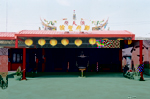 |
| ----------------- |
| 教別：道教 |
| 供奉主神：鄭府聖侯 |
| 陪祀神明：觀音佛祖、福德正神 |
| 創建年代：民國列十四年 |
| 創建人：吳雨順 |
| 廟址：雲林縣北港鎮草湖里西湖路100號之１ |
| 電話：（05）7824454 |

侯天府現址，原稱公館。以前賢達信徒為了舉行年度的鄭府聖侯等神明奉祀典禮，在此處住戶門口搭建臨時道場，供善男信女叩謝神恩，祈求平安。後來賢達人士倡議積資興建公壇，以防祭典中之風雨。但祭祀完畢，鄭府聖侯及其他神明仍須迎回爐主家宅中供奉，十分不便。

　民國七十四年，經集會磋商，一致決定推選籌備委員，成立重修籌備委員會，讓信徒們自由樂捐，積極籌資整建，並以舊有的公壇房屋為基礎，善加修繕。民國七十六年，第一屆管理委員會選出後入火安座，成為鄭府聖侯在台灣首創的祖廟。

### 德安宮

|  |
| ----------------- |
| 教別：道教 |
| 供奉主神：五府千歲（李、吳、馬、朱、羅府） |
| 陪祀神明：包公、福德正神 |
| 創建年代：清乾隆三十八年 |
| 創建人：吳頭 |
| 廟址：雲林縣北港鎮劉厝里劉厝路116號 |
| 電話：（05）7830672 |

德安宮除奉祀有李、吳、馬、朱、羅五府千歲外，並祀有邵、邢、金、主、鄭等府千歲，乃清乾隆三十八年自台南縣北門南鯤鯓代天府分靈而來。本宮初奠之時因陋就簡，所以僅以茅草覆蓋屋頂，後來颱風來襲將其摧毀，後以鐵板蓋屋頂暫避風雨。
　廟之周圍原本崎嶇不平，廟後又有池塘。日據時期，保正高慶發動民工填平。民國四十五年，里長吳珠坤有感於廟宇巳舊，乃籌畫翻修，里民亦皆出錢出力響應。民國六十七年成立管理委員會，七十九年委員議決再度重建，歷三年，建成宏偉莊嚴之新廟。
　德安宮自從奠基以來，已有二百多年的歷史，因為護佑里民，劉厝里民對之甚為崇敬。

### 笨南港朝安宮

|  |
| ----------------- |
| 教別：道教 |
| 主祀：蘇王爺蘇洵、蘇軾、蘇轍父子 |
| 陪祀：李池朱王爺 |
| 住址：蘇厝寮 |

北港通往嘉義途中的蘇厝寮，早於明永曆三十五年（1681），福建泉州府南安縣蘇澤承帶領族人抵笨港南部腹地，墾殖定居。聚落以蘇姓為名，稱「蘇厝寮」。村中奉祀自大陸來台的蘇府王爺，即宋代詩人蘇洵、蘇軾、蘇轍父子三人。
　廟稱「朝安宮」為笨港地區唯一的文人廟。三尊王爺神像，雕刻很細緻，每尊僅六、七吋而已，古香古色，面容慈祥，村民都恭敬禮拜。以前僅供蘇家子弟膜拜，現在已建立雄偉廟寺，將蘇王爺供奉其內，香火鼎盛。
　
## 原鄉鄉土神明

本處所指之原鄉鄉土神明，是指當初先民渡海來台，所帶來故鄉的神明信仰，原本具有濃厚的地域性，由其所信仰之神明即可看出當地移民的祖籍，但經過四百餘年的融合，已漸漸失去其狹隘的地域性，而成為普遍的民間信仰，本鎮類似的廟宇有漳籍移民所信仰的開漳聖王（昭烈宮），客籍移民的三山國王（乾元宮），及福州移民的五僊大帝（五福宮）及臨水夫人（巡安宮），茲介紹如下：

| 2-42 鄉土神明之部將 - 八家將 | 2-43 鄉土神明之部將 - 八家將 |
| ------------------ | ------------------ |
| 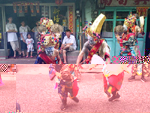 | 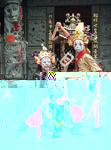 |

### 昭烈宮

| 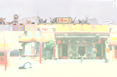 |
| ----------------- |
| 教別：道教 |
| 供奉主神：開漳聖王 |
| 陪祀：地藏王菩薩、武安尊王（姓許宗神）、巧聖先師（魯班公）、普庵先師（土木工守護神）、關聖帝君（財神）、荷葉先師（泥水匠守護神）、爐公先師（打鐵業行業師）、福德正神、註生娘娘、雷公爺 |
| 創建年代：乾隆三十年（1765） |
| 創建人：陳姓宗親一同 |
| 廟址：雲林縣北港鎮大同里公民路104號 |
| 電話：（05）7835052 |

昭烈宮本名昭烈堂，係陳姓祖先自大陸福建省漳州迎請金身，於北港賜福境奉祀。乾隆三十年創立陳姓王會，每年農曆二月十六日舉行祭典，由會員輪流擔任爐主。嗣後由宗親集資在北港街一二三九號之地址，興建宗祠奉祀陳聖王公，名曰「陳姓王廟」。

　光緒二十年（1894）遭受地震災害，廟宇塌崩成為廢墟。陳姓宗親王金身遂由陳姓宗親輪流值東奉祀於自宅。因奉祀不便，乃於民國十七年（1928）倡議募捐，在北港街一二四五號地址重建，然因工程遭受種種阻礙半途而廢，民國三十七年推舉陳向陽為主任委員，多方募捐才完成壯麗宗祠。因陳聖王受封為昭烈侯，故名「昭烈王」，每年舉行春秋二祭。民國四十三年恭雕陳聖王金身安置奉祀，陳誠副總統題匾。爾後因年久失修，樑柱蛀蝕。八十八年四月鳩工興建，九十年中旬竣工，同年十二月三日入火安座。

　民國八十九年召開第一次信徒大會，更名為「昭烈宮」。正殿奉祀開漳聖王，陪神有武安尊王（即保儀尊王，是唐代忠臣許遠）、巧聖先師（魯班公）、普庵先師、荷葉先師、中壇元帥、雷公爺等。後殿恭奉地藏王菩薩並奉祀陳姓宗祠祿位，具有慎終追遠、 飲水思源、教忠教孝之功能。
　
> 註：開漳聖王名為陳元光，河南光州人，唐末考中武進士。當時福建一帶屬南蠻七閩未開化地區，他率軍平定漳州七縣，並大力建設，對百姓施以教化，因而漳州人稱為「開漳聖王」。

| 2-45 昭烈宮舊照 |
| ----------------- |
| 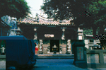 |

### 巡安宮

| 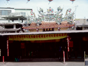 |
| ----------------- |
| 教別：道教 |
| 供奉主神；臨水夫人陳靖姑 |
| 陪祀神明：陳靖姑先父母、福德正神、陳靖姑之師父 |
| 創建年代：民國五十六年 |
| 創建人：詹金石 |
| 廟址：雲林縣北港鎮華勝里文星路144號 |
| 電話：（05）7822503 |

從民國二十二年臨水夫人初降，由乩童陳玉蘭領旨，當時僅為一小壇，開始濟世，屢有靈驗。民國二十九年農曆七月初一起，乩童陳玉蘭往北部各地渡世救人，由於臨水夫人神威顯赫，有求必應，頗有名聲，故信徒愈來愈多。民國五十五年，信徒倡議建廟，命名「巡安宮」。民國五十六年，建廟委員會鳩資動工，一年後竣工，入火安座，一時信徒遍布全省，盛況空前。

　臨水夫人很靈驗，常有未孕者來祈求，幾乎都能如願以償，縣農會前曾鬧旱災就設壇求雨，不久甘霖四起，傳為佳話，因而香火鼎盛。

### 乾元宮 

| 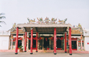 |
| ----------------- |
| 教別：道教 |
| 供奉主神：三山國王 |
| 陪祀神明：三官大帝、註生娘娘 |
| 創建年代：清道光四年 |
| 廟址：雲林縣北港鎮樹腳里大莊2號 |
| 電話：（05）7831478 |

本宮主祀三山國王，溯自清康熙年代，先民隨鄭成功渡台時，恭請三山國王分靈之香火，在諸羅笨港船頭埔登陸。當時樹腳里只有二五家集成小村，百姓遂就民屋創立草堂，安爐奉祀。嗣後住戶日增，聖王威靈顯赫，屢佑村民解決困難。道光四年春三月始建廟宇，咸豐五年及光緒十三年，曾二次重修。民國九年，遷至現址。

　民國四十六年，里民公推留老傳為管理人，倡議修廟，並成立籌備委員會，公推留老傳為主委，於是年八月動土興工，丙辰年仲秋竣工，入火安座。信徒雲集，鑼鼓喧天盛況空前。因神明顯赫，每逢誕辰，香客信徒虔敬謝神，民間戲團紛紛在廟埕演戲酬謝神，蔚為盛況。

### 五福宮（扶朝里）

| 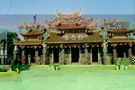 |
| ----------------- |
| 教別：道教 |
| 主神：天僊五帝、玄天上帝 |
| 陪神：福德正神、石將軍、註生娘娘、閻君爺 |
| 創起時代：清康熙年代 |
| 創立人：蘇碧等先人 |
| 廟址：北港鎮扶朝里192之1號 |
| 電話：（05）7836068 |

扶朝里五福宮神明，由大陸「興化店」蘇姓先民從福建晉江帶來天僊大帝尊來台，首先輪流祭祀，後在大庄「五福宮」，由蘇厝寮、大庄、扶朝祭祀。民國五十年，廟宇因水災倒塌，大庄神明又由信眾輪流祭祀。民國六十年，推舉蘇世傳為主事，籌畫興建事宜。民國六十九年二月動土，七十二年竣工，同年二月子時進殿安座，主祀天僊五帝、福德正神、石千歲陪祀左右。樓上「北辰宮」奉祀玄天上帝，閻君公、註生娘娘分置左右。

"　民國七十三年，村民感念天僊大帝，屢次化身，庇佑村民，特塑五尊五僊大帝祭祀。現在廟宇莊嚴肅穆，香火鼎盛、巍峨雄峙，美輪美奐。陳水扁總統曾賜匾剪綵安座，廟壁浮雕、泥塑、交趾陶，頗具建築之美。

> 註：五僊大帝有這樣的傳說：有欲至福州應試的五名書生－張元柏、鍾是秀、劉元達、史文業及趙光明等。有天晚上結伴出遊，遇上五瘟神在五處古井施毒。五人好心警告村人不能喝，卻無人相信又自覺應考未第，無顏返鄉，乃決議犧牲自己留書示警，投井受毒身亡，因而拯救全村生命。民間信仰中，也把五福大帝視為五瘟神。明憲宗時，追封此五人為五福大帝。

### 好收奉三宮

|  |
| ----------------- |
| 教別：道教 |
| 供奉主神：三山國王、巾山神－清化威德報國王、明山神－勤政明肅寧國王、獨山神－惠威弘應豐國王 |
| 同祀神明：觀音佛祖 太子爺 |
| 祀典日期：農曆二月廿五日 |
| 創建年代：民國四十三年 |
| 廟址：雲林縣北港鎮好收里號52號 |
| 電話：（05）7922141 |

崇禎元年〈1628〉鄭芝龍以笨港為基地，招了好幾萬福建居民到台灣開墾。這批來自漳州、泉州的移民，大部分居住在笨港街上。後來從廣東來的移民，就往郊區的西北方聚集，早期的好收是典型的客家部落，從社區內奉祀「三山國王」可知。

　該寺奉祀三山國王，乃康熙五十四年，廣東人移居來此，自塑神像參拜，後來村民有感神跡時常出現，遂發起建廟之事。清同治元年，草創成廟。其後歷經幾次整修。民國四十三年，因廟堂內外剝損有失觀瞻，於是將廟有之香火土地出售，將該款所得重新整建廟構，不足部分由善男信女自由樂捐。民國四十二年農曆五月十六日開工，隔年農曆九月十五日竣工。

　奉三宮為庄民宗教信仰之地、精神寄託之所，平日聚會聊天之處。每年農曆二月廿五日為該宮之祭典。奉三宮是鎮內少數擁有墓園及池塘等公產的廟宇。
　
寺廟對聯：

* 奉鎮好收赫赫神威揚四海，
* 三星拱照巍巍廟貌壯千秋。
* 奉旨護國佑鄉民，三山神威冠乾坤。

## 鬼魂及獸魂崇拜

此類信仰可分為有應公廟與大眾廟二種。此外，北港有大眾爺和有應公，相同點都是奉祀無主鬼魂，相異處是大眾爺是厲鬼，而有應公所奉的則是無主的骨骸。

### 有應公廟

有應公類之陰廟有「百姓公」、「金斗公」、「萬善爺」、「大墓公」等。有應公廟所奉祀的亡靈，大都是修路或建築時所挖掘出土的無主骨骸。這些無主骨骸都是身份不明、無人奉祀的無主鬼魂。為使無主孤魂不會危害世間，得到福廕，故將這些無主骨骸集中置於斗甕中，建祠祭祀，稱為「萬善同歸」。 本鎮這種廟宇甚多，大多未立案，廟宇格局小，且未刻有神像，故不再一一介紹。

| 2-51 屠宰舖靈威祠   |
| ----------------- |
| 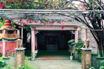 |

###大眾廟

　大眾爺係死於非命的孤魂，據說是鬼中的「厲魂」。左傳之「晉侯夢大厲」，其注云：「厲，鬼也。」古以死而無後稱厲，因無後嗣奉祀的鬼魂，生活無著便成為「厲鬼」作崇害人。直言之，大眾爺所供奉的大都是因械鬥、民變、戰亂而死於非命的孤魂野鬼。因其非自然死亡、死不暝目，所以為害活人。為安撫枉死亡魂，因此建廟奉祀。

　古時民智未開，民眾疾病纏身，以為是沖犯「厲鬼」之故，於是焚香燒紙祭拜，祈求疾病離身。<<士喪禮>>云：「疾病禱於厲」，為求平安乃為厲鬼建祠奉祀以安撫亡魂。

　本鎮之義民廟所供奉者即屬此類，但因民變中，祂們是站在政府的一邊，故受到清政府的冊封，一般民間並不以厲鬼視之。其廟宇介紹如下。

### 笨港義民廟 

|  |
| ----------------- |
| 供奉主神：義民 |
| 創辦年代：乾隆五十三年（1788） |
| 陪祀神明：義犬、福德正神 |
| 創辦人：笨港士紳 |
| 廟址：雲林縣北港鎮旌義街20號 |
| 電話 ：（05）7838213 |

公元1786年，當時清廷政令不明，以致民怨載道，造成「三年一小反，五年一大反」的社會亂象。反清意識強烈的天地會，更形擴張，北以彰化大里杙林爽文為首，南以高雄鳳山莊大田為主，造成全面叛亂。乾隆五十一年，林爽文以破竹之勢，攻陷彰化，南下圍攻諸羅（嘉義），官兵不敵，節節敗退，亂軍所到之處，均受蹂躪，創傷累累。

　後來賊兵攻達笨港，笨港危在旦夕，居民凜以正義，召集壯士一０八人組織義民團，並養有一隻靈犬，堅強抵抗。賊兵屢次攻入笨港都被擊退，但賊兵還是頑強反撲，並善用偷襲，使義軍窮於應付。幸養有一隻靈犬。隨時提高警覺，才能使賊兵難以越雷池一步。

　乾隆五十二年（1787）五月三十日，賊兵設計夜襲。黃昏時分，先以頭陣兵馬詐敗，義軍不疑有他，當晚舉行慶功會，痛飲黃酒，個個喝得酩酊大醉，豈知賊兵派奸細先毒殺義犬，然後潛入義軍。這時義軍大部分醉得東倒西歪，賊兵一入營區，大肆砍殺，一０八位義軍全部罹難，笨港就此淪陷。

　後來滿清政府派福康安將軍，帶領大隊兵馬，渡台討伐。清兵以破竹之勢弭亂，彰化、諸羅、笨港相繼光復，並力擒賊首送京治罪，這場內亂終告平定。次年府城上書皇帝，乾隆御賜「旌義」，並改諸羅為「嘉義」以資褒揚。笨港地方士紳受令，鉤御筆出資建亭，名為「旌義亭」。

　同治二年（1862），戴潮春組織八卦會，全面叛亂。叛軍很快打到笨港，當時笨港義軍及清軍，同心協力，才把戴軍擊退。這次義軍死難有蔡水等三十六名，同時葬在 「旌義亭」兩旁，並將「旌義亭」擴改為「義民廟」。「義民廟」幾度受地震、水災的侵襲，經四次整修、擴建。民國六十二年全部竣工，即現在廟貌。

　義民廟是祭祀保鄉衛民殉難的義民及義犬，具有教忠教孝之義，後來義民屢次顯靈解決民難，鄉民敬仰有加，在每年五月三十日（或二十九）舉行「義民公普」紀念殉難義士。義民廟於民國八十二年被內政部核定為國家三級古蹟。

| 2-54 義犬將軍      | 2-55              | 2-56 國家三級古蹟   |
| ----------------- | ----------------- | ----------------- |
| 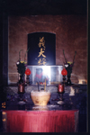 | 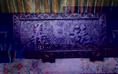 |  |

## 自然崇拜

本鎮此類廟宇包含源於北極星崇拜的「玄天上帝」、土地崇拜的福德正神，與水神崇拜的水仙尊王，茲介紹如下：

### 聖天宮

| 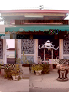 |
| ----------------- |
| 教別：道教 |
| 供奉主神：玄天上帝 |
| 陪祀神明：福德正神、中壇元帥、人得真君、康趙兩元帥 |
| 廟址：雲林縣北港鎮北辰路13號 |
| 電話：（05）7839304 |

咸豐年間，福建黃姓人士由內陸遷台，以康元帥沿途保平安，然後指示雕刻北極玄天上帝一尊，供遠近眾信祈安求福。玄天上帝心懷慈悲，經常雲遊各地救人救世，爾後奉祀於北港吳要家。民國七十三年，信徒集資興建行宮，同年八月十三日落成安座，並恪遵聖旨諭示宮名「聖天宮」，同時成立聖天宮籌備管理委員會。

| 2-51-1 聖天宮神祇     |
| ------------------- |
| 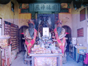 |

### 真武殿

| 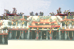 |
| ----------------- |
| 教別：道教 |
| 供奉主神：北極玄天上帝 |
| 陪祀神明：康、趙二元帥、註生娘娘、福德正神、李府千歲、朱府千歲、天上聖母、南天大聖 |
| 創建年代：清代初年 |
| 創建人：李甘棠 |
| 廟址：雲林縣北港鎮溝皂里4鄰160-2號 |
| 電話：（05）7921225 |

真武殿祀奉主神為北極玄天上帝，康、趙二元帥、註生娘娘、福德正神等神駕陪祀。真武殿起源，據廟方表示：清朝初年，有位賣雜細的商人至中國大陸採購胭脂水粉，夜宿武當山下。當晚玄天上帝託夢要同他回台，商人依指示迎回一尊小型玄天上帝神像返台。該神像高約七寸二，成黑面立姿，手持七星劍，腳踏龜蛇。當時中國不准隨便攜出神像，據傳玄天上帝化身成小狗，才順利通過海關。商人認為靈驗，每次做生意時均請神像同行。某日至北港溝皂，因口渴向村民要水喝。喝完水，欲扛起神像離去，卻發現神像不動如山，經神明指示要留在溝皂，爾後神明成為溝皂地方公神。

　初始，廟宇以草茅搭成，位於今東榮國小旁之幼稚園，後遷至國小左側，再遷回幼稚園。後因廟宇傾圮，乃隨爐主奉祀於家中，慶典活動則選在東榮國小操場舉行。民國六十八年，神明示意要建廟，乃擇定「菩提窟」動工興建。該地原為小型湖泊，池水甚深，週遭都是榕樹，氣氛陰森，據傳乃本里龍脈所經之地，經填土建廟後，已無往日陰森之氣氛。民國八十年桂月，翁坤棠率子出資捐獻牌樓，更具規模。本廟信徒來自四面八方，香火鼎盛，是里民精神支柱。每年農曆三月三日為祭典日，場面可觀。

　根據東榮國小前校長蔡裕瓦先生傳述，約四十年前，曾有一蔡姓菲律賓華僑至本里尋祖，其祖先所遺線索，即曾留下一尊玄天上帝，然此事無疾而終，該華僑未再出現。
　
### 崙公廟

|  |
| ----------------- |
| 教別：道教 |
| 供奉主神：福德正神 |
| 創建年代：清乾隆年間 |
| 創建人：先民 |
| 廟址：雲林縣北港鎮樹腳里大庄82號 |
| 電話：（05）7836428 |

清乾隆年間，村莊與公墓銜接，當時毒蛇野獸常常出沒村中，以致村民搬離，祖先墳墓因此無人照料。後來地方人士祈求土地公為村民驅除毒蛇野獸，許多村民都夢到一老者，持杖驅蛇趕獸。經上山一看，毒蛇猛獸都已不見蹤影，村民感恩，特地立廟奉祀。爾後，因村民漸離公墓，廟宇乏人照管，舊廟倒塌，地方人士飲水思源，再度於民國四十年三月重建廟宇及香爐一座，並立碑文紀念福神功德。現在廟境清幽，極具莊嚴肅穆之感。

### 笨南港福德堂

| 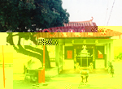 |
| ----------------- |
| 創建年代：康熙年間 |
| 祭祀主神：土地公福德正神 |
| 創建人：笨南港民眾 |
| 廟址：古笨港仁和街尾北港溪南岸（今為嘉義縣新港鄉南港村） |

早期，只要有漢人群居之處，就有土地公廟。閩人說：「田頭田尾土地公」客家人叫土地公為「伯公」，可見台灣地區民眾對土地公的親切認同。

　笨南港福德堂是笨港興建最早的土地公廟，創建年代始於康熙年間。佔地不大，但四周空地寬闊，建有涼亭。內部布置精簡，僅神龕、供桌。龕內置一幅高四尺寬六尺的土地公及文武判官畫像，畫工精美，屬於清代作品，另有土地公神像及木雕文武判官，容貌親切莊嚴。

　福德堂土地公稱為「都福德」，管轄街市眾多人口，與一般土地公不同，所以配文武判官，符合清代街市土地公廟祭祀規制。本堂經清道光十九年（1839）重修，信徒敬獻柱聯：「南港雖舊都福德威靈猶如昨，仁和稱美俗正神庇佑自無疆。」

　公元1869年，楊姓信徒捐款重修，敬獻石爐，與六尺高的樑籤是全省寺廟少見的珍貴文物。樑籤是建廟時，按信徒捐款多寡依序立於中脊樑上。本堂至今已三百多年，可以稱得上「老土地公廟」。

### 笨南港水仙宮

| 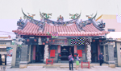 |
| ----------------- |
| 創建年代：清乾隆四年 |
| 主祀:：水仙尊王、關聖帝君、天上聖母 |
| 陪祀：奡當舟尊者、羿善射尊者 |
| 廟址：嘉義縣新港鄉南港村58號 |
| 創建人：林開周 |
| 古蹟：國家二級古蹟 |

本宮建於清乾隆四年（1739），由笨南港商郊捐資建於笨港南街，主祀水仙尊王。清乾隆四十五年，貢生林開周募款重建完成巍峨廟貌。嘉慶初年，笨南港遭洪水肆虐，水仙宮、協天宮同遭洪水沖毀，因笨港港務不振，延至十九年（1814）重建於現址。

　清道光廿八年（1848）笨港三郊金合順、金興順、金晉順發起增建後殿，奉祀協天宮的「關聖帝君」。民國三十七年，南、北港人士鑑於開台勝蹟，年久失修，乃進行募款修葺，歷時二年完成修建工程。

　笨南港街的汀洲媽祖廟，創建於雍正年間。清光緒末年遭地震傾毀，聖母神像兩尊，由信徒楊樹枝迎回家中供奉；因彰化南瑤宮進香不便，經地方人士公議，將媽祖移駕於水仙宮安奉於拜殿，使水仙宮主神為「水仙尊王」、「關聖帝君」「天上聖母」三位，信徒合稱「三宮合一宮」。

　水仙宮五位水仙尊王，指的是治水有功的大禹、三閭太夫屈原、土木業祖師爺魯班公、春秋戰國之伍子胥、楚霸王項羽等。陪祀左右兩位尊者為奡盪舟尊者、羿善射尊者。

　南港水仙宮，因為具有關聖帝君、水仙尊王、及汀洲天上聖母三神，都很有名氣及靈驗，所以香火鼎盛。

　廟內古物如：道光廿九年，泉州金和順、廈郊金晉順敬獻的香爐；同治八年，協天宮石雕香爐三座、神像雕刻都是上上作品。建築採取三開間的廟宇，其中三川殿的龍柱，步口麒麟堵亦是乾隆時代作品。剪黏綵繪、交趾陶都出自名家江清露、陳玉峰等作品，廟宇頗為寬大，是雲嘉地區著名的二級古蹟。水仙宮旁新建天后宮，九十一年農曆九月五日已安座供信徒膜拜。

| 2-62 水仙尊王 |
| ----------------- |
|  |

## 佛教寺院

本鎮佛教寺院有以下數座：

### 慈德寺

| 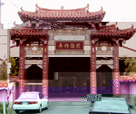 |
| ----------------- |
| 教別：佛教 |
| 主祀：釋迦牟尼佛、觀世音菩薩、羅祖師 |
| 創建年代：清宣統二年 |
| 住址：雲林縣北港鎮光明路162號 |
| 電話：(049)7836011 |

慈德堂未建前，一般信徒必須跋涉至嘉義廳德和堂參拜（即今溪口鄉本厝村），殊感不便。信徒蔡塗水乃與同志顏達、許路、蔡川、王護、蔡然三等發起籌畫，宣統二年七月十六日提出建築申請於嘉義廳，同年八月廿四日准予興建，經費悉由蔡塗水負責。民前一年三月工程告竣，完成瓦葺平房佛殿及其它附屬房屋，共推蔡塗水為首屆管理者兼堂主。

　慈德堂環境優閒靜肅，四周栽植松、竹、花果、藥草等供信眾敬佛念佛兼弘法修養道場，曰「慈德堂」(齋堂)。民國七年二月廿三日，管理者蔡塗水西歸，信徒推蔡山川繼承管理重責。

　民國四十二年八月奉准附設慈德幼稚園，教導國家幼苗，禮聘張玄達法師任弘法組長兼幼稚園首屆園長，繼而增築禮堂、課堂，並改建住學室等。又因慈德佛殿受白蟻之害有礙安全，是以民國五十六年春，著手改建鋼筋混凝土結構、琉璃瓦二層樓佛殿，供奉釋迦牟尼佛、觀世音菩薩、羅祖師等重塑金身。廟貌煥然一新，構造之輝煌、設備之完整、環境之優雅，屬首區一指之齋堂。落成之際，信徒提議將寺名改為慈德禪寺。現慈德禪寺之幼稚園早已停辦多年，新建現代化靈骨塔，則成為安頓祖先的地方。

| 2-64 祠德寺舊照 |
| ----------------- |
| 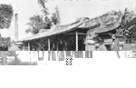 |

### 彌陀寺（小西天）

| 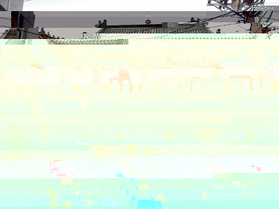 |
| ----------------- |
| 教別：佛教 |
| 主祀：觀世音菩薩、阿彌陀佛 |
| 廟址：雲林縣北港鎮光民里中秋路94號 |

彌陀寺是清代笨港地區唯一的佛教寺廟，興建於嘉慶八年〈1803〉奉祀「阿彌陀佛」。相傳笨港溪常有溺水孩童之冤魂，經常於白晝現形曳人落水，街民恐懼視為畏途。嘉慶三年，居民王福基經過為鬼所困，危險之際朗誦「阿彌陀佛」數聲，鬼隱脫困，乃告街中眾人，立石銘刻「阿彌陀佛」。居民常於黃昏見到石碑出現火光，因此發起募捐興建佛寺，完成拜亭及佛堂。

　清同治五年鄭來旺等重建，並增建養濟院以幫助無依疾困他鄉人士。本地人稱彌陀寺為「小西天」。民國六十五年由現任主持募款重建，為現代水泥建築，並設立圖書室，室內環境優雅是修行禮佛的好處所，保存有清同治五年「小西天」匾額及養濟院石碑。（錄自－笨港一書）

### 碧水寺

|  |
| ----------------- |
| 教別：佛教 |
| 供奉主神：觀音佛祖 |
| 陪祀神明：大眾爺 |
| 創建年代：嘉慶五年 |
| 創建人：蔡秀 |
| 廟址：雲林縣北港鎮新街里新德路3號 |
| 電話：（05）7823382 |

嘉慶五年（1800）笨港街民蔡秀祈願新街眾民平安繁榮及供暫厝亡者靈柩，慨捐五十圓，倡建北壇，並刻觀音佛祖奉祀之。咸豐六年改建稱「碧水寺」。此時中奉觀音、閻羅天子；東廂奉大眾爺；西廂奉福德正神。同治二年、光緒三年皆有改建。大正二年，為保存公業方創設管理制，由蔡棟擔任管理人。

　昔日台灣匪寇猖獗，殘害百姓，陰謀設盟王府，滿清官吏無力抵禦，生靈塗炭，是故鎮民自組義民軍抗衡，以保生命財產安全。其捨生取義之風骨，萬古流芳，乃建置大眾爺奉祀。民國七年再修建。民國三十六年，聘善仔法師駐廟誦經，並兼任臨時管理員。民國三十八年，口湖孫闊嘴先生捐贈太子爺一尊供奉祀，靈驗無比，信徒日益增多，曾被國家指定為三級古蹟。

　民國八十年農曆正月初三晚上不幸發生火警，神像全部燒毀。隔年五月嘉義靜德寺住持吳也合，奉獻大殿重建經費及觀音佛祖及金童玉女各一尊，並於十月二十六日成立管理委員會。近因土地問題發生糾紛被告，法院宣告廟方敗訴。現神明被請出外面，暫住紅色鐵皮屋，真是神明也落難。

| 2-67 碧水寺 |
| ----------------- |
| 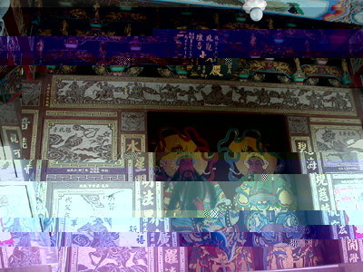 |

### 笨南港水月庵

| 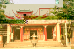 |
| ----------------- |
| 教別：佛教 |
| 供奉主神：觀音佛祖 |
| 陪祀神明：三官大帝、閻羅天子孔子、註生娘娘 |
| 創建年代：乾隆五十六年 |
| 廟址：嘉義縣新港鄉頂菜園 |

「水月庵」位於北港往嘉義約兩公里處，舊稱此庵為「南壇」。廟寺創建於乾隆五十六年，為傳統閩南建築，結構簡樸，保存甚佳，三川殿的雕刻門窗堵、大神龕都是清初古物。　　清代光緒十一年的「慈雲普濟」「法雨超生」。光緒十三年，笨港分縣楊錫霖所獻「得大自在」及乾隆帝的「聖諭牌」頗具歷史價值。「水月庵」主祀觀音佛祖，配祀「註生娘娘」，左殿東廂祭包大學士、閻羅天子。西廂祀「至聖先師」。新春期間的清晨，庵內總擠滿補運、改運的民眾，是非常特殊的景象。

　「水月庵」占地頗廣，花木扶疏，環境優雅寧靜，在已故音樂家陳家湖主持下，興建音樂廳供愛樂者演奏及欣賞，並闢「一息園」廣植花木供遊客及鄉人休憩，是笨港古蹟中之勝景。

　水月庵的「一息紀念館」「一息演奏廳」，藏著一個非常感人的故事。陳家湖先生祖父陳順直，是皎隆年間的飽學之士，泉州官府曾頒「聖諭牌」要他宣講聖諭，勸世行善。乾隆二十四年，陳順直應笨港縣丞之聘，捧著「聖諭牌」渡海來到北港，建台宣講聖諭。爾後由其子陳嘉清繼承家業，仍在笨港經商。

　有一年，因許多賒帳無法收回，經濟陷入困頓，就到米店賒糙米，準備搗成白米過年。豈知米店伙計前來告之：「除夕為收帳日，不可賒帳，如不及時付錢，就要將米帶回。」陳嘉清即刻將米從石臼掏出，讓米店伙計帶回交差。他和母親二人跪在石臼前，對天發誓：「余有一息尚存，當要努力奮鬥，能得三餐安定，誓必行善佈施。」

　並將誓言立為家訓，努力經營「德發」商號，也繼續在南壇講聖諭。如有積蓄就行善佈施，且規定農曆十二月不討債，並於乾隆年間重建南壇，取名「水月庵」，闢建「一息園」，保存石臼為傳家之寶，成為他家教育及推展公益事業據點。

　其子陳家湖創立笨港媽祖文教基金會，發揚媽祖慈悲精神，並創立北港樂團及其他鼓勵青少年努力上進之基金。陳家湖先生有子四個，都是音樂教授，堪稱音樂世家。

| 2-69 南壇水月庵舊照 | 2-70 一息園石臼 |
| ------------------ | ------------------ |
| 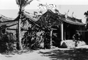 |  |

## 其他類廟宇

供奉之主神無法歸類為以上六類者，有以下數間：

### 聖安宮

| 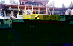 |
| ----------------- |
| 教名：道教 |
| 供奉主神：五文昌帝君、五年千歲 |
| 陪祀神明：玉皇大帝、觀音佛祖、註生娘娘、福德正神、中壇將軍、下壇將軍 |
| 創建年代：清道光十九年 |
| 創建人：道光進士蔡慶宗 |
| 廟址：雲林縣北港鎮華勝里民治路33號 |
| 電話：（05）7832895、7837952 |

道光十九年（1839），貢生蔡慶宗首倡鉅資鳩工興建，奉祀五文昌帝君，舉行春秋祭典。並間闔木鐸，澤潤三綱，德被五常，開闢學堂供地方子弟會文講課。道光二十七年創立「聚奎閣」，培養地方貧寒子弟無數。光緒元年貢生陳纓宏，募捐重修，廟貌煥然一新。光緒十三年，集資興建，垣墻數十丈，成為地方供外地書生學習之好場所。光緒二十年，笨港大地震，房屋倒塌殆盡，地方儒士無力挽回，合併於朝天宮之五文昌夫子殿內。

　民國四十九年六月二十九日新興市場揭幕，恭請各地千歲及天上聖母、關聖帝君合壇祈求商場興旺。經三個月，諸多神明願留受膜拜。同年馬鳴山千歲發爐指示：「現北港媽祖聖德靈感遠播海內外，五年千歲十二兄弟等降臨，願永鎮北港，輔佐天上聖母保佑港中萬眾生靈平安，神壇原向西，要改向南」。

　十月二十五日夜間文昌帝君扶鑾指示曰：『此地乃五聖文昌發祥地，並指示挖取當地桑樹根，直徑五吋餘，長約二尺，恭雕梓潼帝君，朱熹帝君二君，再用樟木恭雕孚佑帝君、關聖帝君、文魁帝君等五尊聖像，稱「五文昌夫子」。』另往馬鳴山恭請盧府千歲一尊，暫時合祀於神壇內。

| 2-72 聖安宮遶境祈福 |
| ----------------- |
| 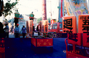 |

　原神壇改建向南，恭號「聖安宮」。民國五十年向馬鳴山接洽恭雕鎮殿盧、羅、徐、侯、耿、吳、張、何、薛、封、趙、譚等十二尊千歲。十月八日開光，十四日午時進殿安座恭奉。合稱「十二宮辰」負責保境佑民。民國五十七年重建拜亭，後因棟樑朽蝕，乃於七十二年重建，廟門向北，七十四年竣工入火安座。廟貌莊嚴，金碧輝煌，宏偉壯觀成為北港之聖地。

　因為五文昌夫子管科舉及第，每逢考期前來朝拜者絡繹不絕。據說點光明燈靈驗無比，因此香火鼎盛。

### 武德宮（五路財神廟）

| 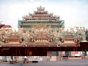 |
| ----------------- |
| 教別：道教 |
| 供祀主神：天官五財神 |
| 陪祀：玉皇大帝、金母娘娘、關帝爺公、池府千歲、天上聖母、招寶天尊、納珍天尊、招財使者、利市仙官、福德正神 |
| 創建年代：民國五十九年 |
| 創建人：陳茂霖 |
| 廟址：雲林縣北港鎮新街里華勝路330號 |
| 電話：（05）7821445 |

清道光年間，先民陳居士為拓荒墾地，自山東恭請中路財神神尊，隨船抵達台灣笨港登陸，當時只蓋茅草一間（即今中山路六十一號保生堂現址），奉祀仁路財開基金尊。

　光緒二十年，陳居士因甲午戰爭他遷，中路財神神尊，留在原地供人參拜。後因天災地禍倒塌，原地被建造房屋居住，中路財神被埋入地基內，地主四度易人，均因無福份受「五財神」的庇佑他遷。

　民國四十四年，陳茂霖從水林鄉遷居北港購此屋，開設保生堂中藥鋪。據說，他命中帶有三合之格，又得神緣，兼開中藥鋪救世救人，獲天官庇護生意興隆。但陳夫人染上無名疾病，群醫束手。由嘉義新港鄉東興廟池府千歲賜一支黑令旗鎮宅，並服下三道神符才逐漸甦醒。經池府千歲指示，必須靠「家神」才能完全治癒。

　民國五十二年，池府千歲巡狩至陳家，發現內有神靈發光。池府千歲請出尊神救世救人，並協助治癒陳夫人。短期間，陳夫人果真痊癒，陳家感神恩，早晚誠心瞻拜，經七年才感動神尊。民國五十九年，扶乩降示：雕刻神像一尊，並出示尊號「中官五路財神」，首創宮號「北港武德宮」。後來因地點擁擠停車困難，陳茂霖乃於民國六十七年獨資興建新宮，並於六十九年安座入火。後承蒙善男信女樂捐龍柱、石柱、石堵等。七十二年擴建天庫、香客大樓等工程。

| 2-74 武髯宮天庫金爐 |
| ----------------- |
|  |

民國七十二年雙十國慶動土的武德宮天庫金爐，具古亭笨造形，是全省廟宇首創的一座金爐天庫。由於善男信女踴躍樂捐，工程相當順利，高達四十餘台尺，整體非常壯觀。武財尊神指示，天庫外觀要雕塑三十六天官，（由武財神爺率領），所以天庫外觀為了要雕塑三十六天官，下面天庫基座塑有中、東、西、南、北五路寶車，運送金銀財寶賜福善男信女，其雕塑造型，栩栩如生，巧奪天工，是座古香古色生意盎然的建築物。

### 聖佛宮

布袋戲中扮相戲偶，除孫悟空之外，另有個角色在扮仙戲（三小仙）中出場獻壽的白猴，兩者造型幾乎相同。唯一差別是孫悟空頭上有永遠除不去的金箍，代表獻壽的白猴，頭上少了金箍，不必聽命於唐三藏，比較好命。

　鎮上北辰路，一座有十四年歷史的齊天大聖廟叫「聖佛宮」。每年媽祖遶境，「聖佛宮」亦組織隊伍跟神明會遶境，節目特別精彩。聖佛宮主祀齊天大聖，陪祀十八羅漢等神明。齊天大聖神格雖不高，但其七十二變的本領一直深受民間的崇奉。因其活潑逗趣，成為兒童的保護神，齊天大聖因此收了許多「契子」。

　農曆七月二十五日，相傳為齊天大聖生日，「契子」當然要準備牲醴、水果，特別是香蕉，因民間相信齊天大聖喜歡吃香蕉；還有三色金、香燭以及壽桃、壽麵等，隆重為契父慶祝壽誕，一時熱鬧紛紛。

### 聖德宮

| 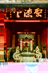 |
| ----------------- |
| 教別：民間信仰 |
| 主祀：關聖帝君 |
| 陪祀：天上聖母、文昌帝君、孚值帝君、岳武穆王、司命真君、千里眼將軍、順風耳將軍、註生娘娘、中壇元帥、福德正神 |
| 創建年代：民國六十一年五月九日 |
| 創建人：陳滄州、吳敏敵、梁東明 |
| 住址：雲林縣北港鎮仁安里中正路135號 |
| 電話：（05）7832721 |

民國六十一年五月九日，由陳滄州、吳敏敵、梁東明三位發起，由斗六市番溝里南聖宮分靈。初創於中秋路八角樓，信徒僅五十多人。天天祭祀素齋水果，不燒金紙。關聖爺屢次顯靈，保佑信徒，信眾愈來愈多，遂向政府登記立案，並建廟於現址。六十六年興建二樓，並奉多尊陪祀神明。本廟但求樸素，不求繁華，並創設捐米救貧運動，數十年如一日。
