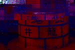

# 第三節 本鎮廟宇簡介
---
以下僅就第二節所列七大類廟宇，一一介紹如下：

##（一）媽祖信仰

媽祖信仰是海洋舊文化的表徵。明朝末年滿清入關，閩粵地區烽火連天，旱災連年，中國沿海移民為逃避飢荒、戰禍，紛紛冒死橫渡波濤洶湧的黑水溝，來台尋求新的生機。當時唐山移民搭乘簡陋的舢舨舟，且無氣象預報與通訊設備，航行海上若遇船難，則葬身海底，由於對大海的恐懼與航行的不安，人們便將海神媽祖視為渡海移民心靈的依靠。台灣地區四面濱海，島上高山峻嶺、河川阻絕，早期交通運輸也是以海運為主，加上沿海居民多以捕魚為生，台灣俗話「行船討海三分命」，因此媽祖信仰日益普及，而台灣早期的媽祖廟也都是面向海洋。

　關於媽祖的身世眾說紛紜，且神話與史實落差甚鉅。傳說媽祖是興化府湄州人氏，父親任都巡檢，其妻樂善好施卻單傳一子，於是虔誠向觀世音菩薩祈求子嗣，一日其母夢見觀世音賜予優缽花(或謂藥丸)，吞食後懷胎十四個月產下媽祖。媽祖出世後逾月不哭，故取名為默娘。媽祖自幼聰敏好學且朝夕禮佛，而後得到玄通道人授予「玄微秘法」，又得神人之「銅符」，乃精通驅妖除魔之術。嗣後媽祖降服桃花山之妖怪千里眼與順風耳，並收為部將。廿八歲重陽節日，媽祖得道昇天。

　如按史料記載，媽祖原為巫覡信仰，原始文獻皆言媽祖為「巫」，眾人因其生前能預知吉凶禍福而祀之，後來才改稱「神女」。至宋徽宗賜其「順濟」廟匾即轉變成神。宋代媽祖之封號為「夫人」、「妃」，至元代因海運日趨發達乃冊封為「天妃」，並成為全國性信仰。明初封為「聖妃」，明成祖因派遣鄭和下西洋，為安定軍心，將之封為「天妃」。清康熙年間，原本冊封為「天上聖母」，至康熙廿二年(1683)因施琅攻克明鄭，假藉媽祖神助之說，乃冊封為「天后」。至此媽祖已成為地位最崇高之女神。

　媽祖信仰自宋代的女巫轉變到清代的天后，睽其緣故乃因海運的發達造成信仰的普及，又因政治的炒作才日漸蓬勃。台灣移墾之初仰賴航海，而初闢地區又是「三年一小反」、「五年一大亂」，治理台灣的各個政府也都會拉攏媽祖，以證明政權的合法性與行為的正當性。傳說媽祖曾經協助鄭成功擊退荷蘭人，也曾幫助施琅將軍打敗明鄭，又曾助清廷平定林爽文、蔡牽之變，但這些傳說都只是統治者利用媽祖信仰鼓舞士氣、籠絡民心，減少人民反抗的託詞。

　早期台灣媽祖按分靈祖廟可分為湄洲媽、溫陵媽與銀同媽。媽祖的造型則是按照「媽媽的形象」來塑造。隨著移民時間久遠，目前各地的媽祖廟多由台灣本土所分靈，媽祖名號也有北港媽、大甲媽、鹿港媽、關渡媽、松山媽及新港媽等在地化的窩謂，而中國大陸在文化大革命之後，各種宗教信仰已蕩然無存，想必媽祖也已投奔自由，因此台灣才是媽祖的新故鄉。

　媽祖崇拜原為航海之神，但媽祖來台之後，也隨著民眾的移墾，職責也有所轉化，台灣媽祖的任務有防止「番害」、驅逐瘟疫、防颱救災和協助農牧等新的職務。在二次大戰期間，許多地區都盛傳媽祖承接盟軍炸彈的神蹟，也有媽祖巡視海岸的傳說，因此媽祖還承攬國防和海防業。現在媽祖又包攬信徒的健康、考試、事業和感情等所有問題，媽祖已不僅是漁民、船員的守護神，儼然成為台灣人的守護神。媽祖就如同台灣的媽媽，四百年來護衛著台灣人民渡過台灣海峽，陪伴台灣人歷經荷西、明鄭、清廷、日本、國民政府政權，在人心最徬徨、無助的時候，媽祖婆的慈愛，總是台灣人民心靈最重要的依靠。

　本鎮以媽祖為主神的廟宇有以下三間，其特色分述如下：

### 朝天宮

|  |
| ------------------ |
| 教別：佛教 |
| 供奉主神：天上聖母（媽祖） |
| 陪祀神明：觀世音菩薩、五文昌帝君、三官大帝、聖父母、註生娘娘、境主公、福德正神 |
| 創建年代：康熙三十三年（1694） |
| 創建人：臨濟宗三十四代樹璧禪師 |
| 廟址：雲林縣北港鎮中山路178號 |
| 電話：（05）7830535 （05）7832055 |

笨港在清初即是諸羅縣轄的良港及大城鎮。康熙三十三年（1694），臨濟宗三十四世樹璧禪師從福建湄洲朝天閣，奉請媽祖神像來台。街民知曉，紛紛懇留奉祀膜拜，並請樹璧禪師主持香火。建廟之初，只有矮屋一椽，至為簡陋。後由開拓諸羅的紳商陳立勳捐地，勸募外九莊居民合力建廟，以瓦換茅，號稱「天妃廟」。

| 2-3 日據時代媽祖祭典燈會 | 2-4 媽祖廟夜景 | 2-5 民國39年媽祖廟廟埕 |
| ------------------ | ------------------ | ------------------ |
|  |  |  |

雍正八年（1730），媽祖神光屢現，百姓庇佑無窮，遂捐款重建，頗具規模，改稱「笨港天后宮」，香火日盛。至乾隆十六年，因丹青剝落，土埆間有傾圮，繼任主持再加修葺，廟貌煥然一新。乾隆三十九年（1774）笨港縣丞薛肇熿蒞廟，見宮廟樸卑，乃令當時淘生陳瑞玉、監生王希明、蔡大成等人率先捐俸，大修土木，才有主神殿二、拜殿二、東畔室二共六間。正殿奉祀媽祖，後殿奉祀觀音佛祖、十八羅漢，龍柱一對（台省僅留的清朝初年的作品），並撰文立碑（此碑石及龍柱尚留在聖父母殿廟埕及觀音殿），這是朝天宮首次大規模翻修及重建。

　道光十七年，因殿宇剝蝕，當時瑞合主持發心向各界募款重修，又適王得祿平定張丙、陳辨之亂，將之歸功于媽祖保佑。王得祿獻「海天靈貺」一匾，並奏請朝廷誥封媽祖為「護國庇民妙靈昭應宏仁普濟福佑群生誠感咸孚顯神戰順垂慈篤祐安瀾運澤覃海宇天后」。此次王將軍除捐款外，並贈梵鐘法鼓各一，榮譽輝煌，因而笨港媽祖遂成為全台媽祖信仰中心。

　咸豐四年，嘉義縣學訓導蔡如璋有感廟宇不敷使用，適世襲子爵特授江安十郡儲糧道王朝綸返台勸運米食，共議擴建，成為宮殿式建築，前為拜殿及東西二室，二進祀天后，三進祀觀音佛祖，四進祀聖父母，東廂註生娘娘，西廂祀福德正神及境主公。 

　光緒二十年，北港街內大火，本宮屹立不動，惟拜殿被焚。光緒三十一年嘉義大地震，大殿破損四垂亭倒壞。北港區區長蔡然標等地方士紳，倡議募捐重建。此次募款遍及全省，包含板橋家族林崇壽、林祖壽，從台北至高雄，從海內至海外各地皆有，由陳應彬主持重修工程。從光緒三十三年開工至民國元年竣工。佔地約千餘坪，即今五開間多廟並列的特殊格局，廟牆也是當時完成。前面廟牆上端的四海龍王，由板橋、高雄各地捐獻。民國四十七年，本宮改修正殿屋頂，至民國五十三年完工，延聘彰化江清露師傅製作，屋上各種剪粘裝飾，琳琅滿目，令人嘆為觀止。

　朝天宮於清朝中葉，成為本省媽祖信仰中心。據台灣府兵備道徐宗幹所著「壬癸後記」淋載：「前籍台人循舊俗，迎嘉邑北港廟中神像至郡城廟供奉。並巡歷城鄉內外而回，焚香迎送者，日千萬計。」乾隆二十三年，朝天宮已分靈至外九莊義竹鄉紹徵宮、大林甘蔗崙的聖母廟、彰化的南瑤宮、大甲鎮瀾宮、白沙屯拱天宮等廟宇，並有往朝天宮進香的活動。可見當時朝天宮媽祖分靈，早已遍及全省。　　

　清中葉以後笨港港口機能雖淌退，但朝天宮香火依然鼎盛，各地信徒還是成群結隊，不辭跋涉前來進香。日據時代嚴禁迎神賽會，並借此消除迷信而拆廟，但日本當局不但對朝天宮未予拆除，並善加保護禮遇。大正元年，朝天宮重修。全台三萬餘人熱烈捐款襄助，感動日人，遂稱朝天宮為「媽祖總本山」。台灣光復後香火更盛，經政府指定為宗教廟寺觀光區「國家二級古蹟」，香火為全省之冠。

　據堪輿界的說法：朝天宮之所以香火鼎盛，因處龍穴之故。府番里北側的沙丘是龍尾；龍口在廟前中山路南方，吸取四面八方之靈氣；左右兩口古井是龍的眼睛。廟內正殿有古井，為龍喉穴。虎井因道路拓寬在馬路中央被封，龍井在民宅，端午常有大批民眾搶著汲取午時水。

| 2-6 龍井 |
| ------------------ |
|  |

朝天宮信眾不僅遍布全台，亦分靈世界廿餘國，善男信女捐款和香油錢收入相當龐大，除經常開支外，朝天宮積極作社會服務如：

1. 貧民施醫：廟方自昭和十一年（1936）設立貧民診所於宮後的番仔樓。聘專業醫師駐所診治。凡是貧民一律免費施醫，其他民眾則收取成本費。台大帝醫畢業的黃玉銘醫師，從光復服務至九十一年十一月始退休，對提昇地方醫療品質有相當貢獻。往後朝天宮將聘媽祖醫院醫生輪流駐診，繼續造福鄉梓。

	| 2-7 民眾診療所藥袋 | 2-7-1 診療情形 |
| ------------------ | ------------------ |
|  |  |

2. 捐贈媽祖醫院：為提高地方醫療水準，朝天宮斥資四億餘元籌設媽祖醫院，並於民國六十六年完成硬體結構時，捐贈給中國醫藥學院。醫院占地四公頃，病床六百床，中西醫並存，對沿海地區醫療服務有極大助益。
3. 辦理社會救濟：在「救急不救窮」原則下，對天然災害或意外之受災者，常主動濟助。如九二一震災捐兩千萬，台中瓦斯爆炸、三峽礦災等均有百萬以上捐款，及家庭發生急難之濟助，不勝枚舉。
4. 文教及體育活動贊助：每年辦理花燈展、藝閣遊行；成立國樂團；辦理台灣區「媽祖盃」軟式網球錦標賽，發行《聖女春秋》月刊；成立「笨港媽祖文教基金會」，補助學生午餐費、教育活動、綠化美化環境等。

為讓大家認識朝天宮神祇，特別將各殿所祀的神明記述於下：

#### 聖母殿（前殿）

主祀：天上聖母計有七尊神像

| 2-8 正殿之天上聖母 |
| ------------------ |
|  |

1. 鎮殿媽（祀在神龕後排正中）
2. 祖媽（祀在神龕前排正中）
3. 二媽（祀在神龕中排正中）
4. 三媽（祀在二媽左側）
5. 四媽（祀在二媽右側）
6. 五媽（祀在三媽左側）
7. 六媽（祀在四媽右側）
 
配祀：

| 2-9-1 日據時代正殿神明 | 2-9 樹壁禪師恭請來台之媽祖 | 2-9-1u 萬年香火盧 |
| ------------------ | ------------------ | ------------------ |
|  |  |  |

1. 香花女
2. 金精將軍，通稱千里眼（祀在神龕前左方）
3. 水精將軍，通稱順風耳（神龕前右方）
4. 太子爺（祀在殿中長案）

#### 觀音殿（中殿中室）

主祀：觀音菩薩（祀於正面神龕）

從祀：

* 右側（東列）：
	1. 降龍尊者
	2. 百納尊者
	3. 進香尊者
	4. 彌勒尊者
	5. 志公禪師
	6. 開心尊者
	7. 達摩尊者
	8. 飛鈸尊者（一稱弄鈸尊者）
	9. 目蓮尊者（一稱飛杖尊者）
* 左側（西列）由左：
	1. 伏虎尊者
	2. 優婆尊者（一稱道悟尊者）
	3. 進花尊者
	4. 進燈尊者（一稱惠藏尊者）
	5. 梁武帝
	6. 長眉尊者
	7. 進果尊者
	8. 戲獅尊者
	9. 洗耳尊者（一稱摩訶尊者）

#### 聖父母殿

主祀：天上聖母父母及兄弟之神牌

1. 積慶衍澤林公暨夫人王氏神位（神龕正中）
2. 靈應仙官聖兄林公神位（神龕右側）
3. 慈惠夫人聖姊林氏神位（神龕左側）

#### 開山殿（後殿左室）

主祀：本宮歷代住持

#### 註生娘娘

主祀：註生娘娘（祀在神龕正中）生育之神或謂臨水夫人陳靖姑，

從祀：婆姐。

#### 境主土地公殿

主祀：

1. 境主公（神龕右側）
2. 土地公（神龕左側）

#### 三界公殿

主祀三官大帝

1. 天官（堯）一品紫微大帝（神龕中央），主賜福，誕辰上元節 
2. 地官（舜）二品清虛大帝（神龕右側），主赦罪，誕辰中元節
3. 水官（禹）三品洞虛大帝（神龕左側），主解厄，誕辰下元節

#### 五文昌夫子殿

主祀：文昌帝君

陪祀：周濂溪、程明道、程伊川、張橫渠、朱晦庵。

【古色古香　春秋二祭】

| 2-10 媽祖春秋祭 | 2-11 行上香禮 |
| ------------------ | ------------------ |
|  |  |

台灣「三月瘋媽祖」，因為農曆三月二十三日是媽祖林默娘的誕辰，所以信仰媽祖的人會在農曆三月舉辦進香、刈火及遶境等宗教活動，各地廟宇為了慶祝「媽祖生」，無不趁機舉辦舞龍、舞獅、南北管等民俗技藝活動，配合著大拜拜，達到人神同樂的目的。
　在北港，除了花樣繁複的廟會活動外，在三月二十三日這一天會依傳統舉辦媽祖祝壽活動及聖父母春祭。恭賀媽祖誕辰的祭儀完全依照古禮的「三獻禮」，儀式與祭孔相似，古色古香，莊嚴隆重，在悠揚古樂中，主祭、陪祭、執事、擁生均著長袍馬褂進行，各地媽祖廟派代表與祭，也有不少人會到場觀摩。至於農曆九月九日媽祖飛昇成道紀念日，會同時舉辦聖父母秋祭。無論媽祖誕辰或成道日，都會恭請聖父母神位到前殿，具有弘揚孝道和慎終追遠之意，祭典儀式和春祭時相同。
　根據史料記載，朝天宮舉行的媽祖誕辰或飛昇成道祭典，都是延續祖廟朝天閣的傳統辦理。在康熙五十九年（1720）清廷以「媽祖屢顯神威護國佑民，頗受民間敬仰，朝廷豈可漠視，此次遣使到琉球敕封又顯神威加護順利達成，為報神恩將祭祀媽祖列入朝廷祀典，於每年三月二十三日媽祖壽誕舉祭。」到了雍正十一年（1738）清廷通令全國各省建祠媽祖，春秋致祭，原為一年一祭增為春秋二祭，春祭仍於三月二十三日媽祖誕辰時舉行，秋祭擇定媽祖登湄峰悟道羽化飛昇的九月九日舉行，所有儀禮由祖廟朝天閣傳到笨港朝天宮，就此相沿下來，已有二百七十餘年的歷史。
　朝天宮誌有云：「清代祀典，最崇天后，每年春秋，笨港分縣及水師千總，必親典祭。是日，守土官具祝版備器，陳羊一，豕一，簠簋各二，籩豆各十，罏鐙具。殿中南設案供祝版，北設一案，陳帛一，香盤一，尊一，爵一。設樂於南階上，設洗於東階下之北，祭官拜位在階上正中，司祝，司香，司帛，司爵，典儀，掌燎，各以其職為位。」
　可見清代對媽祖春秋二祭的重視，及祭典中的祭禮和陳設的情形。日本據台之後，日人仍不敢輕忽深入民間的媽祖信仰，朝天宮依傳統舉行春秋二祭時，北港郡守必親自主祭，以攬人心。光復後，主祭由朝天宮董事會董事長擔任，北港鎮長、鎮民代表會主席等為陪祭，擴大與祭範圍到里鄰長、轎班會爐主及各媽祖會爐主等。
　
#### 茲附春秋祭典儀式程序以及祝文一篇於後，以為參考：

* 【就位】
	* 通唱：財團法人北港朝天宮天上聖母　　
	* 中華民國○○年歲次○○年媽祖誕辰　（成道暨聖父母）春（秋）祭
	* 通唱：典禮開始→鳴炮→樂禮生就位→執事者各執其事→監禮生就位
	* 通唱：陪祭就位→主祭就位→啟扉
	* 通唱：全體肅立→奏樂→瘞毛血（司毛血者捧毛血盤出宮，復位）
	* 通唱：主祭盥洗（主祭至盥洗所洗手）→行上香禮（主祭進前，司香遞香，主祭上香，行三跪九叩頭，復位）
* 【迎神】
	* 通唱：提燈爐迎神，行迎神禮（鐘鼓齊鳴，司燈、司爐、司旗、司傘、司旌、司節、司鈇、司鉞、司扇分列兩縱隊，下階，到拜殿由側門出，中門入，復位，主陪祭行三跪九叩頭禮，鐘鼓止鳴）
	* 通唱：全體與祭者向　天上聖母行三問訊禮
* 【初獻禮】
	* 通唱：行初獻禮「主祭至神案前跪，初獻爵（斟酒→獻酒），獻帛，三叩首，起，復位」
* 【讀祝禮】
	* 通唱：行讀祝禮（主祭至祝案前跪，讀祝文生就位跪，主陪祭俯伏，讀祝生讀祝文）
	* 讀祝文生：維中華民國ＯＯ年歲次ＯＯ三（九）月ＯＯ日，主祭ＯＯＯ，陪祭ＯＯＯ暨閣港紳商總董等，謹以剛鬣柔毛牲醴庶饈果品香楮金帛之儀，致祭於褒封天上聖母之神前曰：千秋大德，萬里慈航，濟世菩薩，補天阿皇，功德實同覆載，崇報祇宜優隆，逢降誕之吉辰，盡諸子之微衷，薦以金帛，奉以豆觴，神其來格，鋻此馨香，尚饗！（讀祝文生起，主陪祭平身，奏樂，六叩首，起，復位）
* 【亞獻禮】
	* 通唱：行亞獻禮「主祭至神案前跪，再獻爵（斟酒→獻酒），獻牲（豬肉），獻饌（八大碗的其中一碗），六叩首，起，復位」
* 【終獻禮】
	* 通唱：行終獻禮「主祭至神案前跪，三獻爵（斟酒→獻酒），獻羹，獻飯，獻金，滿叩首，起，復位」
	* 通唱：主祭行飲福酒受胙禮（主祭至香案前，主陪祭跪，主祭飲福酒，受福胙，滿叩首，起，復位）
	* 通唱：來賓行上香禮（來賓以簽到順序上香）
	* 通唱：全體與祭者向　天上聖母行三問訊禮
* 【送神】
	* 通唱：提燈爐送神，行送神禮（鐘鼓齊鳴，司燈、司爐、司旗、司傘、司旌、司節、司鈇、司鉞、司扇分列兩縱隊，下階，到拜殿由正門出，側門入，復位，主陪祭行三跪九叩頭禮，鐘鼓止鳴）
* 【望燎】
	* 通唱：焚金帛（讀祝者奉祝，司帛者奉帛依次出宮，交予執事焚化，望燎，復位）
	* 通唱：禮成→主祭退班→陪祭退班→監禮生退班→執事者退班
	* 通唱：恭祝風調雨順，國泰民安。

　另外，朝天宮西側有一個「五文昌夫子殿」，又名「聚奎閣」，主祀文昌帝君，陪祀周濂溪（敦頤）、程明道（顥）、程伊川（頤）、張橫渠（載）、朱晦庵（熹）五人，其由來乃是由於史記官書中有云：「斗為帝車，運於中央，……斗魁載匡六星，曰文昌宮……」所以古人奉祀文昌君的人已多。

　而在清道光十九年，笨港貢生蔡慶宗提議捐巨資於笨港街西建文昌祠，提昇北港文風，當時堂宇分為二進，前進奉祀文昌帝君，後進東西二廊則成為學子會文講課的地方，並成立有一社，名「聚奎社」，以為學子之間互相期勉之意，後來他們認為宋冷濂（周敦頤）、洛（程顥、程頤）ｙ關（張載）、閩（朱熹）四大家開啟文明機運，昌明教化，功勞甚大，所以亦奉祀這五人。到了光緒元年貢生陳櫻宏，光緒十三年里紳蔡慶元等人均有勸捐重修，日人據台之後，在北港設立學校，廢文昌祠，命令聚奎社諸主事將祠田贈與朝天宮，朝天宮另闢一五文昌殿奉祀文昌帝君及五文昌夫子，今日該殿對聯上仍嵌有「聚奎」二字，以示本源。

　古代因有科考，士大夫們對於「文昌帝君」甚為重視，民間百姓更是早已將之祀奉為神，每逢考試季節，為人父母者常代子女跪在文昌神前以求其金榜題名，於是天下學校均建祠祭祀之，清嘉慶六年（1801）乃正式列為祀典，通令天下學府建廟立祀，春秋則遣官致祭，而朝天宮沿襲此項傳統，在每年的農曆二月和八月擇定「丁日」舉行五文昌夫子的春、秋祭典，並依例敦請北港鎮內各級中學校長輪流擔任主祭與陪祭，各中小學資優教師擔任執事人員，各高中職及兩所國中學生代表參與祭祀典禮，所有主、陪祭及執事人員均須穿著長袍馬褂，很莊嚴隆重地依禮進行祭祀典禮。
　
#### 茲列祭典儀式如下：

* 【就位】
	* 通唱：中華民國○○年歲次○○五文昌夫子春（秋）祭
	* 通唱：典禮開始→擂鼓三通→揚炮→奏大樂→啟扉→陪祭就位→主祭就位
	* 通唱：執事者各執其事→全體肅立→瘞毛血（司毛血者捧毛血盤出宮，復位）
	* 通唱：主祭行盥洗禮（主祭至盥洗所洗手，復位）行上香禮（主陪祭跪，司香遞香，主祭上香，行三叩首，起立，復位）
* 【迎神】
	* 通唱：行迎神禮（鐘鼓齊鳴，主陪祭跪，叩首－再叩首－三叩首－興－跪－叩首－再叩首－六叩首－興－跪－叩首－再叩首－滿叩首－興，鐘鼓止鳴）
	* 通唱：全體與祭者向　五文昌夫子行最敬禮（脫帽，敬禮，戴帽，復位）
* 【初獻禮】
	* 通唱：行初獻禮（主祭至神案前跪，初獻爵（斟酒→獻酒），獻帛，三叩首，起，復位）
* 【讀祝禮】

	| 2-12 讀祝禮 |
| ------------------ |
|  |

	* 通唱：行讀祝禮（主祭至祝案前跪，讀祝文生就位跪，主陪祭俯伏，讀祝生就位跪讀祝文）
	* 讀祝文生：維中華民國○○年歲次○○朔越日，主祭○○○，陪祭○○○暨聚奎閣各校教員諸同仁等，謹以剛鬣柔毛牲醴庶饈果品香楮金帛之儀，致祭於五文昌夫子之神前曰：北斗之右六星縱橫，集計天道，掌握文衡，暨承象以燦列，復應運而篤生，揭儒宗之領袖，昭代以文明，神人一氣而相感，葇茹聯拔以彙征，彩筆丹篆踵前賢，而得夢秋闈春榜，魁多士以題名，維諸生之願望實有神之光榮，逢仲秋之吉日，盡諸子之微誠，薦以金帛，奉以禮牲，神其來格，鑒此馨香，以掌文籍諸神配祀，尚饗！（讀祝文生起，主陪祭平身，奏樂，六叩首，起，復位）

* 【亞獻禮】
	* 通唱：行亞獻禮（主祭至神案前跪，再獻爵（斟酒→獻酒），獻牲（豬肉），獻饌（八大碗的其中一碗），六叩首，起，復位）

* 【終獻禮】
	* 通唱：行終獻禮（主祭至神案前跪，三獻爵（斟酒→獻酒），獻羹，獻飯，獻金，滿叩首，起，復位）
	* 通唱：主祭行飲福酒受胙禮（主祭至香案前，主陪祭跪，主祭飲福酒，受福胙，滿叩首，起，復位）
	* 通唱：全體與祭者向五文昌夫子行最敬禮

* 【送神】

	| 2-13 送神 |
| ------------------ |
|  |

	* 通唱：行送神禮（鐘鼓齊鳴，主陪祭跪，叩首－再叩首－三叩首－興－跪－叩首－再叩首－六叩首－興－跪－叩首－再叩首－滿叩首－興，鐘鼓止鳴）

* 【望燎】

	* 通唱：焚金帛（讀祝者奉祝，司帛者奉帛依次出宮，交予執事焚化，望燎，復位）
	* 通唱：禮成→復位→禮畢退班

#### 朝天宮附「匾」特別多

朝天宮的匾額特別多，包含皇帝、總統、日本總督、地方首長所賜。這些匾額使朝天宮的名聲更響，也象徵朝天宮全省聞名。朝天宮的匾極為珍貴。其著名的有：

1. 神昭海表（在神龕上方）

	

	清雍正皇帝御筆。康熙六十年，藍廷珍平定朱一貴，藍將軍認為有媽祖保佑才能平亂，雍正四年正月十七日題請恩賜匾額，分別懸掛湄洲、台灣、廈門三地媽祖廟以答謝神明保佑。當年五月十一日，乃交由內閣頒下匾額御書「神昭海表」，經藍廷珍招工摹字作匾，分送三地製作懸掛，該年十一月二十八日，總兵林量會同文武百官恭迎致敬懸掛。北港朝天宮此匾，據雲林文獻記載，為雍正九年摹刻懸掛。

2. 慈雲灑潤

	

	清光緒帝御筆，光緒十二年，嘉義西門街恭迎本宮聖母賽會，適逢大旱，嘉義知縣羅建祥建壇求雨，見縣民奉北港媽祖神尊甚虔，乃齋戒三日，親身向媽祖祈禱，登壇未幾，大雨傾盆，四境均霑，乃經台灣巡撫劉銘傳咨部奏請欽賜匾額懸掛以垂示不朽。禮部奉准於十四年五月飭令知縣羅建祥、工部主事徐德欽奉匾額到朝天宮懸掛。

3. 人和年豐

	

	民國六十四年十二月二十二日，中華民國行政院長蔣經國親自送匾。他以為台灣發生經濟奇蹟最主要是因為有媽祖的保佑。六十八年間有三次颱風靠近台灣，都從台灣東部突然轉向北方海面直撲日本，使本省免遭損害，蔣經國認為都是媽祖保佑，乃指示省主席林洋港代表台灣一千萬同胞叩謝媽祖。蔣經國擔任總統，曾數次到朝天宮致敬。

4. 澤厚民豐

	

	民國七十九年四月中華民國總統李登輝頒贈給朝天宮。七十九年七月七日由台灣省主席連戰 代表前來懸掛起匾，是朝天宮第四塊國家元首題頒匾額。

5. 海天靈貺

	

	據雲林縣采訪冊記載：「道光十七年福建水師督王得祿統兵渡台，舟忽遇颱風，禱告媽祖，不久颱風停止，並一路順風，遂平台亂，上匾誌感。」但另有一說：道光十七年，並無匪亂。道光十二年、十六年，則分別有張丙、沈知之亂，王得祿均曾率兵平亂。
	
6. 享于克誠

	

	大正二年三月台灣總督陸軍大將佐久間佐馬太所贈。佐九間乃日本台灣總督府第五任總督。

7. 神恩浩蕩

	

	石塚英藏所贈，石塚乃日本台灣總督府第十三任總督，贈送時間約在民國十九年。

8. 光澤四海

	民國四十六年，台灣省政府主席周至柔敬贈。

9. 厚德歸民

	中華民國五十五年陳大慶所贈。陳大慶為陸軍上將，台省警備總司令，時任台灣省政府主席。

10. 笨港媽祖

	民國八十一年二月十七日，台灣省主席連戰與台灣省議會議長簡明景親至本宮共同主持元宵花燈及祥和社會藝文活動開幕剪綵時所贈。另有光緒七年十月十五日，光緒皇帝以神靈顯應，頒「與天同功」台灣天后廟奉刻懸掛也頗有名。

### 朝天宮的籤詩文化

在台灣的宗教中，寺廟的籤詩，是非常特殊的一種信仰文化。在現代，求籤解惑可能被斥為迷信，但卻不能否定在民智未開、經濟普遍困頓的年代，寺廟中的籤詩具有安定人心的力量。因之信徒遇到困頓挫折、事業不順、婚姻不如意、感情生變、健康亮紅燈等，都常到寺廟祈求籤詩，盼望從中獲得神祇的指引排難解惑一番。

　探討台灣民眾欲從籤詩中尋找生命明燈的原由，就必須從移民的背景說起。當大批群眾渡過遼闊深奧、惡浪滔天的黑水溝時，那種生死難卜、前途茫茫的不確定感，讓他們對神力無邊的神祇產生強烈的依賴。大多數人奉請故鄉神祇隨行，或攜帶香火在身，盼望行船的旅途、跋涉的過程獲得庇祐順利到達未知的他鄉。當平安抵達台灣，跟隨渡海來的神祇或香火，有的奉祀家中，有的搭草寮供聚集的民眾膜拜，漸漸靠著口耳相傳的靈驗事蹟，與信眾環境的改善，廟宇愈蓋愈雄偉。提供籤詩供信徒祈求，成為寺廟相當重要的特色。

| 2-21 錫製香火 | 2-22 六十甲子籤 |
| ------------------ | ------------------ |
|  |  |

「敬神如神在」凡夫俗子透過扶乩、擲杯、求籤與神明溝通對話，以求逢凶化吉、消災解厄、平安順遂等。一張不起眼的籤詩，學問可不小。無論求子、尋功名、定婚姻、問學業、看健康…都躍然紙上，明確點出人們所重視期盼的事項，對早期先民安定的力量，無疑是巨大無比。
籤詩通常分運籤和藥籤兩種。運籤含甲子籤、二十八星宿籤、百首籤、三十二首籤等。其中以甲子籤和廿八星宿籤最普遍。朝天宮的運籤採甲子籤，共六十首。

| 2-23 藥籤 | 2-24 運籤籤詩 |
| ------------------ | ------------------ |
|  |  |

藥籤含成人科120種、兒科60種、眼科84種。其中藥籤，雖不值得提倡，但在醫療資源欠缺的年代，確曾提供信眾醫療上的協助，至少因信仰所產生的安撫作用，應該能減輕疾病的痛苦，如果症狀輕微，當然就快速痊癒。故在醫藥發達的現仄，求藥籤人數雖大為減少，但仍可見許多長輩虔信地擲杯問神，試圖從籤筒中找出能賜給他們健康的籤支呢！

　所謂「心誠則靈」但要神明指點迷津，首先虔誠膜拜、並仔細說出心中想問之事。如「信女○○現年幾歲，出生於○年○日，宮住○○縣○○鎮○○路○○號，現在遇到○○事無法處理或極為困擾，特向聖母稟告，祈求聖母出示明籤指點迷津」。求藥籤則要特別說出症狀，請求神明是否同意賜籤，如獲應允則可依程序求籤。一般求籤要拜神約卅分鐘後才進行，讓神明有查詢的時間。求籤，每次僅求一事，同時要求多事，就需求多支籤。

| 2-25 籤筒 | 2-25-1 藥籤籤詩 |
| ------------------ | ------------------ |
|  |  |

求籤是否獲得神明同意，要看是否應允聖杯（一陰一陽）而定，有的神明要三個聖杯，有的一杯就過關。求籤時，信眾先以雙手握搖籤筒中的籤支再往上提後放下，如籤筒中有突出的籤支，即可取來放置神桌擲杯問神，如獲得聖杯同意，就可取詩條解詩，或請有經驗的廟務人員協助解釋。但未獲聖杯，則需再抽再求，直到同意為主。但有時出現笑杯，可能暗示不必求了。

　求得媽祖的藥籤，到中藥房抓藥回家煎煮治病。自從醫師法通過，衛生署以影響醫療品質為由，希望朝天宮能撤掉藥籤，但民間特殊的信仰文化，和信眾的需求，再且藥方份量相當輕，保健安撫重於治療，所以這些從清朝就傳承下來的藥籤，現在仍在朝天宮神案上為信眾健康做另類的醫療服務。

　解籤，要看求籤的時間，求籤的性別。因同樣的籤詩會因不同時間和不同性別所求有不同的解讀，單從字面上解釋是不夠的。

| 2-26 宣統三年之籤詩解 | 2-27 木刻籤詩版 |
| ------------------ | ------------------ |
|  |  |

籤詩內容以易經八卦為主，但因艱澀難懂，所以解籤者常根據耳熟能詳之民俗俚語、七俠五義、三國演義、水滸傳民間故事等加以解釋。早年因信眾識字有限，籤詩上常有圖案供解詩參考。

　以籤號、詩文為主，至於籤詩解、典故、圖案等內容則依甲子籤、廿八星宿籤等有異。解籤者根據字義、故事、圖案、拆字等解籤，無論一針見血、委婉含蓄、暗示解說，都希望問卜者能獲神助滿意而歸。好的解籤者能察言觀色，揣摩運用籤詩的療治作用，如同現代的諮商輔導人員一樣。

　除信眾會到寺廟求籤解惑外，朝天宮依例於正月初三深夜、初四凌晨，由董事長抽出公籤，依序為人口、水路、五穀、港運、六畜、生意六支。公籤原來以笨港新一年的運勢為主，但這些年，全台媽祖信徒均相當矚矢，甚至推估至國家運勢走向。朝天宮對公籤均不作解釋，信徒有見仁見智想法，均不足為奇。特舉九十年公籤供參考：

* 人口（丁巳籤）
　　十方佛法有靈通，大難禍福不相同；紅日當空長照耀，還有貴人到家堂。
* 水路（庚午籤）
　　平生富貴成祿位，君家門戶定光輝；此中必定無損失，夫妻百歲喜相隨。
* 五穀（庚辰籤）
　　意中若問神仙路，勸爾且退望高樓；寬心且守寬心坐，必然遇得貴人扶。
* 港運（甲寅籤）
　　於今此景正當時，看看欲吐百花魁；若能遇得春色到，一洒清吉脫塵埃。
* 六畜（甲寅籤）
　　於今此景正當時，看看欲吐百花魁；若能遇得春色到，一洒清吉脫塵埃。
* 生意（己未籤）
　　危險高山行過盡，莫嫌此路有重重；若見蘭桂漸漸發，去蛇反轉變為龍。

### 後溝聖平宮

|  |
| ------------------ |
| 教別：民間傳統信仰 |
| 供奉主神：天上聖母 |
| 從祀神明：千里眼、順風耳 |
| 同祀神明：註生娘娘、福德正神、中壇元帥、虎爺 |
| 創建年代：民國六十三年 |
| 祀典日期：農曆三月二十一日、九月十五日 |
| 廟址：雲林縣北港鎮後溝里74號 |
| 電話：（05）7821451 |

後溝里位居北港溪畔，里民素仰哪吒神武，民國六十二年間，得元帥諭示：興建媽祖廟。眾信乃籌資策劃，擇吉興工，於民國六十三年九月十五日竣工，命名為聖平宮。並專程至『北港朝天宮』祈得『天上聖母』聖尊恭迎入祀。

　聖平宮佔地約兩百餘坪，正脊尾翹，剪飾雙龍朝三星垂脊，側脊另飾人馬、車騎，皆靈活如生。聖平宮左廂闢為辦公室，另祀有「太祖先師」、「達摩祖師」、「白鶴先師」與江義梁山諸猛將神位。聖平宮右邊為後溝里民活動中心，宮前廣場鐵架膠棚搭構成拜庭，在左邊另搭竹棚，內置桌椅數張，為里民煮茗話舊之所，棚前設慈聖台，供慶典唱戲專用，宮側建有一座金亭，壁畫花鳥、仙人持柺在頂，表情詼諧十分有趣。每年農曆三月二十一日、九月十五日必分別為天上聖母、吳三王爺祝壽。如逢五榖豐收之年，里民慶賀之餘，感謝神靈護祐之恩，便虔誠組團赴北港、新港媽祖廟，或至「麻豆代天府」進香敬酬神恩。
