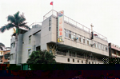
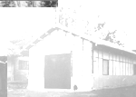
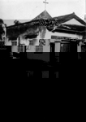
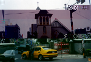
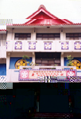

# 第六節　其他宗教概況
---

北港鎮內宗教信仰以佛、道為大宗，此是否與樹璧和尚在數百年前就迎請媽祖到此地奉祀有關，則不得而知。至於天主教、基督教、天理教、一貫道等宗教，都設有教堂、聚會所、道壇等，供信眾聽道參拜聚會。近年才解禁的一貫道，因縣內民眾草根性強，對宗教信仰依賴深，道壇、信徒日漸增多。民眾較陌生的天理教在北港亦有不少教徒。這些宗教的內涵、儀式都值得了解。

## 天主教

| 2-85 北港天主堂 | 2-86 溝皂天主堂 | 2-87 天主堂舊貌 |
| ------------------ | ------------------ | ------------------ |
|  |  |  |

天主教登陸台灣的最早紀錄，是公元1626年的道明會。再次傳入台灣已經是公元1859年的事。雲嘉地區最早的天主堂出現在嘉義大林沙崙仔，雲林縣在公元1877年以後才有宣教活動。北港天主堂屬於嘉義教區朴子總鐸區，兼管溝皂天主堂（已關閉）。
　公元1955年，陶賀和紀福泰等神父因教友蘇照和何楷模協助，購買一間日式宿舍改建為小聖堂及圖書館，北港傳教工作於焉展開。該年陶神父有感於嘉義教區神父以大陸或菲律賓籍居多，不諳閩南語及台灣習俗，影響傳播福音甚鉅。故經牛會卿主教同意創辦「北港女傳教訓練班」，有來自雲嘉各堂口的學員十餘人參加。後來因陶神父他調高雄，乃於公元1957年結束此傳教訓練班。
　公元1968年，耶穌會費峻德神父創辦善導與溝皂兩所幼稚園，前者因附近排水不良常有淹水之苦。費神父透過書信，及親往阿根廷、美國募款，重建擴園舍，並在民國六十二年二月落成。公元1975年，在原址興建新堂，並為凝聚教友向心力，首倡「堂區自養」制和「教友代表會」，後來改為「教友傳教協進會」。公元2000年3月，丁華聲神父接掌教務，繼續推粗福傳工作，如舉辦聖誕踩街活動、組成聖詠團、慕道班、擔任牧靈工作等，十分受到地方肯定。天主堂目前有教友一百多位。
　在天主教徒的認知中，基督由天父派遣，宗徒由基督派遣，主教是宗徒的繼承者，神父及教會所有傳教人員皆由主教派遣。這種由上而下的制度，在教會法典上，稱為「聖統制」，即教宗、主教、神父、修士、修女、教友皆屬天主子民。
　天主教有七件聖事：領洗、堅振、聖體、告解、終傳（病人傅油）、神品（聖秩）、婚配等。以往領洗要在出生八天以內，現在兩個月內都可以。聖體即以敬謹之心領受耶穌之體血滋養生命之意。「告解」就是當信友違背「愛主、愛人」的誡命時，要到司鐸前向主認罪求赦，告解後要做神父指定的補償。神品指神職人員的儲備訓練要經過審慎考核培訓，才能授以權柄。在婚配上，原限於教徒才能婚配，現已適度開放，但不能離婚。
　由神父主持的「彌撒」是種敬天、敬天主的隆重儀式，特別是結婚和告別式時。平常則每週讀聖經一次。天主教徒以有宗教經典聖經，隆重的祭典儀式，神父聖秩嚴謹，和優美的聖樂為傲。
　天主教與基督教系出同源，但儀式和神職人員的規約卻不盡相同。如神父守貞不婚，牧師可以結婚。「敬天祭祖」是天主教的最高準則，所以年節祭祖可點香。天主教的十字架上釘有耶穌，基督教則無。　
　
## 基督教

| 2-88 基督教北港長老會 |
| ----------------- |
|  |

基督教從馬丁路德脫離天主教開始獨立成教派。台灣地區屬於基督教系統的教會有：基督教長老教會、浸信宣道會聯合會、真耶穌教會、聖教會、四方教會、路德會等。
「北港長老會」成立於公元1911年，屬於嘉義中會。日據時代，「北港長老會」在今日的大同路和博愛路路口。北港長老會現址（文化路）本為日本佛教寺廟「報真寺」的原址，是日本人告別式公祭、並存放骨灰之處。民國三十四年，長老會購得該地，拆寺改建為哥德式建築的教堂。
　長老教會抱持著「對人類有愛、對土地有情、對上帝有信」的信念，向各地傳播福音。他們宣揚傳道、教育、服務等三大理念。許多基督教會都設有義診、主日學、獎學金等。教會在每週日上午九點到十一點間做禮拜，由牧師講道，信徒們唱聖歌、奉獻等，孩子們則在主日學中，學習跟耶穌有關的故事及遊戲，十分溫馨。除長老會外，本地屬基督教派別尚有浸信宣道會、聚會所、信義會和真耶穌教會。

## 天理教

| 2-89 天理教佈道所 |
| ----------------- |
|  |

天理教創始人日籍中山美伎，至今已有一百六十多年歷史，信徒有三百多萬人，教會一萬七千多所。是日本人自創宗教，也是日本第二教派。創會宗旨是「康樂、生活」。教徒祈禱時雙膝跪地，手拍四下代表康樂生活四字，也就是說：「他們願意過著健康快樂的日子」。
　陽曆每月十六日下午二時聚會，念誦：「天理教典」，主祀：天理王尊（天公），旁邊祀祖靈神，以表示不忘祖先。天理教宗中山美伎稱為“月神龕”，他的行為是父母的楷模。其教典認為「人類疾病根源在心田」，因此需改造人心、拯救人心，使人心開竅，並希望人們常存「喜悅心、感恩心。」如此家庭、社會、青少年等問題都能迎刃而解，化危機為轉機，不用擔心世界末日，大家都能過「康樂生活」。
　本鎮天理教寺於民國二十四年，由大林蘇萬清創辦，初名「天理教北港佈教所」。新建大神殿於民國七十三年九月十六日落成，民國八十五年三月十二日升等為「天理教台灣北港教會」。掌管十個佈教所。天理教之系統由本部（天理市）－大教會－分教會－佈教所－講社組成。因日本北海道有個北港分教會，所以北港教會就稱為「台灣北港教會」。當時由日本天理教真柱（教皇）中山善衛親自請神分靈到北港安座告祭。
　
## 一貫道

一貫道又稱天道，承襲明末「無生老母，真空家鄉」救世主的信仰而來。創始人為清末王覺一。
　一貫道以太陽的東昇至日落象徵目前形勢，故有初昇的「青陽期」，艷陽高照的「紅陽期」和夕照西斜的「白陽期」。
　一貫道的道統中將儒、釋、道三教聖人納入其中，並以儒家思想為中心，認為人如果能合乎儒家思想，就能合乎天道人心。
　一貫道的佛堂亦叫佛壇，分為家庭佛堂與公共佛堂兩種，是道親禮佛、傳道、誦經、聚會的場所。佛堂供奉的主神明為「明明上帝無量清虛至尊至聖三界十方萬靈真宰」，陪祀的是南海古佛、孔子、老子、彌勒佛、觀音菩薩等。
　經典有﹁無字真經」和「有字真經」兩種。禮拜儀式很簡單，有作揖、獻香、叩首、默唸懺文等。入教者須由點傳師傳授道義，然後宣誓，再授予合同印及口訣。教徒素食，但可以吃蛋。一貫道涵蓋下列職級，平常各司其職－祖師、道長、前人、點傳師、壇主、講師、辦事員、三才、道親等。　　
　北港的一貫道佛堂比較零散，但主要以民樂路上較多，點傳師或講師大多講述四書及三教經典及個人的人生經驗做為見證。集會時間以初一、十五晚上居多。