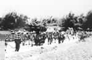

## 第一節 前言
---

廟會活動包羅萬象，俗稱「大拜拜」，通常會有「建醮」、「遶境」…等。在廟會活動中，神明的遶境出巡是地方的大事，地方男女老幼全員出動。有的組成陣頭，替神明「湊熱鬧」；有的抬神轎，替神明服務；家家戶戶擺宴請客，非常的熱鬧。
　北港是台灣最早開發的地方之一，朝天宮建廟三百多年是全台灣香火最盛的媽祖廟。北港有一句俗諺：「北港媽祖，蔭外方」形容北港媽祖不只庇蔭北港，還可以庇蔭到外地。
　朝天宮的廟會活動在清朝就聞名全台，當時媽祖經常到台南巡歷。日據明治四十一年，有一次還巡行北台灣。民國七十六年，為紀念媽祖成道一千年，舉辦了「環島遶境祈安弘法」的活動。隔年，更遠涉澎湖舉行「海陸祈安遶境弘法」的海上遶境。民國八十三年，朝天宮建廟三百年，舉辦媽祖及藝閣全島遶境。此外，民國九十年，朝天宮媽祖應邀至南投縣市遶境祈安，以撫慰921震災災民的心靈。由此可知，「北港媽祖」是全國媽祖信仰中心。
　「媽祖遶境」、﹁五年千歲遶境」是現在北港的兩大遶境活動。農曆三月十九、二十日的媽祖遶境活動中，放大量鞭炮、陣頭、藝閣…等特色，吸引大批人潮前來北港看熱鬧，造成萬人空巷的盛況。民間流傳「三月媽祖」，就是形容台灣各地在農曆三月，供奉媽祖的廟宇會舉行交香、進香或遶境活動，全台籠罩在「迎媽祖」的熱鬧氣氛中，直到農曆三月二十三日為止。
　早期，笨港媽祖會回福建湄洲的祖廟「朝天閣」謁祖進香；「大甲媽祖回娘家」曾是全台最大規模的進香活動，目前因故中斷十幾年；苗栗通霄「白沙屯媽」徒步三百公阮到北港進香，隨媽祖的神意臨時決定進香行走路線，更是神祕。這些歷史悠久的進香、遶境活動值得大家探討了解。

| 3-1 六十年代媽祖繞境 |
| ------------------ |
|  |

