## 第二節 北港媽祖遶境
---

笨港地區居民為感念媽祖聖德，自清康熙三十三年（1694），福建湄州朝天閣樹璧和尚奉請媽祖神像來臺，於農曆三月十九日登陸笨港（即今北港），由信徒立祠奉祀後，例由笨港渡海回湄州謁祖，回程在安平港登陸，三月十九日鑾駕回抵笨港，同時舉行盛大遶境。後因臺灣割讓日本，海疆亦日益險惡，謁祖行程因而停止，但地方信眾為紀念此一例行謁祖活動，仍迎請聖母遶境。(參表3-1 北港媽祖遶境行列順序表)
　日據時代，朝天宮年度最大的祭典活動是正月十五、十六、十七日的遶境，以各種陣頭、藝閣，隨媽祖神轎遶行街道。昭和十年（1935）日本官方以「改革陋習」為名，發起成立「媽祖祭典革新會」，以天寒等因素，將農曆正月十五、十六、十七日的上元祭典由三天縮為十五日一天，農曆三月十九、二十日媽祖遶境遂擴大為二天。第一天上午先前往笨南港遶境，午後回笨北港遶境，至午夜過後才入廟；第二天則上午遶巡新街，午後才回街內。台灣光復後，恢復了上元祭的三日遶境活動。民國五十四年，為響應改良社會風氣的國策，由管理者王吟貴首倡，元月天冷風寒，不適合藝閣遊行，以舉行花燈大會取代原有的迎神賽會活動。

| 3-2 熱鬧喧騰的陣頭 | 3-3 繞境笨南港 |
| ------------------ | ------------------ |
|  | 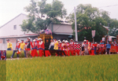 |

民國九十一年廟會實錄：農曆三月十九、二十日朝天宮媽祖遶境廟會場面，比其他地方熱絡，除了驚人的鞭炮、煙霧瀰漫外，還有神明會、鋪會、藝陣全部總動員，大家興高采烈慶祝媽祖誕辰。從全省各地一下子湧進五、六萬看熱鬧的觀光客，讓北港成為人山人海的不夜城。
　遶境行列由路關牌、大燈及開路鼓帶頭，依序為文武陣頭、聖駕陣。隨時代變遷，陣頭形式不斷改變，有新陣頭興起、也有陣頭衰微消失。北港有許多百年以上歷史的陣頭，但因人才斷層，後繼無人，演出的排場已不如以往。南北管陣頭各具特色：南管樂曲悠雅婉約、纏綿柔和；北管樂曲高亢明亮。在北管開路鼓響亮震天的演奏下前導，各陣頭依序出廟。

| 3-6 熱鬧藝陣 | 3-5 官將首使出渾身解數 |
| ------------------ | ------------------ |
| 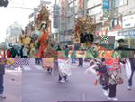 | 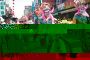 |

在鑼鼓喧天中，獅陣表演祥獅獻瑞、踏七星、八卦、獅接禮…，宋江陣表演武術、兵器，空手對棍，讓人叫好。龍陣秀出神龍翻騰、雙龍搶珠、醉龍翻身、直龍獻禮…真是熱鬧。其他陣頭各有千秋，如五福大帝及趙公明的部將「官將首」、「八家將」，他們以七星步、四門陣、八卦陣等等變化，滴水不漏的各式陣法，表演攻擊和圍捕，使鬼魂無所遁形，以求安民、保境。還有鎮安宮丁府千歲的「五虎將」為媽祖遶境鬥熱鬧，步伐似同八家將，但其掃除穢氣，動作神勇，頗有震撼效果，真是別有創意。

| 3-7 熱鬧的藝陣 | 3-8 神轎出廟了 |
| ------------------ | ------------------ |
| 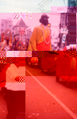 | 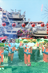 |

隊伍裡，還可看到童仔陣（大仙的神俑仔）如神童、仙童、齊天大聖、太子、濟公、土地公…等，祂們都帶有辟邪祈安的宗教意義，以各式的步法大搖大擺在遶境隊伍裡遊行。本鎮國中、小學生參加土風舞、扯鈴、彈腿等技藝，他們載歌載舞，贏得許多掌聲。
　台灣早期的集雅軒、錦陞社、振樂社…扛著錦繡的大旗，演奏著南、北管樂，載著他們祖師爺的神像遊行。還有來自各地的文武陣，都賣力參與演出。整個北港鎮，炮聲隆隆、鑼鼓喧天。獅陣、武館、陣頭間相互較勁，「輸人不輸陣」在廟埕或遶境沿途拼場演出。

| 3-9 文武陣頭競技 | 3-9-1 炸轎一瞥 |
| ------------------ | ------------------ |
| 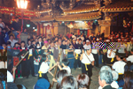 | 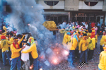 |

接著由穿著紅色古衣的中國醫藥學院同學出場，他們負責誠心順點心鋪的執事牌和鑾駕儀仗（七十二隊）。這時炮聲震天價地響，各頂神轎一轎轎經過「燒金」、「鞭炮」的洗禮，才開始遶境。此時你如果看到一長排的人趴跪在地上，不要遲疑，接著趴跪下去吧！這可是難得的「鑽轎腳」儀式，讓神轎從你的身上通過，可保佑平安幸福喲！在隊伍裡，金懿順轎班穿著紅色日本神祭的服裝，正整齊喊著：「伊咻、伊咻」呼嘯而過，非常炫眼有動感。

| 3-10 鑽轎腳保平安 |
| ------------------ |
| 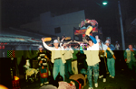 |

當你看到穿黃條紋虎衣轎伕抬著虎爺轎，接受民眾燃放巨量鞭炮洗禮（這在北港，大家稱為「吃炮」），那種煙霧昇騰、炮聲如雷的壯觀場面，既驚天動地，且令人嘆為觀止。由一群天真活潑孩童負責的「太子爺金垂髫」，雖然神轎不「吃炮」，照樣受人歡迎。

| 3-14-1 虎爺吃炮 | 3-11 藝陣同慶媽祖生 |
| ------------------ | ------------------ |
| 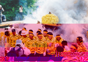 | 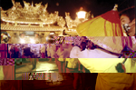 |

在哨角陣及開路鼓陣樂聲齊響之下，威風凜凜的莊儀團千里眼、順風耳將軍出動，前後兩輛香桌車、兩隻繡旗、兩尊將軍神偶和負責持戟、斧、敲鑼的四小將等大隊人馬，引導媽祖鑾駕起轎出廟。
　這些參加遶境的神明，基本上都有古樂前導及可置香案、神明燈的香桌車，加上涼傘、神轎、扇子成為一個神轎陣，祖媽會的成員還多了香擔和報馬仔。這樣浩蕩的陣容，總是吸引萬千信徒爭相膜拜。
　朝天宮廟會出陣的神明會很多，除了媽祖的六個轎班會：祖媽金順盛、二媽金順安、三媽金盛豐、四媽金安瀾、五媽金豐隆、六媽金順崇，其他還有金垂髫轎班會中壇元帥、虎爺會虎將軍、金福綏轎班會笨港境主及福德正神，和這兩年才加入的註生娘娘等。媽祖遶境是個大日子，不但朝天宮的神明會全員出動，連其他廟寺的神明會，如新街碧水寺觀音佛祖、小西天崇佛會、彌陀寺阿彌陀佛，也都出來共襄盛舉。

| 3-13 昔日龍鳳閣 | 3-14 千里眼順風耳出廟囉 |
| ------------------ | ------------------ |
| 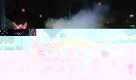 |  |

另外，北港有名的「藝閣」，早晨十點起馬、謝神後，開始遶境。這些藝閣，幾乎閣閣精心設計。內容有媽祖收妖、百鳥朝鳳、哪吒大戰海龍王、秦穆公夢遊廣寒宮、孫悟空大戰鐵扇公主、唐明皇遊月宮…等民間故事。各個藝閣集色、藝、美、聲之最，不但詩情畫意，還有教忠教孝之意。藝閣一向由各鋪會、公會、社團及鎮內各里所提供，每年參加約有三、四十座。
　這些造型講究的藝閣，白天已美不勝收，晚上又有燈光、煙霧效果，更加燦爛炫麗。藝閣上的人物都由信徒子女裝扮（習俗上要童男童女才能坐上去）。聽說坐在上面，可以祈福保平安。夜間遶境完畢，神轎先在中山路底集結，到齊後由閭山堂神童團引領入廟。神轎常在凌晨三、四點，才從三進三退的「犁轎」古禮及隆隆的炮聲中入廟門。最後，由朝天宮的和尚誦經、主持安座典禮，整個遶境活動才算圓滿結束。

| 3-15 犁轎 | 3-12 虔誠膜拜媽祖（關廟門） |
| ------------------ | ------------------ |
|  |  |

| 3-16 藝閣起馬儀式 | 3-17 炫麗的現代藝閣 |
| ------------------ | ------------------ |
| 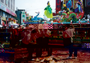 | 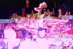 |

| 3-18 藝閣一景 | 3-18-1 藝閣一景 | 3-18-2 三月進香盛況 |
| ------------------ | ------------------ |  ------------------ |
| 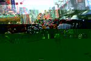 | 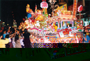 |  |

