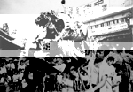
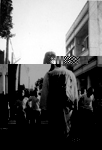
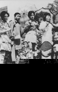
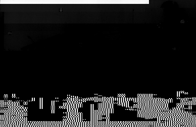
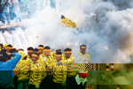
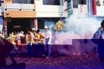
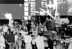
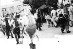

## 第三節　北港廟會憶往
---

在某些人的記憶中，對於北港媽祖的廟會活動，一定有不少難忘的印象。飛龍團的魚蝦鱉蚌…等水族陣配合舞龍的表演，十分有可看性。新龍團的濟公乩童會在廟會中起駕，和神龍一起表演，這在全省的廟會活動中，可是獨一無二的。尤其是濟公和神龍喝酒，把神龍灌醉了，產生獨特的「醉龍」及「神龍尋珠」的演出，那種神龍酒醉的神態及酒醒四處尋珠的著急模樣，不但十分有趣，還極為人性化呢！
　不少傳統文武陣頭，都有「大仙」的祖師爺神偶在後面壓陣，看顧著陣頭的平安。以前的大仙神偶可是北港走透透，目前只有千里眼和順風耳兩位將軍一路走來，始終如一。其他的，限於陣頭的人手不足，只能用人推拉或坐ㄅㄨ、ㄅㄨ。
　

| 3-19 濟公戲龍 |
| ------------------ |
|  |

「馬陣吹，這是什麼？」不少年輕人連聽都沒聽過，這可是乾隆年間就活躍在北港的音樂陣頭，讓人一邊聽著吹奏的音樂，一邊欣賞布馬裝扮的表演，一舉兩得。振樂社的高蹺陣在陣頭行列中「高人一等」，他們扮成西遊記人物，可以做翻筋斗、劈腿…等表演，技藝高超，常常嬴得熱烈的掌聲。振樂社還曾推出「素蘭小姐要出嫁」的戲碼，由幾個大男人反串，演出趣味性十足，逗人發笑的好戲。還有「公揹婆」、「鬥牛陣」、「肚皮舞」也曾轟動一時。此外，由新協社到美樂帝再到北港樂團，帶動了北港廟會中的西樂隊風潮，接著麗聲樂團、新生樂團、b#輕樂團相繼出現。西樂團前方還有小丑帶隊，你看過嗎？現在，有的西樂團很久沒有出陣了，實在令人懷念。

| 3-20 新龍團濟公禪師 | 3-21 振樂社高蹺陣 | 3-22 振樂社高蹺陣 |
| ------------------ | ------------------ | ------------------ |
|  |  |  |

「轟------」，震得耳鼓欲破的鞭炮聲隆隆響著，眼前火光扎眼，濃霧蔽天，炮屑紛飛，硝煙刺鼻，但神轎無畏無懼挺立不動，「嘸走就是嘸走，真勇！」這麼勇猛吃炮的神轎是何方神聖？以前小西天崇佛會、太子爺神轎很會吃炮，和虎爺轎不遑多讓。甚至還會「討炮」多放幾次，嘴裡大喊：「絕對嘸走！」如果覺得鞭炮堆得不夠多，轎班的小伙子會去「搶炮」堆在轎底，這樣吃炮才過癮才震撼。「輸人不輸陣！」各個神轎轎班間常相互較勁，比較誰最勇猛。現在有誰會將由老人家推著，神轎裝著輪子的小西天崇佛會，和吃炮聯想在一起呢？

| 3-23 虎爺吃炮樂呵呵 | 3-24 有請虎爺吃炮 | 3-24-1 神轎下小山般的鞭炮 |
| ------------------ | ------------------ | ------------------ |
|  |  |  |

說到吃炮，就要提到虎爺神轎。虎爺是「勇組」，絕對沒人異議。每年媽祖遶境，總是有一群人跟在虎爺轎旁欣賞「虎爺吃炮」的壯觀場面。但某年虎爺轎在中正路遭人惡意放置土製炸彈，「轟」一聲巨響，虎爺轎被炸碎了，轎伕十多人受傷。虎將軍的神像呢？大家四處尋找都找不齊全。原來有隻虎將軍飛上三樓，端端正正靜靜的站著，相信祂一定不高興吧！經過這事件，往後幾年的媽祖遶境，每頂神轎都搭配警察或義警，仔細檢查炮堆，以免再發生意外。廟方開始宣導不要在神轎底下放鞭炮，加上「環保意識」開始抬頭，造成北港燃放的鞭炮量銳減。還好這種神轎吃炮的傳統，並沒有因此而消失。

　聽過「蜈蚣閣」嗎？蜈蚣閣也叫「龍鳳閣」，是最長的陣頭。以前，蜈蚣閣至少要有72人扛抬，加閣上的孩童，是超過百人的行列。走累時，要用長棍支撐才能休息。孩童坐在閣上並不輕鬆，腰和大腿要綁長布條固定，座位又小，想尿尿都不簡單呢！
　以上種種，很多都只能在照片中和腦海裡追憶。已消失的陣頭還會再出現嗎？「會的！」相信有不少人仍殷殷的期盼著。

| 3-25 紙箔舖龍鳳閣 |
| ------------------ |
|  |

### 消失的北港陣頭

在農業社會，民眾的生活極為單純。農閒時間，左右鄰居除了泡茶聊天外，幾個人聚在一起練練拳頭，唱唱地方小曲，於是各種文武陣頭在村落中蓬勃傳承。尤其可以練武強身，又可以在地方神明廟會「鬥熱鬧」的宋江陣、獅陣，更是處處可見，一個村落甚至會有好幾個獅陣。
　出陣時，是驗收平時演練成果和其他同類陣頭互別苗頭的最佳時機，觀眾的掌聲多寡及大小，是最好的評分方式。台灣邁入工商社會，人人為家庭事業早晚出外打拼，加上媒體的發達、大眾娛樂取向的改變，不少傳統的、需要多人組成的陣頭，消失在北港的街頭。
　對照第一節的「北港媽祖遶境行列順序表」，消失的北港陣頭還真不少，計有：燈排、雜藝、忠義堂、小義堂、假裝團、棹仔藝、清騰閣、集英社、馬陣吹、連棚閣、十二班、維德堂、北港柔拳武道館、扶朝里三義堂、ｂ﹟輕音樂團、集賢閣、南華閣、仁和軒、和樂軒、鎮天堂彌勒團、飛龍團…等數十個陣頭。當然，只比較1936年、1965年、1993年和2002年這四年，這並不是很完整的記錄。尤其是2002年和1993年這九年間的變化特別大，或許消失一、二年的陣頭，只是因為某些因素無法出陣，希望他們趕快復出，不要永遠消失在北港街頭。
　以下謹就我們可以查訪到的資料，做簡單的陣頭介紹：

#### 馬陣吹
「北港馬陣吹」始自乾隆年間，吹奏的樂器有大小古吹、笛子及號角，打擊樂器有鼓、鑼、鈸等。所謂馬陣吹是由一、二十人組成，每人頭戴紙製顏色不同的烏紗帽，手持樂器，足穿長統布鞋，腰兩旁垂掛各式各樣的長布條，再將紙糊的或白色，或紅棕色，或黑色的馬頭、馬尾裝在身上，裝扮成騎馬的樂手。
　馬陣吹目前已解散，但當年團員如李淵、蔡企、蔡塗墻、蔡土趕、蔡土讚、蘇水交等先賢教授許多後學，尤其是鼓吹的吹手，後來分別為金聲順開路鼓、和樂軒、集雅軒、仁和軒、錦樂社、新樂社、錦陞社等社團的骨幹。

| 3-26 錦陞社 | 3-27 失傳的馬陣吹 |
| ------------------ | ------------------ |
|  |  |

#### 北港鎮天堂彌勒團
彌勒團有三尊彌勒佛，由人撐著走，又稱「醉彌勒」，成立年代不詳，應是在1965年以後才成立，是北港一個很有特色的陣頭。在「人若是心內結歸球，就要喝酒，酌一下，酌一下，多好你甘知…」這首歌的音樂中，三尊醉彌勒手拿酒瓶，袒著胸露著大肚，有時醉彌勒還會有相互乾「瓶」，仰頭而飲的動作。祂們足踩醉步，在大街上左搖右晃、忽走忽停，醉態可掬十分可愛。