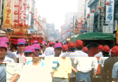
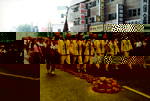
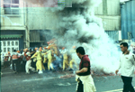
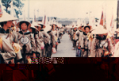

## 第六節 其他進香活動
---

台灣地區有無以數計的媽祖信徒，媽祖廟更有數百座之多，其中從朝天宮分靈而出者，更是不計其數，全世界亦有廿餘國，建有媽祖廟或供奉媽祖。這些分靈於外的媽祖，無論國內外，常會回北港進香謁祖，特別是每年元月到三月。
　在所有進香的團體中，以徒步為主，陣容龐大的苗栗縣通宵鎮白沙屯拱天宮最受矚目。民國七十七年以前，大甲鎮瀾宮回娘家更掀起空前盛況。台北松山區的慈祐宮動輒數千至萬人的進香團也受人矚目，其他大小團體，總讓北港街頭熱鬧喧闐不已。國外則以從民國八十年就赴朝天宮朝聖的日本箱根神輿會最為有名。
　
### 白沙屯媽祖進香

| 3-117 各地來進香盛況 | 3-118 松山慈佑宮進香團 |
| ------------------ | ------------------ |
|  |  |

苗栗通霄鎮拱天宮白沙屯媽祖到北港的進香活動，至今已有一百六十餘年歷史。早年各地信眾都以步行至北港進香，近年因交通工具改進，以步行方式進香者越來越少，虔誠度也相形降低。如今只剩白沙屯等極少數進香團還保有古意。表面上看，進香活動是祈求神明保佑，其實對信徒人格的濡化，卻被忽視了。
　白沙屯媽祖到北港進香，整個行程往返約十天，來回三百餘公里，對任何一位俗稱香燈腳的信眾來說，是對信心、毅力、體力的嚴格考驗。任何香燈腳只要經得起考驗，都具備頂天立地的精神與體力，不管將來，遇到任何挫折，只要沒忘記香燈腳的精神和鬥志，最後一定成功。
　白沙屯媽祖到北港進香的路線並未固定，隨媽祖旨意行走。潦過濁水溪、神轎衝進窄門、走小巷等神蹟時有所聞。北港的媽祖信徒則以隆隆鞭炮、設案膜拜、鑽轎腳等，迎接來自白沙屯的媽祖。
　進香最重要的儀式就是「刈火」，白沙屯是目前全省唯一仍保有傳統糊火缸儀式的進香團體。白沙屯進香團，刈火儀式所用的火缸，為清代陶土燒製而成。渾圓的造型，塗上棕、藍色釉料，充滿古樸之美。

| 3-119 摩肩接踵的進香人潮 | 3-120 徒步的白沙屯進香團 | 3-121 白沙屯進香一景 |
| ------------------ | ------------------ | ------------------ |
|  |  |  |

為配合長途跋涉，防止火缸爆裂，以確保香火一路平安，每年都須用防火土重新糊過。因此進香團一抵北嗡，火缸先由香火車送往朝天宮處理。這項技術需先將火缸浸入清水中，把去年糊上的防火土溶洗掉；再用黏土、紙棉、鹽巴三種材料調水成防火土，糊於火缸內外，成為保護層，讓其自然風乾。
　刈火時，將香灰與燒紅的木炭置入火缸內，再舀入朝天宮正殿引出的萬年香火，以此火缸確保香火不熄，又不會傷到爐身，順利迎回白沙屯。糊火缸的技術，由老一輩的黃伯讓、許連裕傳承而來。近年為白沙屯糊火缸的，已由許瑞盛、盧桂榮、蔡麗水接替。
　
### 大甲媽祖北港進香活動

| 3-122 大甲媽祖掀起進香高潮 | 3-123 大甲媽祖旗隊 |
| ------------------ | ------------------ |
|  |  |

近年大甲媽祖到新港奉天宮的遶境進香活動，是台灣地區規模最大的宗教活動，總是讓農曆三月的中台灣熱鬧非凡。但在之前，大甲媽祖回娘家北港－朝天宮謁祖，那種萬人空巷的情景，及民眾自動提供住宿的熱忱，讓來自大甲的媽祖信徒猶念念不忘。但民國七十七年，大甲鎮瀾宮因要提昇輩分，與北港人交惡，從此改到新港遶境進香。當年，大甲和北港民眾、社團，因媽祖結下良善的友誼，僅能特別繞道重溫了。
　關於大甲媽祖為何要南下北港進香，其歷史又有多久，並無史料予以說明。目前較普膂的說法是：早年大甲媽祖是前往湄洲祖廟進香，後來因時局動盪無法返回大陸，而且北港朝天宮建有聖父母殿，所以改道朝天宮謁祖進香「合火」。
　另一說是基於台灣廟與廟之間的拜會關係，即資歷淺的廟宇到資歷深的廟宇拜會，而鎮瀾宮的歷史比朝天宮短，故到朝天宮進香，可是此二說都無史料證實。但在日據大正十四年（1925），有報紙記載大甲媽祖往北港進香之事。
　早期大甲媽祖的進香活動規模並不大，大約幾十人到幾百人而已，而且多以步行為主，少數人坐轎子。在七七事變發生後一度中斷，直到民國三十七年才又恢復進香，規模更是日漸擴大。後來山線鐵路通車，部份信徒改搭火車到嘉義，再轉台糖五分仔車到北港，但大部分仍以步行為主。
　當時大甲、大肚、濁水等溪的橋樑尚未架設，進香團香客必需涉水而過，尤其是渡濁水溪時，溪中滿是流沙，需事先選擇適當渡河落腳位置插竹標示。當進香團到達溪邊時，必須「卜杯」決定渡河時辰，然後手拉手扶著媽祖神轎，一鼓作氣渡河而過，其場面之壯觀，不禁讓人為宗教力量的偉大動容。
　大甲媽祖進香的基本班底包括：頭旗、三仙旗、頭燈、開路鼓、轎前吹、香擔、馬頭鑼、令旗、娘傘、哨角隊、三十六執事、媽祖神輿等。他們穿著清朝士兵的服裝，後來隨著進香風氣日盛，各種陣頭紛紛加入，更增添熱鬧無比的氣氛。整個進香行程也由六夜七天，增加為七夜八天，一度更增為八夜九天，而後再恢復為七夜八天，往返行程約二百餘公里。
　此一台灣民間規模最龐大，知名度最高的宗教盛事，卻於民國七十七年畫下句點，起因是雙方對於進香名稱的爭執。
　大甲鎮瀾宮於民國七十七年二月二十八日決定將舊稱「大甲鎮瀾宮天上聖母北港進香」改稱「大甲鎮瀾宮天上聖母遶境進香」，由於事涉大甲鎮瀾宮媽祖是否由北港朝天宮分靈的複雜問題，因而引起各界議論，雙方在多次協商後仍無共識，於是大甲鎮瀾宮取消北港行程，改往新港遶境進香，百年進香情誼於焉中斷。但由於新港、北港僅一水之隔，不少大甲鎮瀾宮的信徒在新港進香的同時，仍會到朝天宮參拜，兩地信徒之情誼仍未中斷。