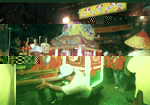
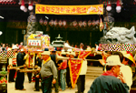
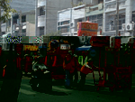

## 第八節　王爺遶境
---

| 3-124 聖安宮王爺遶境 | 3-125 聖安宮清醮遶境 | 3-126 聖安宮王爺遶境 |
| ------------------ | ------------------ | ------------------ |
|  |  |  |

一般人以為北港只有「三月瘋媽祖」，其實「瘋王爺」，亦是北港地區特有的廟會特色。鎮內王爺很多，像鎮安宮丁府、楊府千歲；代天宮的五府千歲、聖安宮的五年千歲；鎮郊新街里的蕭府千歲；草湖里的候府千歲；劉厝里的五府千歲；番溝里的五年王爺；樹腳里過溝武四宮的五府千歲…等等。
這些神明，有的從大陸飄過來，有的從其他廟寺分靈而來。另外，三山國王、玄天上帝，也有悠久的歷史，可見笨港以前確實是古老港口，先民不分閩、客，奉請大陸家鄉神明渡海而來，祂們都是安慰人們心靈的神明。這也告訴我們：台灣的神明十之八九都是廣東、福建一帶分靈而來。大陸（尤其福建）風俗也因而傳到台灣，跟台灣的風俗息息相關。
　北港王爺生日一到，也會遶境祈平安，廟附近居民自然構成神明信仰圈。家戶舉行拜拜、大宴賓客，讓遠地親戚朋友回來團聚，有的還會做醮熱熱鬧鬧一番，像草湖候府千歲、樹腳里武四宮、民治路的聖安宮，常辦理各種慶典，慶祝王爺生日。北港好收里、樹腳里都有三山國王廟，都靠近船頭埔，可見那時笨港亦有客家人登陸開墾。
現在神明已無國界，閩人照樣拜三山國王。北港地區關聖爺很多，大都是私人祭壇。古笨南港的協天宮，是著名的關公廟。道光廿八年，水仙宮合祀協天宮、天妃廟神明，目前水仙宮以關公廟聞名。每逢關公誕辰，北港岐眾都扶老攜幼到廟祭拜。

　此外，溝皂真武殿的玄天大帝也頗有名氣，平時都有進香客。現在扶朝里、嘉義六腳鄉大庄的民眾，以前大都住在「舊大庄」，祭拜同一神明－五福宮（位置在現北港溪河床）的天僊五帝。後來因「舊大庄」遭大水侵襲，村民分散成兩個村莊，兩村莊各自興建新五福宮。聽說五福大帝是因為看到村莊水井有人放毒，為了證明井裡有毒投井自殺，成神後非常靈驗。台灣的神明界真是無奇不有，給我們多姿多彩的想像空間。
　除前述熱鬧滾滾的王爺生，「五年王爺」出巡，無論鎮內或郊區都呈現鑼鼓喧闐、陣頭使出渾身解數獻技、家家戶戶大宴賓客熱鬧非凡的景象。
　「五年到」指五年一次，即逢寅、午、戌年農曆十月，各庄頭會到馬鳴山鎮安宮迎請五年千歲出巡賜福。本鎮迎請「五年王爺」集中在農曆十月初一至十五，最早登場的為新街和劉厝里。鎮內聖安宮因分靈自馬鳴山，故在該當的年份十月十三至十五日，都會舉行盛大的平安儀典，十五日當天從早到晚，在十二頂神轎引領之下會有鎮內的遶境活動，規模僅次於三月的媽祖生。
　據朝天宮董事蘇榮泉說：傳說王爺脾氣大，信徒特別請「媽祖」作陪，以免招待不周惹王爺生氣。十月份的朝天宮，總有穿梭不停的迎請媽祖的人潮。
　公元2002年，聖安宮五年千歲遶境行列順序：1.宣傳車2.路關牌3.爐主燈4.聖震聲開路鼓5.北港老塗獅6.進士牌7.北港勤習堂武館8.哨角震威團9.賜福境武安尊王10.昭烈宮開漳聖王11.天玄宮地母至尊.12.太子爺聖興順13.虎爺聖義順14.金德福福德正神15.封王忠復興16.耿王金義德.17.張王聖崇順18.吳王聖順通19.徐王仁義德20.何王聖捷順21.趙王聖金寶22.譚王聖五義23.羅王忠義崇24.薛王聖隆興25.侯王聖福興26.盧王金勝隆27.馬鳴山五年千歲28.聖德堂玄天上帝、薛府千歲29.金福堂神轎（五福大帝）30.順天府二王會31.北港嘉北會32.笨港太子會33.北港鎮天宮34.北港武帝會35.北港武聖會.
　以上遶境行列順序是依據聖安宮所印製的「北港聖安宮五年千歲繞境遊行隊伍順序表」列出，實際參加遶境而沒有列在表上的尚有北港新龍團等。