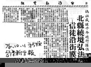
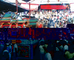

## 第五節 朝天宮大型鎮外遶境活動
---

### 鎮外遶境活動　

清代朝天宮的大型鎮外遶境活動，主要是往南巡歷。文獻上有記載的如下：
　光緒十二年（1886），嘉義西門街迎請朝天宮媽祖，祈雨應驗。此事在《雲林縣采訪冊》有如下的記載：「…三月，嘉義地方大旱，得北港朝天宮天上聖母之庇護，奏請光緒皇帝賞賜『慈雲灑潤』之匾額…」朝天宮的媽祖更時常被迎請到台南遶境。
　咸豐二年（1852）徐宗幹壬癸後記：「咸豐壬子年三月二十三日為天后神誕，台人循舊俗，迎嘉邑北港廟中神像至郡城廟供奉，並巡歷城廂內外而回，焚香迎送者，日千萬計…，十六日神輿出巡，復送天后出城而復返…」。
　此郡城廟即為台南大天后宮，從這段文字可知，距今一百四十八年前，台灣府城居民，每年迎奉北港媽祖至府城遶境，當時「弒香迎送者，日千萬計」，可見熱鬧程度。
　
　
### 日據時期朝天宮大型鎮外遶境活動

御文獻記載可知，日據時代鎮外遶境始於明治三十年（1897）十二月，嘉義東門、西南門奉迎北港媽祖；明治四十年（1907）四月十日，台南首次奉迎北港媽祖；明治四十一年（1908），朝天宮為了籌募修廟經費，首度舉辦大型的北台灣遶境活動。其行程如下：
　12/8北港聖母駕臨北部枋橋→12/10枋橋街，後埔四汴頭等庄迎北港媽祖→12/13擺接堡浦仔庄迎北港媽→12/14新浦庄迎北港媽→12/15後浦庄迎北港媽→12/16社後庄迎北港媽→12/17~12/19興直堡頭前庄迎北港媽→12/20~12/21新庄街迎北港媽→12/22擺接堡枋橋街迎北港媽→12/23~12/24冷水庄迎北港媽→12/25~12/27員林阪庄迎北港媽→12/28~12/30文山堡深坑庄迎北港媽→12/31擺接堡林塢庄迎北港媽。
　大正四年（1915），台南恭請三媽參加遶境，卻發生糖郊媽事件。原來因為景氣不佳，台南紳商議請北港朝天宮媽祖蒞臨台南與國姓爺合迎遶境，以增加熱鬧，吸引人潮。由台南布商錦榮發號石學文負責和朝天宮曾席珍等人洽談此事。4月27日，朝天宮媽祖到台南參加遶境。
　根據當時報紙報導，實際到台南參與遶境的媽祖，並非事先約定的「三媽」，而是朝天宮的「糖郊媽」。這件事曝光以後，引起台南商紳極度不滿，遂中止雙方的關係，停止往來。但根據北港方面的說法：會請「糖郊媽」到台南，實在是因為「三媽」要留在鎮內參加媽祖聖誕遶境，無法到台南。後來因台南人無意將媽祖送回北港，發生一樁靈驗事蹟。台南人為了將北港媽祖留在台南供奉，就雕刻了另外一尊媽祖。當朝天宮人員發現此事，但卻無法辨認出真正的「三媽」。台南方面說：「你們認為哪一尊是北港媽祖，就把祂請回去。」雙方因為此事起爭執。媽祖向朝天宮的人員託夢：「有一顆黑痣的媽祖才是本尊。」朝天宮執事者再次辨認，其中一尊媽祖果然有顆黑痣。朝天宮人員把這尊媽祖請起時，這顆黑痣竟然飛起來了，原來是一隻蒼蠅。

### 近年朝天宮的大型鎮外遶境活動

民國七十六年，歲次丁卯，適逢媽祖成道一千年，全國各地信仰媽祖的信徒無不熱烈慶祝。信徒遍布世界各地的朝天宮董監事認為分香廟宇及信眾遍布全省，有必要帶動全省媽祖信眾及廟宇共同熱烈慶祝，並可藉此活動全面會香與參訪，增進信眾的情誼，並宏揚媽祖慈悲濟世的精神，故敲定建廟以來最大規模的全省遶境活動。
　當年十月三日，朝天宮媽祖環島遶境正式展開。由當時文建會主委陳奇祿點引聖火，廟方法師主持誦經安座，隨後由二百餘位遶境成員向媽祖行跪拜禮並引燃聖火，便開始展開為期二十六日，路程一千五百多公里的遶境之旅。
　在漫長的遶境活動中，除了遶境144個鄉鎮五百多間以媽祖為主神的廟宇外，還舉辦全國孝行模範表揚大會、護國祈安法會及台灣省第二屆北港媽祖杯軟網賽等。
　

| 3-115 媽祖遶境全台 | 3-116 媽祖境外遶境 |
| ------------------ | ------------------ |
|  |  |

遶境的陣容則包含有：（一）開導車（由路經縣市警察局派任）（二）護駕車（以機車二十輛擔任）（三）領隊車（四）開路鼓車（由朝天宮金聲順開路鼓擔任）（五）萬年香火車（六）國樂車（七）莊儀團、震威團車（八）聖駕車（九）裝備車（十）交通車（十一）醫療車，陣容相當龐大。
　自媽祖起駕後，沿途各寺廟均派民俗團體迎駕，宛如一場全國性的民俗嘉年華會。各地善男信女紛紛設置香案，供奉鮮花素果，同時列隊跪拜，其虔敬之心令人感動。另外，各地信徒除了供設香案外，並大放鞭炮，隆隆巨響，真是驚天動地。據估計，在26天的行程中，各地信眾所燃放鞭炮約在一億元之譜，可見台灣媽祖信仰之熱烈。
　值得一提的是，車駕到達台東時，氣象局恰巧發布琳恩颱風警報。到了恆春，正是颱風登陸前夕。神奇的是，在媽祖庇佑下，風雨均暫停。但颱風仍緊追不捨，一直跟到台南。當10月26日聖駕夜宿台南時，氣象局說颱風減弱為低氣壓，大家都認為是媽祖庇佑所致。
　另一項奇蹟是，當聖駕抵達蘇澳時，當地久雨不歇。據居民說，以往遇到這種情況，有三處可能會山崩。但向媽祖請示是否要繼續遶境行程，媽祖指示平安無事，結果安然無恙，當地人士均驚訝不已。10月28日晚上回到北港，全鎮萬餘信眾列成數公里的隊伍遊街迎接聖駕，為這次最大的遶境弘法活動畫下美麗的句點。
　民國七十七年，北港媽祖更遠渡澎湖舉行「海陸祈安遶境弘法」，和澎湖的媽祖進行海上會香遶境，陣容浩大的船隊在海上巡行遶境，場面十分壯觀。
　民國八十三年，是朝天宮建宮三百年的紀念，為宏揚媽祖慈悲博愛精神、提倡社會祥和與安樂，及加強推廣本土民俗藝術文化，故而舉辦藝閣環島遶境，自國曆6月5日起駕南行，到6月29日返回北港，為期25日，整個活動以傳統民俗技藝街頭遶境活動為主，共計出動23部傳統藝閣，走遍本島每一縣市，將北港著名的民俗藝閣，展現給各縣市民眾欣賞，實為台灣宗教文化史的一大創舉。

　民國88年9月21日，台灣中部地區發生大地震，逢成南投地區重大傷亡，當地民眾飽受驚嚇，惶惶不可終日，亟須心理慰藉。南投縣政府乃函請北港朝天宮媽祖前往遶境，藉以撫平民眾心理創傷。朝天宮本媽祖慈悲濟世的精神，於90年10月27日至11月5日前往南投遶境，10天之中遶行南投縣13個鄉鎮市，為當地民眾提供了最佳的精神治療。
　
