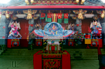
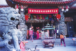
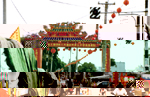
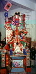
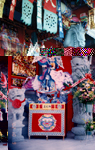

## 第九節 北港鎮常見建醮活動
---
北港鎮最常見的建醮科儀，大多以清醮、平安醮、建廟開光醮為主。如笨南港天后宮汀洲媽開廟門，做清醮；聖安宮五年千歲誕辰做平安醮；劉厝里德安宮因新修廟宇，曾舉行規模盛大的建醮活動，在此特別為文介紹。

| 3-132 開廟門入火安座（笨南港天后宮） | 3-133 聖安宮祈安禮斗法會 | 3-127 德安宮建醮牌樓 |
| ------------------ | ------------------ | ------------------ |
|  |  |  |

劉厝里德安宮主祭五府千歲，自褒忠鄉馬鳴山分靈而來，因屢次顯靈保佑鄉民，深受村民崇敬。民國九十年農曆十月十五日，恰逢五府千歲誕辰，村民新修廟宇，重開廟門，舉行盛大「做醮」法會，祈求居民平安幸福，並祝禱風調雨順、國運昌隆。
　為表示信眾誠意，以前做醮前三天，全里吃齋念經，並闢廣場設醮壇，準備豬羊五牲六禮，金紙金香供奉王爺，邀請雷公雷母及各路神明，超渡亡魂、廟前念經超渡亡魂，為做醮暖身。
　醮會當天凌晨五時開始，行醮如儀，場外設有「六騎」鎮守醮場。主壇道長身穿絳衣、腳穿草鞋，是醮長的指揮者。左邊「副講」，右邊「都講」；案桌兩側，左稱「侍香」，右稱「引班」侍香專責點香，引班則是繞行儀式的領路者。 
　有重要科儀時，兩旁另加道士，可增加排場及龍套角色。後場實習生專門負責布置清場、奉茶等，司樂有四名，左為嗩吶與胡琴手；右為鼓手與鑼鈸手，領班為鼓手。

| 3-128 設壇建醮 | 3-129 溫元帥 |
| ------------------ | ------------------ |
|  |  |

廟內設有殿堂，是醮儀主要場所，禁止閒雜人等入內，廟門兩側廟埕布置火醮場，請求火王，驅逐醮欲的火鬼。火王人物有三：一為白臉黑鬚的「赤明大帝」，一為白臉白鬚的「燧人大帝」，一為紅臉黑鬚的「火烜大帝」。
　醮儀分為誦經、文場和武場。誦經有朝天大懺、玉樞經、三官經、五斗經、玉皇經，這些經懺皆在祈求上蓊諸神賜福、降福、消災解厄或普度眾生。文武場，上午「道場早朝」向天公和諸神啟告、敬酒。中午是「獻寶」朝覲諸聖、為神進餐。
　下午是「外壇獻供」所有道士到外壇和委員宅地誦經施法，一切莊嚴肅穆。另由道士負責祀旗掛燈、燈棚（台）拜表、施放火燈、普渡化食、分燈捲簾、敕水禁壇和敕符正醮等。