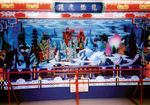
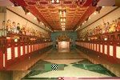
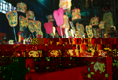

# 第二節　民俗節慶
---

## 春節

春節是節慶中最重要的日子。從大年初一到初五新春期間，處處洋溢熱鬧喜氣。大年初一是一年的開始，穿新衣、戴新帽、拜年、「走春」都是北港地區最普遍的習俗。
　到媽祖廟搶頭香是許多北港鎮民開春要事，為了討吉利求取一年的平安，北港的除夕成了不夜城，媽祖廟前的街道燈火輝煌，人人希望在最佳時辰，獻上馨香一炷，祈求一年平順。子時左右，鐘鼓齊鳴，廟門一開，頓時萬頭鑽動，每人虔心獻上香束，匯成媽祖香爐的熊熊大火，穿梭膜拜的人潮一波波湧進廟中。天稍亮，來自全省各地的信徒與進香團，鑼鼓喧闐震天價地響，廟庭則有不間斷的陣頭表演，這是北港小鎮特有的過年方式。

| 4-2 大年初一搶頭香 |
| ----------------- |
|  |

初一禁忌特別多，如不能吃稀飯，以免出門遇到風雨或造成環境困苦。新春不能掃地、倒垃圾、倒糞便，以免將財氣掃走。不能曬衣服，才不會對天地不敬。打人、罵人、哭泣、說不吉利的言語，有觸霉頭之意。殺生、用刀器被視為大凶。打破器皿要說「歲歲平安」或「撞破瓷，錢財一大堆」。初一午睡也不行，男人會睡崩田墘，女人將睡崩廚房等等。對孩童而言，有吃有喝，犯錯沒人罵，又有長輩的紅包可賺，真是百無禁忌的好日子。
　過年期間，大家都喜歡聽好話，所以在「摸春牛」的習俗中，從牛頭到牛尾，因摸不同部位產生許多押韻有趣又吉利的俗語。如「摸春牛，年年富，年年春」、「摸牛頭，囝孫也出頭」；「摸牛尾，要剩傢伙」；「摸牛嘴，大富大貴」；「摸牛耳，吃百二」；「摸牛腳，傢伙吃勿焦」；「摸牛濫，傢伙剩億萬」，這樣窩心的話，誰聽了都會開心。
　
## 大年初二

年初二，女兒回娘家的日子。嫁作他人婦的女性，在婆家辛苦整年，這天跟著夫婿、兒女回娘家。父母殺雞宰鴨款待女兒女婿，現在則到餐廳叫一桌，大家聊天要緊。南部岡山地區有「探墓厝」的習俗，讓外嫁的女兒有表示孝心的機會。

## 初三老鼠娶親

台灣俗語有「初一場，初二場，初三老鼠娶新娘」，意謂正月初一和初二開放賭博，民眾可以下賭場試試運氣，初三晚上老鼠娶親，因此要提早就寢不能再賭博。或謂初一開正拜年、初二回娘家請女婿都要擺出場面，初三老鼠娶親可以及早仲息無須勞師動眾。
　「老鼠娶親」是華人社會普遍流傳的故事，但娶親的日期則有不同說法。台灣的老鼠是選在正月初三舉行婚禮，揆其原意應在疏解年節的忙碌，因為除夕要祭祖、圍爐、守歲，而初一有走春拜年等年俗活動，初二則必須宴請女兒、女婿，連續三天的勞累，為了調節作息使民眾得到休息，因此設定初三可以晚起。
　台灣俗語謂：「初一早，初二早，初三睏到飽。」民間認為正月初三為「赤狗日」諸事不宜，因此不必勞動做事。無論「赤狗日」或「老鼠娶親」，真正用意都是要民眾充分休息。初三晚上，民眾不但要提早熄燈就寢，而且要在廚房、倉庫等處放置穀類粿餅為老鼠「添妝」，民間稱為「老鼠分錢」。老鼠雖然為害人類，但在其娶親之日民眾會暫泯恩仇，以早睡來成全好事，以食物表達祝福之意，可見台灣人之善良。

## 初四接神日

正月初四，傳說返回天庭述職的神明，將再回民間監察善惡，所以百姓都會準備牲禮、四果、酒、菜碗、甜品接神。「送神風，接神雨」是說送神時會颳風，接神時會下雨。「送神晚，接神早」，接神在上午，希望早日迎回神明繼續保佑之意。
　在北港初四還有一個特殊的習俗，就是行之有年的媽祖廟及部分廟宇抽公籤。朝天宮在初四子時，分別依港運、生意、水路、人口、五穀、六畜等各抽一籤，供各界信徒在新的一年行事之參考。

## 初五隔開

初五，各行各業準備開工接財神。在當日吉時，公司行號貼上寫著「開工大吉」、「生意興隆」的大紅紙，獻上三牲、果品，虔誠祭拜，祈求生意通四海、財源廣進。祭拜完畢，燃放長串鞭炮，在劈哩啪啦響中驅除邪魔，開工大吉利。
　現在開工日期有別於過往，廠商店家往往在年前已擇好吉日，在吉日當天象徵性開個大門，或啟動機器就算數，到初五，再放鞭炮以示「開工大吉」。

## 天凶生

正月初九天公生，從「天上天公、地下母舅公」這句話，可見天公生被重視的程度。民間認為天公是玉皇大帝，神格最高，因此祭拜天公就有許多禁忌和禮節要遵守，連供品擺放都有一定的講究。
　供桌要有頂桌和下桌，頂桌獻給天公，以齋品為主；下桌以葷食五牲供神明部屬享用。家中有天公爐，供桌設於爐下向門外；未設天公爐的家庭，在門口或中庭均可。坐月子、女性遇生理週期、家有喪事未滿週年，都不得拜天公。祭拜天公約從子時，即午夜十一點開始，到隔天天亮都可以。但一般都認為愈早敬拜愈有誠意，幾乎都在子時就開始。

## 元宵節

| 4-3 電動花燈 |  4-4 電動花燈 |  4-6 二ＯＯ一年燈會 |
| ----------------- | ----------------- | ----------------- |
|  |  |  |

元宵節也是上元節，是三官大帝中天官大帝的生日。元宵節據傳漢朝宮廷於正月十五日解除宵禁，官家、百姓得以在燈火輝煌中通宵達旦歡樂，所以又稱「燈節」。
　古時候花燈只限於宮中，後來才流傳至民間。台灣的花燈盛行於日據時代，當時元宵節小孩常提燈夜遊，一方面希望小孩不忘祖國文化藝術，一方面又不引起日本人猜疑。 
　本地元宵節非常盛行吃元宵、賞花燈、猜燈謎。華視約從民國六十三、四年起，每年元宵節前夕請來大批演藝人員表演，並配合朝天宮大小型花燈展錄影，元宵節當晚轉播。這時朝天宮前廣場和中山路總是擠得水洩不通，一邊看偶像表演，一邊搶著猜燈謎。
　過去的小型花燈大多隨作者喜愛自行創作，以竹編製，銜接處綁紙釘，等骨架做好，再以棉紙或玻璃紙糊成彩繪，現今花燈已由小型走馬燈、鼓仔燈、關刀燈、飛機燈…漸漸演變成大型花燈，由室外而室內、由陸地而水上、冰上花燈、由點燭而點燈泡、由電動而鐳射…，形形色色、爭奇鬥艷，兒童常趁此提燈夜遊，與親朋好友共度歡樂佳節。
　雲林縣元宵花燈展規模最大ｙ最早者當推北港朝天宮燈展。小型花燈展有國小組、國中組及社會組，在「輸人不輸陣，輸陣就歹看面」的好勝心驅使下，常聘請紮燈高手來製作，這些花燈大多取材自古典文學，極富有忠孝節義、倫理道德之教化意義。
　舉辦大型花燈聞名的北港朝天宮，燈展從農曆正月十五至二月十五日止為期一個月，由各地知名電動花燈藝師巧製，結合燈光、科技、機械，人物維妙維肖，各種複雜動作，吸引海內外遊客，成為北港進香盛期中，遊客最喜歡遊覽的地點。為了慶祝建國七十年，朝天宮於民國七十年辦理全國性花燈比賽，盛況空前。近幾年，花燈展從元宵節至媽祖生才結束，民國九十二年則從農曆春節就開始。
　乞麵龜，在北港並不多見。但已婚婦女到廟寺「鑽燈腳」希望生出男丁還頗普遍。較早期的「聽香、偷蔥」的習俗，現在已經極少見。「偷拔蔥嫁好尪；偷拔菜嫁好婿」指未婚女子趁元宵節之夜，悄悄溜到菜園裡拔蔥菜，希望嫁得如意郎君的心願，將待嫁女兒心顯露無遺。「聽香」則是在家中或廟宇中上香擲筊祈求神明指引出門方向，再以沿途所聽到的言語當作行事的指示。過了元宵，春節的氣氛才真正淡下來。

## 正月安太歲

從習俗說來，歲是指歲星，屬年神之一。中國古老術數家，以木星（歲星）十二年為一周天。因此周天分為十二等分，以歲星所在的位置為歲名，每個歲星都有歲神，也就是太歲，十二年輪迴一次。太歲被視為凶神，動土、建築、遷移…等，都要留意，否則就有「太歲頭上動土」的說法。 
　太歲是歲神，主管當年流年，就是當年人世間禍福以及天候、氣象、作物豐穡…，和漢人生活有著密切的關係。由於人們敬畏太歲，希望一年都順利如意，安奉太歲，晨昏祭祀自然也成了重要課題。
　太歲星君是司賞人間善惡，記錄每人所做所為的神明。又因太歲是凶神，所以民間流傳有「太歲當頭坐，無喜必有禍」之語。太歲依地支和十二生肖運行，衍生子午陰陽相剋犯沖之理。民間以為生肖當年與值年太歲相同者為「正沖」，往下加六個生肖則稱「對沖」。犯太歲者，可以在正月十五前到寺廟安奉太歲，祈求逢凶化吉。十二月二十四日，則要到寺廟送太歲。此時要準備鮮花、四果、金銀財寶、紅圓發粿，感謝太歲星君的保佑。
　北港民間習俗有「明九與暗九」，就是十九、二十九、三十九…..有「九」的年齡叫做「九關」。尤其四十九歲為「生死」大關，是黑白無常捉拿的對象。長輩要加一歲，躲開陰司追捕。而十八、二七、三六、四十五、五十四、六十三、七十二都是九的倍數年齡，叫做「暗九」，據說是事故多、疾病叢生的年齡，在這些年齡中，要處處小心，以保平安。故許多人在這些年歲常會特別到廟裡安太歲，或到南港水月庵補運。>br> 　要安太歲，就必需要書寫太歲星君神號的紅布或紅紙，就是太歲星君符。首先到寺廟或在黃曆中取得太歲星君符，供奉前，先置於神案三天，再取下於左下角寫下犯沖者姓名、地址，同禱祝太歲星君降臨，才能化金、鳴炮，並將太歲星君請於客廳神位左下方（俗稱龍邊），貼在牆壁上。民眾為求簡便，大都在正月初九天公生安奉太歲星君。
　如果特別擇定時間安奉太歲星君，則要準備鮮花、水果、發糕或湯圓、紅圓粿等祭品。有些人把紅圓湯或紅圓粿靠香爐放置，發糕置於後面，祈前圓後發。如拜天公時安請太歲，只要和祭拜天公的供品共用就可以。所用金紙與祭拜天公相同，就是頂極金（天公金）、大壽金及報恩錢。
　朝天宮文化大樓三樓有間太歲星君館，供信眾安太歲保平安，到聖安宮安太歲的習俗，也是開春盛事。茲臚列六十位太歲神君供參考： 
　甲子（金辨）、乙丑（陳材）、丙寅（耿章）、丁卯（沈興）、戊辰（趙達）、己巳（郭燦）、庚午（王濟）、辛未（李素）、壬申（劉旺）、癸酉（康志）、甲戌（施廣，一名誓廣）、乙亥（任保，一名伍保）、丙子（郭嘉）、丁丑（汪文）、戊寅（魯先）、己卯（龍仲）、庚辰（董德）、辛巳（鄭但，一名鄭祖）、壬午（陸明）、癸未（魏仁）、甲申（方查）、乙酉（蔣崇）、丙戌（白敏）、丁亥（封濟）、戊子（鄒鐺）、己丑（傅佑）、庚寅（鄔桓）、辛卯（范寧）、壬辰（彭泰）、癸巳（徐單）、甲午（章詞）、乙未（楊仙）、丙申（管仲）、丁酉（唐查）、戊戌（姜武）、己亥（謝太）、庚子（盧秘）、辛丑（楊信）、壬寅（賀諤）、癸卯（皮時）、甲辰（李誠）、乙巳（吳遂）、丙午（文哲）、丁未（繆丙）、戊申（徐浩）、己酉（程寶）、庚戌（倪秘）、辛亥（葉堅）、壬子（丘德）、癸丑（朱得）、甲寅（張朝）、乙卯（萬清）、丙辰（辛亞）、丁巳（楊彥）、戊午（黎卿）、己未（傅賞）、庚申（毛梓）、辛酉（石政）、壬戌（洪充）、癸亥（虞程）

| 4-7 元辰府 |
| ----------------- |
|  |

## 閏月添福壽

在台灣的習俗中，每逢農曆閏月，嫁出門的女兒，要在正月底前送豬腳麵線給娘家父母，表示盡孝及添福壽之意。
　「 正月給父母，二月給兄嫂，三月給後母」從這個記載中，可以知道：凡是父母健在，正月底以前就要送豬腳麵線；父母亡故，由兄長照顧的，要在二月份送給兄嫂；至於繼母，三月份贈送就可以。現在由於社會轉型，僅保留父母的部份，兄嫂、繼母都已省略。
　另可能考慮豬腳麵線烹調費事，或油脂太多有礙長輩健康，贈送實惠的紅包變成最實際。至於南部的岡山、燕巢地區，則重視「提花」，即購贈金飾，讓母親可插戴於頭上，此是否有炫耀女兒嫁得不錯之意，則不得而知。

## 頭牙和犒將

牙，原指市集交易的經紀人。古代期約易牧稱為「互市」，唐代因書「互」似「牙」，故轉書為牙。自唐末稱交易仲介者為牙人、牙儈、牙郎或牙保；以經營貿易為業之商行稱為牙行；營業執照是為「牙帖」；營利所得稅稱為「牙稅」；佣金則謂「牙錢」；每月初二、十六日供員工肉食即為「牙祭」。
　台灣工商業者每逢初二、十六日則以牲醴、金紙祭祀土地公，俗稱「做牙」。其中農曆二月初二首度做牙謂之「頭牙」，農曆十二月十六日則稱「尾牙」。這種「做牙」習俗顯然是由古代朔望互市、牙祭之俗演化而來。
　為什麼「作牙」會變成為祭拜土地公的日子？這要追溯到古代社稷神祭祀。由於人們將作物豐收與生意興隆都歸於土地公的保佑，即將土地公當作財神爺。
　另為感謝神將天兵協助巡狩保衛庄頭，所以商家在初二、十六；一般家庭則於初一、十五兩次拜祭，就是作牙和犒將、兵。有些茹素者，早齋以外，特別選在初一、十五食齋，是否覺得會特別得到賜福就不清楚了。
　頭牙二月二，是祭拜土地公的重要日子。「頭牙早，尾牙晚」是說做頭牙要在早上，尾牙則於下午。但現在本地早已習慣下午三、四點祭拜，有許多家庭，僅在頭牙與尾牙祭祀，其他牙祭都簡化不做了，特別是年輕一輩。

## 清明節

| 4-7-1 掃墓 |
| ----------------- |
|  |

春雨霏霏的季節，北港地區一般在農曆三月初三日或清明節前後掃墓。掃墓分「掛紙」和「培墓」兩種儀式：

（一） 掛紙
　　在北港稱作「壓墓紙」，一般用小石頭或小磚塊將紅色墓紙壓在墓碑上，黃色墓紙壓在土地公位置上，另將白色或紅、黃、藍、黑、白的五色紙塞在墳上，表示子孫祭拜祖先之意。如此可看出這家人今年未生「後生」、子女未娶，只是探望祖墳而已。壓石頭之意，希望頭殼硬，會讀書會健康。

（二） 培墓
　　就是「掃墓」，意謂修墓與祭拜。祖先墳墓相當於活人住屋，若任其破壞衰廢，雜草叢生，則會影響子孫興衰。每年清明節，將墳上雜草清除，若墓碑字體模糊不清，則重新描寫，使其煥然一新。 
　　「培墓」要在墓前供奉牲醴紙錢給祖靈（三牲或五牲）或十二菜蔬（韭菜、魷魚、筍乾、甜菜、甜芋、肉醢、苜頭、萵菜、蓮子、棗子、竹筍、豬腸）和粿類做為祭品。若是新墳則必須供奉五牲，后土則用「千查」（碗中只放茶葉）。祭祀時，先拜后土再拜祖先，「刈金」先燒給后土，再燒紙錢給祖先，燒完鳴砲。
　　在收供品之前要將雞蛋、鴨蛋在墓碑上打碎，將蛋殼丟在墳上，象徵「脫殼」，以示新陳代謝，同時將麵龜粿和紅龜粿分給別人吃，稱為「揖墓粿」，意謂﹁祖德流芳」。
　　過去大家環境困苦，許多小孩聽到鞭炮聲，均跑來分麵龜或紅龜粿，為了圓滿，如果麵龜紅龜粿不夠，有的會分錢給孩子，大家來個皆大歡喜。由於現代人分秒必爭，沒有時間維護整理祖先墓園，應景產生整理墓園的臨時行業，許多大學生在清明前，也加入賺外快的行列。一座墳墓五百元到千元不等，一天下來收入相當可觀。
　　台灣民間習俗有長子娶媳婦、添丁生子或置產，要培墓感謝祖先庇蔭。培墓時均點「姓氏燈」，祭拜前於墓前燃燭祭祀，將燭火放進燈罩內，沿途不可熄滅。回到家裡，立刻把燈放在祖先靈桌前，相傳姓氏燈，具有「添丁發財」之意。如果一路不熄，則表示子子孫孫繁茂吉兆。現火化風氣漸盛，祖先骨灰奉祀於佛塔或納骨塔增多，掃墓也簡化許多。大都以鮮花、水果為祭品，聊表孝思。
　　清明節家家戶戶吃春捲。北港春捲皮最脆最薄，春捲食材主要有韭菜、豆芽、鮮蝦、瘦肉、雞絲、油麵，灑上花生粉、海苔、糖粉，皮兒塗些豆腐乳或蒜泥，口味特佳。有的家庭將春捲炸來吃，也別有一番風味。

## 端午節

端午節，俗稱「五日節」，是三大民俗節慶之一。
　端午節起源甚早，但目前都以為端午節是在紀念屈原。其實，端午節可能源自古代驅除瘟疫的習俗。台灣的端午節按民間流傳習俗而言，多與驅瘟除疫有關。五月又是夏季之首，俗諺「未吃五月節粽，破裘不敢放」，意味端午之前氣溫多變。度過端午節才算正式進入夏季，被子、棉襖才能收起來存放。夏季天氣炎熱、蚊蚋孳生，瘟疫疾病易於流傳。民間就以插菖蒲、艾草、掛香包、喝雄黃酒等各種儀式，來達到袪瘟辟疾的目的。
　其次，就端午龍舟競渡的習俗而言，龍在中國象徵雨露水源。所謂：「龍從雲，虎從風」。在農業社會中，雨水無疑是主導農事生產的重要因素，為祈求風調雨順，於是產生祭龍王、賽龍舟的習俗。其目的應在期待糧食生產而非尋找屈原遺體。台灣賽龍舟之前所舉行的「祭江」儀式，旨在祭祀水中的「好兄弟」（水鬼），並祈求江河不再氾濫，更與屈原無關。
　台灣端午節習俗與大陸南方相似，其中包粽子是最重要的一環。粽子源自古代的「角黍」，是以蘆葉包黍米煮熟而成。台灣地區，大體以糯米與各種豐富餡料包製。習俗中，家有喪事者不可包粽子，需由親友饋贈，謂之「送節」，具有守望相助彼此關懷的意義。
　端午當天家家戶戶在門楣兩側插掛菖蒲、艾草和榕樹葉。菖蒲形如利劍，象徵斬除妖魔；艾草可驅除蚊蟲；榕葉則有避邪功能。
　端午節亦盛行配戴香包驅邪，香包多縫成香囊，其中以老虎造形最普遍，俗稱「虎仔香」。此地習俗，新娘在第一個端午節要準備香包贈人，街坊都爭相索取，讓孩童佩帶以求「好搖飼」。
　端午節尚有飲雄黃酒驅邪除瘟的習俗，因「白蛇傳」中，白素貞誤飲雄黃酒現出原形，加深雄黃酒可驅邪印象。目前多半以紹興酒、黃酒、花雕代替，但其目的仍在驅邪袪瘟。
　端午節正午的水稱為「午時水」，據說也具有袪除疾疫之功。台灣民間在端午節正午通常會取水飲用並擦拭身體，期能袪除百病。
　朝天宮左右兩側，已有百年歷史的「龍井」，因水質甘甜，端午當天常出現大排長龍的民眾汲取午時水（右側虎井因道路拓寬已無法取水）。據傳唯有端午節正午豎立雞蛋、硬幣可使屹立不倒，許多人在端午節午時嘗試豎雞蛋、硬幣。依個人經驗，只要抓住平衡點，並非端午節午時才能豎立，平時也能使雞蛋直立不倒。
　端午節除了包粽子、掛香包、賽龍舟、喝雄黃酒等，北港部份地區則盛行吃「補天餅」。據民眾說法：早年農曆五、六月梅雨季節，陰雨潮濕常超過一兩個月，嚴重影響百姓作息和耕種。因當年民智未開，百姓認為是天空有了破洞，雨才會下個不停。如果能在端午當天吃「補天餅」，天氣有望早日放晴，農家便能順利耕作收成，這種「吃餅補天」的習俗，隱含在科技不發達的年代，民眾需要靠天吃飯的單純與無奈，現在卻變成端午佳節的另類特色。
　「補天餅」分成鹹、甜兩種。鹹的以麵粉糊拌豆芽菜、韭菜下鍋油煎，講究一點的則加蚵仔或蛋；甜的在麵糊內加糖拌勻煎成微黃即可。由於豆芽菜是補天餅的主角，當天菜攤上的豆芽菜常供不應求，可樂壞豆芽供應商了，特別是有「豆菜庄」美稱的北港鎮口庄社區，五六家生產豆芽菜的商家，更是忙得不可開交哪！

## 半年節

六月是炎熱的三伏天，梅雨季節也過了，在六月六日「曝衣節」當天曝曬衣物、棉被、書籍、壽衣，既可袪除霉濕之氣，又為收藏準備。六月六日也是上天將厚賜福氣給人們的日子，所以又稱「天貺節」，有的民眾這天會到廟裡「補運」。另外漳州、同安籍者，習慣過「半年節」吃「半年圓」。「歇夏」是新婚第一年的新娘選六月的某些日子回娘家小住、敘舊。婆家要準備禮物讓媳婦帶回家，娘家則要視是否已生育子女準備禮物。

## 七娘媽生

| 4-8 七娘媽亭 |
| ----------------- |
|  |

七夕，中國情人節，也是舉行十六歲成年禮的日子。因為民間習俗認為兒童在十六歲前都受到註生娘娘和七娘媽的照護，「成年禮」儀式完成，表示孩子已長大成人，將要負起更多的責任。 
　七夕（農曆七月七日）為七娘媽生，未婚男女青年可以準備七巧碗、胭脂、粉餅鏡子、扇子、祭拜七娘媽，可求得如花容貌及美好的姻緣。
　七星媽是未成年男女的守護神，如果家中有滿十六歲子女，父母要製作「七娘媽亭」，準備麵線、肉粽、胭脂、絨花、粉餅等祭祀七娘媽，替孩子做十六歲。一面感謝七娘媽庇祐孩子長大，一面告訴子女要開始自己負責任。祭拜結束，將七娘媽亭焚化，感謝七娘媽的守護。一般民家也會在當天黃昏，準備七碗菜飯、七副筷子、有些人還會另備油飯、麻油雞、湯圓以及胭脂、水粉等祭拜七星娘娘，祈求平安喜樂。 
　傳說織女是七仙女中的小妹，牽牛郎名叫董永，織女與牛郎結婚後生下兩子，織女回天庭，牛郎卻留在人間。織女的六個姊姊，看董永一人難以撫養兩位孩兒，就暗中幫助這兩個孩子，使他們平安阜大成人。因為有這個傳說，所以民眾都相信七仙女是保佑孩子的神祇，尊稱他們為七星娘娘、七星夫人、七娘媽，祈求孩子在七娘媽的庇佑之下，順利成長茁壯。
　七娘媽在民間特別受到婦女崇拜與敬仰。孩子周歲時，可以向七娘媽許願，求賜「絭牌」掛在胸前保佑。到十六歲時，還有隆重的成年禮，答謝七娘媽的照顧。這種習俗，還流行在少數家庭。
　
## 中元普度

| 4-9 中元普渡法會 |
| ----------------- |
|  |

依習俗農曆七月一日鬼門開，農曆八月一日子時（晚上十一點至一點）才關鬼門，孤魂野鬼在人間得享一個月的祭祀。
　七月十五日是三界公中元（舜帝、地官）赦罪日。佛教的『盂蘭盆業』是根據「盂蘭盆經」目蓮救母故事而來。據傳目蓮因母親生前罪孽深重，死後被打入地獄，目蓮盛飯供養，不料食物入口化為火焰，後來釋迦牟尼佛教其羅列百味，供養十方僧眾貧民，目蓮依指示於七月十五日作盂蘭盆會終於救母脫離餓鬼界。

| 4-11 普渡一角 | 4-10 普渡場景 |
| ----------------- | ----------------- |
|  |  |

目蓮救母故事演化成普度餓鬼習俗，加上中元地官赦罪信仰就形成中元普度，對象也變成孤魂野鬼。中元普度融合儒家慎終追遠的孝思和佛家慈悲的精神，這種愛屋及烏，普度眾生的情懷，賦予祭典更深刻的文化意義。
　台灣普度分公普、私普兩種。公普是寺廟舉行法會普度孤魂野鬼，私普是在門口擺設祭品進行家普。家普包括拜祖先、犒兵（拜天兵天將）、拜好兄弟（孤魂野鬼）、地基主（以前的地主）。
　朝天宮從七月十三至十五日，連續三日舉辦法會，請來師父於十三日申時（下午三至五時），由朝天宮同時出發，分別至南壇、慈德禪寺、北港溪、彌陀寺、北港戲院後（以前228事件皆在此地槍殺）請回所有孤魂野鬼。此時土地公和城隍爺要分別到方圓十里、五里找孤魂野鬼來普度。朝天宮外設置寒林牌位，分別安置在東（青龍門）、西（虎門）門外，讓所有孤魂野鬼各就各位。
　普度儀式包括對三界公的中元（頂桌）及好兄弟（下桌）作早課（誦經）、午敬（獻菜）、晚課（誦經），希望好兄弟好過一些。普度用品含：提供好兄弟更衣沐浴梳妝打扮所用臉盆、毛巾、粉餅、口紅；食品包括雞、鴨、魚、肉、水果、素菜；經衣（由長方形的銀紙上印有衣服、褲子、髮梳、鏡子、剪刀等物）、銀紙（鬼魂專用的貨幣，由黃紙上貼銀色箔紙）。
　北港地區傳統的普度儀式，祭品五列，中央由草湖公館排設三牲、山海祭品，旁邊另陳列八種點心、粿粽，最旁邊的兩列由商號以竹簍裝盛經營貨品供奉之，此一場面盛大，供奉豐盛的普度儀式，因第二次世界大戰中斷，後來國民政府為端正民風，遏止浪費奢靡，統一規定於農曆七月十五日舉行。

| 4-12 普渡用品 | 4-13 斗燈 |
| ----------------- | ----------------- |
|  |  |

傳統普度祭品，都有代表性含義。據笨港合和會考證，要有代表五行的金（金針）、木（木耳）、水（水粉）、火（金菇）、土（筍乾）、六大吉祥的筍（節節高升）、魚（年年有餘）、松（松鶴延年）、蟳（三元及第）、牡丹（富貴吉祥）、蓮花（高風亮節），及各種具有特殊意義的糖果餅乾等。合和會曾於八十九年在北港大橋溪畔恢復放水燈，超渡水難亡魂的儀式。
　普度用的斗燈是圓型米斗內置油燈、白米、七星劍(或桃木劍)、鏡、秤、涼傘、尺及剪刀等物，目的在祈福辟邪。安置斗燈成為建醮、普度活動主要經費來源。斗燈之安置分公私兩種，總斗燈是為境內全體民眾所設，也有以姓氏，族群、家庭為單位安置斗燈，基隆地區迎斗燈是以姓氏為單位。
　斗內所放置白米、七星劍(或桃木劍)、剪刀皆為辟邪之物；尺、秤代表「衡知輕重」、「度量善惡」；鏡可照妖；油燈則有光明、添丁、興旺之意。民間認為斗燈象徵長明光亮、生生不息之生命，因此斗內油燈須長明不熄，油燈熄滅則表示斗燈所屬族群將有厄運。

## 關鬼門

一般而言，關鬼門的日期是在農曆八月初一子時。而基隆地區則在初一下午才關鬼門。孤魂野鬼在人間享呵一個月奉祀，在八月初一以前必須回到陰曹地府，接受地藏王管制。八月初一奉祀孤魂野鬼、無主骨骸的陰廟便會象徵性地將柵門關閉，表示封閉鬼門關。至此整個七月祭鬼的活動完全結束。
　在關鬼門之後，為了防止孤魂野鬼「逾假不歸」，因此要舉行「跳鍾馗送孤」，所謂「送孤」亦即送走孤魂野鬼之意。跳鍾馗通常用在祭煞儀式，這是台灣民間最普遍的驅鬼儀式。民間俗信鍾馗是鬼王，具有鎮壓鬼魂的法力。
　
## 中秋節

| 4-14 中秋夜 |
| ----------------- |
|  |

北港中秋節節目很多，有團圓拜月、有祭祖拜神、廟邊中秋猜謎燈，還有到舊大橋看彩色燄火，溪岸賞月，吃月餅、文旦等，節目繁多。
　據耆老說：以前小朋友最喜歡圍在一起點香，關「四腳神」（青蛙神）或關「椅仔姑」。「關四腳神」要唸「四腳神，四腳鬼，到咱兜吃雞腿，配土豆仁。」「關椅仔姑」會念「椅仔姑，椅仔姑，到咱兜吃雞肉絲菇」他們又唱又跳，不久這些扮「四腳仔」和「椅仔姑」的孩子、椅子都會跳起來，真是不可思議。
　又有一耆老說：「古早人，對月亮很尊重，小孩子不能用手指月亮，否則會被月亮割耳朵，不能在月光下放尿，否則會尿床」信不信由你。
　以前北港用來祭拜「月娘」的月餅都用紅筆標上「元」字。吃月餅曾盛行一種遊戲，即擲有紅點面和黑點面的骰子，這實在含有「取秋闈多元之兆」的意味，不過現在已不盛行了。北港人認為：八月十五日晚上，如果晚睡，會使自己壽命延長；結婚的女子晚睡，會使其母親長命，所以大家都準備玩到通宵。
　為什麼中秋節要吃月餅、吃芋頭？元末，劉伯溫要幫朱元璋起義，那一年中秋前正值瘟疫流行，劉就散佈流言說，中秋節食月餅免瘟疫。為了要聯絡漢人，相約於八月十五日晚上，豎花燈為信號，並分頭製月餅，且在餅餡中放置傳單約定「大除夕，殺韃子。」胡奴不識漢字，渾然不覺。經四個月醞釀，到除夕夜，乘韃子酒醉而殺之，元朝就被推翻。後來中秋吃月餅的風俗遍及全國，明太祖也以中秋節為開國紀念日，此為中秋要吃月餅的由來。
　中秋吃芋頭源於漢光武帝時代。漢光武帝起義時，有次孤軍被圍困山上，多日未食，王莽軍隊又放火燒山，情勢非常危險。這時突然傳來一陣香味，原來是野生芋頭被燒熟了，大家掘來充飢，士氣振奮，反攻大勝。後來漢武帝通令全國上下過中秋節，必須吃芋頭、祭拜芋頭，以紀念救命大恩。
　另一傳說，明朝末年，移民們流離逃難之中，到了中秋節大家沒有月餅吃，正好當地芋熟，便用來代替，所以俗話說：「有錢人家吃月餅，無錢人家吃芋頭」。
　北港地區行之有年的中秋猜燈謎，和其他地區在元宵節舉辦不同，這大概和媽祖在每年的元月十五日和三月十九、廿日遶境，民眾無暇參與猜燈謎有關吧！
　燈謎也稱「燈猜」。從長輩提起早年參加「燈猜」活動推測，可見早年北港即有「燈社」、「燈謎」的存在。因為本地大都從閩南移民而來，從『閩南采風錄』提到：『泉州民間風俗，元宵是晚有高唱經史詩句，如射覆然，曰「燈猜」。可見本地自泉州移民史跡。
　
## 中秋節的民俗儀式

中秋節除了應景賞月、吃月餅柚子外，北港地區許多失傳的「關椅姑」、「關箸神」、「關掃帚神」、「關水雞仔神」、「關扁擔神」等儀式，或未婚男女、青少年流行聽暗卦、跳菜股、偷挽蔥為父母、家人、自已祈福長壽的活動，都紀錄供參考。

　一、關椅仔姑（以女性未出嫁少女為主）
　　（一）禁忌：
　　（1）這是關落陰請「椅仔姑」出乩，所以　　　　要在夜晚。
　　（2）限於未婚小姐參加，因「椅仔姑」　　　　是被嫂嫂虐待致死，所以不可有已婚　　　　者參與或觀看，否則關不到或椅仔姑　　　　容易退乩。
　　（3）椅仔姑靈來時，不可說：「你阿嫂拿　　　　火箸來囉！」否則會退乩，所以關椅　　　　仔姑怕男生惡作劇，不准男人來看或　　　　玩。
　　（4）夜間不宜有燈光照明。
　　（二）工具與布置：
　　（1）準備一張草蓆，尺寸不限，上面擺上一張小矮竹椅，綁上竹籠，竹籠上再綁上一小竹籠，穿上衣服，小籠子包上白布畫上眼、鼻、嘴等五官，頭上插上紅花。
　　（2）前面擺上小供桌、供桌上放著胭脂、椪粉、花、三樣水果、剪刀、針線等，並擺上一鐵罐放進米或填上豬糟下之泥土當香爐，以便插香用。填上豬糟下之泥土，關椅仔姑較易來，如場地又設在豬舍旁更好。
　　（3）準備好後，大家先上香拜拜請求椅仔姑降臨，並插三支香於香爐中，再推選二位小姐，在左右跪著，雙手握住竹椅並稍抬高，其他小姐圍繞周圍，手拿香三支以上，在旁上下搖動，並唸咒語。咒語：「椅仔姑、椅仔奴，請妳阿姑來坐椅，坐椅定，問妳聖，那有演，椅頭阿，扣三下，來作聖。」反覆唸至起乩。
　 另有一咒語：「椅仔姑、椅仔奴，請你三姑來坐土，土土椅，繡蓮花、蓮花子，今年姑仔是幾歲？三歲三，穿白衫，黑領罩，白手巾仔，繡腰包（錢包），腰包賴著錢，腰包錢足多，色褲滾青邊，也有花，也有粉，也有胭脂，點嘴唇，也有檳榔心，荖藤葉，好食嘛分妳，分妳三姑來就身」
　　起乩即椅仔姑的靈魂來附身，這時握竹椅的兩位小姐， 會覺得椅子很重。靈來時，小姐們就可提出問題來問：例如：「明年我是否會出嫁？哪耶，椅頭仔就扣三下！」扣是扣在小供桌上。
　　又如：「今天是幾日？」也可問親人亡魂在陰間的生活好否？需錢？需衣服？也可問：「將來我有幾個男孩子？」此即探花欉，椅仔姑會依數扣幾下來指示問者。

　二、關三姑（以女性未出嫁少女為主）
　　三姑故事聽說就如同椅仔姑，但是否同一人就不得而知了，
　　布置和儀式和關椅仔姑一樣，咒語卻不同。咒語：「三歲姑、四歲姊，阮庴也有檳榔心，也有荖藤葉，好食嘛分你吃，分阮三姑仔較是親，親仔親，親豆籐，豆藤白波波，一條小路通奈河，行到奈河橋，腳也搖，手也搖」。

　三、關箸神（以男性青少年以下為多）
　　（一）取一鐵罐裝滿米放在桌上，插上一支筷子，再小心橫放一支筷子成丁字形。
　　（二）儀式：上香禱請箸神降臨，然後圍在周圍上下搖動香，唸咒。
　　（三）咒語：「關箸神，轉輪輪，因何那有神？」一直唸到箸神來。來時上頭橫放的那支筷子會轉動，真奇妙！

　四、關掃帚神（以小孩為主）
　 （一）工具：準備一支新木康榔掃帚。
　 （二）儀式：挑選一位八字較輕孩童坐在椅上當「觀者」。
　 （三）在掃帚下半部插上三炷香，「觀者」坐在椅上彎下身，頭頂在掃帚柄頂端上，雙手扶住掃帚柄，焜後閉上雙眼；其他孩童人手三炷香，圍坐「觀者」旁邊，邊搖動香炷，口裡唸咒：「掃帚神，圓輪輪，扛你山頂挽樹藤，樹藤變掃帚，掃帚真有神！」如此重覆唸，直到來附身。
　　（四）掃帚神來時，觀者身子會開始不自主搖動，越搖越大，最後離開椅子，但仍保持閉眼彎腰姿態，雙手扶著掃帚，東掃掃、西掃掃，這時大家一面笑一面東閃閃、西閃閃，讓「觀者」在地上掃個不停。
　　大家嘴中仍然念咒不停，一高興越唸越起勁，此時有人開始收集緩香成束，由此人引導觀者前進掃地。
　　（五）如要停止，只要先取走掃帚上的三炷香，並把掃帚取走，叫「觀者」名字，並搖醒他，觀者就可清醒。

　五.關扁擔神（以青少年為主）
　　（一）儀式：
　　（1）如前法。
　　（2）觀者肩上背一隻扁擔，雙手向左右伸直，搭在扁擔上。
　　（二）咒語：
　　「扁擔神，轉輪輪，因何那有神？」
　　來時觀者會轉動不停，所以非常危險，周圍的人，要注意免被扁擔「扁」到。如要停止時需要一壯漢從觀者後面抱住，另一人取下觀者扁擔叫醒。假如觀者惡作劇，假裝「扁擔神」來，亂轉更危險，玩此法不可不慎！

　六、觀水雞仔神（以孩童為主）
　　（一）禁忌：
　　（1）此童玩以小孩為主，夜間不宜有燈光照明，宜附近有水：如小水溝附近。
　　（2）為了安全，不宜太靠近水邊，最好有大人在旁照顧並維持秩序，免得小孩玩過頭忽略安全。
　　（二）工具與布置：
　　（1）準備一張草蓆，尺寸不限，選一八字較輕小孩當「觀者」。　　觀者屈膝跪伏在草蓆上。
　　（2）準備好後，大家先上香拜拜請求水雞神（青蛙）降臨，並每人分線香三隻給其他小孩，大家圍繞在觀者周圍，在旁上下搖動線香。並唸咒語：「水雞仔神！水雞仔鬼！請你八月十五來吃白米飯，配雞腿。」
　　另一咒語：「水雞仔神！水雞仔鬼！請你八月十五來吃白米飯，配魯卵。」
　　（3）水雞神靈來時，觀者會如青蛙跳躍，並且跳向有水的地方，真神奇！
　　（4）要叫醒觀者，只要抱起觀者並叫醒他即可；再換人做，繼續玩。

　七、聽暗卦，也稱「聽香」
　　（一）先向家中或附近土地公廟上香祈禱，說明你○○人，今年幾歲、家住何處，要求何事？要往何方走出去聽香，請土地公出聖杯指示。
　　（二）如問南方有神筊，就走出屋外往南走。如在行進中聽到有人談話，第一句話就是土地公的指示。依此句話來斷所求事項吉凶。如：婚事、今年運勢、光明…。
　　聽說有一位寡婦，膝下無子、丈夫早逝，不知再嫁是否好？求土地公聽暗卦，結果她第一句聽到的是「鴨母欲生卵，就換過坵。」 所以她就改嫁，果然生下數位孩子，生活過得美滿快樂。

　八、跳菜股（未結婚少男玩）
　　夜晚祈禱土地公，偷偷到附近菜園，從這股跳過另一股，一面跳菜股，一面嘴裡唸：「跳菜股娶好某！」

　九、偷挽蔥（未出嫁少女玩）
　　夜晚祈禱土地公，到附近蔥園，偷摘蔥一欉，並嘴裡唸：「偷挽蔥嫁好尪！」然後回家，蔥日後可煮來吃，如被人發現就不靈。
　　這麼多種中秋儀式是否激起你的思古幽情呢？（紀雅博提供）

## 重陽節

九月九日重陽節，當日有配茱萸、登高避禍、賞菊喝菊花酒的習俗。民國六十三年，政府以九九重陽具有長久長壽之意，將之定為「老人節」、「敬老節」，北港地區常在是日舉辦各種敬老、健行活動。
　重陽節也是「媽祖」飛升成道的日子，朝天宮在凌晨零時於正殿隆重舉行媽祖成道暨聖父母秋祭大典。這項傳統祭典儀式已有兩三百年歷史。
　九月九，本地有將祖先集中「作總忌」的習俗。過去漳州人因生活條件欠佳，無法為每個祖先忌日祭拜，所以選在重陽節當天一起辦理。現代則因為生活步調快、無暇也無假期可以祭祖先，所以也漸漸將祖先集中作「總忌」。
　
## 下元節

下元節是水官大帝的誕辰，和上元節的天官大帝神誕與中元節的地官大帝生日，通稱三界公生，也稱三元節。民間認為三界公，其神格等同玉皇大帝，所以能賜福、赦罪、解厄，因此祭拜的格局相當大。
　農曆十月十五是下元節，祭拜儀式在子時開始。過了午夜，整個北港街頭的鞭炮就劈哩啪啦的響起，因為習慣祭拜儀式結束才入睡的緣故。朝天宮的三官大帝殿在十四日就湧進信眾膜拜，鮮花、四果、牲禮、供品擺滿供桌，信仰的虔誠實非筆墨可以形容。
　
## 冬至大如年

冬至是廿四節氣之一，在立冬後四十六天，通常在十二月廿二或廿三日，當天太陽直射南迴歸線，北半球白晝最短黑夜最長。
　周朝至漢初的曆法都是以冬至所在之月為正月，即以冬至為一年之首，漢代時在冬至舉行慶典謂之「賀冬」，因為自即日起太陽將往北回移，陽氣將日漸回升之故，宋代以冬至為「亞歲」，是僅次於過年的節令，按『東京夢華錄』、『武林舊事』等書籍記載，宋代的冬至如同過年般盛大，皇帝也在冬至日舉行祭天大典，且大赦罪犯，皇帝於冬至祭天之俗至清代仍然留存。
　台灣冬至通稱「冬節」，主要民俗是搓湯圓，以祭拜家中供奉諸神和地基主，同時也舉行祭祖。湯圓象徵圓滿、團圓，普遍用於台灣民間婚禮、入厝、入廟、做三年、安神位等典禮。冬至吃湯圓除有團圓、圓滿之意，也具有「取圓以達陽氣」之意。
　因為自古民間即有天地觀念，天代表陽、乾，冬至後陽氣日漸回升，故言「冬至陽生」為使陽氣回復，於是以圓象徵迎接陽氣。凡事圓滿乃民間普遍的期望，吃湯圓祈求圓滿，更是人民共同的心願。
　台灣民間認為，吃過冬至湯圓就表示增添一歲，因此有冬至不吆湯圓避免年齡老化的笑談。吃湯圓代表添歲的觀念，可能源自周代到漢初以冬至為歲首的曆制，南宋陸游《冬至》詩注就有「吃盡冬至飯便添一歲」之說，由此可見，吃冬至湯圓象徵添歲的觀念形成已久。
　據『台灣府志』、『台南縣志』、『台灣舊慣習俗信仰』等文獻記載，台灣冬至舊俗，民眾會將湯圓糊在車窗、桌櫃、畜欄、水井等處，謂之「糊圓仔丁」祈求「出好丁」(生男兒)，宗祠並舉行盛大祭祖儀式謂之「祭冬」ｘ之後在宗廟祠堂擺設宴席，同姓宗族團圓聚餐，謂之「食祖」，台灣目前已無此習俗。冬至亦是決定明年是否續租耕地的訂約日。田地買賣和租佃續約選在冬至，揆其用意應是冬至時農作物都已收成，產權較清楚之故ｚ
　冬至也是台灣民間預測未來氣候的依據，因為冬至是以陽曆為準，如對照農曆日期即可預知今年冬季嚴寒時期，所謂「冬節在月頭，要寒年兜；冬節在月尾，要寒正、二月；冬節在月中央，無雪和無霜」。意謂冬至如在農曆月初，年底將會寒冷；冬至如在農曆月底，要到正月或二月才寒冷，假如是在中旬，則當年冬季將不會嚴寒。
　此外也有「乾冬節，澹過年」和「冬節澹，做孝男」之農諺，意謂冬至如天氣晴朗，過年就將下雨。假如冬至天雨，明年收成將會不好，農民會像失去父母的孝男般哭泣。
　台灣冬至習俗流傳至今，除搓湯圓，還有「燉米糕」進補的習俗，希望圓滿、身心健康。在農業社會中，農民生活作息依照生產週期，農民按照歲時節令播種收成。但現代工商社會中，節氣已不再支配人民的生活，冬至吃湯圓慶團圓吃米糕進補的習俗，也許有天會邏成歷史。
　
## 尾牙與做牙

台灣牙祭是工商界專有的習俗，其他行業並不舉行。做牙儀式多在商店門口擺設香案祭拜土地公，其規模較一般祭典簡略，是屬於個別祭祀。做牙的祭品通常用來分享同仁、犒賞員工，因此做牙並不僅是商人求財祈福的宗教祭儀，也是僱傭間交流聚會之聯誼活動。做牙餐敘在傳統社會中成為勞資溝通、協調最基本方式，其中以年終尾牙最為隆重。
　往昔僱主決定員工來年去留，都選訂在尾牙餐會揭曉。台灣俗諺：「吃尾牙面憂憂。吃頭牙撚嘴鬚」，意謂頭牙時因工作 確定，故歡喜從容；尾牙事關去留，難怪感到不安，特別勞工權益未受重視的傳統社會。
　以前尾牙宴以白斬雞為主菜，僱主以雞頭相向，表示要解聘該員工。假如被免職者眾多，則夾雞頭分別朝向將被解僱者。這種雙方心照不宣的暗喻，毋須口頭辭退，亦無須書面通知，這是台灣民間傳統免職風俗。如僱主不解聘任何員工，則將雞頭朝自已或拿掉。尾牙解聘員工，與現代一年一聘不謀而合，且在解聘前饗以盛宴，頗具人情味。至於尾牙辭退員工為何以雞頭表示，則待查考。 
　尾牙宴除決定員工去留外，也有酬謝慰勞同仁一年辛勞的用意。台灣的宗教慶典、歲時節令都以家人團圓、親友歡聚為主。尾牙則為同仁聯誼聚會之節日，且平時因階級差別，長官與部屬、老闆與員工鮮有同桌共食機會，唯有牙祭餐敘，特別是尾牙，僱傭共聚酬謝辛勞，顯見尾牙之重要性。
　尾牙習俗目前依然普遍流傳，且不僅限於工商業者，其他各行各業都比照舉行，所宴請對象則擴充為來往廠商、客戶甚至政府官員、民意代表。因為尾牙變成例行性的交際應酬，與傳統決定員工去留、酬謝同仁辛勞努力之原意相去甚遠。尾牙宴也不再固定於農曆十二月十六日舉行。

## 送神挽面

農曆十二月廿四日下午，準備瓜果牲禮敬拜神明，送神回天庭休息奏事。家中就可進行大掃除。平常因為神明在，神像、香爐、祖先牌位均不得亂動，以免冒犯。只有送神之後，才能取下擦拭、清洗。此外，住家環境、門窗、桌椅、家具也要趁機清洗整理，民間傳說「大拚厝（大清掃），才會富」。因此家家戶戶都會除舊佈新，以迎接新年的到來。
　台灣俗語：「二十四送神，二十五挽面」，婦女在二十五日要「挽面」拔除臉毛修整儀容，準備迎接新年。據說當日玉帝會派天神下凡巡視，防止陰鬼惡煞趁機為害人間。北港舊俗二十五日不得將女性內衣褲曝曬在外面，以免對天神不敬。
　
## 除　夕

除夕是一年的結束，家家戶戶貼春聯、祭祖、拜地基主，表達慎終追遠、飲水思源之意，夜晚圍爐、守歲贈壓歲錢，處處洋溢歡天喜地的團圓氣氛。
　除夕貼春聯，通常在「辭年」祭拜後。春聯大都貼在門楣，故稱「門聯」，貼在室內、器物上亦可。春聯文辭以吉祥對句和吉祥語為主，辭句因不同職業有別。民眾最喜歡貼「恭喜發財」；商人偏愛「招財進寶」；農人希望「風調雨順」；漁民祈求「滿載而歸」；工廠則張貼「開工大吉」。
　此外雞舍豬圈貼「牲畜興旺」；風鼓貼「川流不息」；米缸貼「滿」（不宜貼廁所）；其他樑柱、牆壁則倒貼「春」、「福」，表示春到、福到。北港也可見到門楣貼五張上書「福」字的花邊剪紙，稱為「五福紙」，象徵「五福臨門」。但家中守喪期間則不能貼紅門聯，父喪貼綠色，母喪則貼黃色，文辭則為思念親情文句，但有的家庭則不貼。
　年糕是過年必備食品，象徵「年年高昇」。在台灣稱「甜粿」，有「甜甜好過年」之意。「發粿」表示發財，菜頭粿(蘿蔔糕)象徵好彩頭，包仔粿是「發萬金」，全都有吉利討喜之意。守喪期間不能蒸年糕、發粿，由親友鄰居贈送，稱為「送年」，喪家則以糖果、甜點回贈，台灣人情味之濃厚可見一斑。
　除夕祭拜用的蔬果，都別有吉祥討彩的意味。如鳳梨（旺來）表「興旺」；柑橘為「甘美」；桔仔是「吉利」；芹菜表「勤勞」；韭菜代表「長久」。糕仔、年糕表示「高昇」；「土豆」象徵「吃老老（長壽）」；豆干則代表「升官」；冬瓜、糖果等甜點意謂「吃甜甜大賺錢」。
　其他如雞肉「起家」；丸類表示圓滿；魚是「年年有餘」，「飯春花」亦代表年年有餘，因為米飯或發粿上插有紙糊的春仔花，「春」的台語，是有餘之意。
　除夕吃年夜飯又稱「團圓飯」，顧名思義是具有闔家團圓共餐之意。除夕夜家人圍坐火鍋爐前共享年奇飯，故又稱「圍爐」。台灣年夜飯必食「長年菜」，北港地區以芥菜為主，南部地區則取帶根菠菜，是取長命百歲之意。
　在圍爐後，長輩要給兒女、晚輩壓歲錢，稱之為「壓年錢」。按『燕京歲時記』記載：「以彩繩穿錢，編作龍形覆於床腳，謂壓歲錢，尊長之賜小兒者亦謂之壓歲錢。」給壓歲錢具有祝福之意。
　除夕夜「守歲」習俗，從「達旦不寐謂之守歲」可知起源於唐代。民間以守歲愈晚父母會愈長壽，原有人倫孝思的美意，現在除夕夜變質為賭博而「達旦不寐」。除夕夜一過十二點，新年正式來報到，此起彼落的鞭炮聲在北港街頭劈哩啪啦的響起，朝天宮則擠滿一波波搶頭香的民眾，期待在「開正」之際，祈求一年順遂平安。