# 第一節 宗教建築
---

北港是個擁有悠久歷史及豐碩文化的地方，其建築風格，可謂傳統與現代並存，中式與西洋相互崢嶸。
　從早期冬暖夏涼、耐震、材料易取得的土确厝、竹管厝、木造建築，到磚造、鋼筋混泥土、鋼骨結構的現代建築；從廟宇壢複的建築藝術到民宅的變化多端；從單屋到街屋；從三合院到透天厝、公寓大廈，從尋常百姓閩式建築到豪富人家巴洛克、文藝復興式的建物；從日據初期的繁複到末期的簡潔；北港的建築所呈現的多樣風貌，堪稱一部簡易的建築史。
　以下簡略從宗教建築、民居、庭園建築、公共建物等進行探討。
　
宗教建築包含傳統的道、佛教之寺廟、家廟祠堂、五營和天主教、基督教等建築物。然現今的寺廟建築幾乎都經過不同程度改建，從較早的草壇、竹造到土埆、磚造廟宇，演變至鋼筋混凝土構造，裝飾華麗的廟宇格局。
　本地廟宇的重新整建有其原因：如因震災塌毀需重修，或日據時期的「廢廟運動」和「市區改正」計畫，許多廟宇被破壞或強迫遷建壓制不得重建，另亦因民眾或信徒熱烈參與敬獻神明，以求平安的緣故。廟宇的文化價值，在廟貌一再改變、格局一再擴增的情況下受到斲傷。鎮內朝天宮和義民廟是保存較完整的廟宇，分別被列入二、三級古蹟保護中。
　家廟、祠堂有同宗族設「公廳」集體祭拜祖先的性質。建於乾隆三十年的「陳氏昭烈堂」，原屬於合院式的祠堂，民國九十一年第四度改建成金碧輝煌的現貌。 
　每個村莊的「庄頭廟」是護佑村庄的主神。有莊嚴或華麗的廟貌外，其他如「大眾廟、有應公、萬善祠」或神格化的「石敢當、大樹公」，建廟格局雖小，但自有神威在。
　最富特色當屬五營的「將爺廟」，廟體仿閩南建築，三面磚牆覆以紅瓦，漆色鮮豔，內設簡單香案。另創建於昭和年間的基督教長老教會屬歐式建物，頗具藝術價值。

## 朝天宮

| 5-1 朝天宮及中山路一景 |
| ----------------- |
|  |

### 平面格局

　朝天宮的建築格局在早期民建寺廟中就頗具規模，為其他廟寺建築模仿的對象。朝天宮以「多廟並列」的特殊格局呈現，廟九開間，深四進。第一進前殿以三棟建築構成，中為三川殿，兩側為龍虎門，總共開五門；第二鄂是正殿；第三進觀音殿，兩側是三官殿及文昌殿，其雖為配殿但在格局上像是小廟宇，各有其山門過水廊及內埕；第四進聖父母殿寬五開間，使內埕較為寬廣，兩側則為後廂及洋樓。(參表5-1 朝天宮建築內容年表)

| 5-2 朝天宮平面圖 | 5-3 造型優美的藻井 |
| ----------------- | ----------------- |
| 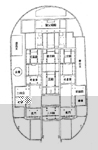 | 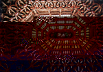 |

### 外觀造型

| 5-4 廟前五開間 | 5-5 正殿巍峨壯觀 |
| ----------------- | ----------------- |
| 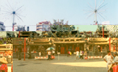 | 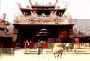 |

　整座廟門呈現莊嚴及輝煌的氣象。三川殿是台灣寺廟中較早使用假四垂（俗稱昇庵）的建築，龍虎門是典型的「四垂」造型，其他各殿則以「三川脊」的形式呈現，鐘鼓樓的方形格局與其他各殿很適配。

### 石雕
　最具代表性的石雕位於觀音殿的步口，有乾隆四十年的龍柱，龍身半浮於柱身，造型洗鍊而古樸，是台灣早期龍柱的代表作。文昌殿有道光十九年的御路斜魁，是經典之作。廟埕ㄧ對咸豐年的石獅，身軀挺直，造型靈活討喜。

| 5-6 洗鍊古樸的龍柱 | 5-7 雙龍戲珠之御路 | 5-6-1 洗鍊古樸的龍柱 |
| ----------------- | ----------------- | ----------------- |
| 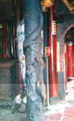 | 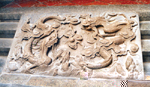 | 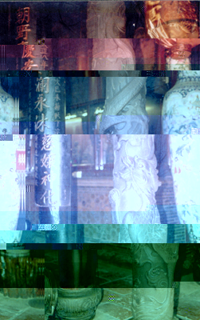 |

廟牆有光緒末年所雕的四海龍王，東海龍王威嚴莊重，西海龍王長鬚美髯，體態傳神，南海龍王衣褶流暢，北海龍王雕紋柔軟自然，各尊皆栩栩如生，雕工精細，是曠世傑作。三川殿及正殿壁面上的題字、雕堵等都是精心佳作，令人觀賞稱讚。

| 5-8 西海龍王-敖順 | 5-9 東海龍王-敖光 | 5-10 北海龍王-敖吉 | 5-11 南海龍王-敖明 |
| ----------------- | ----------------- | ----------------- | ----------------- |
| 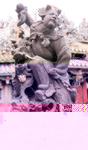 | 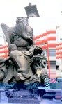 | 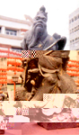 | 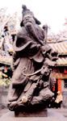 |

### 木構及木雕
　三川殿及龍虎門門面的木作及雕刻很細緻；三川殿前後步口的溜金斗拱及架內的棟梁很值得觀賞，通樑飽滿，金瓜筒肥碩，瓜身作「老鼠咬金瓜」的造型；龍虎門的蜘蛛結網是長方八角形，斗拱千變萬化；正殿的圓形藻井則令人目不暇給，嘆為觀止；凌虛殿的「 功參造化」及「德配乾坤」螭虎團字造型，令人叫絕，是朝天宮很有特色的螭虎團文字。

| 5-12 三元及第 | 5-13 5-14 螭虎團字 |
| ----------------- | ----------------- |
| 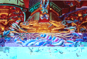 |   |

### 剪黏及陶瓷飾
屋脊水車堵因位於屋外容易遭受風吹雨打，較不易保存，因此朝天宮的剪黏僅有少數是清代的作品，其中三川殿、龍虎門、拜殿的屋頂非常熱鬧輝煌亮眼，大都是光復後完成，是彰化江清露的作品，使用玻璃多，但其堆塑的造型及人物身軀架式，皆為一流作品。

| 5-15 剪黏 | 5-16 剪黏 |
| ----------------- | ----------------- |
|  |  |

### 彩繪

| 5-17 浮雕 |
| ----------------- |
|  |

現存彩繪中有部分是陳玉峰的作品，一部份是他兒子陳壽彝重繪，而聚奎閣凌虛殿大門上的二十四節氣彩繪是罕見的題材。

### 靈驗故事特別多

| 5- 18 孝子釘 |
| ----------------- |
| 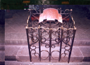 |

北港朝天宮媽祖靈驗故事特別多，如孝子釘、求雨、警察捉賊、庇蔭百姓、用裙子撥炸彈等，因此香火滿天下。

　北港朝天宮是全省媽祖信仰中心，攸關北港文化發展，值得全民重視，它亦是北港人及附近地區經濟發展的命脈，我們除了發揚媽祖精神之外，更應竭力保持這個二級古蹟，讓她永久發揮榮耀。

## 媽祖文化大樓景觀公園

| 5-19 媽祖文化大樓景觀公園 | 5-20 景觀公園一角 |
| ----------------- | ----------------- |
| 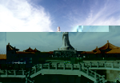 |  |

媽祖文化大樓是中式建築物，樓頂的景觀公園，是個亭台、樓閣、曲廊、花園一應俱全的中國式庭園建築。其中最引人矚目的是座高四十．五公尺的媽祖石雕像。
　這座石雕像為福建湄洲的朝天閣所贈。民國八十二年十二月二十九日開工，在大陸分成三百六十塊花崗石雕塑，再一塊塊安裝，經二年三個月的施工，疊成ㄧ尊莊嚴慈祥的媽祖雕像。湄洲祖廟於八十五年農曆三月十九日，由該廟董事長林文理率團奉送鎮殿媽祖「首德媽祖」一尊給朝太宮，並且舉行媽祖石雕像開光鑑證典禮。

| 5-21 重修諸羅縣笨港天后宮碑 | 5-22 四爪半金龍 | 5-23 石枕 |
| ----------------- | ----------------- | ----------------- |
|  | 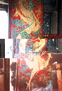 |  |

景觀公園落成後，吸引無以數計的觀光客登樓遊賞，並俯瞰北港全景。夜晚，媽祖石雕像的放射燈強力照射四周，成束的光線成為北港鎮的圖騰指標，遠遠的就可以感受到媽祖無邊無際的慈悲溫暖。

| 5-24 宣統年間龍柱 | 5-25 咸豐年間石獅 | 5-26 祈求 | 5-27 吉慶 |
| ----------------- | ----------------- | ----------------- | ----------------- |
|  |  | 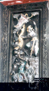 |  |

## 義民廟

| 5-28 義民廟 |
| ----------------- |
| 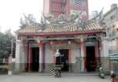 |

義民廟是廟塚合一的三級古蹟，整體為二進建築的廟宇。義塚分別位於主殿正後方及廟身左右，義犬將軍是整塊大石頭雕成，線條粗獷蒼勁又婉約，造型甚有創意。
　「義民廟」經歷數次修繕始具今貌，三川殿與正殿相連，沒有丹墀及過水廊，廟身後側緊靠墓體前壁。地面鋪設尺磚及花崗石。廟身高度頗廣，空間感覺威嚴靜肅。雕飾儉樸，造型古意，木瓜拱及雕花配置中規中矩，兩側浮雕堵，博古樣式，正殿兩壁有「萬古流芳」「旌旗飛揚」大壁畫，把當時的兵荒馬亂，百姓遷徙流離的情況，彩繪得淋漓盡致。

| 5-29 出自名家的彩繪 | 5-30 出自名家的彩繪 |
| ----------------- | ----------------- |
|  |  |

牆上鳥踏造型奇美，壁上磬牌深具古意。圍牆為傳統廟牆，很具尊嚴。廟內古物價值連城，同治年間的香爐、神桌及鐫有姓名的三十六個木製神牌，乾隆時期一０八位的神牌等。身著清朝官服的義民公爺塑像，代表義民永垂不朽。義民公著清朝制服，亦可看出滿清政府很重視義民。 
　廟內書法、石柱對聯鐫刻筆法蒼勁，都出自名家。如三川殿廟前對聯「一０八人舍生取義，五月三十日為國捐軀」正殿前對聯：「古民族未可輕視，真英雄大抵成名」等都甚有價值。北港義民廟建築，是閩南傳統式，中規中矩，古香古色。廟內墓園，庭院花木扶疏，是值得參訪的古蹟。

| 5-32 義民廟名家書法 | 5-31 造型獨特的鳥踏 |
| ----------------- | ----------------- |
| 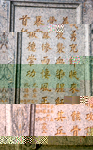 | 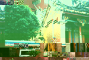 |

## 北港長老教會

| 5-33 北港長老教會 |
| ----------------- |
|  |

位於北港鎮中正路的北港長老教會，在昭和年間重建，屋身仿歌德式造型。在鎮內新舊建築中，特別突出耀眼，更具歷史與藝術價值。本體建築有雙斜屋頂，側邊有塔樓，外觀古典厚實。