# 第二節 民居建築
---

從笨港的發展史來看，「一府二笨」的繁華，及媽祖信仰凝聚成宗教重鎮的脈絡，應可從此地的建物找到些蛛絲馬跡。事實上，在政治變遷、機能變易、建物年限及人為因素下，歷史性的建物僅存少數。其中以日據昭和年間最為豐碩，我們將以不同時期的民居作介紹。

## 街屋

從笨港的發展史來看，「一府二笨」的繁華，及媽祖信仰凝聚成宗教重鎮的脈絡，應可從此地的建物找到些蛛絲馬跡。事實上，在政治變遷、機能變易、建物年限及人為因素下，歷史性的建物僅存少數。其中以日據昭和年間最為豐碩，我們將以不同時期的民居作介紹。

| 5-34 造型雅麗的街屋 | 5-35 厚實典麗的磚造立面 |
| ----------------- | ----------------- |
| 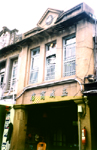 |  |

笨港自古街市發達，歷史性的街屋多半集中在中山路、大同路、厚生路、義民路、新民路、光明路、中正路、民主路上。這些街屋大多為日據時代「市區改正」的產物。特別是中山路，因商業鼎盛、都市功能擴大，逐漸形成具有「亭仔腳」的線性大街，即典型的「昭和」式建築。
　街屋多以共同壁相互連結，櫛比鱗次屹立街道旁。此種常見的「住商混合」式的街屋，門面約只有四凶尺半，景深卻非常狹長，最長的有７０多公尺。空間利用依次為店面、神明公媽廳、房間和倉庫，分具不同功能，充分達到「住商合一」的需求，並為爭取更多的活動空間，也向上發展。
　有的街屋中有夾層、閣樓及中央挑空的樓井等，形成獨特的建築特色。正立面臨街道部分，因建築年代有別，呈現不同風貌。以下分昭和前、大正型、昭和型等三種型態，略述其街屋正立面造型如下：
　在昭和年間以前，以木造屋身、磚造支柱為主，此期女兒牆未出現。另有一、二樓均採木造，「亭仔腳」外側再立磚柱支撐的施工法。這種建築常夾有雨淋板外觀，並在木造骨架中，編竹牆補泥灰做成屋身。
　大正時期街屋，建材以磚為主，開始使用鋼筋混凝土。廊柱以清水磚或洗石子處理。一樓柱身上的水平帶，雕飾較少，常作為店招用。水平帶以上主要是屋身立面及開口部。開窗以長條窗為主，窗台、窗楣、雨庇則乾淨俐落或華麗繁複皆有，女兒牆為此期主要建築特徵。三角形、圓拱型、書卷型、破山式、鏤空式等山牆，比比皆是。再飾以人物、剪黏、花草、家族姓氏之泥作雕飾，極富變化性與巧思。
　昭和時期建築已受到西方現代主義影響，立面線條簡潔，開始出現陽台及連棟共用水平帶做雨庇、女兒牆等。此期因混凝土施工，屋身開口增大，型式自由又有變化。表面處理除洗石子外，面磚廣沬被使用，二樓以上建築個案日漸增多。
　南陽國小退休教師顏連茂之宅第，中山路121號，是非常特殊的「昭和型」街屋。前臨「大通」（中山路），立面簡潔，具有陽台。室內木造結構，砌紅磚牆，中間有三處「深井」（天井），院落建物直達共和街（古蕃簽市）。　　鎮內深具特色的街屋常被林立零亂的招牌遮擋，視野上的美感蕩然無存，實在可惜。
　
## 第一樓

| 5-36 |
| ----------------- |
| 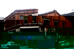 |

第一樓位於新民路，坐東朝西，是日據時期首棟西式磚樓，因為寬為六間，又稱為「六嵌仔」。由於當時北港碼頭生意興隆，酒家甚多，此樓曾是遠近聞名的酒家。現為民屋，至今牆面還保存的很完整。

## 朝鮮樓

| 5-37 |
| ----------------- |
|  |

位於光明路與新興街口的朝鮮樓，建於日據時代。這棟坐北朝南的建築物為二樓建築，外觀洗石子，是日商在北港所開設之酒館，專供豪商巨賈尋歡作樂，據說所聘女子均來自朝鮮，故稱之。

## 甕牆

| 5-38 |
| ----------------- |
| 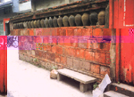 |

北港共和街及安和街一帶，舊稱蕃簽市，乾隆、道光年間曾熱鬧一時。郊商顏謙源在此經營「謙源號」，把壓船的酒甕砌築成獨特的「甕牆」。此有一百多年歷史的建物，現屬於雲林縣稅捐處所有。據說此種建設只出現在鹿港和笨港。
　「甕牆」在民國八十八年十月二十二日嘉義大地震嚴重坍塌。笨港合和會首先表示願意協助修復，鎮內社團紛紛響應共襄盛舉。修繕工程由交趾陶師父許哲彥按照古法負責施工修護，目前已恢復舊觀。

## 中正路王宅

| 5-39 |
| ----------------- |
| 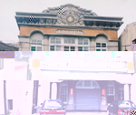 |

「王宅」在中正路尾，原北港火車站前左側，建築美輪美奐，至今保持得很完整。王宅建築屬於現代主義形式，但其細部裝飾較多，變化亦多，表面以米黃色磁磚及洗石子搭配，造型很有美感。王姓家族從日據時代就從事貨運工作，目前為中連貨運北港站。

## 高成吉商號

| 5-40 |
| ----------------- |
| 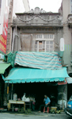 |

「高成吉」商號，是高興家族所經營，是日據時代北港地區爆竹煙火的總經銷。當時爆竹煙火是管制品，高家取得經營權殊屬不易。建築立體面裝飾以「高」字呈現，很突出。女兒牆亦做細膩裝飾，是北港地區少有的裝飾品。

## 新街蔡宅

| 5-41 |
| ----------------- |
| 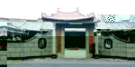 |

新街華勝路上的蔡家老宅，民國二十六年間，由蔡裕斛興建。此座大宅花費不貲，約當時三十甲耕地價錢，是一幢七開間三合院大宅，護龍分前段二間及後段三間，形式為傳統外形飾以西師細部，木構架為穿斗式，步口深兩架，通樑上立瓜柱，出屐正拱傑作，整體頗為華麗壯觀，是北港現存最具規模古宅。
　窗戶大，採光佳；牆壁、柱子皆洗石，線條簡潔清新，頗有西風。圍牆上的鏤空窗櫺、山門屋角的唐朝紋、屋椽彎翹，具閩南風格。
　民國八十年台十九道路拓寬，波及蔡家三川門及部份圍牆，蔡家後人感念先人恩澤，不惜重資將前緣三川門及圍牆以科學方法向內遷移，並將歷年遭颱風颳損部份、剪粘及雕塑一併整修，使這座大宅得以傳承，保持原有風貌。
　蔡宅因在馬路旁，路人都當是家祠或古蹟，一些對建築有研究的教授，常率領學生到此觀賞研究，成為最佳的建築教材。

## 新興街蔡宅

| 5-42 新興街蔡宅 | 5-43 新興街蔡宅 |
| ----------------- | ----------------- |
| 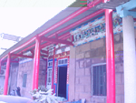 |  |

新興街蔡宅建於清光緒末年，是北港街長蔡然標宅邸。此宅曾由其任省議員及監察委員的孫女林蔡素女經管，現由蔡華英女士接管。
　蔡宅屬單體街屋，由大陸匠師以福州杉建築成寬三間深三落的大宅。正面除裙堵外，皆為木構材料，且留有兩扇八卦型與三扇方形窗洞，這種通風氣窗的造型極為少見。每落間都設小天井，第一落牆上有剪黏水車堵，交趾陶都還很鮮豔。
　室內兩側壁堵有彩繪及書法，具有藝術感。第二進是神明廳，舊有的神明龕、神明桌都是清朝作品。第三進以居住為主，全部採用穿斗式構造，並有雕飾，是保存較佳的古宅，尚有很多早期的精美家具。如此華麗細緻的大宅邸，與蔡然標獲取科舉功名有關。
　
## 合院式住宅

| 5-44 |
| ----------------- |
| 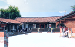 |

店屋出現在笨港的核心地區，鄉村除了竹管仔厝及土角仔厝外，經濟寬裕者則以磚、木料建成有大埕、天井的合院。合院式建築有三合院、四合院、一條龍等，這種正身高敞，兩側廂房稍低的建築在府番、好收等郊區，還普遍存在。

## 竹管仔厝．土角仔厝

| 5-45 |
| ----------------- |
| 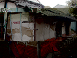 |

在早期的房屋建築中，「竹管仔厝」在農村處處可見，因為竹子容易取得。竹管仔厝以刺竹挑大樑，牆壁和屋頂先用竹子編出主體，再用泥土混合稻桿、稻穀塗抹上去，再蓋上厚厚的茅草就算大功告成，後來屋頂換成瓦片，這種冬暖夏涼且耐震的房子，在閹豬社還有一棟。
　土角仔厝用事先製模陰乾的厚泥塊堆疊成牆壁，底部因為怕水侵蝕，所以會在外部加瓦片，門的部分則先用木板隔出長寬預留的部分，進一步以土塊堆疊牆面而成。此一環保建築取之於大地，回歸於大地，除了偏僻鄉村已不多見了。
　
## 木屋

| 5-46 文化路的日式木屋 |
| ----------------- |
| 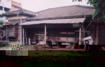 |

鎮內的木屋，主要以政府機關、糖廠之日式平房宿舍為主，尤以北港糖廠員工宿舍佔其中最大宗。
　這種日式建築，相當耐震。為防潮濕、蟲害，通常都會挑高離地三尺左右。外觀清一色覆以齊整的雨淋板，牆面結構採竹編，糊上黏土層。木門窗造型講究，六角狀、格子狀的門窗，看似簡單卻富變化。這種藉著窗型變化增加建物美觀的施工法，是日本平房主要特色之一。在博愛路剛拆除的信豐麵粉廠老宅的繁複磚造型窗，讓人更有思古幽情，可惜因乏人整理，落得重建的命運。
　好收國小前棟平房，是鎮內僅存屋樑、門窗全為檜木質材，且仍使用中的校舍。具有古風的檜木窗仍非常完整，大小屋樑依舊堅固耐用，覆蓋的紅瓦屋頂，在萬綠叢中特別出色耀眼。年初，這棟建物換新裝，台度貼古色古香的板岩、木紋瓷磚，地板採用仿木地磚，樑柱、內外壁油漆重新粉刷處理，搭配高懸的紅燈籠，中國式的洗手台，相當典雅古樸。
　
## 古亭畚

| 5-47 古亭畚 | 5-48 古亭畚 |
| ----------------- | ----------------- |
| 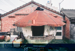 | 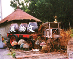 |

「古亭畚」是早期農民儲存農作物的糧倉。「古亭畚」的主要由竹片編織成圓型結構。其次以黏土、稻草、牛糞混合，塗砌在竹結構上。屋頂蓋上厚實多層的稻草、甘蔗葉或茅草就大功告成。這種早期倉儲吸水防潮功能特強，可長期儲存稻穀、花生、地瓜簽等。隨著倉儲的現代化，好收里有個建於民國五十二年的「古亭畚」，已由鐵皮屋頂取代茅草，看起來更堅固耐用。

## 現代建築

| 5-49 現代建築 |
| ----------------- |
| 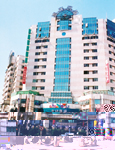 |

現代建築深具多元化特質，無論建材、造形設計、面積大小、用途都明顯與傳統大異其趣。
　在建材上，從泥土、竹木、磚塊、鋼筋混泥土、鋼骨結構；屋舍型態從平房、合院到高樓大廈；建屋面積從寬闊無比的透天厝到坪數、活動空間受到限制的販厝、公寓；坐落型式有單屋、街屋、別墅、組合式鐵屋、大型規劃社區；尚有特殊的建物，如美輪美奐的鴿舍、貨櫃屋、檳榔屋等，真是讓人嘆為觀止。 
　