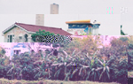
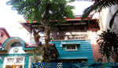
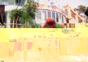

# 第三節 庭園建築
---

| 5-51 庭園建築 | 5-50 芳園 |
| ----------------- | ----------------- |
|  |  |

隨著溫文儒雅的蔡爾信博士，走進那條不甚寬敞再尋常不過的巷弄，心裡不免納悶，我們心中的桃花源在哪？待主人推扉，古樹參天、蘭影粲然、錦鯉悠遊的庭園，霎時抓緊我們的目光。
　翻讀史頁，當年帆影頻繁，交易熱絡，素有「小台灣」之稱的笨港。其文化內涵之豐富，建築藝術之雋永，值得推敲品味，但庭園建築則不多見。諸元專科醫院創辦人蔡深河醫師精心營造的「芳園」，雖無亭台樓閣，但百年羅漢松、楊桃樹、蘭花型塑出渾然天成的典雅，具有耐人尋味的意境在。在樹濤滿園、古趣盎然的庭園裡。老院長畢生重視生態、尊重自然，不但一草一木親自照料，培育蘭花，種植各類香花，並藉著自然界的事例教導子女。
　「芳園」中，一棟百年歷史的日式建築，雖掩映在林蔭之間，但依舊讓人驚豔。外觀木造雨淋板，結構堅固，另有夾層供逃生躲藏，設計上頗具匠心。儒醫蔡深河老醫師就在這棟歷史建物中撰寫博士論文和肝膽研究的論著。 
　五十年前，諸元醫院的創辦人蔡深河院長在兼顧土地、人文、生態的思維下，開風氣之先以生態工法經營樹腳里船頭埔的「果樹林」庭園，如今蔚然有成，儒醫前瞻性的胸襟與風範，令人由衷佩服。

| 5-52 果樹林建築 | 5-53 果樹林建築 |
| ----------------- | ----------------- |
|  |  |

果樹林庭園培植無數國內外奇珍異卉，修竹綠林，深幽的鳳凰林蔭，鳥禽棲息的水塘，儼然成為生態庭園。正興建的中西合壁、既今又復古的三樓建築，從設計形式構思之初就考量到光影效果、內外和諧、虛實對照等建築原則，至於建材的採用；施工的參與；裝飾造型的選擇；壁畫、浮雕的運用；自然光的….都突顯蔡老院長對生命、自然的關照。
　陶管柱的古味、五彩玻璃珠的繽紛、馬賽克的行雲流水，籤仔的飄動感、碎玻璃的耀眼、水泥噴漆的方便性等，將外觀做最創意性的裝飾；保留素面未加雕琢的牆面，仍有特殊的效果。
老院長夫人親自黏貼馬賽克，用「籤仔」貼出蘆花飄搖的景緻，指揮高處貼馬賽克的師傅完成大幅的壁畫。欄杆、女兒牆上的動物造型既創新又童趣；內部有老院長伉儷創作書藝鑲嵌成壁畫；挑高的屋宇可觀星；樓梯設計於正中又透明；擋東北季風的迴廊；傾聽大自然音籟的演奏台；梵谷畫作浮雕；鄉土建材的構思等，都跳脫傳統格尿。 
　由於蔡院長藝術造詣高，文采豐厚。其水彩、國畫、油畫、陶瓷塑型均為一時之選，搭配創作詩句，稱得上文圖並茂，雅俗共賞。如花團錦簇的「春天花園」，題詩「春光照耀到家園，四季花開樸雅心。但願群芳情不謝，一朝相見一朝深」；熱情的「扶桑花情」則有「紅瓣金蕊巧安排，扶桑花開應陽光。真紅象徵熱情來，宛如少女純情愛。」的詩句。其中「烽火火雞」畫中的主角，據蔡爾信博士說：「畫裡六十高齡的火雞是父母親的寵物。世界大戰時，為躲避美機轟炸，避居鄉下。每次飛機飛過上空，牠就咯咯叫，似乎對戰爭心存不滿。」
　其他詩畫作品尚有「百葦飛春」、「自由自在」、「王者之尊」等。蔡院長雕塑長才，充分展現在壁上或雕於欄杆上的的變色龍、紫光閃爍的鳳凰、燦爛的雉雞等動物。一幅摹仿梵谷名畫浮雕「星夜星空」，樹幹攀緣糾結，樹態生動如生，塑工精細，不亞於梵谷原創作。蔡夫人廖華英女士，熱愛花藝設計，曾以「夜美人」的曇花刺繡，轟動藝術界，這幅傑作就鑲鐫在別墅牆壁上。 
　蔡老院長一門俊秀，在這棟建築裡，處處是全家構思、一起動手的巧思結晶。不同樓層，不同樓面，各具景緻。蔡爾信博士認為說：「建築中主要以父親追求生態和諧、土地永續和人文關懷的理念為主。另外一部分則來自旅行意象。」蔡博士又告訴我們：這棟建築是家人對父親綿長的追憶，沒有完工期限。