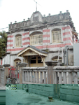
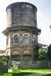
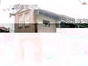
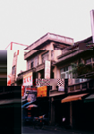
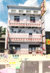

# 第四節 公共建物
---

公共建物有現代和歷史性建物兩種，可分機關建物、產業建築、交通營建物與其他建築物等。
北港鎮的歷史公共建物僅存仁和街的舊台南法院和商工銀行舊址「番仔樓」，其他像郡役所、公會堂都已隨社會變遷被拆除改建。產業建築以北港糖廠為主，其員工餐廳建於昭和時期。「五分車」雖逐漸功成身退，但不能否認其在產業文化上的價值。至於「十角水塔」、北港與大復戲院、永樂旅社與復興客棧及燕子樓等，均自有其歷史定位，毋庸贅言。

## 番仔樓

| 5-53-1 |
| ----------------- |
|  |

在三百多年歷史的朝天宮後殿右後方，有棟叫「番仔樓」的巴洛克式洋樓，使古色古香的朝天宮出現「中西合璧」的景觀。這幢有特殊風貌的建築物與朝天宮並列為國家二級古蹟。
　這棟洋樓建於大正元年（1912），是北港鎮上第一座洋樓。當時曾遭到保守鎮民激烈反對，但主持朝天宮擴建工程的蔡然標、蔡川等人仍力排眾議興建。原來在明治三十九年（1906）三月十七日，發生嘉義打貓大地震。嘉雲南三縣災情嚴重，廟宇倒的倒、塌的塌，北港朝天宮亦無法倖免。日本為了推動「皇民化」政策，禁止倒塌廟宇重建。因震災時傾圮的聚奎書院，日人不准原址重建，於是將奉祀的五文昌夫子自聚奎閣遷至朝天宮，並維護十餘甲學田免被日本政府沒入官產。
　當時北港區長蔡然標為了維護媽祖信仰及中華文化，以維修為由辦理朝天宮擴建。雖經力爭為日人核准，但還是百般刁難，尤其是中國風貌的老街、古厝，成為推動「皇民化」的阻力，日人頒布所謂「市區改正」命令，拓寬老街、強拆中國風貌的古厝，因而引起民眾憤懣，朝天宮前的宮口街拓寬工程，因民眾全力支持朝天宮擴建，日人無力兼顧被擱置。日本官員為此惱羞成怒，百般刁難朝天宮擴建工程，主持工程的蔡然標、蔡川等人為顧全大局「逆來順受」，為表示支持「市區改正」政策，在修建及擴建中國宮殿式廟宇外，在朝天宮後殿石牆內興建兩棟洋厝。左棟為現代式二層樓，右棟為巴洛克式洋樓「番仔樓」。
　這棟巴洛克風貌的洋樓完工後，被當時的「商工銀行」看上，向朝天宮承租開設「北港支行」，成為北港地區金融中心。光復後商工銀行易名為第一銀行，另覓北港分行行址而遷移。該棟洋樓由「北港建築信用合作社」承租為社址，一直到民國七十年合作社新建現址後遷離。
　
## 十角水塔

| 5-54 |
| ----------------- |
|  |

俗稱「水道頭」的北港第一水源地，有座高二十多公尺的水塔。這座聳立北港一號堤防外的鋼筋水泥水塔，是公元1929年（昭和四年）在朝天宮資助經費下，由街長蘇顯藜興建。當年興建費用為廿四萬日圓，從昭和四年三月二十三日開工，到昭和五年五月三十日完工。
　水塔共分三層，三樓是圓柱體，上層為圓柱鋼筋混凝土造之蓄水塔，並設有維修用之護欄，中、下層則作成十角形之構造物，每面開半圓拱形門窗，作為辦事處及維護空間之用。
　日文叫「水道」的自來水廠，在當時有最進步、最完善的設計，有取水井、沈澱、過濾、消毒等設施，將引自北港溪的水，經過前述過程處理，再以幫浦打上水塔，後送至每一住家。這座水塔供應民生用水長達數十年，目前雖已功成身退，但其十角造型的建築風格，成為頗富特色的歷史建物。
　
## 復興客棧

| 5-55 | 5-56 |
| ----------------- | ----------------- |
|  |  |

笨港「復興客棧」是全台僅存的最古老旅社，由蔡不然所創立。據考據已有一百多年的歷史，目前還是由蔡姓家族經營，店名稱「蔡復興」。客棧在當時叫做「販仔間」，意思是供「販仔」（即生意人）落腳休息的處所。蔡不然年輕時結交不少朋友，為人仗義直言，生性慷慨，人稱「販仔間教」。
　創立之初位於蜆仔街，生意興隆。光緒二十年，北港街大火，客棧受波及，遂遷建於現址，至今已八十七年。第二代經營者是蔡成，其後長子蔡東熾繼續接掌。平時顧客以生意人為主，但農曆一至三月的進香旺季，曾有一天容納二百多位香客的紀錄。
　民國初年，住宿一夜二角半，當時買一付香紙需3～5元，只要購買其香紙，即可免費住宿一夜。早期香客必須寫信預訂房間，客棧亦代為準備牲禮、金香燭等，並代為預約鼓吹陣，讓香客方便迎接神明至朝天宮。近年來，因新型旅社興起，且朝天宮陸續興建多棟香客大樓，生意已大不如前。
　復興客棧是一棟二樓三間寬的建築物，全為穿斗式的木構造，大廳亭仔腳深八尺，大廳兼作門廳功能。門廳分內外，外廳是櫃臺及帳房，內廳設龕。其後屏頂下桌，除了供奉自家祖先及神明，也供香客住宿時寄放神明及香旗。廳二側設梯通往二樓，房間全為總舖，僅一樓有兩間單人房。目前僅二樓供作住宿。建築物的構造仍保存良好，並有部分雕飾，是一棟難得的傳統式樓房的建築。

## 永樂旅社

| 5-57 |
| ----------------- |
|  |

　「永樂旅社」位於中山路上，是日據時代第二次市街改正時所興建的新型旅社。牆面貼淡粉紅色磁磚，山牆上洗石子堆塑裝飾，外形及比例頗有現代感。是北港中山路東排坐東朝西的旅社。

## 燕子樓

| 5-58 |
| ----------------- |
|  |

位在中山路上，是日據末期由王雙（王吟貴之父）所創建，名為「第一旅社」，是棟四層樓的建築物，為當時北港最大的旅社，後側設有百餘坪花園。當時因二、三、四樓的陽台常有燕子築巢棲息，被稱為「燕子樓」。後來業主在牆面上以木雕的燕子裝飾，更增加其美觀。二十多年前，王氏家道中落，地方士紳合資買下「第一旅社」，更名「祥和旅社」，喻燕子帶來祥和之氣，後側花園則賣給「諸元醫院」。幾年前，「燕子樓」三度易手，由朱姓商人接管，更名為「世一賓館」，其上的燕子繼續盤旋穿梭，看盡該旅社的滄桑史。

## 北港戲院

| 5-59 |
| ----------------- |
|  |

這棟昭和年間的建築物，雖內部已大幅改變，但外觀立面仍維持原貌。正面有變形山牆，外表貼淡黃色磁磚，以洗石子帶出曲折條紋做成水平裝飾。二樓開口大，陽台懸突於外。整體造型厚實，大方又美觀，誠屬建築佳作。

## 振興戲院

| 5-60 |
| ----------------- |
|  |

振興戲院立面以現代女兒牆線條轉折表現造型，表面為洗石子，做溝縫，中央山牆以洗石子堆塑文字，標明營業項目。天花板和托間可明顯看到焊接補強的物件。