# 第一節　公私設施及建物
---

北港鎮內公共建築、私人建設一應俱全，這些公共設施、機關或私人建物，不但提供鎮民各類生活服務，有些尚具有歷史及文化價值，非常值得探討認識。

## 鎮公所

| 6-1 |
| ----------------- |
| 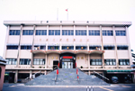 |

鎮公所是北港鎮行政中心。民國三十四年八月改日據時代台南州北港郡北港街為北港鎮公所，當時以鎮長、副鎮長為機關正副首長。民國四十九年廢副鎮長。現在內部單位分為民政、財政、建設、農業、社會共五課及行政等四室。其中社會課成立於八十九年五月，兵役課在九十一年併入民政課。附屬單位有民國六十二年成立的清潔隊，民國七十四年成立的圖書館，及先後成立的四個市場。
　鎮公所現有各課室經辦業務如下：
（一）民政課－自治、選務、宗教、禮俗、教育文化、調解、地政、公墓 整理、健保、兵役行政、圖書館等。
（二）社會課－社會福利及救助（中低收入戶、敬老津貼、急難、殘障等補助 等）、社團、慶典、失蹤人口協尋等。
（三）建設課－土地徵收、都市計劃、證照、一般工程、違章建築查報、河川公地、水門、市場、停車場、路燈管理等。
（四）財政課－公庫管理、出納、鎮稅收、公有財產管理等。
（早）農業課－農地使用證明、水旱田利用、農情報告、造林、畜產保健等。
（六）行政室－檔案管理、總務、採購發包、研考、公文收發等。
（七）清潔隊－環保清潔業務（含環保申訴）。
（八）托兒所－幼兒學前教育等。
　攸關鎮內垃圾清運及環保清潔業務的清潔隊，在鎮內十五里採垃圾不落地，每日分四條路線沿街道收集垃圾，郊區則在定點設垃圾子車，分兩線隔天收集一次。在延長掩埋場使用年限及因應垃圾進焚化爐的前提下，清潔隊在資源回收分類、廢棄家具處理都投入心血，民眾可隨時與他們聯繫。鎮內因係觀光城鎮，每週還要安排三天回收數量龐大的椰子殼，載至麥寮六輕做堆肥的材料呢！

## 北港鎮民代表會

| 6-2 |
| ----------------- |
|  |

北港鎮民代表會為地方自治之民意機關，與鎮公所如車之兩輪ｘ鳥之雙翼。代表會每年審議、議決鎮內總預算及追加減預算，於法定期限內通過外，其餘討論、議決本鎮財產之經營處分及公所、代表提議事項，並接受人民請願案。定期大會依規定半年召開一次，每次不得超過十天，臨時大會依規定每十二個月不得多於五次，且不能超過十天。

## 北港鎮立中正圖書館

| 6-3 |
| ----------------- |
|  |

本館成立於民國70 年，是棟二層樓的建築物。一樓有儲藏室、辦公室及開架書庫。書庫分參考區、兒童閱讀室。二樓上有自修區、期刊室、閱報區。另設大型會議廳一座，供鎮內集會使用。館內藏書近三萬冊，分類清楚，借閱方便。圖書館除週一休館，其他白天都開放。
　圖書館除提供借閱服務外，也透過愛鄉讀鄉、親近圖書文化飄香、舞蹈欣賞、親子製香包等活動，提昇閱讀風氣及社區文化水準，頗受地方肯定。因本鎮擁有朝天宮古蹟，宗教類圖書類圖書不少。本圖書館是雲林縣文化局首梯電腦全自動化輔導的圖書館。借閱便捷。因四周都是文教機構，環境優美幽靜，是非常適合閱讀、自修的場所。

## 警察分局

| 6-4 |
| ----------------- |
|  |

警察以維持民眾安全為首要任務，其制度沿革要追溯自明代。明永曆年間鄭經頒布保甲法，可知當時以保甲制度維持地方治安。清康熙頒「臆保甲以弭盜賊」諭；乾隆末定「保甲規約」；道光時期則以保甲制度為依歸行清庄聯團之法；光緒十三年（1887）台灣建省，除清庄聯團組之外，尚設清庄聯團總局及分局，形成官民混治的警察單位。另外清朝在笨港�後設有水師汛、笨港汛，都擔負整個笨港地區民眾安全的責任。
　日據時代，日人曾先後在光緒廿四年（1898）和大正十一年（1922）公佈「台灣保甲條例」和「台灣保甲規約」箝制台灣同胞的行動、思想自由，形成警察－保甲－壯丁團的警政體系。直至昭和廿年（1945）日人眼見敗象已露，始公佈廢棄保甲制度。
　日人警察體系分工嚴密，以北港郡而言，內部有警務、司法等數單位，戰時又設有兵事、防空、調查、警備等。另有監視區、巡視區、派出所、駐在所的設置。北港郡警部有北港、口湖兩監視區，北港監視區又分北港直接巡視區和元長巡視區。前者有郡直轄、新街、土間厝三派出所；元長轄區有客子厝、元長、鹿寮、好收等派出所。
　台灣光復，雲林縣設警察局，下有六個分局，北港分局轄區為北港、水林、口湖三個鄉鎮，所轄有水林、口湖兩分駐所，及北港、北辰、好收等九個派出所。
　北港分局原來房舍在北港圓環附近，民國七十二年遷至現址。其組織編制有，分別統籌和襄理警察業務的分局長、副分局長外，各分駐所、派出所執行受理各項警察業務，分局內各組任務如下：
　 行政組─行政、秘書、公共關係、會計等業務。
　 督察組─督察、訓練、人事等業務。
　 刑事組─刑事、少年業務。
　 戶口組─戶口、外事、後勤業務。
　 保安組─保安民防業務。
　 資訊交通組─交通、資訊業務。
　 陸務組─保防、陸務業務。
　 勤務指揮中心─勤務指揮、管制、聯絡業務。
　 警備隊─轄區巡邏及治安維護等。

## 雲林縣消防局第三大隊 北港消防分隊

| 6-5 |
| ----------------- |
|  |

鎮民通稱的「消防隊」，其全名為「雲林縣消防局第三大隊北港消防分隊」。四十年代，消防隊最早屬於北港鎮公所民政課管轄，設在民主路78號（現在三商對面），該辦公廳舍已因地震拆除。五十年間，轉為消防警察隊隸屬北港分局之外勤分隊，建物在北港派出所現址，直到民國七十二年，始遷至文仁路。
　根據蕭清河分隊長敘述：「消防隊在未精省前，原隸屬台灣省警務處，後轉為台灣省消防處，全銜為『雲林縣警察局消防警察隊北港分隊』，歸分局管轄。八十七年七月精省，消防處合併至消防署辦公，各縣市陸續脫離警察局。雲林縣消防局於民國八十八年七月揭牌，並設立三個大隊。第一大隊負責斗六、斗南分局轄區；第二大隊掌管虎尾、西螺區；負責北港、台西兩分局區的第三大隊，所轄有七個分隊，包括北港、水林、口湖、台西、四湖、東勢、麥寮等，隊址設在北港分隊內。」
　「雲林縣消防局第三大隊北港消防分隊」管轄鎮內廿八里，有消防人員廿名，替代役三名。現配置高低壓水箱車、救護車、幫浦消防車各兩部，水庫車、雲梯車、救助器材車、化學車、查察車、指揮車、救生艇、橡皮艇各一部，可供救災救火之用。
　消防業務包含預防火災、緊急救護、搶救災害、救護車等為民服務事項。長久以來，119專線電話在救人、救火、救災上發揮相當功能。
　因為編制有限，北港消防分隊運用民力組成「雲林縣義勇消防總隊第三大隊北港中隊北港分隊」、「雲林縣消防局北港社區婦女防火宣導隊」和「雲林縣消防局北港鳳凰志工分隊」共三個志工團體，加入救災、宣導陣容，以爭取時效將災害減至最低。
　「北港義勇消防隊分隊」通稱「北港分隊」。起源於昭和十一年（1936）的「壯丁團防火班」。隊址設在民主路78號，與舊消防隊同址。轄區包括北港、水林、口湖、元長等鄉鎮。民國三十四年，「壯丁團防火班」奉警務處命令改為「消防組」，三十八年又改為「消防隊」。目前「北港分隊」隸屬雲林縣消防局第三大隊，負責協助北港、口湖、東勢、四湖、台西、麥寮等鄉鎮消防工作。

| 6-06 早年義消演習 | 6-07 早年義消演習 | 6-08 早年義消演習 |
| ----------------- | ----------------- | ----------------- |
| 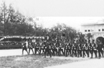 |  |  |

義消人員以協助救災為主，目前編制包括第三大隊廿六名，北港中隊十四名，北港、水林、口湖等分隊各四十五名。
　「北港分隊」尚有金香燭部基金管理委員會及雲林縣北港鎮義勇消防協進會兩個附屬組織，前者設在朝天宮內。自台灣光復，首任分隊長許壬子任內，在朝天宮設立金香服務部至今，已有數十年歷史，是全國得天獨厚具有生產性的志願性消防團體。
　「北港社區婦女防火宣導隊」在民國八十九年十月九日正式成立，主要在推廣社區家庭防火宣導教育。九十一年成立的「鳳凰志工分隊」以協助緊急救護為主，強調「服務充實人生，用關懷增進溫情」。

## 台灣電力公司雲林區營業處 北港服務所及變電所

| 6-9 北港變電所 |
| ----------------- |
|  |

華勝路上的「台灣電力公司雲林區營業處北港服務所」擔負整個北港鎮27400戶電力配送的任務。以前，北港服務所租用中正路的民宅辦公，直到民國54年，才自購土地於華勝路現址做服務據點。民國74年，因業務量擴增，改建四樓迄今。鎮內電力供應可溯及日據時代，當初以電燈為主，電源主要來自日月潭之水力發電，有部分來自北港糖廠製糖過程之蒸氣發電。
　電力為國家經濟發展之原動力，亦是百姓現代生活之必需品，輸電線、變電所則是電力傳輸不可或缺之媒介。北港地區的電力主要由「北港一次變電所」和「雲港二次變電所」負責供應輸送。
　基於因應北港地區工商發展及地方繁榮需要，台灣電力公司在民國七十五年六月廿三日建立位於土厝的「北港一次變電所」。其電源由嘉民超高壓變電所以161千伏特經變壓至69仟伏特，經由二次輸電系統送至69千伏特大用戶及各二次變電所後，再降壓至22/11千伏特以配電線供電至一般用戶和工業用戶。本變電所之轄區計有元長、土庫、橋村、東北、口湖、雲港、水林、東石、朴子、嘉太等十所二次變電所，提供大北港地區約一百家大型工廠及三十多萬戶居民用電，是極重要的電力設施。
　根據「台灣電力公司雲林區營業處」提供的資料，參表6-1「雲港二次變電所」沿革。

## 地政事務所

| 6-10 |
| ----------------- |
|  |

北港地政事務所前身為台南地方法院北港出張所，設於朝天宮後之仁和路，以辦理不動產登記為主。民國三十五年十一月更名為台南縣北港地政事務所。三十九年十月，因行政區域調整，從仁和路遷至民主路，並易名為雲林縣北港地政事務所，直接隸屬雲林縣政府。
　民國七十二年，因業務量大增，原有廳舍不敷使用，縣政府利用空軍訓練基地建築美輪美奐、設備完善之新辦公大樓，乃遷入現址辦公ｚ地政事務所編制四課，第一課負責地籍登記；第二課地價業務；第三課地用、地權業務；第四課測量業務。
　民國八十三年，北港地政頂樓設立衛星追蹤站，這套設施以測量台灣在全球地理的國際座標為主，是本省西部唯一的地理衛星觀測站。內政部認為北港天候佳，地形開闊，所以能從嘉南平原的廿餘個規劃點中脫穎而出。

## 雲林縣北港鎮戶政事務所

| 6-11 |
| ----------------- |
| 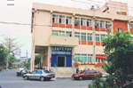 |

　日據時代，日人為推行殖民政策，戶政業務由警察機關管理，方便其調查人力，維持治安。本鎮戶籍自明治三十九年建置。民國三十五年四月，戶政機關劃歸北港鎮公所，並由鎮長兼戶籍主任，戶籍課長兼副主任。民國四十六年及五十六年，先後由警察人員兼戶籍副主任和主任。民國五十八年七月一日，試辦戶警合一，戶籍課改隸雲林縣警察局，六十二年正式實施戶警合一。到八十一年戶警分立，「雲林縣北港鎮戶政事務所」正式成立。戶政事務所現址在文仁路，其業務如下：
　戶籍登記－出生、死亡、認領、監護、收養、結婚、離婚、遷入、住址變更。
　核發文件－初補換國民身分證、戶籍謄本核發閱覽、門牌業務、印鑑登記。
　戶籍資料－學齡、選舉、中老人名冊、學術研究統計等。
　行政業務－出生年月日更正、改名、人口統計、國籍歸化等。

## 中區國稅局北港稽徵所

民國八十一年七月，財政部遵照行政院指示及立法院財政委員會之決議 ，將委託臺灣省政府各地稅捐稽徵處代徵之國稅收回自徵，在臺灣省成立財政部臺灣省北、中、南三區國稅局。
　　中區國稅局於八十一年七月一日成立，九月一日正式運作，職司中部地區六縣市轄區內營利事業所得稅、綜合所得稅、遺產稅、贈與稅、證券交易稅、貨物稅及期貨、交易稅等國稅。轄區內並設有六個分局，十三個稽徵所。北港稽徵所位於文仁路6號，負責北港、水林、口湖、四湖、元長五鄉鎮之國稅稽徵業務。與雲林縣稅捐稽徵處北港分處同棟大樓辦公。
　　
## 雲林縣稅捐稽徵處北港分處

| 6-12 |
| ----------------- |
|  |

　　「雲林縣稅捐稽徵處北港分處」成立於民國三十九年，地址為圓環旁的民主路45號。五十九年原址改建，門牌更改為文化路40號。直到民國七十二年配合「北港地區行政機關擴建方案」遷至現址。
　　本單位原負責國稅、地方稅之徵收，自從國稅歸財政部國稅局，本處僅負責北港、水林、元長、口湖、四湖五鄉鎮的地方稅徵收。所謂地方稅含營業稅（九十二年歸國稅局）、房屋稅、地價稅、土地增值稅、印花稅、契稅、娛樂稅、汽機車使用牌照稅等，其中機車150cc以下不徵稅。
　　
## 衛生所

| 6-13 |
| ----------------- |
| 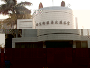 |

本鎮的衛生所設於民國三十九年五月一日，初由鎮公所管轄，民國四十一年一月改霜雲林縣衛生院，五十年七月再改歸公所，六十三年七月則由雲林縣衛生局管轄迄今。衛生所最早在博愛醫院辦公，即現北港外勤記者聯誼公會。外十三年遷至吉祥路，後因業務擴充，原有房舍不敷使用，乃遷至現址。
　衛生所業務範圍眾多，包括：一般醫療以及巡迴醫療服務、傳染病防治及預防接種、寄生蟲防治、空氣污染防治、營養衛生及食品衛生管理、醫院診所管理以及密醫取締、藥政管理及取締不法藥物化粧品、婦幼衛生、家庭計劃、托兒所和幼稚園的健康管理、肺結核的防治、肝炎防治、檢驗業務和衛生教育宣導等，近幾年積極推動婦女防癌及抹片檢查，所以衛生所是鎮內民眾健康及生活上的照護者。

## 中國醫藥學院北港附設醫院

| 6-14 |
| ----------------- |
| 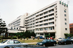 |

在民國六十幾年，台灣的醫療制度還不甚健全。朝天宮為了照顧北港及其附近地區民眾的健康，特別撙節開支籌建媽祖醫院。當時蔣故總統經國先生鼓勵民間創辦慈善醫療事業，中國醫藥學院董事長陳立夫於是接辦此未完工醫院，並在民國七十五年六月十五日完成全部興建工程正式開幕，名為「中國醫藥學院北港附設醫院」，就是地方所稱的「媽祖醫院」。
　媽祖醫院成立之初，為當時雲林與嘉義沿海一帶規模最大的醫療機構。目前地下一樓、地上七樓的建物中，共設急性病床200床、特殊病床82床，並包含有加護病房及護理之家。
　媽祖醫院創院之初，經營不易。但在歷任院長、副院長及全體員工努力下，已奠定良好的基礎。民國八十八年十月起，院長由中國醫藥學院台中附設醫院蔡長海院長兼任，北港與台中兩附設醫院合併營運。「媽祖醫院」既是大學附設教學醫院，又是富有宗教特質的醫院。其秉持以“病患為尊”的理念，在醫療服務上提供完善的醫療設備與優異的醫療人才，為偏遠地區民眾提供全面的醫療照護，並設有二十四小時全年無休的急診服務，包括沿海地區最缺乏的小兒科急診，可算是此區域的緊急醫療中心。
　鑑於當初建院時，雲嘉地區醫療資源缺乏，交通不便，民眾外傷轉院恐有延誤。這幾年來，媽祖醫院在骨科、神經外科及一般外傷的急救上特別重視。另外，針對老人特別容易罹患的糖尿病、高血壓、關節疼痛等也頗有研究。其中心臟科為九十多歲的老阿婆裝心臟節律器，骨科為九十五歲的老人更換人工關節，都是很成功的案例。中醫部門的設置，讓患者有更好的醫療選擇。
　媽祖醫院在衛生署的評鑑中屬於地區教學醫院，其中醫部提供教學，在全國醫院評鑑中排名第三。曾有土庫商工學生因為車禍被判定為植物人，經中醫部半年頭皮針灸，竟然慢慢恢復知覺，雖然不似常人靈活，但能走能說能思考，在醫學界被認為是一種奇蹟。 
　媽祖醫院提出其院景如下：

　一、醫療服務方面：
　　（一）整修院區硬體設備：提供病友、家屬、員工最佳醫療空間及工作環境。目前著力規畫呼吸照護病房，希望病人有全面的照護環境。
　　（二）增加診療科別：目前醫院提供十七個診療科別，未來將陸續提供更多的診療科別服務患者。為因應社區特性，某些科別門診都設在早上，下午進行中西合診、教學門診、衛教以及特別門診等，期望病患有更周全的醫療服務。
　　（三）增聘優秀醫師：增聘更多優秀專任主治醫師，以提供最佳服務。
　　（四）提昇醫療水準：藉台中附設醫院醫學中心品質，透過兩院合併提昇醫療水準。

　二、社區服務方面：
　　（一）配合衛生政策：參與社區醫療服務，支援鄉里基層保健照顧，推行社會醫學教育，灌輸民眾現代保健觀念。
　　（二）推展居家保健：對長期病患提供服務。能自行照顧者轉介居家護理，若照顧不便，則轉介至六樓的護理之家安養療護
　　（三）加強雙向轉診：配合基層醫療單位，以雙向轉診為目標提供轉診轉檢服務。

　三、教學研究方面：
　　（一）藉台中附設醫院改革經驗，全面推行教學改革計劃，以提高醫學生素養。
　　（二）學術資訊數位化，藉院內網路及網際網路，推廣遠距教學及會診。>br> 　　（三）增加研究空間，積極參與台中附設醫院的教學研究計劃。

　中國醫藥學院遷校到北港時，將成為院校合一的醫療環境，遠景很令人期待。另外，媽祖醫院擁有良好的義工制度，希望義工來源能夠擴展到社區中，號召更多人士加入義工行列。媽祖醫院需要社區人的認同，更希望扮演雲嘉地區民眾健康之「守護神」。

## 北港自來水廠

| 6-15 早年自來水廠 | 6-16 水塔位置圖 | 6-17 自來水廠氣曝塔 |
| ----------------- | ----------------- | ----------------- |
| 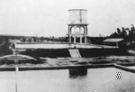 | 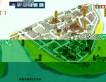 | 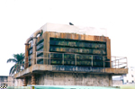 |

創辦於昭和四年的北港第一淨水廠，也就是俗稱的「水道頭」，至今有七十幾年的歷史。水廠基地面積1.28公頃，水塔高二十多公尺，蓄水量440公噸，供水人口達九千六百四十六戶。當年興建費用為廿四萬日圓，從昭和四年三月二十三日開工，到昭和五年五月三十日完工，北港自來水廠由當時的街長蘇顯藜所建，朝天宮資助經費。日文叫「水道」的自來水廠，在當時有最進步、最完善的設計，它引北港溪流水源，經沉澱、過濾、消毒後，以幫浦打上水塔，後送至每一住家，被稱為「水道水」。

　自來水廠的整體構造有如下幾部分：
　(1)水塔與辦公處：水塔分三層，三樓是圓柱體，上層為圓柱鋼筋混凝土之蓄水塔，並設有維修用之護欄，中、下層十角形構造物，每面開半圓拱形門窗，作為辦事處、會議 室及維護空間之用。
　(2)機房建築：鋼筋混凝土柱樑與磚造牆身結構，屋身有精彩清水磚構造，開窗分割與洗石子表面處理，有古典風格。
　(3)汲水口：位於北港溪之一側，形似體積較大之混凝土造深井，並有汲水管連結北港溪底，現今還保存得很好。
　(4)大型蓄水池：有四處蓄水池可作淨水處理，除一處用來儲存來自嘉義的水源外，其餘皆處於閒置狀況。
　(5)木造事務空間：水塔後方的水廠事務空間，為日治時期純木造建築物，現有頹圮現象。
　(6)木造員工宿舍：位於事務空間後側。
　(7)老樹與鳥類棲息地：入口處有縣登記43號的老樹一棵。高達數層樓，是鳥語啾啾的好休閒場所。

| 6-18 自來水公司北港營運所 | 6-19 弟二水源地 |
| ----------------- | ----------------- |
| 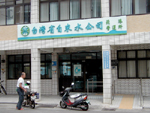 | 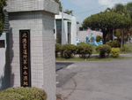 |

屬於自來水公司北港營運所的北港第一淨水廠，從從昭和七年啟用至八十六年十月二日全面停用，提供鎮民飲水服務達一甲子以上。後來因北港溪污染，加上擴建需要，乃於民國七十七年，在新街里闢第二淨水廠。鎮公所在第三次都市計畫檢討時，曾將水塔及周圍土地規劃為兒童樂園、住宅區等。但擁有地上權的自來水公司，卻希望以地易地，並補償五千萬經費。北港鎮公所乃結合地方文史團體將該地規劃成多元休閒空間，陳水扁總統曾親臨視察。民國九十一年，因「水道頭新桃源」文藝季活動的辦理，這片被遺忘的土地逐漸喚醒大家的記憶。自來水廠具有歷史、地標、美學價值，亦具鄉土教學、休閒及觀光功能，確實值得保存。
　第二淨水廠在北辰國小西南面，有大型的地下抽水機、過濾池、曝曬噴水池等設施，是負責供應北港地區的水源。淨水廠取用之水源以深水井為主，但因防止地層下陷，地下水受到管制，鎮內七口深水井每日出水量僅有6400立方公尺，另由元長七口深水井供應10500立方公尺，新港每日亦輸送6500立方公尺至第一淨水廠的清水池，再由三台幫浦輸送至鎮內用戶，才勉強解決高達兩萬餘立方公尺的用水量。目前自來水公司在林內興建淨水廠，並埋設巨型管線配送各鄉鎮，以解決民生用水問題。
　
## 北港公園

| 6-20 北港公園 | 6-21 早年公園中的神社 | 6-22 浩氣凌霄之牌樓 |
| ----------------- | ----------------- | ----------------- |
| 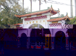 |  | 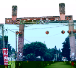 |

北港公園是位於文化路、太平路、成功路、北辰路和民治路之間的區域。日據時代，公園面積廣大，林木高大茂密，現今北港高中也是當時公園的一部分。日本人在昭和8年（1933）於公園內建有神社，光復後命名為「中山公園」，後來公園重新整建，改稱為北港運動公園。
　北港溪溪水所挾帶的泥沙很多，在長年風積之下，在溪旁堆積成大沙丘，這些沙丘，台語稱為「沙崙仔」。北港鎮文化路底和太平路一帶，以前就是典型的「沙崙仔」。「沙崙仔」由北港鎮第四屆鎮長蔡科的祖先（青陽蔡姓）最先開墾。
　日大正9年，當時北港街長蘇顯藜，強制徵收土地闢建公園。當時私有土地子孫均獲取補償金，蔡裕斛被徵收三甲多，其子孫領取最多。
　據老一輩表示：北港的「沙崙仔」原有三個，分為「前崙」（頭前崙）、「中崙」和「後崙」（後尾崙）。「前崙」在現今游泳池旁；「中崙」在北港高中附近；「後崙」則位於北港分局週遭。北港高中又名「沙岡」，就因為它位於「沙崙仔」的關係。北港農工的所在地，以前被稱為「沙崙仔腳」。
　日據時代在前崙建有神社，入口的牌樓前，有條稱為「死尾仔溪」的小溪。（現在公園路到新街沒有加蓋的大水溝，即是以前死尾仔溪的上游），溪上築有塗抹粉紅色小石子的拱橋，當地人稱「隱龜仔橋」。「死尾仔溪」流入北港溪，有水門相隔，以防北港溪水倒灌。
　從牌樓到神社兩旁有整排的石製宮燈，十分美觀。民國四十幾年時，因北港溪土堤太矮，常造成水患，「中崙」和「後崙」被剷平，沙土則被移去墊高堤防，以防水患。現在三十多歲以上的北港人，相信都還有到沙崙玩沙及捉（釣）沙鱉的回憶。民國七十幾年，建北港鎮立游泳池時，前崙也被剷平了，北港僅剩可玩耍的沙崙就正式走入歷史了。
　台灣光復後不久，日本神社入口牌樓被改為現在所見的雙十形狀牌樓，上書「浩氣凌霄」四字。大陸淪陷，國民政府遷台，許多外省人士跟隨政府到台灣，散居在全台各地。此時許多來自大陸的人士遷入中山公園內的文化路築屋而居，並命名為「克難新村」。另有人說，他們曾在公園文化路口立了上書「克難新村」的石牌，但被當地其他居民推倒。
　在反共抗俄時期到民國六十年代末，國軍常在各地舉行對抗演習，北港公園常被利用構築各種戰地工事，如散兵坑、戰車的堡壘…等。演習結束時，國軍弟兄會把公園恢復原狀才離開。
　現在北港公園依然是鎮民最好的休閒去處，公園內的遊戲設施不斷更新，民眾社團也不斷成立，各個社團各據一隅，各佔地盤，涼亭、鐵皮屋越蓋越多，還加上鐵捲門鎖上，讓公園共用共享的功能大打折扣，實在有待改善。
　
## 體育設施

北港公園又稱運動公園，是鎮民運動休憩的最佳場所。公園內寬敞的運動場，常被選為縣運及大型活動辦理地點。民國59年1、2月，第一屆「媽祖杯」棒球錦標賽和首屆「笨港杯」少年棒球賽，與民國60年3月的中部五縣市擴大慶祝第四十六屆童子軍節的聯合露營大會，都在公園舉行，十分熱鬧。當然此地也是舉辦縣運的好場地。
　除運動公園外，北港鎮的體泜設施尚有網球場與游泳池，及綜合體育館。鎮內各級學校的運動場所、館舍、設備等，都是社區民眾健身運動最好的資源。
　雲林縣立網球場建於民國五十六年，原稱鎮立北港網球場，有水泥球場四面及紅土球場三面。後來因配合區中運舉行，改為國際標準的富麗克球場，並正名為雲林縣立北港網球場，是熱愛網球運動者最佳運動場所。
　鎮立游泳池興建於民國七十四年，提供鎮民消暑的好去處。北港游泳協會會員不分冬夏，均在此晨泳。近年因SPA風行，鄰近鄉鎮及嘉義地區私人溫水游泳池紛紛設立，鎮游泳池的營運每況愈下；綜合體育館如何妥善規劃應用，凡此均值得主政者思考。
　
## 中華電信北港客戶服務中心

| 6-27 |
| ----------------- |
| 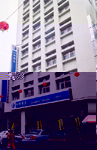 |

現稱「中華電信股份有限公司北港客戶服務中心」的原北港電信局成立於民國三十八年，民國七十年五月改隸台灣中區電信管理局。轄區涵蓋縣內北港、元長、口湖、四湖、水林五鄉鎮，同時跨越嘉義新港、六腳兩鄉部份村落。民國六十二年，人工電話改為自動電話，是電信史上的大事。電信局位於媽祖廟右後方，是棟七樓建築物。其機房則分設樹腳里和六腳鄉的崙陽村。
　民國八十五年，因交通部電信總局改制成立「中華電信股份有限公司」，北港電信局易為現名。主要業務包括固網通信、行動通信，以及數據通信三大領域，提供語音服務、專線電路、網際網路、寬頻上網、智慧型網路、虛擬網路、電子商務、企業整合服務，以及各類加值服務。
　由於ｅ化時代來臨，網際網路普及，電信局提供多元化服務網站，將電話號碼簿資料搬上網路，提供客戶電子信箱、連結客戶網站，讓大家不出門就可知天下事。原為獨占性的國營事業，這幾年因民營電信企業加入市場爭霸戰，連有線電視都搶食有限的大餅，電信局優勢不再，在客戶的服務上變得積極主動，也許這是走向民營化的好處吧！
　
## 郵局

| 6-28 |
| ----------------- |
|  |

北港郵局設在文化路，另有中山路和新興市場旁兩支局。郵局創設於明治三十年(1897)。在日據時代屬「特定局」。民國三十五年，改稱郵電局，業務含郵政及電信。爾後郵電分家，乃稱「郵局」。轄區曾包括北港、元長、四湖、水林、口湖等鄉鎮。民國九十一年四月十四日，因調整編制，位於文化路的北港郵局成為雲林郵局32支局；南陽郵局改為33支局；北辰郵局則是34支局。
　郵局業務從日據時代就開辦郵件、包裹、儲金、匯兌、壽險等，當年因壽險以強迫投保，業務績效頗可觀。現在儲金及壽險佔了大宗，投遞業務因「宅急便」、「宅配通」的搶攻，大受影響。目前郵局尚代理民間或政府委託之業務，如金銀幣買賣、高速公路回數票、火車票、壽險貸款及快遞、快捷業務，真是五花八門。

## 台灣省雲林水利會北港管理處

| 6-29 |
| ----------------- |
| 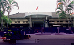 |

「台灣省雲林農田水利會北港管理處」位在公園路，一棟建於民國四十一年古色古香的建築裡。管理處創設於民國九年九月一日，原稱「公家共埤圳官田溪埤圳北港郡部」與行政官署「北港郡役」合署辦公。期間經十度易名，在民國七十六年正式定名「台灣省雲林農田水利會北港管理處」。
　鄭英物主任說：幾十年來，管理處負責北港、水林、口湖、四湖、元長五鄉鎮及土庫部分土地的灌溉、排水系統之管理，面積廣達22000公頃以上。管理處設有工務、管理、行政三股，下設十三個灌溉工作站和兩個水路工作站與十五個雨量站。另以每一百公頃為基準設置義務性服務組織「水利小組」，協助推動業務。至於排水系統以雨水、灌溉剩餘水及部分家庭畜牧工業廢水管理外，沿海防止海水倒灌的防潮水門管理、水污染管制都屬於其服務範圍。
　管理處事業灌溉區屬嘉南大圳之濁幹線末端，事業區域涵蓋四鄉二鎮。東南兩面毗鄰嘉南水利會嘉義、朴子兩管理處；西至台灣海峽；北鄰舊虎尾溪與虎尾區管理處相接，堪稱幅員廣大。主要灌溉水源引自濁水溪，但因水源不穩含沙量高，需配合地下水及利用迴歸水補助水源，區域內有22處補助水源和138口地下水井可補灌溉水源之不足。
　由於超抽地下水導致地層下陷嚴重，加上環保意識抬高，管理處特別加強地面水的有效使用，且嚴格控制地下井及補助水源，同時控管廢水之排洩，以落實灌溉水質管理趨於完善。但我們要特別呼籲：在農田水利工程上要兼顧生態保育和自然施工法，才能保持原有水源、確保水質和自然生態，為後代子孫留下耄好的生活空間。
　
## 雲林地方法院北港簡易法庭

| 6-30 |
| ----------------- |
|  |

雲林地方法院為了減輕北港地區民眾奔波之苦，特別設立簡易法庭審理案情較輕微的案件。
　位於北港糖廠用地內的簡易法庭，成立於民國八十五年。但實際受理業務早在民國七十二年以前，無償借用民眾服務社開始，初期以受理房屋公證為主。現在則涵蓋刑事、民事、小額訴訟等。刑事以酒醉駕車造成凶共危險罪；民事如新台幣五十萬元以下案件、支票、會款、匯票糾紛處理、小額訴訟、公證等。每週二上午為公證時間，除房屋業務，現在增加單身公證，讓單身男子可至異國尋求良緣。
　
## 北港老人會館

| 6-31 |
| ----------------- |
| 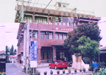 |

在北港鎮文化路246號的「北港老人會館」，是老人聚會的最好場所。北港老人會會員將近三千人，是鎮內社團之冠。成員定期在會館活動、開會、唱歌、下棋等，顯示北港老人的健康快樂。
　北港老人會館，除了老人會組織外，還有北港區殘障協會及居家保護協會、家扶中心等單位。三樓則設有笨港田園藝廊，文化局定期展覽各種藝術作品，提供鎮民藝術饗宴，笨港媽祖文教基金會辦公室也在此。北港老人會理事長鄭報說：歡迎各界到老人會館開會或做活動，讓老人會館變成ㄧ座快樂天堂。
　
## 北港金融機構

| 6-31-1 北港鎮金融機構分布圖 |
| ----------------- |
|  |

北港人口不多，但銀行卻特別多。早期有信用合作社、農會，後來陸續設置第一銀行、土地銀行、彰化銀行、台灣中小企業銀行、台南企業銀行、郵局、華僑銀行，九十年則新開萬泰銀行。十幾年前，資金還不充裕的年頭，北港銀行界為了朝天宮新春期間的香油錢存款，還要一番協調呢！(參表6-2 北港地區金融機構一覽表)

| 6-23 運動公園一角 | 6-24 體育館 | 6-25 游泳池 | 6-26 網球場 |
| ----------------- | ----------------- | ----------------- | ----------------- |
|  | 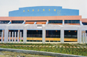 | 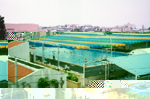 |  |
| 6-34 第一銀行 | 6-35 台南區中小企銀 | 6-36 台灣中小企銀 | 6-37 土地銀行 |
| 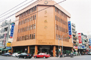 |  |  | 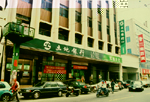 |
| 6-38 華僑銀行 | 6-39 彰化銀行 | 6-40 合作金庫銀行 | 6-41 萬通銀行 |
| 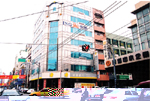 | 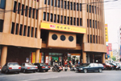 |  |  |

鎮內的文化路堪稱金融街，彰化銀行、第一銀行、華僑銀行、台灣中小企業銀行、郵局都在這條路上。民主路上有土地銀行、台南中小企銀及剛撤銷的僑銀分行，加上鄰近的合庫、農會、萬通銀行，方圓不到兩百公尺，就有如此多的金融機構，可見當年笨港的繁華程度。另惠民儲蓄互助社，是民間互助性的團體，扮演存款借貸的角色。
　日大正四年(1915)成立的北港信用組合，應該是本地最早的金融單位，就是光復後的北港農會。被華僑銀行合併的北港信用合作社則為民國十一(1936)年成立，前身是因應日本政府將舊市街改為新式街道，所需資金過於龐大，乃由北港士紳創設「保證責任台南洲北港建築信用購買利用組合」，後來易名為「北港信用建築合作社」，民國五十三年改為「雲林縣北港信用合作社」直至民國八十六年六月十四日在臨時會員代表大會中通過與華僑銀行合併，正式走入歷史。

## 北港鎮農會

| 6-32 北港鎮農會 | 6-33 日據之北港信用組合 | 
| ----------------- | ----------------- |
|  | 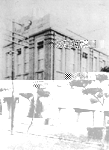 |

農會肇始於大正四年的「有限責任北港信用組合」，地址在北港郡北港街北港六二四番地之六。昭和16年(1941)易名為「保證責任北港信用販賣購買利用組合」ｘ至民國四十年三月二日變更為「雲林縣北港鎮農會」。其間曾陸續更名為「北港街農業會」「台南縣北港鎮合作社」「台南縣北港鎮農會」。會址先後從六二四番地遷至中正街六號，再遷到現址中正路廿號。
　農會設有會務股、信用部、供銷部、推廣股、保險部和好收辦事處等單位。會務股以辦理會員入會為主；信用部負責存放款、匯款、轉帳、自動提款、代理本鎮公庫、代售統一發票及印花、代收稅金及各種水電票據費等；供銷部供銷農藥、肥料、農特產品銷售及政府委託之稻穀經收、米糧加工等；推廣股負責農事、家政、四健推廣工作；保險部承辦農民健康保險、第三類健康保險、老農津貼等業務。

## 旅社

| 6-42 親和旅社 |
| ----------------- |
| 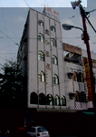 |

在交通不便的年代，要到北港進香、觀光都得大費周章。因為搭車轉車的勞頓往往就是個把天，所以鎮上供信徒、觀光客過夜住宿的客棧、旅社特別多。尤其是農曆一至三月的進香旺季，大型遊覽車載來一車車的遊客，如不早早預約，就得轉到嘉義縣市過夜了。早期旅社設想周到，還曾代辦朝拜媽祖的供品呢！
　北港這個蕞爾小鎮，因媽祖廟鼎盛的香火，帶來旺盛的人潮。因此含朝天宮興建的厚生、中秋、仁和三處香客大樓，就有十餘間旅社、飯店，可供行旅住宿，其中的蔡復興客棧已有百餘年歷史。朝天宮的香客大樓，旨在解決信徒住宿問題，非以營利為目的，故住宿費採隨喜添香油錢方式。在開自用車的旅客激增，既可住宿又能解決停車問題的汽車旅館，成為民眾另一種選擇。北港大橋彼端的意文大飯店，也可紓解住宿的需求。(參表6-3 北港鎮內旅館業一覽表)

| 6-43 朝天宮厚生大樓 | 6-44 朝天宮中秋大樓 | 6-44-1 朝天宮仁和大樓 | 
| ----------------- | ----------------- | ----------------- |
|  |  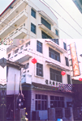 |  |

但隨著高速公路、快速道路陸續通行，交通時間縮短，住宿旅客驟減，曾是黃金行業的旅館業一下子掉進寒冬裡，難怪業者要問：旅館業的春天何時再來臨？

## 市場

| 6-45 |
| ----------------- |
|  |

北港先後成立四個傳統市場和果菜市場，最早是明治三十五年(1902)成立的中央市場，即第一市場，位於現今龍華富貴市；中央分市場成立於民國三十七年，後改稱第二市場，乃現在媽祖景觀大樓的樓下；民國四十九年成立的新興市場，又稱第三市場；民國五十八年成立示範市場，即第四市場，則是媽祖廟前的十餘戶店家，現龍華富貴市靠中山路的店面。第一、四市場，因火神肆虐改建，風貌全新。
　中央市場在民國七十七年的一場大火燒毀，目剋建好的龍華富貴市內雖規劃有攤位，但真正遷入營業的卻不多，以致這個陪伴北港人無數歲月的市場有沒落之虞。原本冷清的新興市場已有後來居上之勢。
　北港鎮果菜市場屬於北港鎮果菜市場股份有限公司，該公司前身為成立於民國四十五年的「北港鎮果菜市場」。數十年來，先後從仁和路、民生路遷至現在的大同路。清晨營業的果菜市場原以果菜批發為主，由於攤位及消費群眾轉向，流動攤販從建國國中綿延至民樂、大同兩路的交叉口，常造成人、車、攤販爭道險象環生的狀況，讓人捏把冷汗。
　至於成立於光復初期的北港鎮漁市場，早期設於中央市場內，後因業務擴增，搬至吉祥路。該市場在民國六十年以前，無論建築規模及業績都是西台灣的佼佼者。爾後因社會結構改變，交通日趨流暢，市場入不敷出，於民國七十四年奉令解散。
　夜市是近年來自發性的市集，攤販在固定的夜晚輪流在村里固定場所匯集成市，琳瑯滿目的攤位，販售食衣住行育樂等貨品，擁擠鑽動的人潮，不但刺激消費，帶來商機，逛夜市成為民眾忙碌生活的消遣之一。北港最早的夜市始於牛墟，也曾遷移至北港公園旁，亦曾在第二停車場營業一段時間，後因合法性問題移至同仁夜市。華勝路曾有短暫營業，可能因場地狹小停掉了 。

## 便利商店

| 6-46 便利商店 | 6-47 便利商店 | 
| ----------------- | ----------------- |
|  | 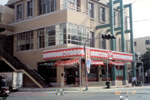 |

傳統的柑仔店，曾是柴米油鹽醬醋茶的供應站，也是各式零嘴的加油站。親切的老闆、應有盡有的貨色，不但滿足孩童的口腹之欲，也應付成人世界所需，連賒帳都口頭說一聲就算數，「柑仔店」將老闆與顧客間的信任發揮到極致。但便利商店卻已成為今天消費者最佳的選擇。年輕的消費群將敞亮、擺設整齊的便利超商當成生活中的一部份。廿四小時營業滿足不同生活型態者的需求，難怪年輕族群會說：「看到便利超商，心裡就湧起陣陣溫暖」。
　鎮上的便利商店以統一集團的7-eleven為主，目前共有四家，分布在民樂路、華勝路等地，這些以黃金三角窗地帶為營業點的超商，可看出經營者的用心與企業哲學。另外，全家、萊爾富等連鎖超商店亦陸續進駐本地，為鎮民的生活帶來了不少便利。最近台糖公司亦加入超商的行列，設立「蜜鄰」販賣台糖產品及一般的民生用品。
　
## 大賣場超市

| 6-48 | 6-49 | 
| ----------------- | ----------------- |
|  |  |

　貨色齊全、應有盡有，走一趟大賣場或超市，幾乎食衣住行育樂諸多問題都可以迎刃而解。這是許多人捨傳統柑仔店就超市大賣場的理由。早期的公教人員福利站、91年剛歇業的齊普超市、目前的省錢超市、機聯社、軍公教福利站等，都為北港人提供採購的便捷性。民國九十一年十二月開幕的台糖量販店，據說是雲嘉最大的賣場，許多小商店的生意將受一定程度影響。
　也許是「近廟欺神」，北港人期待已久的大型百貨公司慶光百貨，卻因鄉親捨近求遠到嘉義、台南、高雄、台中採購，不到一年就歇業。現主幼商場入主營業販賣服裝。

## 大同農場

| 6-50 大同農場 | 6-51 大同農場 | 
| ----------------- | ----------------- |
|  |  |

　大同農場在文仁路尾，以前稱「樹腳里阿兵哥農場」，現劃歸光復里。該農場因在大同社區附近，故稱「大同農場」，毗鄰新建的「雲林地方法院簡易法庭」。目前居住十餘戶人家，有菜刀業；有經營農場的，都是「退役授田榮譽軍人」的後代子孫。
　據丁鄰長說：祖父丁建國民國四十四年退除役。官兵授田時，分配十幾戶榮民到此經營，屬高雄農場第十五農莊，位於中埔農場（屬於北港糖廠）後面，是北港鎮唯一國軍退除役官兵「授田農場」。
　「大同農場」靠近樹腳里，卻屬光復里管轄，斜對面靠近光復里的介壽路卻屬於樹腳里，是北港戶政的一大奇蹟。

## 北港示範公墓

| 6-52 | 6-53 | 
| ----------------- | ----------------- |
|  |  |

在日據時代北港有兩大公墓，一為興化店，一為樹腳里。興化店早就被北港溪沖毀不留痕跡。目前的較大的公墓，有船頭埔、崙仔頂等地。另外有劉厝里附近的媽祖湖，好收、口庄鄰近的火燒塚及水尾溝都有公墓。東湖的鳥食麥、番溝、大北里的墳墓較稀少，可能是居民比較接受火葬的關係。
　溝皂公墓曾有飛機墜落，頗有一些穿鑿附會的說法，經過當地玄天上帝及永興宮（當地人說祖公廟）神明勸說，已成吉地。扶朝里、水埔里村莊都有公墓，看起來比較乾淨，但從墓碑堂號都可明白看出泉多漳少的現象。媽祖湖曾發現興化店的墳墓，有點奇怪。船頭埔有日據時代留下的「萬善同歸」一座，據說是建飛機路及拓寬時死亡的無主骨灰墳墓。
　從整體看來，因鎮民相信風水，公墓內安葬方向參差不齊，墓碑造型各異，塚墓大小不一，使公墓成為亂葬崗。公墓中都有土地公廟，船頭埔有安宅公，樹腳里有崙公廟；溝皂有永興宮等。 
　北港最大的示範公墓在府番里的三木康榔。環境清幽，花木扶疏，塚墓整齊，是座美麗的示範公閨。至今已完成ㄧ、二期工程，本區分甲、乙區，甲區包括納骨塔、停車場、管理所、涼亭、牌樓、廁所、墓區等，乙區則全為土葬區。目前基墓有六０三座，納骨塔有一六八０位。該公墓有一尊巨大的土地公，並有土地公廟，大金爐一座。
　目前百姓接受火葬程度頗高，因經濟又衛生，整理、祭拜均便利。本鎮應該改善喪葬習俗，發揮示範公墓的功能，免於鎮民奔波水林法輪寺、關仔嶺等納骨塔之苦。現慈德禪寺新建納骨塔，因環境清幽，頗受民眾肯定。