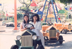
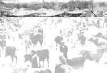
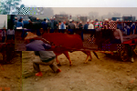
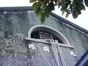
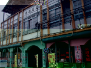
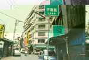

# 第二節 歷史設施
---

## 兒童樂園

| 6-54 兒童樂園 | 6-55 兒童樂園 |
| ----------------- | ----------------- |
|  |  |

北港曾經有座非常受小朋友喜愛的兒童樂園。園址在北港國中分部，曾是台南師範的分部。更早以前則是北港女子家政學校，也是日本子弟學校的所在地。
　北港兒童樂園，收費低廉，是鄰近鄉鎮及鎮內兒童假期最喜歡的場所。這裡的小火車、碰碰車、萬花球世界、迷陣等，都曾讓孩子玩得樂不思蜀。可能生意清淡或設備不足，營業兩三年就結束營業。當時的職員陳衍仁不勝唏噓的回憶：「如果增加設備，起碼不會那麼早關門。」
　這片土地後來被拍賣，原先的巴洛克式的建築物被拆，蓋起十幾層的大樓。除一般住戶，亞太慶光百貨公司進駐，本以為會為北港帶來商機，哪知短短年餘就關門大吉，令人徒呼奈何？
　
## 北港牛墟

以前台灣墾殖開拓年代，耕田、旅遊、結婚、榨蔗、汲水等，無不仰賴牛隻。因此，牛跟農村生活息息相關，整個農村文化等於牛的文化。由於農人求牛殷切，牛隻日增，因此我國最原始的「牛」交易市場，就形成「牛墟」。
　「牛墟」的墟既是商販雲集且熱鬧之場所，亦是荒廢之處。牛墟從昔日牛販群集、交易熱絡的榮景，隨著科技進步、農村型態改變、農業機械化的影響，變成攤販聚集之地，已失去牛隻買賣的功能。北港牛墟，突顯北港在農業時代蓬勃發展的歲月，也說明農業社會轉型的脈絡。北港牛墟從興盛趨向沒落，正是一部最寫實的農業興衰史。

| 6-57 昔日熱絡的牛墟 | 6-58 琳瑯滿目的牛具 |
| ----------------- | ----------------- |
|  |  |

　台灣牛墟，在日據時代初期或清治時期就有。到昭和六年（1931）據官方統計全台共有八十四處牛墟。至民國六十年，全台尚有鹽水、寶斗、岡山、善化、屏東、北港等地。如今農村機械化，牛需求量日益減少，牛墟日漸式微，只剩北港、善化、鹽水三處。它們各有規定：每逢陽曆一、四、七日在鹽水，二、五、八日在善化，三、六、九日在北港，逢十則休假。如牛墟日又逢例假日，為之「大日」，牛墟市場熱鬧的景況會更勝於他日。
　其中又以北港牛墟牛隻的交易量最多，其他兩處加起來不及北港的十分之一。農民、牛販在牛墟從事牛隻、牛具、牛車、農產等買賣，牛販也承襲內地的牛經知能，有相牛、鑑別的能力，以獲取更多的利潤。
　北港牛墟在清朝及日據時代，設在北港第一水源溪埔地，後遷至北港大橋東邊，兩處都設有牛灶。岐國六十八年移至北港大橋西側溪埔地。清治及日據時代，每天交易量約三百頭。民國五、六十年代是北港牛墟鼎盛時期，現在卻見不到牛隻的影子，僅留流動攤販定期販賣各種用品器物罷了！牛墟地攤與牛販都需每天向鎮公所繳二十元清潔費。地攤貨物林林總總，西藥、中藥材、手錶、牛具、茶葉、二手貨等都有，因為一般商店不賣農具，買農具一定要到牛墟。
　牛的交易量以九月至年底為大月，因為甘蔗採收期牛隻需求量最多的緣故。
　在牛墟交易中，以黃牛最貴，水牛約便宜五、六千元，肉用牛、病牛端看肉量多寡而定，每隻約三萬元。內行牛販一看肉牛即知多少乾肉（未灌水），灌水牛每隻可多至六十公斤，買到灌水牛肉，一煮就會縮水失重。
　牛要買賣前，牛販把牛牽至溪旁刷洗，水牛則塗上一層灰黑溪泥後再洗掉，毛色可光滑無比。黃牛則掛上鈴鐺，讓他走路，搖搖「聲」姿。牛經過化妝，再去牛墟賣，行情較有看頭。 
　昔時牛販於牛隻交易時有密碼，每個數字皆有代語，外人不易了解：如一「建」、二「奈」、三「章」、四「士」、五「馬」、六「未」、七「慎」、八「酉」、九「術」、十「磕」、百「鼓」、千「鑼」、萬「刀」，現在牛販已少用，買賣時雙方兩手互握，以手指在彼此掌心指劃一番。因為時間就是金錢，所以買賣過程比較直截了當，當面談價，當雙方價錢談不攏時，會加大嗓門，近似吵架，其實他們希望有人圍過來，權當中間人，看起來很有趣，很有人情味。
　所謂「內行人看試步，外行人看熱鬧」，是指買賣耕牛觀察外貌外，還得經過三關－試步、摸壽、試腳力、拉力的考驗（鑑定）：

一、試步：
　乏人牽牛走三圈，有經驗的牛販，只看牠走幾步，就可知這頭牛是否勤快、溫馴、敏捷；如果主人要打罵才走走停停，一定是懶牛，或未經過訓練之役用牛。經此試步觀察，牛販再看是否胸臀廣闊、背腰堅實、骨骼粗大、體大而圓、體重下垂、眼珠明亮、肌肉有彈性，就知道這頭牛能否擔當耕田載運大責。

　二、摸壽：
　摸壽即摸齒看齒數齒色。牛齒左右對稱，成年牛下顎左右各有十顆，上無切齒，其他左右各六顆，合計三十二顆。正常發育的成牛下顎切齒八枚，稱「牛公」，十齒稱「牛王」，最受歡迎的是「牛王」。齒色隨年齡磨損而成黃色，齒間隨年齡加大，所以牛販亦可從牛齒成長磨損、顏色來鑑別牛齡。

　三、試腳力與拉力：

| 6-59 拉力大考驗 |
| ----------------- |
|  |

　賣主以四十元，租用兩輛牛車相連，車輪用繩子綁死，賣主為表示牛的腳力、拉力皆夠，會拜託周遭牛販上坐，主人在旁斥喝舉鞭抽打，要牛拉動，有些牛隻腳力不夠，拖不了幾步尿屎皆流，牛鼻也拉得鮮血直冒，甚至前腳發軟，跪下無法拖動，這時牛主人知道考驗無法過關，只好失望牽著牛，默默的離開。
　在台灣，由於牛對農民的貢獻，所以農家對牛既尊重又依戀，普遍認為牛有靈性，他們以不吃牛肉表示對牛的敬謝之意。

## 戲院

戲院是娛樂事業，也是文明的象徵。北港這小小的古鎮，曾先後開設北港、大復、振興、國賓四間大戲院。北港和大復兩間戲院建於日據時代，振興和國賓則建於台灣光復以後。這些戲院曾有一段風光無比的歲月，直到六、七十年代，因受電視業發達的衝擊，都難逃結束營業的命運。現代北港的年輕人，很難想像當時戲院的盛況吧！。

### 北港戲院

| 6-60 |
| ----------------- |
|  |

民國26年新街蔡裕斛投資五萬日圓，約等於現在兩甲田地價值之經費創建，是當時嘉南地區最大的戲院。整體建築以巴洛克式模樣呈現，舞台有三層，自動上下升降的布幕，有旋轉舞台設施。主要以演電影為主，當時主要經辦人蔡啟東不惜重金放映第一輪影片，不然就聘請著名的歌劇團、新劇團或明星登台，曾一度成為嘉南地區最賣座的電影院。 
　民國七十七年結束營業，轉賣給蘇姓老闆，改為超級市場及西餐廳，現為洗腎中心及撞球場。這棟古老建築物，縣府曾有意開發成為南台灣「影像博物館」，由文建會推動電影保存，然戲院限於租約只好作罷！
　
### 大復戲院

| 6-61 |
| ----------------- |
|  |

大復戲院是北港第一家戲院，又叫「北港座」，院址在博愛路。名氣不如北港、振興兩戲院。當時由龔家經營，大部以演歌仔戲、新戲劇、布袋戲為主。但因舞台比較高，放映電影比較少，口碑沒有那麼好。目前仍保有一台電影播放機器。建物結構堅固，雖歷史悠久且經九二一地震，仍屹立不動。大復戲院結束經營後，曾改為卡拉OK及西餐廳。

### 振興戲院

| 6-62 |
| ----------------- |
|  |

振興戲院在中山路，本來是高姓家族經營的商店，寬達六間，是北港最大的商店。光復後改為振興戲院，還是由高顯醮主持。因為矗立馬路旁，又在市中心，觀看電影方便叫座，且因觀眾年紀較長，另設有閩南語旁白，很有人情味。該院七十六年末結束經營，許多長輩仍懷念不已。(照片參閱5-14振興戲院)

### 國賓戲院

| 6-62-1 |
| ----------------- |
|  |

國賓戲院由蔡春長所建，位於新市場附近，現已經剷平改建成「金北港」大樓商店。據一些耆老說，這家戲院原有其他用途，後來才更改為電影院。裡面設備較差，生意也較蕭條，因地勢較低，常遇雨成災。但由於是新建築物，有些人還是挺喜歡，後來改名為國宮戲院。
　北港這小地方，就有四間戲院，可知居民教育程度和生活水準頗高，現在除了國賓（國宮）戲院外，其餘戲院外觀猶在，若居民善用這些空間，或許能開創社區新風貌，為北港帶來新願景呢！

## 海岸巡防總局 嘉義東石訓練大隊北港中隊

| 6-63 |
| ----------------- |
|  |

從民樂路經萬有紙廠往四湖路上，有棟非常不起眼的建築，目前屬於「行政院海岸巡防署」。民國七十四年，則為陸軍海防部隊的一部份。民國八十一年，「海岸巡防司令部」成立，該單位是國防部「四二大隊之新兵集訓中隊」。
　民國八十九年一月廿八日，政府為順應世界潮流、解決海防積弊，將國防部海岸巡防司令部、內政部警政署水上警察局、財政部關稅總局緝私艦艇等單位合併成立「行政院海岸巡防署」，專責我國海岸巡防工作。目的在維護海域及海岸秩序，確保人民生命及財產安全。初期以查緝走私、偷渡等為主軸，中長期則以確保海域、海岸秩序及海洋資源生態之保護為目標。
　「北港中隊」以執行船隻安檢工作為主。這個單位隸屬「海岸巡防總局中部地區巡防局岸巡第四總隊」新進海巡人員由嘉義東石訓練大隊管轄。現在北港中隊人員已調回訓練大隊，營區交由岸巡四二大隊保管，目前空置中。