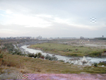

## 第四節 北港溪
---

北港溪發源於阿里山山脈西麓古坑鄉樟湖山，距刈菜園約一公里。以前上游集水區與濁爪溪相鄰，兩溪在林內相遇，濁水溪洪水氾濫滿溢，就藉北港溪疏導部分洪水，造成台灣中西部水災（俗稱北港溪出黑水）。如嘉慶間、道光初，笨港大水患即是。那時曾造成居民遷徙麻園寮，及另建新街的狀況。

　自從公元1912年，興建林內一、二號堤防，北港溪就跟濁水溪水完全隔絕，自成水系。沿途匯集石牛溪、大湖口溪、三疊溪、石榴班溪、崙子溪、倒孔山溪等溪，流長82公里。流經雲嘉19鄉鎮，於口湖鄉下湖口、台子村出海。

| 1-16 北港溪 | 1-17 洪水高漲的北港溪 |
| ------------------ | ------------------ |
|  |  |

北港溪沿途河床標高都在一百公尺以下，故中段淤積十分嚴重，土質鬆軟，水道曲折，因此水路常改道。像乾隆、嘉慶、咸豐、民初發生的水患，都是如此。民國四十八年的八七水災，使笨南港再度受創，導致遷村。近幾年，防洪設施日漸完善，始未發生嚴重水災。

　北港溪流域面積達六百四十五平方公里，上游稱海豐崙溪，中游稱虎尾溪。源頭在古坑鄉荷包厝，稱為尖山坑溪 （參圖 1-18 北港溪流域圖、表1-2 北港溪小檔案）。

　最近上游地區之山坡地過度開發，山坡上之原生植物及地表覆蓋物被砍伐殆盡，改植孟宗竹、檳榔及荔枝等農作物。在長期耕作，加上整地改種農作物時，並未做好水土保持工程，導致大量土石隨著雨水及灌溉用水流入溪中及上游支流，造成北港溪水質濁度過高。上游受莿桐、斗六地區製紙業、工業…污水之影響，使下游水質更惡化。民眾任意在河堤岸邊棄置垃圾、醫療廢棄物，或盜採砂石，加重北港溪的負荷。

　現在北港溪原貌盡失，滿目瘡夷，亟待整治。北港溪水源，提供灌溉用水、工業所需冷卻用水，以及流域內四十萬人每天生活用水，北港溪是雲林縣生命之河，然而如此污染，民生將何以堪？

　二十多年前的北港溪，水質清澈，魚水成群，人們成群結隊到溪邊玩水，「摸蜊仔兼洗褲」的情景，都已成為中老年人美好的回憶。　

　近年來，北港溪污染在台省二十一條主要河川中，經常名列前茅。我們該如何解救北港溪已成為重要課題。
