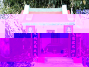
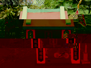
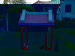
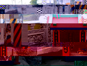
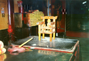

# 第五節 傳統的宗教儀式
---

## 安營調營按部就班來

一般五營安放，都在廟宇落成或安座大典之後舉行。四轎輦或童乩，通常就是踏字勘地、方位辨識的主導角色。發輦後，勒令「舞龍清靜，幾奉安兵」，擇地放營釘、竹符、令旗，各方元帥開始領兵鎮守壓煞，標榜「五營神兵在此，邪魔歪道莫入」之意。
　放營之後，嚴禁閒人等靠近，不可觸摸或遷動，以免冒犯神明。重整營寨，換竹符、令旗要在一年後，時間多選在主神誕辰午後舉行，由童乩、或手轎或四轎指揮，較正式，還迎請「紅頭仔」主持，不像目前「釘竹符」簡化至十數個「常人」就可完成。
　五營神兵，雖有壓煞驅邪的能力和任務，但卻不能任意出兵征戰。動用神兵，一定要有主神口諭，另則需透過法師或童乩的「調營」，調營的意義則皆不外乎借自然神力，以抒展自己的不安或增強信心。以下抄錄「紅頭仔」常用的「調營神咒」。
　
### 調東營神咒

| 2-79 東營 |
| ----------------- |
|  |

一聲法鼓熱鬧紛紛，拜請東營軍東營將，
　東營軍馬九夷軍，九夷軍九千九萬人，
　人人頭戴大帽身穿甲，手舉金鎗青令旗，
　火炎光，火炎明，請到座，軍馬到挑軍，
　走馬到壇來，到壇來，神兵火急如律令。
　
### 調南營神咒

| 2-80 南營 |
| ----------------- |
|  |

二聲法鼓熱鬧紛紛，拜請南營軍南營將，
　南營軍馬八蠻軍，八蠻軍八千八萬人，
　人人頭戴大帽身穿甲，手舉金鎗紅令旗，
　火炎光，火炎明，請到座，軍馬到挑軍，
　走馬到壇來，到壇來，神兵火急如律令。（本句三稱）

### 調西營神咒

| 2-81 西營 |
| ----------------- |
|  |

三聲法鼓熱鬧紛紛，拜請西營軍西營將，
　西營軍馬六戎軍，六戎軍六千六萬人，
　人人頭戴大帽身穿甲，手舉金鎗白令旗，
　火炎光，火炎明，請到座，軍馬到挑軍，
　走馬到壇來，到壇來，神兵火急如律令。

### 調北營神咒

| 2-82 北營 |
| ----------------- |
|  |

四聲法鼓熱鬧紛紛，拜請北營軍北營將，
　北營軍馬五狄軍，五狄軍五千五萬人，
　人人頭戴大帽身穿甲，手舉金鎗黑令旗，
　火炎光，火炎明，請到座，軍馬到挑軍，
　走馬到壇來，到壇來，神兵火急如律令。

### 調中營神咒

| 2-83 中營 |
| ----------------- |
|  |

五聲法鼓熱鬧紛紛，拜請中營軍中營將，
　中營軍馬三秦軍，三秦軍三千三萬人，
　人人頭戴大帽身穿甲，手舉金鎗黃令旗，
　火炎光，火炎明，請到座，軍馬到挑軍，
　走馬到壇來，到壇來，神兵火急如律令。（本句三稱）

　東營姓張將軍，青面青令旗；
　南營姓蕭將軍，紅面紅令旗；
　西營姓劉將軍，白面白令旗；
　北營姓連將軍，黑面黑令旗；
　中營姓李將軍，黃面黃令旗；

### 調五營總咒

旗鼓香爐通三壇，一聲法鼓鬧紛紛，
　二聲法鼓透地鳳，吾帶明鑼天地動，
　焚香走馬到壇前，調起東營軍西營將，
　調起南營軍北營將，中營軍五營將，
　調起五營兵馬，點兵加點將，
　飛雲走馬到壇前，挑兵走馬到壇前
　神兵火急如律令。急急如律令(本句三稱)

### 發五營兵咒

謹請祖師急急發兵出，祖師急急發兵打；
　發兵並發伏符，發去東營軍西營將
　南營軍北營將，中營軍五營將，
　五營兵馬點兵加點將，兵先發，馬先催，
　扶隨弟子腳踏五營房門草扇開
　驅陰辟邪救良民，神兵火急如律令（本句三稱）

　農曆七月，五營神兵本應「休假」收兵，但主神神格不同，又有差異，「硬性神明」如諸姓王爺一定要收兵，以避免和出鬼門關的「好兄弟」起衝突。收兵時，廟宅皆取下馬草水，外營不燒香，內營五旗暫捆一束。但「非命厲鬼」等不收兵，因其係半陰陽身份，不受約束。五營神兵目的在於保衛地方平安，祂造型簡陋但象徵千軍萬馬的神力，給居民多少安全感。從歷史角度來看也實在有一番情趣和意義。

## 關輦轎

| 2-84 輦轎 |
| ----------------- |
|  |

北港地區有些廟宇會透過在「關輦轎」，求神明指點迷津，其中以王爺廟居多。其他如三山國王、玄天上帝、五福大帝也有。關輦轎，需透過「桌頭」翻譯，所以稱「啞口仔轎」。 
　關輦轎儀式中，除了「桌頭」是專職人員外，其他轎伕都是臨時由鄰居或同庄參與宗教事物者擔任。但並非所有轎伕都會「起童」，真正「身不由己」大概只有一個。 
關轎仔，大都在黃昏或晚上。關轎前幾天，廟方爐主、主事或宅地信徒，要先把神明請來安奉在神壇或供桌上，早晚祭以清香、四果，並在焚香祈拜時，告訴神明所求何事及目的，以便神明瞭解原委、仔細調查與思考對策。如屬「內發性」行為，晝夜都可能發生，但以定期的廟會或神明誕辰為主。關轎仔是否成功，端看事情輕重程度，從一兩個時辰到半天都有。小事如問病、祈安，大事如「裝金身」、「踏廟地」等。
　關轎仔要以紅布條將守護神金身繫在轎椅上，或其令牌、香爐、法器亦可，插上三炷香，有時並安以符籙。「乩手」和轎伕各就其位，鼓手與銅鑼手敲打乍聽單調卻富變化萬端的節奏，「桌頭」在旁燒金紙、念禱詞，甚至吹號角，有時以鞭炮助興，祈求神明降臨。
　隨著鑼鼓節奏加快和音量的增高，本來酣睡的「乩手」，如果逐漸搖頭、抖動起來，表示神明已經降臨了，「乩手」動作由小而大，速度由慢而快，轉眼間，如一頭野性大發的醒獅般飛奔、狂舞。此時的「乩手」早已渾身發抖，神智模糊，處於朦朧狀態中；其他的轎伕則清醒如常配合「乩手」的動作而已。
　經過短暫熱身運動，滿頭汗水的轎伕，扛（抬）著輦轎以轎之右腳，結結實實往案桌「碰」一聲，鑼鼓聲立刻停頓，輦轎仔就在案桌墊板上移動，輪到「桌頭」上場。桌頭問「何方神聖」降臨，手轎仔會以案頭猛敲一下或不作聲響，答覆正確與否。然後「乩手」以圈打、點、畫等動作示意，桌頭以三、兩語解說神意。其間信徒可透過「桌頭」，臨時要求神明答覆相關問題或指示迷津，有時直接說出所求所願，如村里捉鬼。這時跳躍中的「輦轎仔」會衝到「不平靜」處尋找，有時突然衝下水或凶地，如輦轎大跳特跳，表示鬼捉到了，這時就放鞭炮助興。
　關轎結束前，乩手會上下抖動或左右搖晃輦轎仔，最後用力一頓，「輦轎仔」即刻停止。在整個過程中，「桌頭」是關轎仔的靈魂人物，其次是「乩手」，在斷斷續續一來一往的問答中，桌頭借附神發跳的輦轎之「公信力」來作判示，和解決信仰問題的依據。
