## 第四節　北港遶境陣頭介紹
---

### 路關牌

| 3-28 路關牌 | 3-29 路關牌與大燈 |
| ------------------ | ------------------ |
| 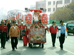 | 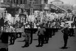 |

路關牌位於整個出巡行列的最前鋒，牌上面書寫著出巡的路線。所有的遶境隊伍要依據路關牌上的路關出巡。北港媽祖出巡的路關牌，在長方形木框鑲上玻璃製作而成，遶境時由專人持拿。根據民國五十四年文獻的記載：當時的路關牌是以竹和玻璃紙作成，上畫虎頭，牌上並未寫明遶境路程，內裝置有花朵，與普通路關迥異。現在的路關牌則置於手推車上，由人推著行進，牌子內貼路關，前置香案，兩旁各置一支鼓仔燈。

### 大燈

| 3-30 媽祖繞境大燈車 |
| ------------------ |
|  |

北港媽祖出巡的前鋒陣有近百個大燈，每兩個大燈成一對，每一對大燈代表一個團體參加出巡，燈上書寫著各行會團體的古老名稱（燈號）及其奉祀的主神。但此陣頭僅限於神明會及郊、舖戶的大燈，一般文武陣頭的大燈並沒有排在其中。以往每個大燈都要雇請一個人拿，有多少個大燈，就要雇請多少人。現在為了節省金錢，製作推車，每輛車上可插六支大燈，省錢又省人力。
　簡單的說，「燈號」就是指團體的稱號，參加媽祖遶境的舖會燈號，列舉部分如下，以供參考：金豐順（菜舖）、金海順（魚舖）、金隆順（紙箔舖）、金珍順（青果舖）、誠心順（點心舖）、金清珍（餅舖）、金長順（麵線舖）、元本善（藥郊）、金福順（檳榔舖）、金寶順（米舖）、金安順（西藥商）、金百順（百貨郊）、駐鞍莊（旅社、餐廳業）、金珍順（豆干舖）、海山珍（醬油舖）、金慶順（布郊）、金興順（雜貨店）、金毫順（電器商）、金義順（屠戶）、金通順（汽車運輸舖）。
　
### 報馬仔

| 3-31 報馬仔（蔡世昌、蘇棋源、林朝雄） | 3-32 報馬仔道具服裝 | 3-33 報馬仔陳義泉 |
| ------------------ | ------------------ | ------------------ |
|  |  | 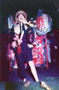 |

報馬仔是媽祖出巡遶境的先鋒官，走在隊伍前端開道，遊行中途則是機動服務、連繫，其裝扮特殊，常是記者、民俗愛好學者捕捉的焦點人物。
　據說早期笨港「報馬仔」是許願而來：如祈求媽祖庇佑家人病癒或平安等如願，在駕前為媽祖服務，是義務職，也是神職。報馬仔類似軍中的斥候或放哨、偵察、刺探敵情的人，在本省歌仔戲或布袋戲中常直呼為「報馬仔」，但也有稱為「探馬」。
　清代及民初，北港報馬仔的裝扮就像平民百姓所穿服裝，頭戴斗笠，腳穿草鞋，身穿台灣黑色對襟上衣及長褲，手裡提著一面鑼，比今日報馬仔所提的鑼稍大些。日據時代，腰掛喇叭形傳聲筒。當媽袓即將出巡至某街道時，報馬仔必先至該街之街頭或街尾、十字路口，提起銅鑼敲打，拉大嗓子或拿起傳聲筒：「恁大家呀！媽祖這陣在○○街，馬上巡到這裏來，請大家披在外口的衫褲趕緊收入厝內，準備香案桌，點香領接聖駕──。」
　現在北港報馬仔之裝扮配備，是民國四十五年，由曾任北港朝天宮委員的蔡川精心設計。因當時報馬仔蔡老虎過世，蔡川鼓勵陳義泉繼承衣缽，設計一套報馬仔道具及服裝送給陳義泉，並告知其意涵，報馬仔從此有新風格。陳義泉先後於六十年傳給葉大順、陳萬得（再傳李富盛），八十六年傳授蔡世昌、蘇棋源。
　北港報馬仔裝備相當突出，身穿黑色台灣對襟上衣，上下鈕扣錯扣，外層反穿一件羊皮襖背心（原有羊毛一面穿在內），黑色台灣長褲；褲管一上捲近膝蓋，小腿可見有瘡疤一、二處，腳穿草鞋，另一褲管不上捲，但赤足。頭戴清官兵紅纓帽，留長辮。左肩挑一支特製未張開長柄紙雨傘，柄上依序前端（肩前）懸掛一面銅鑼，鑼心漆紅色；傘柄末端（肩後）懸掛錫壺一只，豬腳一隻，韭菜一束；韭菜及豬腳以紅紙箍一圈，並以紅棉繩繫掛在傘柄上。右手拿鑼槌，嘴上留一燕尾鬚（八字鬍鬚），眼戴一副無鏡片老花眼鏡，腰纏繞一布束腰帶，上插一支旱煙桿，桿上繫一繡花煙袋，造形深具地方特色，也蘊含人生哲理。
　笨港報馬仔裝配其文化意涵和精神，可由下列幾句來總括：

1. 認清本份，負責盡職。（紅纓帽）
2. 言而有信，始終如一。（燕尾鬚、髮辮）
3. 世事晦暗，明辨是非。（眼鏡）
4. 忍受煎熬，出人頭地。（羊襖）
5. 正直語善，長長久久。（兩傘、韭菜）
6. 感恩惜福，社會和諧。（旱煙桿、煙袋、錫壺）
7. 知足常樂，心平氣和。（豬足）
8. 勞心勞力，成功在望。（鑼心）
9. 人生坎坷，記取教訓。（瘡疤）
10. 腳踏實地，善留形象。（赤足）
11. 欣然服務，不計酬報。（衫褲）
12. 代代相傳，長祐安寧。（煙袋、腳趾）

　據本地耆老回憶：陳義泉之前的「報馬仔」為蔡老虎，往上推溯為九十歲尚為聖母服務的柯科，再上推已不可考。陳義泉出任報馬仔共三十年，接替的阿憨和陳萬得因媽祖完成其心願，志願擔任駕前先鋒。目前阿憨已過世，陳萬得擔任二十五年，現因中風無法上陣，已過世的陳義泉曾在八十歲的高齡最後出陣。三位「報馬仔」陸續凋零，笨港文化會館為了傳承傳統，由陳義泉擲筊，獲媽祖同意交棒，於民國八十六年五月十二日晚，由會員逐一在媽祖神像剋擲筊，經「神意」擇定蔡世昌、蘇棋源二人，至此報馬仔才得以繼續傳承。
　北港報馬仔其文化意涵重於實質意義。報馬仔看似地位卑微，但其負有教化、開道、勸導、引導、傳達、協尋、為友廟進香活動服務之功能。特別要一提的是，北港報馬仔的造型，自陳義泉改革後，成為各地競相模倣的對象。
　陳義泉從民國五十九年，經大甲媽同意擔任往北港進香出廟時的駕前先鋒，並在北港引領入廟，直到民國七十七年大甲媽轉往新港後終止。現在大甲媽駕前的報馬仔由大甲人自扮，但造型仍延襲自北港報馬仔。
　
### 南管、北管和樂團

媽祖遶境時的音樂陣頭，大約可分成南管陣、北管陣和西樂團三類。
　南管是以洞簫、琵琶、二弦、三弦、拍板和噯仔（小嗩吶）等十多種樂器組成，樂曲悠雅婉約、纏綿柔和。北港較早的南管樂團是「集斌社」（1747）和「武城閣」，都有百年以上的歷史，爾後陸續成立「集英社」、「南華閣」、「集賢閣」、「錦樂社」、「新街錦陞社」等，但現在已漸漸沒落。

| 3-34 昔日集斌社之演出 | 3-35 昔日集斌社之演出 | 3-36 目前的集斌社 |
| ------------------ | ------------------ | ------------------ |
| 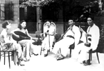 | 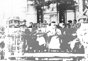 |  |

的「金聲順開路鼓」）等，後來成立了「聖震聲開路鼓」、「振樂社」（以前有高蹺表演）等。
　北港的西樂團有「新協社」（北港樂團的前身）、麗聲樂團、新生樂團、b#輕樂團。在媽祖遶境活動中，當年的南北管樂團和龍隊、獅陣，新協社在遊行隊伍中，特別顯眼和新鮮，頗受鄉親好評。

| 3-37 北港樂團 | 3-37-1 振樂社 |
| ------------------ | ------------------ |
| 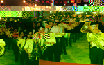 |  |

### 開路鼓 金聲順開路鼓和聖震聲駕前開路鼓

依照傳統，媽祖出巡的聖駕前有「迴避、肅靜」等執事牌及鑾駕儀隊（七十二隊），在鑾駕最前面必有鑼鼓隊，敲鑼打鼓以為前導，以巨大鑼鼓聲宣示媽祖聖駕到了，民眾聞聲不但迴避讓路，且會擺香案迎接膜拜。這支前導的鑼鼓隊，民間稱謂「開路大鼓」或「開路鼓」，意為媽祖聖駕前導開路的鑼鼓隊。
　北港這支鑼鼓隊，最初以民眾稱謂的「開路鼓」為隊名，是媽祖出巡時不可或缺的隊伍，隸屬於朝天宮。
　清同治五年（1865）楊添丁、蔡宣德、蔡老慶、王如山及蔣馬來等開路鼓先賢認為，開路鼓應比照抬媽祖神轎的轎班會一樣，年年有集會，用擲筊方式擇定值年爐主，於是奉祀唐玄宗時之「霓棠羽衣曲」及精通各種樂器的田都元帥為祖師爺，並將開路鼓隊命名為「北港路關鼓」，仍隸屬於朝天宮。
　「北港路關鼓」演奏由田都元帥所譜之曲如一江風、玉芙蓉、大瓶爵、東華福星及月眉詞等樂曲，因鼓聲雄壯渾厚有力，嗩吶聲響亮節拍分明，大小銅鈸和大鑼聲響亮震天，為遶境隊伍增添了莊嚴、雄偉、熱鬧的氣氛，是迎神、酬神、廟會中不可缺少的樂陣。
　

| 3-38 金聲順開路鼓 | 3-39 開路鼓隊 |
| ------------------ | ------------------ |
|  |  |

清宣統三年(1911)朝天宮管理人蔡然標秀才，認為擁有一百多年歷史的開路鼓，命名「北港路關鼓」似缺文雅，且無法表現聲震金闕的雄威，乃易名為「北港金聲順開路鼓」，此名獲得團員支持，他並為「北港金聲順開路鼓」寫對聯，橫聯為「金鼓威聲開路順」，直聯為「聲金振玉明條理，順韻喧音有始終」。團員李坤、楊土墻，楊定等人為不辜負蔡秀才的用心，並為培植後起之秀，於是招募團員二十餘人開班傳藝，由李坤等人利用夜間在彌陀寺悉心指導。
　阡據時期日人全力推動「皇民化」，由於朝天宮為台灣人信仰中心，加上日本官吏也體驗媽祖靈感，在摧毀奉祀中國神明廟宇聲中，對北港朝天宮「特別禮遇」。在朝天宮管理人蔡然標主張「音樂無國境」之下，讓「金聲順開路鼓」得以繼續演奏傳承。此期間培養的傑出樂員李淵、陳高城，光復後全力投入傳藝工作，擔任師傅並領導金聲順，使金聲順開路鼓樂藝精進，成為台灣首屈一指的開路鼓隊，奠定了今日執牛耳的穩固基礎。
　受金聲順台柱父親楊定影響，自幼耳濡目染且對開路鼓樂藝有興趣的七十多歲鼓手楊松村說：「傳統鼓樂，與現代的西樂有C、D、E、F、G、A、B調相同。自古就有其樂調，如正館、邑公調、邑士調、邑六調…等，也自有演奏法，已達到律呂調陽境界。開路鼓的鼓、鑼、銅鈸不是隨便敲打，鎖吶也不是隨便吹；大鼓必需配合嗩吶吹奏樂曲，依章法打。稱為「下架」的大小銅鈸、大小鑼要配合鼓聲及樂曲敲打，也有規定章法，如西樂的曲調、節拍、樂聲強弱等絲毫不能有差錯，一有差錯就失去調和而貽笑大方。」
金聲順現擁有祖師田都元帥的譜曲三百餘首，演出時的指揮是叫「頭吹」的一號嗩吶吹手，他吹出第一音，「二吹」、「三吹」及其餘吹手就立刻知道要吹那一首曲，打鼓的鼓手也是如此。「下架」要配合鼓聲，所以樂員必需熟習全部樂曲及演奏方法，因此特別注重平常的讀譜與練習演奏。
　楊松村說：開路鼓這個名稱，乍聽起來是以鼓為主，其實是以一般叫「鼓吹」的嗩吶為主，「鼓吹」吹出甚麼樂曲，大鼓立即配合，「下架」的大小銅鈸及大小銅鑼再配合大鼓敲打，就因鼓聲、銅鈸、銅鑼聲音大，會把鼓吹聲壓制下來，行家要從鼓聲、銅鈸及銅鑼聲中聽出鼓吹聲來，鼓吹吹的好壞非常重要，因此鼓樂人士說鼓吹是開路鼓或鼓樂隊的靈魂，並非誇大之詞。
以金聲順為例，近百年來樂家都推崇已仙逝的李淵、陳高城是第一把交椅的吹手，吹出的聲音不僅正確、圓滑、響亮，有如「行雲流水」般。尤其李淵吹奏時的「插花」技巧，被鼓吹界譽稱「絕技」、「絕藝」，無人出其左右。可惜因兩位樂界前輩都不在人世而成為絕響。
對於大鼓的打法，楊松村說也有章法。在一台尺半到二台尺半直徑鼓面，以兩支鼓槌敲打鼓心、鼓邊的聲音就有差異，加上敲打的快慢、力氣的大小，引起的共鳴也不同，這裡面十分有學問。因為每一面鼓所發出聲音不盡相同，必需靠耳朵判斷，靠手及鼓槌體會。大鼓配合嗩吶吹奏，依章法敲打，最重要的是有板有眼，節奏正確，大小銅鈸和銅鑼使能配合，其中銅鈸及銅鑼的節奏要分明，如以每小節四拍為例：小銅鈸每拍打一下，大銅鈸是每兩拍打一下，小銅鑼是每拍打一下，大銅鑼是在第四拍時敲打。

| 3-40 金聲順大鑼 | 3-41 金聲順鼓亭 |
| ------------------ | ------------------ |
|  |  |

此外，演奏也有程序，楊松村以媽祖出巡擔任鑾駕時的開路鼓為例。其程序最先是「起馬」，演奏樂曲是：過江龍、竹流子；接著「獻大介」， 演奏屬於散排的樂曲如：一江風、番竹尾、玉芙蓉、貳凡、大瓶爵、東華福星、遊醬令、月眉詞、將軍令等；到了「落馬」時要燒金箔而結束。至於演奏「十排」，樂曲是配合媽祖鑾駕的遶境，有倒旗、天地排、紅葫蘆、北葫蘆等，到遶境結束，則演奏東山、將軍令等樂曲。
　「金聲順開路鼓」是台灣最古老的開路鼓隊，有三百多年光榮歷史。因為保持傳統，不但金聲順保存有手抄的樂譜總簿，團員也各有手抄，以五、六、上、工、乂…等符號的樂譜來自修磨練，十分難能可貴。現在團員約二百一十人，其中演奏的樂手約四十人，都是自願為媽祖「神僕」，不僅參加演出無報酬，且為充實設備出錢出力。從最初無鼓亭，鼓手將鼓佩掛在腰間敲打，進步到由兩人肩抬簡陋鼓亭，再演變到現今的雕刻精緻，真是不可同日而語。一百多年前，由唐山師匠雕刻的一座鼓亭，和一面直徑八台尺，重達二千台斤的台灣最大銅鑼，是金聲順珍藏的傳承之寶。
　金聲順開路鼓的成員並組織「雲林縣古樂協會」法人團體，且擁有自己的會館。在社會轉型、許多傳統藝陣日趨式微的今天，金聲順能持續發展運作，實在難能可貴。目前金聲順在農曆正月初九、三月二十三、九月初九、十月十五等晚上，會在朝天宮三川殿排場演奏，有興趣不妨到場欣賞。（大部分取材自笨港 第43期）
　「聖震聲駕前開路鼓」成立於公元1962年，由曾老成、陳金田二人號召成立，他們原來是集雅軒的會員。因為開路鼓金聲順走在遶境隊伍的最前面，後面跟著幾十個文武陣頭，金聲順距離媽祖的聖駕太遠，他們認為媽祖需要駕前開路鼓，乃發心成立。此外，聖安宮五年千歲出巡少了一個開路鼓，聖震聲也擔任聖安宮的開路鼓。
　聖震聲曾因無人管理會務而停館近十年，公元1983年由黃秋文先生重整會務，才能重新興起。聖震聲奉祀西秦王爺為祖師，原本開路鼓屬南管系統的曲館樂團，應奉祀田都元帥，但因聖震聲的創始人和第一任樂師蔡企來自集雅軒，而集雅軒屬北管奉祀西秦王爺，為了飲水思源，聖震聲乃奉祀西秦王爺。
　
### 菜鋪大旗

| 3-42 菜舖大旗 |
| ------------------ |
|  |

由菜舖「金豐順」負責的大旗為長方形紅絨布綴有流蘇，旗面繡有「北港朝天宮天上聖母聖駕」字樣及龍鳳圖案。以前每面旗由二人扛抬，休息時，有一枝「Y」型的棍子可以支撐。現在則將大旗放在推車上，每面大旗由二人拉著走。

| 3-43 集斌社南管演奏 |
| ------------------ |
| 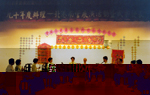 |

早期北港的南管樂團有集斌社（創立於乾隆十一年）與武城閣。北港武城閣於清咸豐九年（1859），由蔡本圭、蔡江河、蔡坎陽、蔡本港等四人在小西天（彌陀寺）創立的，屬於南管樂中的臥品。奉祀子游夫子與孟昶為祖師，每年八月丁日過爐兼吃會。
　集斌社曾分出集英社（1930）；武城閣則旁出南華閣（1941）和集賢社（1952），但因南管逐漸沒落，後繼無人，只剩集斌社和武城閣。公元1981年集斌社參加媽祖遶境時，因人手不足，便決定與武城閣合併成一隊參加遶境，後來武城閣亦因人手不足，參加媽祖遶境時需向笨港媽祖文教基金會的南管社借調人手。武城閣南管練習地點在光民里活粗中心，會館則設於朝天宮仁和大樓。
　集斌社目前又重新振興，借用新街里的活動中心聚會練習，也常應邀出陣演出。
　武城閣成立的目的，是因為對南管音樂的熱愛，聚會則純為參加排場演出和休閒娛樂，故武城閣除了參加農曆正月十五日、三月十九、二十日朝天宮媽祖遶境，以及寺廟祭典邀請演出與義務參加會員家中的喜喪行列外，並不為外人演奏。
　
### 集雅軒

| 3-44 集雅軒大鑼 | 3-45 集雅軒曲譜 |
| ------------------ | ------------------ |
|  |  |

民間曲藝和宗教活動是先民謀生餘暇的兩大重要活動，先民的休閒因之有了意義，也可紓解生命的困惑，更藉此擴大或處理部分人際關係。朝天宮自清道光（或嘉慶）以來，即為全臺媽祖信仰的中心。每屆香期，真是「萬芳整隊來朝聖，無處分靈不返宮」。所以古笨港地區的核心－笨北港的民間曲藝活動特別活絡。
　對現今年輕一輩的北港子弟而言，可能感受不到早年子弟戲團旺盛的生命力。但是這些子弟戲團的組織和活動，卻曾因濃厚的宗教氛圍和社會環境，不論創立年代、數量或熱絡盛況皆為鄰近鄉鎮所不及。此種義務性的團體和長輩生活融為一體，不但隨著媽祖生、各社團的祭典節日，也隨婚嫁、喪事出陣參與，成為特殊的文化面。
　集雅軒創立於咸豐元年（1851），是笨港頗有名氣的北管子弟戲團。軒內存有一上百年純手工刺繡之大旗子及多本戲曲曲譜供民眾點選，文物保存良好。民國三十八年，購買傳統二落木造民宅於現址。這棟古樸的會館，本來面臨蕃簽市古街。但博愛路拓寬拆去其中一落，目前以第一落背面作為門面。入口開放三門，前段作為練習場所，後屏設龕供奉祖師爺西秦王爺－唐明皇。
　會館供奉西秦王爺，左邊奉祀先輩神主牌位。早晚香氣芬芳、裊繞滿室。館內彩牌、托燈、鼓架、繡旗…精緻的作工，閃爍昔日的輝煌。集雅軒起初由地方人士蔡及、陳真、吳石…等十二人發起組成。老一輩曾提及集雅軒由和樂軒分出的淵源。和樂軒是比集雅軒更早的北管子弟戲團（更早者尚有仁和軒）。和樂軒人才分散後，改聘京戲老師教授而轉成京戲劇團。
　集雅軒經由最初牌場、出陣，吸收的會員日漸增加，財源穩定後聘請老師教戲。日據時期打下演戲的基礎，民國十二年左右，更是興盛一時。其中戲服、彩牌、托燈、骨架等文物，皆精心製作之佳品。太平洋戰爭爆發，因經濟蕭條、皇民化運動等因素，民俗活動不如往常活絡。
　台灣光復，集雅軒以深厚的民眾基礎再度招募新會員，民國四十年，可說達到全盛時期。包含站山（出錢的地方人士）、藝員（前後台演出者）共有一百六十人之多。媽祖轎班會、舖戶做平安戲、迎媽祖熱鬧陣等，都被邀請出陣或上棚，尤其是三月十九日，動用最多人力、物力及龐大陣容隨媽祖的神轎出巡。
　最興盛期，人手可分雙陣，一陣參加遶境，一陣演戲。學戲的人多到可以出雙棚戲，雙棚演員同時在加大的戲台上演戲，且戲碼有鳳鶴樓、忠義節等大戲。一棚演員就需二、三十人，其盛況可知。民國四十六年，曾被邀請到士林參加故總統蔣公六十八歲生日盛會，是集雅軒重要的歷史紀錄。
　北港地處鄰近鄉村什榖集散中心，屬經濟不錯、宗教信仰熱誠的地區。由於地方人士熱烈參與及對子弟的鼓勵，兼且農業社會人口穩定，國民對戲曲的熱衷…種種因素，當時不僅集雅軒興盛，高甲仔（南管戲）歌仔戲、京戲、其他子弟團、文館、武館，如百花競相綻放，戲台間也有拼台的情形。
　歌仔戲佔語言上的先天優勢，高甲、亂彈、京劇必須以武齣來取勝。子弟團多無會館，行頭則放在朝天宮內，一館一角落，集雅軒分配放置在觀音殿，入箱戲服則放在現今開山廳內，演練、套戲另覓處所，義民廟、李仔淵…等處都曾開過館。民國三十九年，集雅軒因站山會員捐獻和賞金，方有財源買下現今之會館。
　日據時期，集雅軒曾聘過誰來教戲已無從查得，但其拿手好戲「倒銅旗」，則自日據傳承而來，當時扮演秦瓊的王金龍仍讓老弟子們津津樂道。秦瓊是老生武將，必須有武術底子配合，於是從髯義堂龍鳳獅請來師傅教授「雙金間」（武器名稱），王金龍學到出神入化，每演出必獲滿堂彩。光復後的老師，有集雅軒的老一輩蔡企，也是初創十二位先輩的後代；溪口埤仔頭請來做內台戲（職業戲團）的陳水德。德仙雖不識字，腦子裡卻能記下一、二十齣戲，忠義節、鳳鶴樓即是學自德仙；另有二崙油車高石貴，也擔任過集雅軒總綱。
　集雅軒興盛得快，衰退得也快。在傳統社會結構趨向工商社會的轉型中，因媒體發達、大眾娛樂取向改變，加上家長不鼓勵、學生不願學，及政府對民俗曲藝不切實際的觀念等，集雅軒曾一度面臨散館命運。最後雖經多方奔走，將面臨解散或已解散的各個子弟戲團成員匯集起來，目前成員雖有百多人，樂團十多人卻大多年事已高，如收不到新血傳承，仍難逃散館的命運。農曆六月二十四日是西秦王爺誕辰，也是集雅軒會員聚集過爐的日子。（摘自笨港25、26期－許文綺訪吳燦華、吳炎林）

| 3-46 集雅軒鼓架 | 3-47 錦陞社參與繞境 |
| ------------------ | ------------------ |
|  | 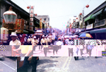 |

### 新街錦陞社

錦陞社是北港新街地方戲樂團，創立於日據時代，是極有名氣的子弟戲，早期曾被日本政府禁止演出，首任老師是錦樂社高徒王海清先生。光復後，由於地方迎神賽會所需，乃重整旗鼓，並高薪聘諱師父前來指導，重振聲威。五十年代，戲樂登峰造極，受邀到各地公演，獲得很多讚賞，現在回想起來，新街人猶感榮幸。

| 3-48 錦陞社繡旗和戲服箱 |
| ------------------ |
|  |

錦陞社戲部大戲（子弟戲），約百年前從福建泉州傳入，歌曲是南管系，對白為泉州話。五十年代，經本地人修改戲曲對話，變得淺顯易懂，深為觀眾接受。角色有生旦、武生、老生、彩旦、花面、二花、丑角等，樂器有琵琶、洞簫、三絃、笛子、嗩吶、鑼鈸，應有盡有，樂器聲音都非常優美。
　當時錦陞社社員多達六十多人，全都是男性。五十年代，曾公演於台北大稻埕、嘉義城隍廟、台南天后宮。所到之處，觀眾都是黑壓壓一大群，當地也變得熱鬧滾滾，非常轟動。
　據現年六十二歲，十八歲就進入錦陞社，當年小生蘇金生說：「每到一處公演，棚仔腳就站滿了人群，台上演得如醉如癡，台下觀眾則掌聲如雷。全團都是男生，生旦由蔡連晃先生反串，因面貌姣美、唱腔優雅，戲迷都當他是女性。每當散戲，大夥兒都爭睹其風采。看到他上男廁，才知他是男的……」接著蘇金生應我們邀請，自唱自拉秀了一首唱腔圓滑、淒涼優美的「相思燈」，讓你難以想像這是出自老男人的唱腔。回憶中的蘇金生得意的說：「有次上台北大稻埕公演，曾受當地社團贈送很多戲服、錦旗、禮物。回到北港，受鄉親人山人海夾道歡迎，真是一生最大的榮幸。」
　蘇金生接著嘆了一口氣說：當時錦陞社很多台柱個個唱作俱佳，身懷絕技。像大花蔡長、花旦蔡用、老生劉拋、蔡東合、老旦何家長、蔡東山、小旦林飛東，個個都能歌善彈，可惜大都已凋零。如今只剩三、四人，偶爾在一起拉拉唱唱。不禁令人感嘆：「人生如戲，戲如人生」，面對錦陞社的式微，徒嘆奈何。
　戲部錦陞社日漸式微，樂部還有參加媽祖遶境活動，飾蛤仔精、蝦兵蝦將、魚婆龜公、魚精……等，在街區遊行表演。這些水族團，在田都元帥帶領下，悠遊大街小巷，贏得許多掌聲。
　錦陞社成員，大部分已離鄉背井，對於該團的集訓，也都興趣缺缺。直到民國七十九年，蔡銘田等數位熱心人士重整錦陞社，每逢農曆初一、十五於新街巡天宮演練，但限於經費和人力，現只能作十音古吹音樂表演。很多耆老，都希望社區居民參與，期望能重振錦陞社的聲望。
　
### 振樂社

| 3-49 振樂社「素蘭要出嫁」 |
| ------------------ |
| 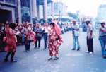 |

振樂社屬歌仔戲，由錦樂社分出，雖從南管樂團分出，但在遶境時吹奏北管樂器，不同於以前的錦樂社。錦樂社在遶境時打大鼓，吹奏南管樂器。振樂社的高蹺陣由蔡森鉗先生於民國六十年組成，是北港唯一的高蹺陣，高蹺的表演技術高超，曾轟動一時。
　此社還曾經表演「素蘭小姐要出嫁」，配合鑼、鼓及五音，吸引無數觀眾的眼光。但近幾年因新血中斷，以致有日漸式微之虞。振樂社奉祀田都元帥與媽祖，會館在北港五府千歲代天宮中，每晚在此地練習樂器。
　
### 北港樂團和麗聲樂團

| 3-50 麗聲樂團 |
| ------------------ |
|  |

北港樂團成立於民國十四年，最初叫「新協社」西樂團。成立的目的就是要參加媽祖遶境活動，由擅吹小喇叭的西藥商人李鐵發起。最初成員有李鐵、陳次在、楊榮輝、許金枝、陳清波、蔡維良、林問、許福榮、蔡雲騰、紀清塗等十人，成立後首推林問為社長、李鐵擔任指導，樂團編制八人，每晚在博愛路李鐵家前廣場練習吹奏。
　新協社一切開銷以社員每月所繳「館費」支應，李鐵擔任義務指導，樂器則由社員自備。最初樂團編成銅管樂器和打擊樂器，因為少了吹尸號的，所以用一把木管樂器「單簧管」代替小號，直到三年後陳家湖等十人加入，才有人吹小號。
　新協社成立之初，在「迎媽祖」行列中演出，當年遊行陣頭都是南北管樂團和龍隊、獅陣，新協社在遊行隊伍中，特別顯眼和新鮮，頗獲鄉親好評。後來一些重要慶典，地方人士都會請新協社參加，日據時代日本神社祭典也請新協社伴奏。
　民國二十年，陳家湖鑑於「新協社」團名像國樂團，建議改為「北港美樂帝樂團」。美樂帝是英文MELODY（旋律）的諧音，直到光復前，北港樂團都叫﹁美樂帝」。在「美樂帝」時代，樂團規模最多達到六十多人，有一部分團員乃另組「麗聲樂團」。
　最重要的演出是在民國三十年，全台樂界配合日本『建國二千六百年』慶典舉辦全台灣青年吹奏樂大會。北港美樂帝、麗聲兩樂團合組成團代表北港郡參加台南州的初賽，一舉奪魁。再代表台南州到台北參加吹奏樂大會，與松山福安郡西樂社並稱日據時期台灣最有名的西樂團。
　光復後，「美樂帝」改名為「北港西樂團」，成員也慢慢擴增到七、八十人。四十年代，台灣正處於中共戰火威脅，北港樂團於民國四十年特地到高雄各軍事基地義演勞軍，以振軍心。民國四十一年到七十年間，每年雲林縣運動會，北港樂團都會應邀演奏助興。
　民國七十四年，巴哈三百週年誕辰，北港樂團在雲林縣各鄉鎮做街頭演奏外，還北上到台北市街頭表演，並且在中正紀念堂廣場公開演出。
　北港樂團從成立至今，團員都是無給職且有正當職業，從不做職業性演出。像已故陳家湖先生擔任樂團指導六十多年，不但出錢出力，還出場地，團員因此投入凝聚，樂團成員音樂素養極高，因之在雲嘉地區培養出許多優秀的音樂師資、作曲家、演奏家。
　麗聲樂團創立於日據時期（民國二十五年），由當時「新協社」部分成員組成。初創會員180人之多，由於少有新會員加入，且會員年齡多半在五、六十歲以上，因此參加遶境時，除了會員，還會請麗聲樂團的老師及其學生教授北港農工或崇先高中學生來幫忙。 
麗聲樂團過去借用義民廟旁房子當會館，後來該建物因老舊拆除改建，麗聲樂團因無會館，缺乏練習的場所，除了農曆三月十九、二十日的遶境活動外，幾乎少有活動，且遶閡之前亦須先開會決定是否參加遶境。有不少團員在三家電視台（台視、中視、華視）樂隊工作，遶境時都會回來幫忙。

### 北港的獅陣

| 3-51 德義堂龍鳳獅 | 3-52 德義堂托燈 |
| ------------------ | ------------------ |
|  | 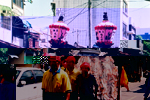 |

舞獅在台灣，有南北區分，北部大多以「醒獅」為主，南部則是「台灣獅」。台灣獅又因分布區域不同，有各式各樣的造型及文化傳承。北港的獅陣有德義堂和勤習堂兩大系統，每個獅陣出陣遶境時，後頭都有大仙的祖師爺神偶壓陣，由奉祀的祖師爺，就可以知道這個武館修習的拳路：達摩祖師－達尊拳（達摩拳）；宋太祖－太祖拳；白鶴祖師－白鶴拳。
　清光緒年間，福建人劉美堂（第一代）任水師把總，駐紮於笨港汛。甲午割台後未隨軍返大陸，定居笨港西勢窯、牛灶口（今北港西勢里），以「劉總師」之名傳授著重強健身體及摶擊技巧的「暗館」武藝及少林達摩拳，授徒十二人，有吳惡牛、王淵語等人（第二代），以發揚忠義精神、強身強國、保衛鄉土為宗旨，當時未設館號。
　劉總師去世後，門徒弟子另外延聘嘉義蘇大鼻為師父，傳授「光館」的武藝（著重於兵器及獅陣），教授太祖拳，並正式以「德義堂龍鳳獅」為館號。此時，吳惡牛製作三十多斤的銅獅頭，取代以往鍛練臂力使用的石鎖，既可練獅陣也可練手力。傳到第三代，人才輩出，由蔡老狗、鄭食、莊水陣、陳英文、莊昆、陳瑞金、陳添等八位師傅共掌館務。後來吳惡牛另立門戶，成立吳門德義堂本館（吳歿後改稱德義堂本館至今）；蔡老狗則另立笨港德義堂；鄭食也另立雄武館。（以上根據莊水陣及莊昆徒弟之葉勝祈講述）
　德義堂的獅子是依照地藏王菩薩的座騎－麒麟獅造型製作成獨角青獅。面有七星（代表天、地、人及東、南、西、北），後頭有火焰八卦及金珠（八卦的乾卦在上【天】、坤卦在下【地】；太極的白色在上【陽】、黑色在下【陰】。不能上下顛倒，因為舞獅時，獅頭大部分的時間都向上；火焰上的金珠如同龍珠一樣，是獅子的靈魂所在）；獅被有虎斑紋搭配五色布，代表「金」、「木」、「水」、「火」、「土」五行；獅尾是「麒麟尾」。簡稱「獅頭、虎身、麒麟尾」，十分穩重亮麗美觀。
　德義堂的武陣，俗稱「龍鳳獅陣」。相傳德義堂的獅隊，有「龍」、「虎」、「鳳」、「獅」、「麒麟」五大形吉祥獸旗幟。這五大形流傳的拳路有（1）黃龍出洞（2）猛虎出林（3）飛鳳朝龍（4）獅子滾球（5）麒麟煽耳……等拳術。
　其舞獅的技法有（1）「龍鳳呈祥」舞龍者頭戴龍頭，身穿龍衣，臀綁龍尾，右手拿龍珠，左手獻爪，雙腳以前弓後箭，轉身迴旋的優雅動作展示，鳳以頭戴鳳頸，手拿翅膀，臀部綁鳳尾，以「金雞獨立」的姿勢，交叉盤旋、龍鳳相戲呈現喜氣洋洋的氣氛。（2）「祥獅獻瑞」舞獅有二人，一個耍獅頭，一個耍獅尾，以點一下走一步的基本步伐，將武功各式步伐融入其中。
　表演程序有1.接獅2.參神3.鎮煞4.拜獅5.雙獅搶球….等各式舞法，都讓人百看不厭。更特殊的是有一位帶獅者，稱之「獅鬼」或「獅兄」，頭戴純銅打造的面具，造型福相、憨厚，右手拿樹青，左手持八卦扇，身帶紅圍兜，酷似孩童，天真無邪的和獅子嬉戲。
　民國四、五十年是德義堂全盛時期，習藝弟子一百多人，出外表演時行頭載滿三大卡車，其陣頭具有丈大特色：拳術方面，剛柔並濟，將剛猛的太祖拳和柔拳搭配表演，頗具調和之美。陣頭方面，內涵熱鬧而豐富。表演時除了一般武陣不可缺少的獅子、宋江陣外，又加上「獅鬼」，以及龍、鳳二種人扮的靈獸；在祥獅獻瑞外，再加上龍鳳呈祥的象徵。第三個特色則是配樂出色，伴奏的樂器除了獅陣樂器－鑼、鼓、鈸外，又加上噯仔（小鎖吶），樂聲高亢明亮，以四拍的打法，配合舞獅者的動作，表現和鳴的節奏。

| 3-53 德義堂白鐵獅頭 | 3-54 德義堂仙聯 |
| ------------------ | ------------------ |
| 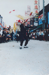 | 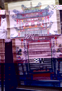 |

此外，德義堂尚有一則和台灣獅有關的傳說：相傳一位老和尚在路上看到一個憨憨的小孩和一頭小獅子，老和尚就把他們帶回去撫養，小孩和小獅跟老和尚一起吃素。小孩和小獅整天玩在一起，還常摘榕樹葉給獅子吃。小孩子長大了，要幫忙燒水、煮飯。有一天，小孩子在起火時，獅子在旁邊搗亂，他氣得用搧火的八卦扇拍打獅頭，八卦扇帶起的火焰就烙在獅頭上，連八卦印也烙上去了。這就是台灣獅獅頭上有火焰、八卦，和舞獅時為什麼要「咬青」的由來。（以上根據葉勝祈講述）
　勤習堂是為習武強身，參與媽祖遶境遊行及凝集地方子弟認同愛護鄉土成立之武館。奉祀白鶴祖師，主拳是「白鶴拳」，因「鶴」特性動作敏捷、快速、爆發力大，具有軟拳兼具外家拳之特質。太祖拳、達摩拳也是主藝之一，兵器則操練十八般武器，陣法傳習「宋江陣」，其他如獅陣、鼓陣亦是研習項目。 
　勤習堂承襲自西螺七崁，第一代創始人廖平，西螺人。當時受陳達先生之邀，來此傳授武藝，沿襲至今已近百年，是極具特色的陣頭。根據我們訪問老塗獅（黃清塗）本人，另有部分不同的說法：廖平師並不是西螺人，而是來自唐山。他從西螺往南傳授武藝，當他到板頭厝時，勤習堂第三代教練陳水來的大哥在板頭厝跟他習武，同時向振興社學，才回到北港。所以有勤習堂的地方，就有振興社，因此流傳一句話：「庄頭勤習堂，庄尾振興社。」
　以前勤習堂有個叫「肉丸成」的西螺人，另外成立勤習堂。勤習堂鬧雙包，經廖平師評定，叫﹁肉丸成」收館，才解決這個紛爭。
　勤習堂的武陣，俗稱「宋江獅陣」或「白鶴獅」，獅子是民間俗稱的「雞籠獅」（屬峨眉火焰獅）。表演時，有一裝扮成白鶴的人，頭戴鶴頸，手拿翅膀，身著鶴裝，和獅子相戲，十分特別。加上宋江陣的演練，聲勢十分浩大。

| 3-55 勤習堂獅陣 | 3-56 老塗獅獅陣 |
| ------------------ | ------------------ |
| 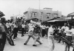 |  |

北港老塗獅國術館（鳳陽國術館）成立約五十年，創辦人兼負責人老塗獅本名黃清塗，出身北港勤習堂，他的義父就是陳水來。他還另外向「鳳陽府」（武館的名號）的師父學氣功，鳳陽府的拳術屬南拳，師父還傳他製造傷藥的方法。黃清塗十七歲時就到高雄教武，後來到柳營研究鶴拳，二十三歲時回勤習堂教白鶴拳。他後來離開勤習堂，三年後在北港義民路自創「鳳陽國術館」。
　老塗獅表示：老塗獅的獅頭另成一格，獅頭是鳳陽府的開口獅，獅子的舞法也和北港的台灣獅陣不同，台灣獅用獅耳之力顯現獅子的威猛，他則是用甩的方式來舞獅頭，以甩獅頭鬃毛時出現的力感，加上獅頭開口閉口時所表現的力聞，來顯現出獅子的威猛，十分特別。
　老塗獅早年巡迴全省各地表演，並開設「中國武功學院」，是武術界家喻戶曉的名人，也是已歿名武師北港六尺四的師傅。有一次，老塗獅到鹽水埔表演壓二、三百斤石椿臼的氣功，六尺四也在旁邊看，大家看六尺四的體格很好，請他幫老塗獅推石椿臼。當時，六尺四並未拜老塗獅為師。後來六尺四的腳踝在台北受傷，回來讓老塗獅醫好後，才拜老塗獅為師。老塗獅習授太祖拳、達摩拳、白鶴拳和氣功，出陣表演除獅陣外，拳術、氣功表演為其特色。
　
### 北港的龍團

| 3-57 新龍團龍陣 |
| ------------------ |
| 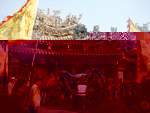 |

在台灣民間，龍有青龍、金龍、銀龍等幾種，最近很多地方更引進國外舞龍比賽用的夜光龍。依舞龍表演方式的差異，有人將台灣的龍隊分為南部龍及北部龍：南部龍為神龍，講求身段的美感。舞龍時，要求龍的動作要如行雲流水般順暢，節奏快慢分明，忌諱龍身打結、動作停頓；而北部龍，則講求穿節、解結的技巧。舞龍時，要求龍的動作要迅猛如風，有較多的動作是在原地穿節、解結，龍身的節與節間常會擰轉如一串香腸。

| 3-58 水族陣蚌精 | 3-59 濟公乩童同繞境 |
| ------------------ | ------------------ |
|  |  |

北港龍團有飛龍團、新龍團、玄龍陣屬南部龍。北港飛龍團為中部龍陣之祖，於清宣統年間成立。當年從福建省福州市請來翁三連組團傳授舞龍技藝。最初團員有翁三連、吳然和、黃竹根、李傳、蔡水、吳伯衷、劉火炭、吳瑞英、王水生、羅水來、洪有土、葉亭、陳老翁等人。當時北港地區有勤習堂、德義堂和飛龍團等武陣，其中以飛龍團最為出色。除了舞龍外，還有魚蝦水族陣，配樂異於一般龍陣，以桶仔鼓為主樂器，配以小鑼、鈸。目前因老團員逐漸凋零，已幾年沒有出陣。聚英社玄龍陣則成立不到十年。

| 3-59-1 聚英社 | 3-61 玄龍陣 |
| ------------------ | ------------------ |
|  |  |

飛龍團設館於仁和路，有專屬的樓房放置舞龍道具，並奉祀四海龍王、田都元帥、天上聖母。團內有一條長八丈的龍，及一對大龍旗，均為公元1929年製作。大龍旗向嘉義市訂製，堪稱「台灣第一大旗」。因「工程」浩大，當年由三家刺繡行承製，費時近三年仍無法完成而倒閉，因而留下「吃倒三家店」的典故。
　大龍旗旗長兩台丈，寬一台丈七台尺，呈三角狀，另有旗頭長五台尺，每幅連旗桿重約兩百公斤。往年隨媽祖出巡時，必須由兩座鐵架滑輪載著，還需要搭配十個工人操作。旗上的字和龍完全以手工浮繡精製而成，兩邊還繡有魚、蝦、蟹、鰲、龜等蝦兵蟹將，正反兩面圖案字繡皆不同，充分顯示當年舞龍道具的精緻，遊行陣容的浩大。

| 3-60 新龍團八十公尺青龍 | 3-62 六十年代全省龍舞競賽 |
| ------------------ | ------------------ |
|  | 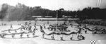 |

北港新龍團由「飛龍團」團員葉瑞生創辦，成立約五十多年。「新龍團」的成員為學童，具舞龍技藝往下紮根的意思，奉祀降龍尊者（濟公）為祖師。降龍尊者，原為鼓亭上木雕神像，因早年媽祖遶境時，走在石頭路上顛跛搖晃掉下來，遂奉為祖師。現葉勝祈先生家中供奉有北港地區最早的濟公神像，迄今仍保存有當年創團神龍（約八十公尺）。
　葉勝祈的祖父葉亭學藝於翁三連，習得舞龍及糊龍的真功夫，成為北港地區舞龍的創始者之一。葉亭將此獨特的民俗技藝，傳給火龍、秋桂、瑞生及得財四個兒子。其中火龍師負責糊製飛龍團的龍。
　「新龍團」出陣時，長八十尺的紅鬃青龍，就需龍珠一人，龍身十一人，再加配樂五音（鼓、大小鈸、小鑼、小吹）及香案車，一次約需三、四十人。舞龍陣型有：祥龍獻瑞、龍遊四海、龍找珠、龍下海、雙龍搶珠、醉龍、青龍獻禮 … 等。該團供奉的濟公禪師有乩童，曾起駕教團員舞龍的方式及技巧，其中醉龍、龍找珠…等獨步全台的演出，就是濟公禪師起駕時所傳授。
　早年，濟公禪師的乩童會跟著遶境，起駕時會和龍隊一起表演，十分特別。
　聚英社玄龍陣發起人吳世龍，小時候是新龍團的團員，對舞龍有興趣，對北港的民俗活動日漸沒落十分關心，乃於民國八十四年成立龍隊，為地方民俗盡一份心力。他同時成立了聖天宮聖龍陣。
　
### 北港的童仔陣頭

| 3-63 昔日閭山堂團員 |
| ------------------ |
|  |

民間，大家習慣把由人裝扮的大仙神偶叫做「童仔」。北港人常因神明降駕指示，創新成立「童仔陣頭」。本地童仔陣種類很多，有神童、仙童、太子、醉彌勒、濟公、齊天大聖…等。
　閭山堂神童團是北港最早成立的神童團，也是全台神童團的始祖。本團由吳居宅創辦，據廖漢臣先生民國五十四年發表於臺灣文獻之「北港朝天宮與其祭典」，提到當年參加媽祖遶境的陣頭中，就有「小神童」，且其順序排列於執事牌之後，與爾後閭山堂神童團的位置相符，因此似可推定其成立時間應在民國五十四年以前，可能是民國五十年（1961）。

| 3-64 童仔陣大會串 | 3-65 逗趣的濟公 | 3-66 俏皮的童仔陣 |
| ------------------ | ------------------ | ------------------ |
| 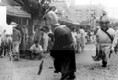 |  |  |

閭山堂原為刻佛仔店，伶祀巧聖先師及閭山法主，神童為主神旁供其差役的小書僮。吳居宅為增添陣頭的熱鬧與趣味（一說是媽祖託夢），乃將神童的造型做成大偶，跳法自創，由當年任職於南陽國小的洪清彬老師構思，經五、六年參加遶境演練，修改成形，全套演來需時半個鐘頭。
　閭山堂神童團對外傳授有：高雄朝后宮、大甲鎮瀾宮（1971）、溪州神童團，其中溪州團每年三月十九日仍組團來參加遶境。閭山堂目前並無組織，由有興趣者自動聚集參與。
　集聖軒仙童團為北港第二個童仔陣，由黃秋文發起。三十多年前，太上老君指示乩手，祂需要兩位童子，且要跳仙童步，仙童團因而成立。仙童與其他神童團的造型相似，差異在於仙童揹劍與葫蘆，神童只拿扇和令旗。仙童出陣一定要一對（紅衣童子、青衣童子），也曾出陣二對以上。祂的跳法為國術步法，參神之時要跳四方、七星、八卦，但在街上就不必踏腳步，只跳Ｓ型，順著鼓點節奏跳即可。
　全省的仙童和神童幾乎都發源於北港，集聖軒仙童團是北港仙童團中，歷史最悠久的一團。包括北港、板橋、苑裡、大甲等地都有本團師父傳承的痕跡。
　
### 文轎和武轎

| 3-66-1 武轎 | 3-66-2 官將首 |
| ------------------ | ------------------ |
| 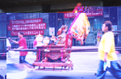 | 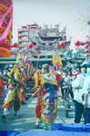 |

神轎可分為文轎和武轎兩類。文轎構造比較密閉，常有精緻雕刻；武轎構造開放，轎的四週沒有什麼遮蔽。文轎行走較直較平穩，不會左右搖晃，武轎不只會左右搖晃，有時還會倒退，頗具威武氣勢。
　一般神明都坐文轎，武轎以前是地藏王、城隍爺專用的座轎，轎的四周沒有什麼遮蔽，方便地藏王、城隍爺在關鬼門有最佳的視野，外出找尋在外遊蕩的好兄弟。官將首則是地藏王、城隍爺的駕前先鋒，為了誘拐躲藏的好兄弟現身，官將首會撒紙錢（黃股紙），讓貪財的好兄弟出來撿拾，好將他們拘捕。
　台灣著名的民俗廟會，北有霞海城隍出巡，南有北港媽祖遶境。以往北港人組成的陣頭，皆是為了給媽祖「湊熱鬧」，增加媽祖出巡的熱鬧性、可看性。
　如今年輕一輩，為了表現和別的陣頭不同，吸引別人的目光，將地藏王、城隍爺的武轎和官將首大量的引進媽祖的遶境中，媽祖的遶境行列出現大量的抓鬼部隊（鍾馗、夜叉、官將首…），呈現了令小孩恐懼的陰森氣氛，這不太符合媽祖遶境的歡樂氣氛。
　曾有一年遶境時，某一武轎中的人將給好兄弟的黃股紙撒到媽祖的神轎，撒紙錢的年輕人這種對媽祖不敬的行為，引起媽祖轎班的不滿，因而引起衝突。近年來，這些年輕氣盛的陣頭，並不完全按照媽祖遶境的路關來行走，甚至演出爭道之行徑，讓北港人幫媽祖「湊熱鬧」的意義變了調，實在令人憂心。
　
### 北港太子會

| 3-66-3 太子會官將首 |
| ------------------ |
|  |

北港太子會剛成立十多年，祭祀太子爺與薛府王爺，因薛府王爺年輕、衝動與太子爺個性相似，所以選擇祂來祭祀。
　本會只有兩尊神明參加遶境，主神帶領五營神將和官將首，並帶有古代衙門枷鎖、虎牌鐵鍊、令牌等。本會非朝天宮附屬神明會，屬獨立社團，遶境步伐不跳七星或八卦，採用比較年輕、自創的舞步，不放迎神古樂，改放洌行音樂舞曲，很受一般年輕人喜愛。這股風潮也影響了其他的童仔陣，也不放迎神古樂，改放流行音樂舞曲，甚至還出現神童及太子爺嘴咬奶嘴遶境的逗趣鏡頭呢。
　
### 聖駕陣

| 3-67 聖駕陣七十二隊 |
| ------------------ |
| 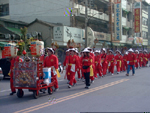 |

根據朝天宮遶境行列順序表的分類，從聖震聲駕前開路鼓之後，就算聖駕陣，其中除了開路鼓、哨角震威團、執事牌、鑾駕、閭山堂神童團、莊儀團這些陣頭外，其他都是神轎陣。
　每個神轎陣屬一個轎班（神明會），通常包括香桌車（上置香案、神明燈）、涼傘、神轎、大扇等，有時亦配有古吹或鼓隊，其中祖媽轎班多了一個香擔和報馬仔；碧水寺則多了黑令旗；太子爺、虎爺、金福綏轎班、小西天轎班則無傘及扇。

### 震威團

| 3-68 震威團哨角隊 | 3-69 哨角樂音揚 |
| ------------------ | ------------------ |
| 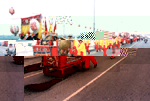 | 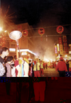 |

震威團成立於康熙三十三年（1694），與朝天宮創立同時。在媽祖出巡時吹哨角、敲馬頭鑼為鑾駕做為前導。相傳馬頭鑼聲和哨角聲具有避邪、去陰、淨化之靈效。哨角是古代軍隊中用的號角，古代帝王出巡鑾駕的儀隊前都有哨兵吹哨角、敲馬頭鑼，示警沿途百姓迴避讓路、肅靜恭迎，后妃出門也是如此。王子公卿、知縣以上官吏雖無儀隊，但是哨角、馬頭鑼等一應俱全。
　後來這樣的規制也襲用於受封的天妃、千歲、天后等神明出巡。宋代起，媽祖即獲皇帝誥封夫人、天妃、天后以及天上聖母，並賜春秋二祭以謝神恩，信徒乃於媽祖出巡時比照古代帝王、后妃出巡的鑾駕。
　北港哨角能吹出五個音，鹿港天后宮哨角或大甲鎮瀾宮的哨角，吹出來的只有高、低兩音。震威團吹出的五個音，相當西樂中的DO、MI、SO、高音的DO、及低音的SO；前三音各吹八拍，第四音高音的DO吹十二拍以示雄威，第五音低音的SO吹六拍後收音。哨角吹奏的方法和吹喇叭不同，要靠特製吹嘴與嘴唇的接觸與吹氣來變音，運氣要用丹田力量，有一定的訣竅，非常難學。
　馬頭鑼的敲法，在帝制時期有帝王公卿之分，在地方因官階高低有別，迎神賽會也因神明位階而有所不同，媽祖因受封為天后，因此採用帝后的規制。即先敲九下，再連四下，敲完鑼後吹哨角，如此反覆運用；一般王爺則敲七下連四下，再吹哨角五聲。哨角是於馬頭鑼打完後接著吹，因此指揮的是馬頭鑼。 
　哨角是以黃銅鑄造，長四台尺八寸，為便於攜帶，以兩節伸縮，縮起來為兩台尺四寸。以前震威團使用的銅製哨角是光緒十年購自大陸泉州，既笨重，有些吹嘴甚至已損害。當時朝天宮以為台灣光復後可與大陸通航，計畫再到泉州購買哨角，不料卻山河變色，無法成行。現在所用哨角是魏幼謙手工打造，他不只是吹五音哨角的第一好手，製造的哨角更是無人能出其右。 
　因傳說哨角是由黃帝冊封，故震威團奉軒轅聖帝（黃帝）為祖師。
　
### 執事牌

| 3-70 執事牌 | 3-71 執事牌陣容浩大 |
| ------------------ | ------------------ |
| 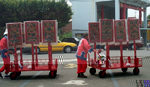 | 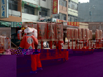 |

執事牌的隊伍是由古代帝王將相出巡的前導隊伍演變而來。長方形的木牌，下有木柄可供抱握，一般都是將主神名號、廟名、肅靜、迴避等直接刻在木牌上。朝天宮媽祖遶境的執事牌較為特殊，是在木牌上套上紅布，再將文字以黑色鑲金邊的型式繡於紅布上，計有「北港朝天宮」、「天上聖母」、「欽加祀典」、「奉旨特祭」、「閤臺平安」、「護國庇民」、「風調雨順」、「國泰民安」、「河清海晏」、「肅靜」、「迴避」等。
　北港朝天宮媽祖遶境的執事牌依慣例由布郊負責，由於布業蕭條，現在布郊找不到足夠的會員小孩來拿執事牌，所以都委託國小老師召集學生來擔任，每人發給工資，四十幾個學生，費用約須十萬元。過去都由朝天宮補貼及布郊會員出資支付，現因為布郊會員越來越少，無力負擔費用。
　民國八十八年起，由朝天宮自行找學生拿牌，並支付所需經費，布郊則將衣服捐出，朝天宮仍將執事牌的陣頭掛名為布郊。該年上元遶境，朝天宮執事索性打造幾輛推車，將執事牌捆綁上車，省卻了不少麻煩，但也破壞了隊伍的可看性及象慧意義。
　
### 鑾 駕

| 3-72 準醫師參與七十二隊 |
| ------------------ |
|  |

鑾駕是由古代帝王出巡的儀衛隊伍簡化而來。帝王的儀仗隊伍起源於扈從警衛隊伍，起初作為衛隊的意圖較為明顯，後代君主的儀仗隊，則漸漸變成一種禮儀。所謂儀仗，是指帝王外出時護衛或隨從隊伍中所持的旗幟、車騎、傘、扇、武器等陳設。只有被封為帝王、后、妃的神祇才配用鑾駕，媽祖被封為「天后」，因此媽祖出巡大都會使用鑾駕。
　北港媽祖出巡的鑾駕指的是儀仗中的兵器，俗稱「七十二隊」，名稱大約如下：日牌、月牌、槊、短槊、槍、戟、雙戟、刀、關刀、斧、鉞、矛、印架、龍頭、佛手握筆、仰月、雙托、銅鏡、菱形槊…等，按例均由「誠心順」點心舖負責。但近年來由於該會人手不夠，現在都是雇用二十五人執二十五件兵器，或請學生幫忙拿兵器。
　如同布郊「金慶順」無力拿執事牌一樣，鑾駕前景頗令人擔憂，一旦鑾駕也上推車，北港迎媽祖的行列就更不完整。幸好九十一年的遶境，朝天宮請中國醫藥學院學生參加遶境執拿，浩蕩壯觀的行列，吸引不少人目光留駐。
　
### 金垂髫太子爺會

| 3-73 金垂髫的囝仔團 | 3-74 金垂髫少年兵 |
| ------------------ | ------------------ |
|  |  |

金垂髫太子爺會成立於公元1963年，由北港義勇消防隊成員組成。因義消在朝天宮設有金燭部販賣金紙，故組成本會。創會會長為許壬子先生。本會現有會員一百多人，會員主要是現任及退休的義消成員，要加入本會一定要具有義消身份，到目前為止尚無義消不加入本會。 
　初期太子爺會參加遶境時，神轎由小孩子來扛，參與扛轎的小孩頭戴髮帶，身圍肚兜，腳戴鈴鐺。由於小孩子較活潑，愛四處向民家搶炮，因此神轎常脫隊。後來因鞭炮的威力越來越強，常有小孩受傷（一說小孩容易累），必須由義消來接替。但遶境當天，義消要帶領陣頭、轎班，無法分身扛轎，故十多年前改將轎子放在推車上，請人來推。民國八十七年再恢復舊制，由金垂髫轎班會的委員召集國小五年級以上及國中的學生150名來抬轎，原則上讓北港鎮各里的小孩子都有機會參加。轎子也改用較輕的藤轎，小孩扛轎無須特別訓練，只要在遶境前幾天排演一下就可以了。
　
### 虎爺會

朝天宮的虎爺會，成立於康熙三十三年（1694）。虎爺會址在北港鎮博愛路附近。除了祭祀虎爺外（共五虎），並祭祀朱府千歲。會員本是博愛路附近居民，後來才擴大召募。現在經黃光男、顏錦明重新組織，社員有一百多人，是朝天宮很強大的神明組織。

| 3-78 最新的虎爺面具 | 3-75 愛吃炮的虎爺 |
| ------------------ | ------------------ |
|  |  |

農曆六月六日為虎爺聖誕日。虎爺爐主之下，有四個腳仔，朱公爐，虎爺爐，同為四腳爐，本會朱公金身與大虎、二虎，放在爐主家。三虎放在會長家。虎爺轎過去會上下搖動，現在規定不可。虎爺是遶境神轎中最會吃炮的轎子，在濃煙漫天、轟隆作響的場景中，「虎爺轎」屹立不搖，轎夫無畏無懼的神采，讓群眾懾服。

| 3-76 愛吃炮的虎爺 | 3-76 愛吃炮的虎爺 |
| ------------------ | ------------------ |
| 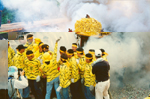 | 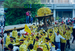 |

遶境時，扛虎爺轎者需會踏腳步，否則整座轎子會翻倒。有人拿扇子指揮轎子，但未特別訓練弟子擔任扛轎。扛轎者都是遶境之前由全省各地自動來報到者，有的不是會員，有經驗的老手會帶領有興趣的新手。抬轎者既使互不識，仍無礙扛轎。他們穿著虎紋服裝，在氣勢熊熊炮火中，猛烈吃炮而毫無損傷，真叫人匪夷所思。

### 金福綏土地公會

| 3-80 金福綏福德轎 | 3-79 金福綏香棹車 |
| ------------------ | ------------------ |
| 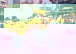 | 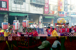 |

朝天宮金福綏土地公會主祀笨港境主、福德正神，成立於公元1925年。創始人為楊清祺、蔡錦榮、蔡再生，會員大部份為北港地區的生意人，目前有會員二百多人。
　境主公為掌管廟境信仰範圍的土地神明，職責類似土地公。金福綏笨港境主原有八家將的組織，由蔡再生擔任教練，以前參加媽祖遶境皆有八家將隨行，土地公殿亦配祀文武判官，八家將現在已解散。本會於農曆八月十五日福德正神誕辰時，在土地公殿前有供應信徒祈求平安龜的習俗。本會過爐日，笨港境主是農曆二月二日，福德正神原在十二月十六日，民國五十七年起改在農曆五月十七日土地公殿的重修、安座紀念日舉行。
　據學者研究「八家將」的起源有五種：

1. 上界大洞天真君下凡，轉世作為『五福大帝』的部將。
2. 五福大帝所收降的海盜。
3. 大戶人家的家丁。
4. 地藏王的部將。
5. 城隍十二爺之系統

| 3-81 八家將賣力演出 | 3-83 玄通會館八家將 |
| ------------------ | ------------------ |
| 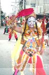 |  |

『五福大帝』是掌管瘟疫之神，專為陽界驅瘟除疫，保境安民，最早為福州一帶的鄉土保護神。城隍廟、王爺廟、嶽帝爺廟的八家將，幾乎由『五福大帝廟』衍生而出。臺灣八家將的發源地，台南府城的『白龍庵』，奉祀的主神就是『五福大帝』。
　八家將大抵模仿清代巡捕審堂體系，石萬壽分析：「鴉片戰爭以後，府城治安完全落在聯境組織的肩上，聯境組織為承擔此一艱巨任務，乃仿營兵組義民旗攘外，仿巡捕組冬防巡更隊以安內。及送王船之俗興起，部份供奉監察類神明的境，乃將巡更隊化妝成家將團，以鎮魔除妖，兼作不日定期的操練」。
　其組成陣容有五人（四將一差）、六人（四將二差）、七人（六將一差）、八人（六將二差）、十人（八將二差）十二人（八將二差加上文武判）等類，因陣容人數不一，也稱『什將家』或『家將團』。成員大致為(1)什役(2)文差(3)武差(4)甘爺(5)柳爺(6)謝爺(7)范爺(8)春神(9)夏神(10)秋神(11)冬神(12)文判(13)武判等。甘柳謝范合稱『四將』或者『四大將軍』；春夏秋冬合稱『四季神』或者『四大帝君』。
　八家將演練程序為：主神下令→文差接令→武差傳令→謝范捉拿→甘柳刑罰→四季拷問→文判錄口供→武判押罪犯。類似清朝縣署巡捕組織的神格化。其陣法由師父親自傳授，以「七星步」、「照四角」、「開八卦」為主。

| 3-82 八家將賣力演出 | 3-84 滿臉彩裝的官將首 |
| ------------------ | ------------------ |
|  |  |

鎮內亦有寺廟或村莊組有「官將首」，相傳為新莊地藏庵(大眾廟)發展而出，現已成為全台廟會常見的陣頭。「官將首」是青面增將軍與紅面損將軍合稱，又稱關將頭、八將頭。相傳兩將軍原為危害人間的魑魅，被地藏王菩薩懾服成為駕前護法，奉旨庇蔭民間。官將首的原為兩人扮演，演變至今日五人、九人不等。新莊的官將首，還有陰陽司公(陰陽判官)，虎頭鍘與引路童子。
　在廟會中扮演官將首者，身、口、意要三清，故不近女色，不食葷食。出巡時，面畫臉譜，底色分為青、紅、藍等。手持三叉戟、手銬、火籤、虎牌等刑具，身掛鹹光餅 (平安餅)，經由法師開光，方可出巡。官將首動作陽剛，以傳統戲曲中的「鬼步」為基礎，二虛一實踮腳步行走，與八家將的陰柔不同。官將首出巡時，逢廟必敬拜該廟主神，動作精采可看。

### 金瑞昭註生娘娘

| 3-85 金瑞昭的神轎 | 3-86 金瑞昭的神轎 |
| ------------------ | ------------------ |
| 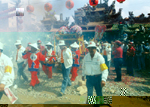 |  |

金瑞昭註生娘娘轎班會成立於民國八十年，公元2001年首次參加媽祖遶境活動。註生娘娘配祀婆姐輔佐掌管生育之事，一般配祀36位婆姐或12位婆姐，但朝天宮只配祀2位。本會過爐日，農曆九月十二日。

### 媽祖出巡的先鋒將－莊儀團協會

| 3-87 金精將軍 | 3-88 水精將軍 | 3-89 莊儀團 |
| ------------------ | ------------------ | ------------------ |
|  | 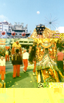 | 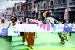 |

相信看過朝天宮媽祖出巡的人，一定會對陣前四尊威風凜凜的將軍留下深刻的印象，這四尊造型威武、服裝華麗的將軍，正是千里眼與順風耳。據傳千里眼有天通眼，能窺宇宙萬象；順風耳有天耳通，可聽世間眾音。關於其由來有幾種傳說：一說千里眼與順風耳，本是金精、水精所化；二說他們是商代紂王的大將，大哥高明、小弟高覺。有一次和周文王的軍師姜子牙交戰身亡，死後陰魂不散、四處飄遊，後來盤踞桃花山。
　另一說認為千里眼與順風耳是天庭的天將，奉玉帝旨令，降在桃花山，等待媽祖得道成神仙之時，輔佐聖母救渡海上遇難的眾生，以化解人間的劫厄。還有書中記載，媽祖乃是觀音菩薩的化身，所以千里眼替媽祖執行「觀」千里災難的任務，順風耳則執行「聽音」職務，觀與音相和，正符合「觀音」大士之意。
　相傳，宋太平興國七年（982）湄州島西北方常有二妖出沒，附近居民驚恐萬分。妖怪面貌兇惡，目如銅鈴、齒像短劍，身材高大，聲如巨鐘、來如飄風、去似閃電。默娘聽到桃花山有二怪擾民、危害百姓的訊息，就提著銅符前往，在山中遇到二怪，力勸他們修道愛民，千里眼與順風耳勃然大怒，以為默娘只是尋常村姑，竟敢前來訓示，心中不服，就使出法寶與默娘交戰。默娘手持銅符，口念神咒，二怪全身無力，四肢不聽使喚，只得認輸屈服，並懇求默娘開恩，願意隨之修道，一同救濟天下蒼生，成為媽祖娘娘駕前將軍－千里眼及順風耳。因此媽祖廟，也供奉眼觀宇宙萬物的千里眼，耳聽世間眾音的順風耳。
　莊儀團協會創立於民國八十二年九月九日，是負責供奉、保養千里眼及順風耳，及參與遶境的神明會。但在協會成立前，已有六十六年歷史。其前身是民國十六年，由本鎮十二位先賢所組織的「北港朝天宮千耳眼爺會」，會址設於朝天宮內，後來會員日漸增多，乃改名為「朝天宮莊儀團」，至民國八十二年始成立協會。目前該協會組織架構有理事長、常務理監事、理監事、總幹事、幹事、顧問等編制。每四年於農曆四月七日吃會日舉行理監事改選，理事長只能連任一次。
　本協會於農曆正月十五、三月十九及二十參與遶境活動。在遶境前一週訓練會員扛大型將軍。遶境時，會員一律穿紅褲子、古式鞋子。本會的將軍極具特色，紅臉是閉嘴的千里眼將軍；青臉是開嘴的順風耳將軍。傳說青將軍是水精將軍，會吐水，水代表錢財，故可以張嘴。紅將軍是金精將軍，媽祖怕祂會吃百姓的金銀財寶，故不許張嘴。
　千里眼、順風耳將軍的頭部製作極為精巧。早年取金紙的紙棉加漿糊做成黏土狀，再一層層糊起來。近年則改用牛皮紙。據傳，師傅是兩位將軍自己挑選，製作前常顯靈讓師傅觀看，故可製出傳神的面貌。

| 3-90 威風凜凜的千里眼和順風耳 | 3-91 威風凜凜的千里眼和順風耳 |
| ------------------ | ------------------ |
| 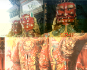 | 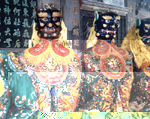 |

莊儀團神像製作師傅為世代相傳，老師傅石晉朝已經往生，但生前留下很多傳神的頭像。兩位將軍目前尚未找新師傅，所以這幾年並沒有新作品。至於將軍所穿的衣服，則是本鎮華德雕刻店所繡，其繡工之精細，亦為他處罕見。目前協會中尚有百餘個將軍頭，正計劃成立專館展出。
　莊儀團協會目前在全省共有十個分會，分別位於瑞芳、台北、三重、板橋、大甲、清水、沙鹿、彰化永靖、高雄內門、高雄市等，在國外則有日本箱根、青森與美國舊金山等三個分會，只要是本會的分會，都會獲得本會贈送的大型將軍二尊，只送不賣。
本會將軍有許多靈驗故事，其中一則為會中兄弟所嘖嘖稱奇。據說有婦人頭部長瘤，經多年求醫仍無法醫治。有一年，當本會將軍正在遶境時，這名婦人因離將軍太近，將軍的手因此甩到頭部的瘤。回家後，頭上的瘤竟不藥而癒，將軍之威靈顯赫不脛而走。

| 3-92 千里眼順風耳和四小將 | 3-93 千里眼順風耳和四小將 |
| ------------------ | ------------------ |
| 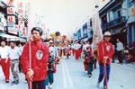 | 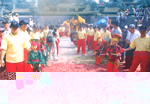 |

### 六媽金順崇轎班會

| 3-94 炮聲隆隆迎六媽 | 3-95 炮聲隆隆迎六媽 |
| ------------------ | ------------------ |
|  | 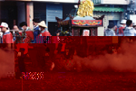 |

六媽會的起源有一段動人的故事。日據時代，日本政府認為媽祖遶境是一種迷信的行為，故開始限制朝天宮每年的遶境活動。昭和十三年，由於日本政府干預，三媽會員決定不出來抬轎。當時有位王金先生認為此例一開，日後恐無人要出來抬轎，故臨時在朝天宮廟口招集了十餘人扛三媽轎。當遶境即將展開時，三媽會唯恐喪失扛轎權利，又堅持出來抬轎。朝天宮感於新成員熱心幫忙，於是再請出一頂轎子與一尊媽祖神像，讓新轎班參與遶境，這尊媽祖就是六媽。
　每年遶境，本會都固定請六位轎夫來扛轎。由於六媽轎可以吃炮，扛轎時又無特定步伐，故吸引不少有興趣或湊熱鬧的青少年來扛轎。目前本會有二個香爐，正爐過爐及吆會日期為農曆四月二十六日，副爐則為農曆四月二十七日。
　
### 五媽金豐隆轎班會

| 3-96 五媽轎出巡 |
| ------------------ |
|  |

本會由陳韞先生等人於公元1911年所發起組織。陳韞從事藤椅業，經濟狀況不錯，因而招集好友組織本會。目前會員近二百人，以居住地劃分為四部。會長一任四年，可連任一次，另設總務、會計各一人，組長、委員各四人，監察三人。
　本會香爐有三個，分為正爐、副爐和遶境爐。正爐過爐及吃會日期為農曆四月十七日，副爐則是農曆四月十八日，遶境爐過爐日期同副爐，但不辦吃會。本會入會須經監察員審查，目前由於會員眾多，並不打算再招新會員。
　
### 四媽金安瀾轎班會

| 3-97 四媽轎出廟 |
| ------------------ |
|  |

「四媽金安瀾轎班會」成立於民國元年，至今已有九十一年歷史。會員人數眾多，其中以蔡陳楊吳許五大姓居多，參加會員不限於北港人，會員中選出9至11名組織委員會，再從其中選出會長，四年一任，連選得連任，會中幹部、顧問為會長所聘，有些顧問為外地人。
　本會規定參加的會員必須親自出來抬轎，不可只出錢不出力。儘管如此，會員仍年年增加。由於會員多，擲得爐主的機會很低，因之香爐又分副爐與遶境爐。至於吃會時間則為農曆四月二十日。
　
### 三媽金盛豐轎班會

| 3-98 三媽出廟 | 3-99 三媽香棹車 |
| ------------------ | ------------------ |
| 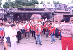 | 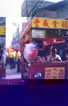 |

三媽轎班會是歷史悠久的轎班會，組成年代在公元1811年。咸豐五年（1858）的台南大天后宮鑄鐘緣起碑記：「朝天宮二三媽甲眾轎班捐銀30員」刻有本會捐銀的紀錄。會員多半繼承祖先名份而得，故三媽會的會員姓氏與清朝北港五大姓（蔡、陳、吳、許、楊）類似。
　本會會員原入會條件極為簡單，只要信仰媽祖都可入會，後來附加逢媽祖出巡時要分擔抬轎護駕，連續三年才可以入會。會員吃會日期為農曆四月二十八日。
　本會有一鑄造於甲午戰爭（1894）前的香爐，最重要的法器為鼓架。每當朝天宮媽祖遶境時，三媽會隊伍前會由爐主的子弟負責打鼓。俗語說：「鐘到、鼓到、媽祖到」，即聽到鐘鼓聲就知道媽祖來了（二媽會法器為鐘）。
　
### 二媽金順安轎班會

| 3-100 二媽遶境 |
| ------------------ |
|  |

二媽金順安轎班會和三媽轎班會同時成立，是目前六個媽祖會中最富有，也是組織最龐大的轎班會。由北港、草湖、新街、新厝四個副爐轎班會，共十七位委員成立轎班委員會。再由其中產生會長、監察、總務、會計、助理總務、助理會計、祭祀委員、徵收委員等，任期為四年，其任務為監督性質，對於各副爐轎班會之行政均採不介入的態度。
　每年農曆四月十五日為本會過爐之日，此時會根據會員名冊擲茭產生正爐主，其他三個副爐轎班會得神杯最多者為該副爐轎班會之爐主。每年聖母遶境時，需由當年正爐主之副爐轎班會全權負責。
　二媽轎班會遶境不吃炮，因為此會委員覺得神明不應受到驚嚇，乃勸導民眾不要將鞭炮丟在轎下。這種宗教與環保結合的特例，和鞭炮放愈多，神明和放炮民家會愈興愈發的北港傳統民俗頗不一樣。

### 祖媽金順盛轎班會

| 3-101 歷史悠久的祖媽轎 | 3-102 媽祖殿租御神輿 |
| ------------------ | ------------------ |
| 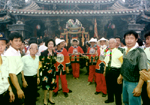 | 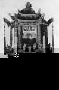 |

本會是朝天宮最早成立的轎班會，與北港許氏家族有很深的淵源。歷任會長包括許致及其子許壬子、許壬申。他們一脈相傳，一心一意組織管理祖媽金順盛轎班會，目前會長許壬申，對本鎮的各方建設都有很大的貢獻。
　日據時代，因祖媽遶境時所乘清代轎子過於老舊，許致乃糾集地方士紳成立祖媽會，並重金禮聘大陸雕刻名家，費時三年，重新製作新的神轎。新神轎曾代表北港地區參加日本雕刻博覽會，獲得入圍，舊神轎則送給二媽。由於早年許致對祖媽會貢獻良多，許壬子、許壬申亦是地方之領導階層，因此許家獲得會員一致擁護繼任會長。現在祖媽會會員一百多人。有些老會員想當爐主，以迎接媽祖爐至住宅供奉，因此不開放新會員加入。
本會宗旨純粹為媽祖奉獻服務，只參加交值年（六個媽祖轎班會每年輪流出轎，每逢該會出轎之年）農曆正月十五日上元節遶境活動及農曆三月十九、二十日媽祖遶境活動，並未參加其他活動。

### 碧 水 寺

| 3-103 媽祖遶境至碧水寺 |
| ------------------ |
| 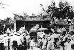 |

新街碧水寺創立於嘉慶五年（1800），由蔡秀募款興建，奉祀觀音佛祖，因位於笨港北郊，又稱「北壇」，與南壇水月庵南北拱衛笨港街。每年媽祖遶境時，本寺會迎請觀音佛祖參加遶境，遶境南港時則由南港地方人士負責抬轎。

### 小西天崇佛會

| 3-104 小西天崇佛會 |
| ------------------ |
|  |

小西天崇佛會屬彌陀寺神明會，成立於公元 1948年。彌陀寺附近居民為參加媽祖遶境活動而組織本會。 
　彌陀寺位於中秋路上，建於嘉慶八年（1803），又稱「小西天」，奉祀阿彌陀佛。昭和九年（1934）將原益安館（主祀關帝爺公）和養濟院（主祀福德正神）的眾神明合祀於本寺，由蔡知高捐贈廟地，李騰凰籌資重建，昭和十一年（1936）落成。現在本寺主祀西方三聖—阿彌陀佛、觀世音菩薩、大勢至菩薩。小西天崇佛會參加媽祖遶境的神明為阿彌陀佛、上帝公（玄天上帝）、李王爺公（李府千歲）。目前會員有77人，歷任會長有許金水、戴溪川和蔡榮泉。每年農曆四月八日過爐。

### 金懿順媽祖轎班會

| 3-105 金懿順日本轎 | 3-106 金懿順媽祖轎班會 |
| ------------------ | ------------------ |
| 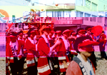 |  |

近趁年農曆三月十九、二十媽祖遶境，有座由女轎伕抬的神轎，非常受大家矚目，她們穿著日本傳統服裝，紅衣闊衫，看起來很特別。抬轎時嘴裡喊著：「伊咻、伊咻」「伊咻、伊咻」轎子上下搖晃著，步伐整齊，看起來很有日本味道。這是日本箱根觀音福壽院和北港國際獅子會中的北英獅子會共同組成的金懿順媽祖轎班會，九十一年特別請中國醫藥學院學生擔任轎伕，成為遶境行列中搶眼的一支隊伍。
　金懿順媽祖會成立於民國八十年十二月，由創會會長蕭瑞美女士組成。會員以北英獅子會、朝天宮念佛會、土風舞會及社會人士為主。轎班會的神轎，為日本人武藤靜司贈與日本箱根福壽院，再轉贈朝天宮。每年舊曆四月二十三日在朝天宮過爐，由法師主持擲筊產生爐主。日本國媽祖會員及日本箱根福壽院之會員大都為北港旅日台胞。現日本國媽祖會會長為北港旅日華僑曾定修先生，是個熱愛家鄉的人，很受地方人士肯定。

### 藝閣

藝閣之「藝」是指以南管樂器彈唱的藝旦；「閣」乃架子上置放食物的木板；為藝術之閣、詩意之閣。
　在史籍上可以找到藝閣起源的蛛絲馬跡，大約始自宋代的肉傀儡（小孩裝扮，身體不動，有如傀儡，取其體輕，易於抬行），這應該是藝閣最原始的雛形。
　藝閣傳入台灣至少有一百五十年，更遠可推至二百二十七年。朱景英（1750）曾任台灣理番同知、台南知府，在其「海東札記」記載：「出金傭人家垂髫女子，裝扮故事舁遊市街，謂之抬閣。」
　笨港朝天宮藝閣遶境最大支柱是商業團體舖會。笨港早在公元1837年就成立十二個鋪會，往前推測，此地藝閣至少有一百六十年以上歷史。
　台灣藝閣受南方模式影響，清初陳鴻（福建莆田）在〈莆靖小記〉曾提到：「用桌一只，後造一屏，二人扛抬，飾小兒為男女坐桌上……鼎革後，借各班戲子妝扮，新造高大木架，用四人扛，倩好女兒童三四人飾新鮮衣服，演熱鬧故事，更相爭賽。」藝閣以人扛抬遶境，從清治到公元1950年代未曾改變。
　公元1923年，日皇太子裕仁遊台，製藝閣高手精心創作出名副其實的「詩意閣」，至台北歡迎皇太子ｘ競奇鬥勝到了極點。
　民國四十年左右，藝閣由人工扛抬改為獸力，即將「閣棚」裝置於牛車上，由牛來拉動，後改以機動三輪車帶動。現在藝閣完全改用貨車車體，其外形比當年增大五倍之多，每部都要有發電機隨行(藝閣製作專家顏崑池先生講述) 。
　在五十年前，夜間遊街，僅有「電土火」陪伴，光線極為黯淡，如今受科技影響，藝閣四周花堵所裝設燈光造型，既炫眼輝煌又別具一格。讓人眼花撩亂，也讓北港成了不夜城。 
　據專家說：民國六十八年藝閣數量增多，藝旦反而漸少，有些舖會找不到藝旦。而南管賣藝圖體又後繼無人，會彈會唱的藝旦成為絕響。
　民國六十一年至六十六年間，參加遶境的藝閣大約10座以下；民國六十四年因先總統蔣中正先生逝世停辦；民國氖十七年至七十六年藝閣數量約11到20座。民國七十一年起，因電子琴花車興起，大約連續四年左右，部分「出閣」單位為了省錢，以電子琴花車替代藝閣。朝天宮董事會為端正禮俗，決定只補助以「藝閣」參加遶境的單位。如此一來，促使藝閣創作再創高峰，並提高北港藝閣品質。
　民國八十三年，慶祝建廟三百年，朝天宮舉辦大規模的北港媽祖暨藝閣環島遶境。從六月五日至廿九日為期廿五天的遶境之旅，不但掀起全台參與熱潮，更將藝閣文化傳遍島上各角落。目前各地廟會陸續有藝閣登場，但規模最大，仍非北港莫屬。
　在北港出現過的藝閣有三類：

#### 龍鳳閣

| 3-107 早期龍鳳閣 | 3-108 龍鳳閣引來如潮群眾 |
| ------------------ | ------------------ |
| 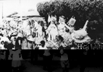 |  |

由紙箔舖贊助，此種藝閣稱為陣頭閣、蜈蚣閣、蜈蚣棚、龍鳳閣。北港龍鳳閣其特色在於龍頭鳳尾，意在陰陽調和和龍鳳呈祥，有別於一般蜈蚣閣。它具有保平安、避邪、掃魔作用。
　其閣台以榫頭相扣，片片連環不斷，彎轉容易。裝扮人數依其型態大小有八人(八仙)、十二人(十二金釵)、二十四人(二十四節氣)、二十八人(二十八星宿)、三十六人(天罡)、七十二人(地煞)、極限是一百零八人(一○八好漢)。百年來其內容一成不變，閣台變化少之又少，由於其遶境之前，必須舉行開光儀式、請神；因此結束時，也要以隆重儀式送神。
　民國五十年左右，北港迎神賽會中，龍鳳閣參加遶境次數較多，其休息區就在義民路與博愛路之間的光明路，聲勢浩浩蕩蕩，極為壯觀。但由於產業結構改變，龍鳳閣就在社會洪流中隱沒了。
　民國六十五年，紙箔鋪再依某部戲曲重新訂製服裝，製作龍頭鳳尾三十六人裝的龍鳳閤，雇用72個工人抬此閣。後因人工不易雇得，工資又貴，乃將閣台改裝三輪車。幾年後，閣台老舊損耗嚴重，紙箔舖決議不再整修，改贊助花費較少的藝閣，龍鳳閣就此消失。
　民國八十二年，朝天宮新任董事長曾蔡美佐上任，為了增添熱鬧再製作新龍鳳閣，然而只遶境半天就功成身退，此後沒再出現。

| 3-109 龍鳳閣一景 | 3-110 三輪車時代的龍鳳閣 |
| ------------------ | ------------------ |
|  |  |

依據北港朝天宮前祭祀組紀仁智說：朝天宮的記錄簿，曾記載金箔紙舖於公元1908年，朝天宮重建時已用龍鳳閣專名捐款興建三川門，此可證明，龍鳳閣至少在九十四年前，就已成立，但始於何年則不得而知。

#### 藝旦閣

| 3-111 藝旦閣  |
| ------------------ |
|  |

由藝旦扮裝，並表演南管樂曲，以琵琶彈奏演唱於閣台上，唱曲是陳三五娘、昭君和番、山伯英台等。早期藝閣最具代表性的主角，就是能彈唱南管的藝旦。若無真才實學，難登上藝閣寶座。藝旦所到之處，男女老少無不佇立圍觀，一面欣賞花枝招展的藝旦，一面傾聽難得一聞的繞樑歌聲。閣上有數位著戲裝的小孩陪襯，如今這幕老少共享的民間藝術畫面，已不見蹤影。（藝旦閣資料由李碧桃女士提供）

#### 藝閣

| 3-112 美輪美奐的藝閣 | 3-113 遶境中的藝閣 | 3-114 遶境中的藝閣 |
| ------------------ | ------------------ | ------------------ |
|  |  | 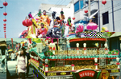 |

由十四歲以下的童男童女，著古裝扮演戲劇角色。其內容題材多半來自搜神記、封神榜、神仙傳記、神話故事、歷史人物傳、觀音傳、媽祖傳、西遊記、三國演義、二十四孝故事…。製作者所設計必需具備完整的單元故事，使人一目瞭然。如媽祖收妖必定要有媽祖、千里眼、順風耳，少了當中一角都不行。
　這種藝閣是藝旦閣消失之後，由不懂南管的小孩裝扮藝旦模樣，其閣台裝飾可看性極高，故又叫「詩意閣」。閣上的角色，以前由鋪會爐主及幹部子女裝扮。如人員不足，再由出資多的子弟擔任小藝人。
　小藝人坐在閣台上一下午或一晚上下來，相當疲憊，因此要排班輪流。為了增加趣味性，小藝人常帶著糖果從半空中撒下，有如仙女散花，觀眾撿拾得樂不可支。但也因為大家爭先恐後搶「平安糖」，常會造成小意外、小傷害，不得不防範。
　藝閣遊街前後，須至朝天宮拜媽祖，舉行「起馬」、「落馬」儀式。「起馬」是上藝閣之前祈求平安，「落馬」是下藝閣後感謝保佑，現儀式已簡化為經過廟前舉香膜拜就了事。
　現在台灣場面最大的藝閣秀，是在北港的媽祖廟會，因傳統藝閣製作費用極為龐大，非一般小商人、小廟宇所能負擔之故。據顏崑池先生告知 現在一座全新藝閣約需新台幣八十萬元。藝閣秀能百年來屹立不墜，大概可歸納如下：

1. 朝天宮香客多，相對的「添油香」也多，廟本身「出閣」娛樂信徒，是輕而易舉的事。 
2. 舖會組織成立於公元1837年，歷史悠久，西藥、中藥、米舖、紙箔舖、麵線舖、汽車業、餅舖、銀樓、魯班會、屠戶…等舖戶都恭奉媽祖。
3. 行政區單位：北港行政區分28里，但在廟會「出閣」的，僅屬古笨港街道幾個里參加，這些里由各鄰長挨家挨戶，要求里民樂捐，依樂捐所得多少來決定是否「出閣」。
4. 民間團體：目前有老人會、早安會、老人福利協進會…等團體，會贊助藝閣演出。

　北港人引以為傲的藝閣，集精美、奇巧、情意與藝術於一身，如有機會，促使藝閣展成為國際性的「嘉年華會」，想必定是大家一同的期望吧！