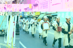

# 第三節　婚喪喜慶及其他習俗
---

## 做生日

|  4-15 祝壽物品 |
| ----------------- |
|  |

「做度脺」是生命中的第一個生日，當天父母會將孩子打扮的漂漂亮亮祭祖拜神，長輩贈送新衣帽、金鍊、金鎖片等祝福「好搖飼敖大漢長命百歲」的禮物，特別是外婆家的賀禮，總是特別豐厚，有的家庭會大肆宴客，表達有子萬事足的喜悅，特別是長孫長子。
　鄰近的嘉義縣，遇到女婿卅一歲生日，還要特別準備豐富的禮物，如西裝等賀壽。有些人則在五十歲會大肆慶祝一番，岳家仍要送大禮呢！但這些習俗在北港已不多見。
　一般民間做壽七十歲為「大壽」八十為「上壽」九十歲為「老壽」、百歲為「期頤」都盛大祝賀。親朋好友送來賀禮，並演戲一面喝酒一面看戲，戲的內容以富貴長壽為主。壽宴中，一定要有「豬腳麵線」這一道菜。壽星還要盛裝，坐在正廳接受子孫拜壽。但有些人因相信相命師「鐵口直斷」，某些年歲不敢作壽，以免被黑白無常帶走。
　隨著社會的變遷，過生日吃豬腳麵線逐漸式微，西式蛋糕和生日快樂歌成為慶賀生日的主流。

## 婚禮 

結婚，人生大事。早期婚禮，有其固定儀式，稱為六禮。男女結婚要經過繁複的程序，才能結為連理。今日結婚儀式洋化、簡化、多樣化，除宗教婚禮仍具備應有莊嚴性外，跳傘、騎馬、坐牛車、潛水等，都與傳統婚禮大異其趣。目前公證結婚、集團結婚則成為婚禮的另一種形式。現在就傳統婚禮做簡要介紹： 
　（1）納采－說媒提親。
　當男方看上某家小姐，就請媒婆去提親，如女方不同意可婉辭。現在男女自由戀愛，常找個「便媒人」上陣就行。
　（2）問名－探問生辰八字。
　此階段雙方要準備男女八字交媒婆送到對方，慎重些還會要求對方曾祖父母、祖父母及父母三代姓名、經歷。如果雙方生辰八字相配，合八字過程雙方都無事故發生，就可討論婚嫁。現在合八字日漸減少，但還是會找人探聽對方底細。如果是自由戀愛，合八字、探底細都省了。
　（3）納吉－定親、小定。

| 4-17 訂婚六禮 | 4-16 訂婚六禮 |
| ----------------- | ----------------- |
|  |  |
| 4-18 男女訂婚互贈用品 | 4-18-1 訂婚吃茶 |
|  |  |

即「掛手指定」，男方選定吉日到女方家戴戒指訂婚約。女方則宴請準新郎及其親戚。北港地區有些準新娘家，會在這天宴客，正式結婚則不辦歸寧。
　「掛手指」時，準新娘面對門口坐於高椅，雙腳踩在小竹椅上（竹頭旺之意）。男方將一對戒指戴在新娘的右手中指，準新娘則將戒指戴於準新郎左手中指。此日女方要宴請男方親友，男方要準備紅包「壓桌」。為了讓準親家「春」錢，有些地方的習俗，男方在筵席中途就得離席，而且不能相辭。意思是讓親家吃有「春」。
　據「四五嫁妝專賣店」的老闆許永欽伉儷說：「訂婚當天，男方要準備十二項各具吉祥意義之禮物給女方。包括象徵佳偶天成的芋頭兩棵；有傳宗接代之意的蓮蕉花兩株；傳承繁殖的木炭；同心的燈心、竹心；緣粉（鉛粉）些許；情意綿綿的紅棉紗；五穀豐登的「五穀」等。
　女方則準備「招福」的香蕉二至六梳；步步高升的「糕仔」；入門香的「米香」送男方祭祖，另備冰糖、冬瓜糖、桔餅、桂圓乾、花生糖及喜糖等六色糖祭祖，且回送男方。同時準備送準新郎全身十二項：帽子、戒指、領夾、錶鏈、西裝、白襯衫（純潔）、皮帶、皮夾（財庫）、皮鞋及襪子（不可白色）、手帕、浴巾各2雙。
　
　（4）納徵－大聘、大定。
　男方在吉日將聘金、金飾、衣料、禮餅及酒、龍眼乾等裝於神籃，由媒婆陪同送至女方。女方點收並祭拜神明、祖先。現在「打現金」盛行，雙方事先談妥喜餅飾品價碼，委由女方自理，可謂皆大歡喜。至於收聘金的女方已少之又少。

　（5）請期－通知結婚日期。

| 4-19 結婚必備物品 | 4-20 嫁妝 |
| ----------------- | ----------------- |
|  |  |

男方擇定黃道吉日準備迎親。將嫁娶安床、上轎（喜車）、進房之吉辰表，由媒人送到女方。女方另請擇日師看是否適宜，稱「覆課」。現在擇吉日，不煞雙方家人即可。因為時間就是金錢，人人為事業工作忙碌，星期假日就成為嫁娶吉日，許多達官貴人一天就收到百張以上的喜帖，只有大嘆分身乏術了。

　（6）迎親－結婚

| 4-20-2 過烘爐、踩瓦片 | 4-21 字孫桶 |
| ----------------- | ----------------- |
|  |  |

新郎依迎娶時間，領著花轎或搭上喜車，放著圓仔啐、豬腳，到女方家迎娶。新娘拜過祖先，由父母扶上轎（車）。此時新娘要丟扇子，表示丟掉小姐脾氣的意思。這習俗還有新娘要聽從對方家教的意義在。
　迎親行列回到男方，由小叔或小輩端著紅柑，請新娘下車，新娘則要贈紅包。新郎扶新娘下車，並由媒婆高舉米篩遮住新娘，以免被煞，如果新娘有孕，則以黑傘代替。進廳堂前，新娘必須先踩破瓦祛除穢物不祥，過了門檻還要跨過爐火，有將不吉事物驅走及興旺之意。女方準備子孫桶，具有人丁興旺、子孫繁茂之意。
　中午或晚間則大宴賓客，吃新娘茶等。現在不時興鬧洞房，但結婚宴客的種種，仍讓新婚夫婦忙碌疲累不已。迎娶的前一夜，男方除「拜天公」外，依俗要準備蛋糕等祭拜床母「安床」，另外還要請好生肖的男性與新郎同睡，有早生貴子的用意。
　婚禮第二天清早，新娘的弟弟或小輩男孩，要到男方接新娘歸寧，俗稱「頭返客」。岳家備備喜宴，請女婿及親朋好友等賀客。新郎新娘要返家時，岳家需準備兩根連頭帶葉的紅甘蔗和一對帶路雞及甜米糕，帶回男方分送宗親，婚禮才算結束。在婚禮進行中，生肖屬虎的被視為帶凶，在關鍵性的吉時，如靠近新人，將影響婚姻幸福。
　前述納采、問名、納吉、納徵、請期、迎親為早期結婚的程序，在工商發達的高科技社會，許多耗費時日的繁文縟節逐漸簡化，小定、大定一次解決，或結婚當天同時訂婚。有的家庭依北部習俗，訂婚當天女方宴客，不再辦理歸寧宴。
　另有新人體諒親友南否奔波的辛苦，分批宴客，結個婚可能請上五六次客，實在夠累人。至於聘金、喜餅的多寡，大多數的家庭已不像過去那麼計較，八字、生肖的要求也不再那麼講究。參加公證結婚，或辦理創意婚禮都有，結婚不像過去那麼繁瑣，但是否和高離婚率有關就不得而知。
　現代人結婚，因時空因素常將喜帖郵寄，但本鎮好收里民眾可不如此輕率。當地要娶媳婦辦喜事的人家，前一天會親自送「紅龜粿」到親朋好友家報喜，並且邀請喝喜酒。送「紅龜粿」取其雙雙對對、萬年富貴之意，至親送四個加兩個粽子，朋友或鄰居則送兩個，其禮貌之週到，很少地區能出其右，真是難得。
　
## 喪葬習俗

慎終追遠是我國優良風俗之一，對於死亡這件人生大事，為人子女者為求盡孝道，且為表現家世或繁榮子孫，均力求風光體面。除宗教喪禮外，喪葬習俗仍無明顯改變，其程序敘述如下：

### 臨終

　　（1）徙舖
　　病危時，將病人由房中移至正廳臨時鋪設之床板上，稱為徙舖。依古禮，男移正廳右側，女移左側。未成年夭折移床前地上，家有長輩移於護龍。
　　（2）豎魂帛
　　人死，為其蓋上「水被」，以銀紙或石頭為枕，並在死者腳邊供「腳尾飯」，並燒銀紙、點香燭，供其路上食用及路費。再以厚紙或白布書寫死者姓名及死亡年月日暫代牌位，謂之「豎魂帛」。並取下廳中天公爐，以布遮蓋神明及祖先牌位。再擊破一隻碗，門上斜貼白紙條，以為喪家之表示。
　　（3）乞水
　　家人穿孝服往河邊「乞水」，並以銅幣擲於水中買水。乞回之水用以擦拭死者身體。「乞水」之俗本地少見。
　　（4）張穿
　　即為死者剃頭綰髮及穿壽衣之儀式。
　　（5）抽壽
　　喪主及家人食用麵線煮烏糖或紅糖，藉此化凶為吉。或稱死者年歲可添加於子孫壽命云。
　　（6）哭路頭
　　亡者遺族圍於身邊嚎哭，嫁出女兒女眷接獲訃聞，隨即回家並跪爬嚎哭，稱為哭路頭。
　　（7）報外祖
　　母死，報訃於外祖稱為「報外祖」。外祖至喪家，子女跪下迎接稱「接外祖」。若是接其母舅，則稱「接外家」或「接外客」。
　　（8）守舖
　　死後至納棺其間，喪家服侍死者舖側，稱為守舖。
　　（9）埋喪
　　人死未殮，至親好友前往弔唁，稱「埋喪」。
　　（10）買壽板
　　即買棺木之意。運棺途中，過橋及十字路，需置銀紙及紅布一條，稱「放紙」。棺木運回後，燒金紙接棺，奉入廳中。
　　（11）圍庫錢
　　由遺族焚燒庫錢及庫官庫吏，其紙灰日後埋入墓旁。另有「寄庫」之習，即多燒庫錢寄託死者轉交早先亡故之其他家族成員。
　　（12）掛孝
　　喪家於門柱貼上白紙，亡父在左，亡母在右。

### 入殮

　　（1）入殮
　　請道士擇日將屍體納入棺中。
　　（2）辭生
　　納棺前以十二種菜碗供祭死者，稱辭生。此為死者在陽間所吃最後一餐。
　　（3）放手尾錢
　　納棺前，預先在死者袖中放制錢一百二十文，再取出分子孫，並以布帛手帕繫於手腕，稱「結手尾錢」。俗語「放手尾錢富萬年」如分遺物，則稱「分手尾物」。
　　（4）割鬮
　　以長麻繩一端繫於死者手中，另一端由遺族手持。在道士念完吉句後，將其剪斷，再包入銀紙焚化，以示與鬼魂斷絕來往之意。此儀式已被省略。
　　（5）洗淨
　　道士於盆水中放黑麻油，喪家以指頭沾濡抹於眉下，稱為洗淨。
　　（6）收烏
　　納棺時請道士供祭，稱為收烏，收烏後正式蓋棺。
　　（7）擱棺
　　為待吉地或吉日安葬以致停棺一段時間，稱為「擱棺」或「停棺」，須於旬祭之時雇工油漆，稱為「打桶」。

### 居喪

遺族自死者斷氣時開始服喪，需脫去裝飾品，禁止穿華麗衣服，孝子不理髮，夫婦不同房，禁止晤賓友、赴宴、參拜寺廟，一直到除靈為止。目前居喪情況改變，常有喪家之親朋好友陪同守靈，並無忌諱。

### 做旬

出葬前，除早晚供奉「孝飯」外，每隔七日「做旬」，要七七四十九天，做完七旬才算盡禮數。因為時間有限，現在隨俗簡化成一天一旬者大有人在。

　　（1）頭旬
　　或稱頭七，俗以死者將於是日返家，故於亡故第六日晚上，延請僧道在靈前誦經，稱「開魂路」。
　　（2）二、四、六旬
　　為小旬，奠祭較為簡略。
　　（3）三旬
　　又稱「查某子旬」，嫁出去的女兒是日回家奠祭。有些家庭會「做功德」，女兒、女婿準備豐富祭品致祭，並延請僧道誦經，繼由禮生司儀及女婿讀祭，儀式極為隆重。是夜喪家設宴酬謝，為期一晝夜。
　　（4）五旬
　　由孫女或姪女致祭，又稱「查某孫旬」。
　　（5）七旬
　　即尾旬，俗稱「做尾日」。尾旬除「做功德」奠祭外，入夜並有「燒靈厝」之俗。靈厝是竹紮紙糊的房子及家具，供往生者陰間居住之用，有些地方會在此時焚燒庫錢。

### 出殯

　　（1）轉棺
　　將棺木移出門外。
　　（2）起柴頭

| 4-22-3 起柴頭 |
| ----------------- |
|  |

　　或稱「起車頭」。備牲禮跪拜，喪主跪於桌旁，答謝各界弔祭。另有禮生主持禮儀，代讀祭文，獻弔祭文者須行三跪九拜，喪主則在背後隨拜。
　　（3）封釘
　　將棺蓋蓋上，四端各打長釘一支。通常請往生者的長輩象徵性封釘，同時唸誦吉祥四句聯。
　　（4）旋棺

| 4-22-1 旋棺 |
| ----------------- |
|  |

　　由道士領導，孝男孝婦繞行棺側三次。
　　（5）絞棺
　　以擔具縛棺，棺上蓋棺罩。
　　（6）哭棺材頭
　　出棺前，喪家婦女身穿孝服倚棺而哭。
　　（7）弔祭
　　外家、女婿等供牲禮「弔祭」，喪家視其費用答以較多之回禮。
　　（8）點主
　　由學者或官員充當「點主官」，在「神主」上點朱，繼而在朱點上點墨，用後朱筆擲向太陽，墨筆則留下。本儀式普遍在發引前的告別式或落葬辦理。
　　（9）發引

| 4-22-4 發引 | 4-22-2 謝路頭 | 4-22-5 入土誦經 |
| ----------------- | ----------------- |
|  |  |  |

　　喪葬行列開始起行，稱為發引。
　　（10）排路祭
　　喪葬途上，其親戚故舊或受恩於故人者，於喪葬行列途上備香案供祭。喪主以白布金品作為答禮。這幾年，路祭的場面極少出現。
　　（11）落葬
　　將棺木置於墓前，號哭一番，再由僧道誦經。接著棺木穿孔「放栓」以便屍體與地下土氣相通，再將棺木置入墓穴中，由喪主動土埋之。埋畢須祭祀土地公。　　
　　（12）豎靈
　　「返主」回家後，設靈於廳旁，稱「豎靈」或「安靈」。
　　（13）巡山
　　葬後一兩日喪主穿孝服至墓地參拜，並勘查埋葬後情形，稱為「巡山」或「巡灰」，同時拜謝后土，舉行「完墳」之儀。
　　（14）除靈
　　於尾旬或「做百日」、「作對年」時除靈撤除靈桌。
　　北港有個傳說：「三十六歲」是人的本歲，活到三十六歲以上才不算「夭壽」，否則犯有「不孝之罪」，在陰司地府要接受各種刑罰，還要關在「枉死城」裡受苦。故年輕人出殮前，父母要棍打棺木，表示已受父母責罰，才可以在閻羅王面前減輕罪刑。
　　俗傳六十六也是一個「關」，語云：「年過六十六，閻王要吃肉」，作六十六大壽時，女兒要買豬肉回來祝壽，只要壽星吃過豬肉就不要緊。活過六十六歲，萬一死亡，喪事就可當喜事辦理，遺族可以不必哭泣。
　　一般訃聞、輓聯都是白色系，五代同堂才印製懸掛紅色，表示福壽全歸之意。但現在禮數紊亂，許多喪家隨意印紅色訃聞、懸掛紅色輓聯，更甚者還僱請電子琴花車表演不堪入目的槁目，喪事該有的悲悽已變調成喜劇般熱鬧，這樣失禮的社會，是誰的責任，值得我們共同省思。
　　

## 北港人辦桌

北港人「辦桌」出菜有三種形式。「入厝桌」，第一道起雞（家），第二道菜是湯圓（團圓），最後一道菜不可以用丸類（完了不祥）。「嫁娶桌」首道菜為拼盤（意為結合），次道菜是魚翅（亦為菜色很好請慢慢品嚐）。
　「喪事桌」肉是第一道，切成三角形肉，稱為「三角肉」，（意為菜色不多不好，不能讓你吃的滿意）也告訴你，主家不希望辦這種桌。普通喪事菜數一定是奇數，喜事菜數是偶數。「吃三角肉」是「喪禮」的暗號，飲紅酒是吃「喜桌」之意。婚宴不吃鴨和鯉魚，以免影響夫妻恩愛及長久。
　
## 收　驚

| 4-23 香米式收驚 |
| ----------------- |
|  |

收驚，以前都在各廟宇。像義民廟，慈德堂、碧水寺、巡安宮、郊外好收的「三山國王」都有替人收驚。後來漸漸分散至鄉間村里，地方出現「紅頭仔」、「收驚先」替人收驚。
　「收驚婆仔」（先生媽）在自己家宅（在糖廠宿舍），阿泉在大街尾神壇替人收驚。收驚技術正如「畫符吃筆頭，收驚靠手抓」可見收驚師父都有「祖傳秘方」或靠經驗累積，才能有「手到驚除」。
　收驚，一般以小孩夜哭難眠、惡夢驚醒、臉色異常、排便異樣（如拉青屎），父母認為是邪魔歪鬼作祟纏身所致，必須請紅頭仔或收驚婆（先生媽）、收驚仙來收驚。收驚者必需借用神力「壓驚」，小孩才會平安無事。收驚必須在正廳行事，所念所請神明多多益善，神力會愈強、愈靈。 
　收驚分咒語式（佛教法師念大悲咒）、符籙式（一般民間神堂）、「香米式」等三種。
　咒語式收驚，要先點香誠心膜拜請觀音佛祖幫忙，並說：「南無大慈大悲觀世音菩薩，今日○○○要收驚，望佛祖卡鰲替○○○（尚未取名通稱嬰仔）收驚，修乎伊無青驚，無膽惶，暝好睏，日係好踢逃」。接著一面唸誦大悲咒，一面將手中馨香在受驚者胸前上下擺動，等咒文唸唱三遍，再祈請「南無大慈大悲觀世音菩薩收好○○○平安無代誌」收驚的時間以下午為主，收驚才有效。
　「香米式」是用小碗或瓷杯盛滿白米，使之微凸，再使用被收驚者所穿之衣物（避免毛織品）覆蓋米再拉緊抹平，然後點香祈禱請神來收驚，最後謝神。
　請神詞極為簡單，虔誠念出本鎮諸位守護神及附近神明來幫助收驚即可。神明本是喜歡做好事，凡是被點到，即使在百忙中也會「撥冗」參加。請神後，在供桌香爐插三支香以祀神明，接著把三支香及覆衣的米杯，交予右手緊握，左手貼於腰際，轉身踏三七步，在收驚者面前，上下不斷來回比劃，同時念「收驚文」。
　念咒完置香於桌上，然後小心掀開衣物（不能碰到米粒），仔細觀察，以便由上層米粒所顯現形狀，依其角度、方位研判受驚或致病的種類和原因。

　一般把米粒變形分為五型：
　（1）裂紋狀：為禽獸所驚。
　（2）豎立狀：被人所嚇驚。
　（3）半豎狀：自家邪神戲逗。
　（4）半倒狀：他家邪神纏身。
　此二者即是一般所謂「家神相借問」。
　（5）低凹狀：

　「土神問著」是指在住家附近挖土或填池所致，據說嚴重者，嘴唇和腳底還會呈黑，這種現象較麻煩，有時還要再安「土神符」較有效。米粒「形變」的研判後，信手抓取形變的米粒，放於清水碗中，表示已降服邪神，並將他囚於此，至此初收結束，如此經再收、三收反覆步驟，才告完成。
　終了，還香於爐中，端起放米粒的清水，抖動香支，取下代表神力無邊的香灰，作為「爐丹」在燒爐謝神後，讓受驚者喝三口或沾唇，再用神指在受驚者額部「勾三清」之神號。然後順勢在胸（背）草揮「安字符」以增效力。最後把剩餘的水、米外潑收場。煞米潑水之意，表示已將陰邪土煞趕「離離」，一切平安無事。

### 茲摘錄常用收驚文數則如下 ：

一、寺廟用

　　香煙通法界，拜請收魂祖師降雲來，
　　四大金剛降雲來。
　　天催催，地催催，金童玉女扶同歸，
　　收到東西南北，收到中央土地公，
　　本師來收驚，本師來收驚，
　　毋收別人魂，毋討別人魄，
　　收你弟子（受驚人姓名）魂魄回，
　　備辦魂衫魂米，拜請列位尊神助吾來收魂，
　　三魂歸做一路轉，七魂歸做一路回。
　　燒金燒化江湖海，豪光發現照天開，
　　收魂祖師下金階，神仙兵將降雲來，
　　神兵神將火急如律令。
　　仙人為吾敕白米，祖師為吾敕白米，
　　眾神為吾博白米，白米敕起起，
　　敕離離，消災解厄身無病
　　香煙即起通世界，三魂七魄收轉來，
　　收魂三師三童子，收魄三師三童郎，
　　勿食黃泉一點水，萬里收魂亦著歸，
　　三魂飄飄歸路轉，七魄茫茫歸路回，
　　魂歸身，身自在，魄歸人，人清采，
　　收你（受驚人姓名）三魂七魄回歸來。
　　吾奉太上老君敕，收兵神將火急如律令，
　　急急如律令，急急如律令。

　　二、一般民間

　　民間收驚，不難看到摔鹽米或吃符仔，但最傳統最常用還是念「十二生肖咒」收驚文。此收驚文，易背而有趣，其文如下：
　　祖師助吾來收驚，天師助吾來收驚，
　　仙童玉女助吾來收驚，
　　合壇官將助吾來收驚，
　　王仙元帥助吾來收驚，
　　太上老君助吾來收驚，
　　王禪老祖師助吾來收驚，
　　清水祖師助吾來收驚，
　　普庵祖師助吾來收驚，
　　觀音佛祖助吾來收驚，
　　齊天大聖助吾來收驚，
　　騰麒聖者助吾來收驚，
　　保生大帝助吾來收驚，
　　謝府元帥助吾來收驚，
　　中壇太子助吾來收驚，
　　五府千歲助吾來收驚，
　　菩薩祖師助吾來收驚，
　　現壇官將助吾來收驚，
　　黑虎大將助吾來收驚，
　　空中元帥助吾來收驚，
　　三百六員官將助吾來收驚，
　　拜請三師三童子，三師三童子
　　弟子爐前獻香念咒請，
　　仙師到壇前助吾來收驚，
　　正寅二卯驚無驚，三辰四巳驚無驚，
　　五午六未驚無驚，七申八酉驚無驚，
　　九戌十亥驚無驚，十一子十二丑驚無驚；
　　鼠驚無驚，牛驚無驚，虎驚無驚，
　　兔驚無驚，龍驚無驚，蛇驚無驚，
　　馬驚無驚，羊驚無驚，猴驚無驚，
　　雞驚無驚，狗驚無驚，豬驚無驚，
　　東方路頭，西方路尾，跋倒驚無驚，
　　南方路頭，北方路尾，跋倒驚無驚，
　　中方路頭，五方路尾，跋倒驚無驚，
　　東西南北，擔橫斜角，路頭路尾，
　　跋倒驚無驚，
　　埕頭埕尾，巷頭巷尾，
　　床頭床尾，跋倒驚無驚。
　　爬上懸，跋落低，
　　爬上崁仔頭，跋落眠床下，
　　椅仔頂，跋落椅仔角驚無驚，
　　大驚小驚你無驚，男驚女驚你無驚，
　　父驚母驚你無驚，公驚婆驚你無驚，
　　厝邊隔壁大大小小驚你無驚，
　　正月朱一娘，二月曾二娘，搶治無驚，
　　三月李三娘，四月阮四娘，搶治無驚，
　　五月王五娘，六月蔡六娘，搶治無驚，
　　七月錢七娘，八月印八娘，搶治無驚，
　　九月陳九娘，十月狄十娘，搶治無驚，
　　十一月溫十一娘，十二月青驚娘，
　　搶治攏無驚。收著頭，好離流；
　　收著耳，好離離；收著目珠，
　　好細膩；收著面，好到無記認；
　　收著肚，好好無事路，
　　收到真清氣，攏總無代誌。
　　食飽飯，睏飽眠，百病消除，順手好離離。

###「土神符」收驚文抄錄如下：

　「祖師助吾來收驚，天師助吾來收驚，
　仙童玉女助吾來收驚，合壇官將助吾來收驚，
　王仙元帥助吾來收驚，太上老君助吾來收驚，
　王禪老祖師助吾來收驚，清水祖師助吾來收驚，
　普庵祖師助吾來收驚，觀音佛祖助吾來收驚，
　齊天大聖助吾來收驚，騰麒聖者助吾來收驚，
　保生大帝助吾來收驚，謝府元帥助吾來收驚，
　中壇太子助吾來收驚，五府千歲助吾來收驚，
　菩薩祖師助吾來收驚，現壇官將助吾來收驚，
　黑虎大將助吾來收驚，空中元帥助吾來收驚，
　拜請三師三童子、三師三童子，
　弟子爐前獻香念咒，
　請仙師到壇前助我來收驚，要收一點，
　東方甲乙木，木神木煞，飛土飛煞，
　東方土神青面陳貴仙，土煞周信，
　犯著貴面煞神，
　犯著飛土飛煞星君；二點到南方，
　南方丙丁火，火神火煞，
　飛土飛煞南方土神紅面蔡子連，
　土煞池天林，犯著紅面煞神，
　犯著飛土飛煞星君；三點到西方，
　西方庚辛金，金神金煞，飛土飛煞，
　西方土神白面張子貴，
　土神孝旗犯著白面煞神，
　犯著飛土飛煞星君；
　四點到北方，北方壬癸水，
　水神水煞，飛土飛煞北方土神黑面林正宗，　 
　土煞楊文輝，犯著黑面煞神，
　犯著飛土飛煞星君；五點到中央，
　中央戌己土，土神土煞，飛土飛煞，
　中央土神黃面姚碧松，土煞呂岳，
　犯著黃面煞神，犯著飛土土神星君；
　外土外土，土神花面何慶隆，
　犯著花面煞神，犯著飛土飛煞星君；
　犯著飛土飛煞星君；
　犯著土公土婆，土父土母，土子土孫，
　犯著飛土飛煞星君；
　田頭塭尾，有人開水頭閘水尾，
　做大岸埋涵孔，起塭寮張水門，
　犯著飛土飛煞星君； 
　有人出土糞車草丕，掘車陷閘界址，
　有人開水溝鋸林投，剉甘蔗開芋溝，
　釘牛繩做岸頭，犯著飛土飛煞星君；
　壓頭壓屋，有人起厝做屎斛，
　開水溝栽樹林，
　頭前後壁，有人圍籬圍隙，
　有人蓋厝抹壁，開溝坉隙，
　犯著飛土土煞星君；
　有人擔懸坉低，有人擔土坉厝地，
　有人疊田青置牛犁， 
　犯著飛土土煞星君；
　有人出肥糞堆，有人掘土做魚池，
　有人拆舊厝扎土壁，
　蓋厝頂搭總鋪，埕頭埕院；
　有人搬缸搬甕，搬輕搬重，
　開箱開籠，開門開窗，
　犯著飛土土煞星君；
　天煞地煞，陰煞陽煞，喪煞喜煞，
　妖煞魔煞，火煞水煞，
　三十六天罡，七十二地煞，
　總共一百O八煞，
　收收清氣，攏無代誌，
　無燒熱，無飽氣，食飽飯，睏飽眠，
　百病順手消除好離離。

　民間常流傳一句話：「囝仔無收過驚，飼無大漢。」從小孩夜哭、拉青屎或成人受到驚嚇，收驚曾是極普遍的民俗療法。收驚來自驅邪、押煞的信仰層次，也是父母無助或心慌意亂的求安行為，毫無矯飾地反應天下父母的真摯情懷，應算是另類的心理治療吧！