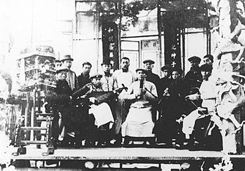
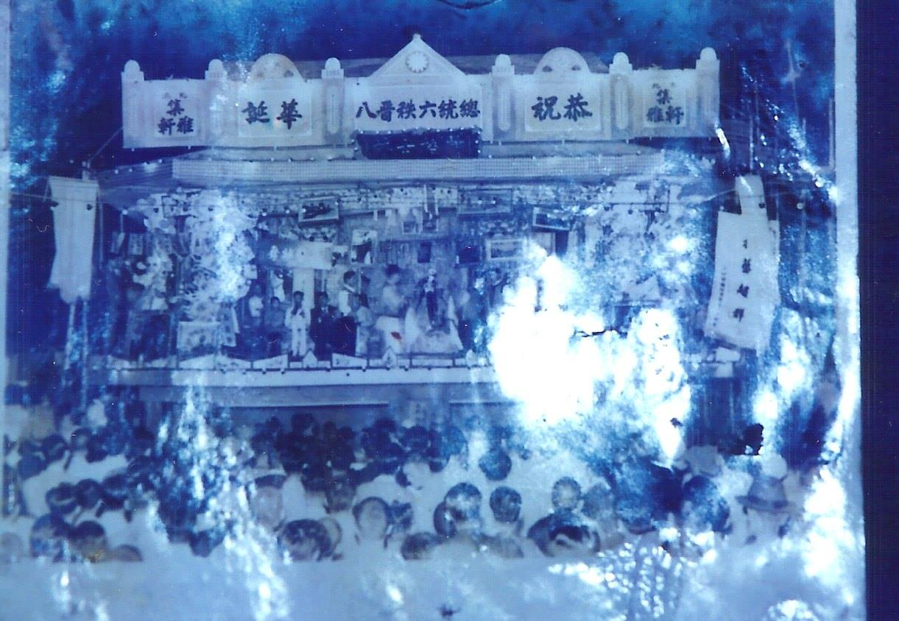

# 南北管

南管是以洞簫、琵琶、二弦、三弦、拍板和噯仔（小嗩吶）等十多種樂器組成，樂曲悠雅婉約、纏綿柔和。北港較早的南管樂團是「集斌社」（1746）和「武城閣」（1859），都有百年以上的歷史，爾後陸續成立「集英社」、「南華閣」、「集賢閣」、「錦樂社」、「新街錦陞社」等，但現在已漸漸沒落。

北港最早的南管「集斌社」曾獲當時巡撫**唐景崧**推薦入清宮演奏，光緒皇帝十分讚賞，頒賜「御前清曲」及涼傘一把。所以集斌社參與遶境時，前頭彩牌黃底繡龍上有「御前清曲」四字，並有涼傘一把前導。

## 集斌社

集斌社創立於乾隆十一年（1746），以朝天宮爲社址，之後有武城閣、南華閣、集賢閣及集英社等南管社團之成立，這都由集斌社帶動出來的，此應歸功於先祖**林杏水**之功勞。林杏水是清末駐廈門水師提督巡防臺灣，因篤信北港媽祖，而與笨港結緣。

當他到鹿港巡防炮臺時，不慎跌傷腳踝，以年紀已老辭官，並舉家遷居笨港，他能文能武，曾在聚奎閣教授詩文及武術，並精於書法，當年他手抄的「南管曲簿」八冊，以傳家之寶珍藏。

林杏水自少就浸潤南管音樂，退休後也去集斌社教授。光緒年間集斌社被臺灣巡撫唐景崧推薦到清宮演唱。光緒帝對林棟財（林杏水之子）、林尚泉父子檔更是讚賞，特頒賜「御前清曲」及涼傘一把。全體人員於榮歸笨港。所以集斌社迎媽祖參與遊行時，前頭彩牌黃底繡龍上有「御前清曲」四字，並有涼傘一隻前導，此項殊榮是全台獨一無二的，也是北港人的光榮。

▼ 照片中是特從臺北聘來攝影師拍照留念，其中涼傘就是光緒帝所賜，依照片中閣員服飾來看可能日據時代所拍攝。(引用自 [北港南管歷史 @ 唐龍-世界上沒有比真實更可貴者 :: 隨意窩 Xuite日誌](http://blog.xuite.net/sl5261/twblog/119296667-%E5%8C%97%E6%B8%AF%E5%8D%97%E7%AE%A1%E6%AD%B7%E5%8F%B2))

## 武城閣

北港武城閣於清咸豐九年（1859），由蔡本圭、蔡江河、蔡坎陽、蔡本港等四人在小西天（彌陀寺）創立的，屬於南管樂中的臥品。奉祀子游夫子與孟昶為祖師，每年八月丁日過爐兼吃會。

集斌社曾分出集英社（1930），武城閣則旁出南華閣（1941）和集賢社（1952），但因南管逐漸沒落，因後繼無人只剩集斌社和武城閣。公元1981年集斌社參加媽祖遶境時，因人手不足，便決定與武城閣合併成一隊參加遶境，後來武城閣亦因人手不足，參加媽祖遶境時需向笨港媽祖文教基金會的南管社借調人手。武城閣南管練習地點在光民里活動中心，會館則設於朝天宮仁和大樓。

集斌社目前又重新振興，借用新街里的活動中心聚會練習，也常應邀出陣演出。武城閣成立的目的，是因為對南管音樂的熱愛，聚會則純為參加排場演出和休閒娛樂，故武城閣除了參加農曆正月十五日、三月十九、二十日朝天宮媽祖遶境，以及寺廟祭典邀請演出與義務參加會員家中的喜喪行列外，並不為外人演奏。

## 北管

北管是以大鑼、大鼓和鈸等高亢明亮的打擊樂器為主，加上殼仔弦、二弦、中胡等弦樂器，配合吹奏樂器如嗩吶等，是迎神、酬神、廟會不可缺少的樂陣。一百多年前，本鎮的北管陣頭有「和樂軒」、「集雅軒」、「北港開路鼓」（現在的金聲順開路鼓）等，後來成立了「聖震聲開路鼓」、「振樂社」（以前有高蹺表演）等。

▼ 1955年。應士林鎮長之邀，北港集雅軒前往士林慈諴宮為蔣介石總統演奏祝壽。當年18歲的春生仙，也跟隨著父親、老前輩一同到慈諴宮的效忠閣演出。(引用自 [舊北港遊客中心](https://www.facebook.com/PeikangVC))

## 西樂

北港的西樂團有「新協社」（北港樂團的前身）、麗聲樂團、新生樂團、b#輕樂團。在媽祖遶境活動中，當年的南北管樂團和龍隊、獅陣，新協社在遊行隊伍中，特別顯眼和新鮮，頗受鄉親好評。

---

以上參考 [從笨港到北港](http://www.cuy.ylc.edu.tw/~cuy14/eBook/ch3-4.htm)

以上參考 [北港南管歷史 @ 唐龍-世界上沒有比真實更可貴者 :: 隨意窩 Xuite日誌](http://blog.xuite.net/sl5261/twblog/119296667-%E5%8C%97%E6%B8%AF%E5%8D%97%E7%AE%A1%E6%AD%B7%E5%8F%B2)
