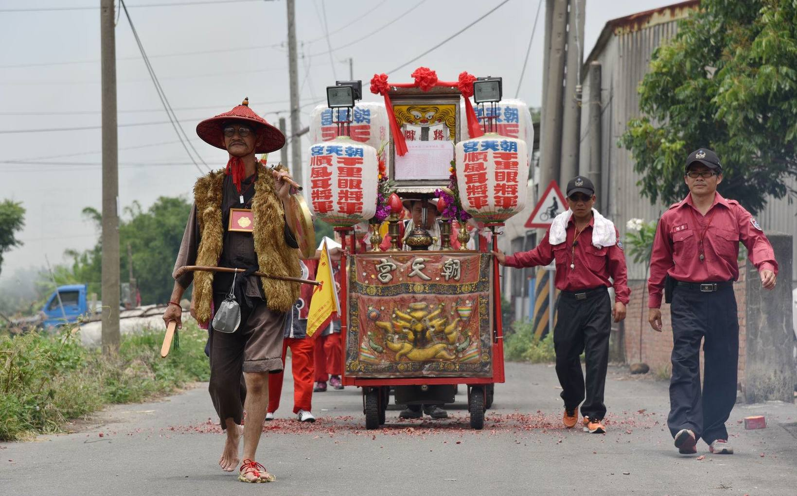
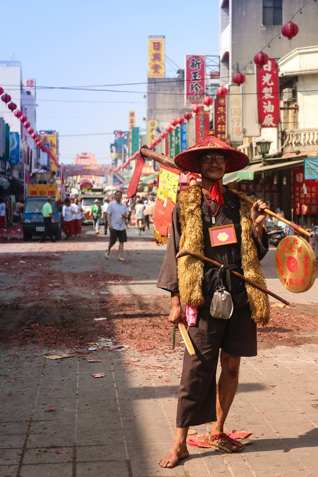
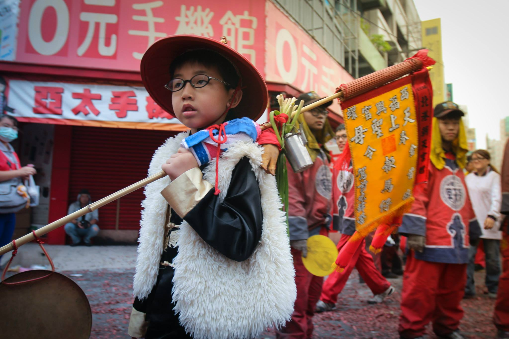
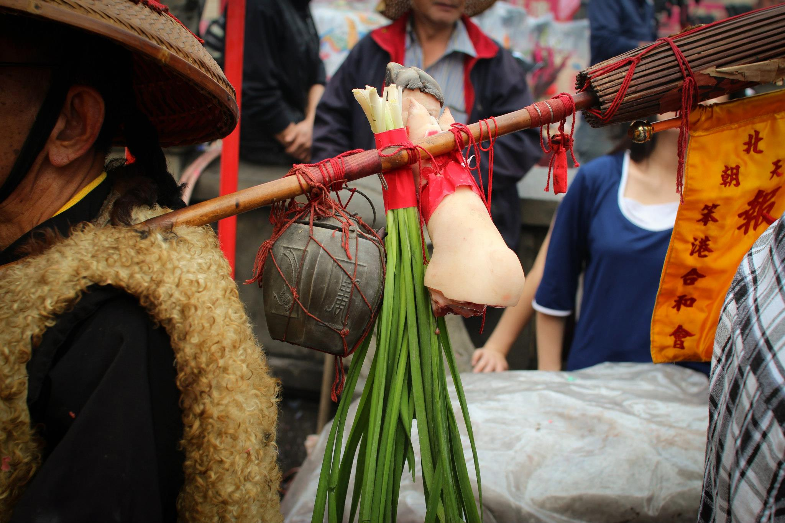
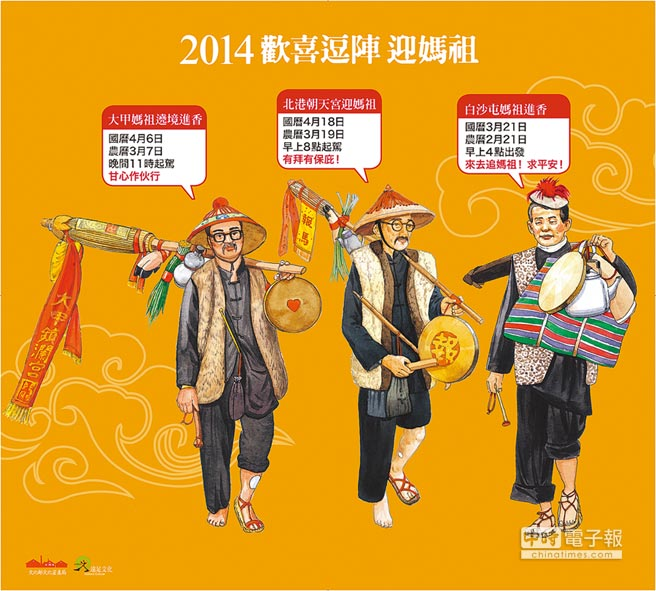

# 報馬仔

「報馬仔」是遶境隊伍的先鋒官，走在隊伍前端開道，遊行途中則是機動服務、連繫，其裝扮特殊，常是記者、民俗愛好學者捕捉的焦點人物。

## 起源

據說早期笨港報馬仔是許願而來，如祈求媽祖庇佑家人病癒或平安等，在駕前為媽祖服務，是義務職，也是神職。報馬仔也類似軍中的斥候或放哨、偵察、刺探敵情的人，在本省歌仔戲或布袋戲中常直呼為「報馬仔」，但也有稱為「探馬」。清代及民初，北港報馬仔裝扮就像平民百姓所穿服裝，頭戴斗笠，腳穿草鞋，身穿台灣黑色對襟上衣及長褲，手裡提著一面鑼（比今日報馬仔所提的鑼稍大些），在日據時代，則加上腰掛喇叭形傳聲筒。

▼ 2015 笨港報馬仔 - [李天賜](https://www.facebook.com/profile.php?id=100008459647954) ([Sean Wu](https://www.facebook.com/sean.wu.184) 攝)

當媽袓即將抵達至某街道時，報馬仔必先至該街之街頭或街尾、十字路口，提起銅鑼敲打，拉大嗓子或拿起傳聲筒大聲喊道：「恁大家呀！媽祖這陣在○○街，馬上巡到這裏來，請大家披在外口的衫褲趕緊收入厝內，準備香案桌，點香領接聖駕～～」

據北港耆老回憶，在「報馬仔」的追溯可由**陳義泉**之前的為**蔡老虎**，往上推溯為九十歲尚為聖母服務的**柯科**，再上推已不可考。陳義泉出任報馬仔共三十年，接替的**阿憨**和**陳萬得**因媽祖完成其心願，志願擔任駕前先鋒。目前阿憨已過世，陳萬得擔任二十五年，現因中風無法上陣，已過世的陳義泉曾在八十歲的高齡最後出陣。三位「報馬仔」陸續凋零，笨港文化會館為了傳承傳統，由陳義泉擲筊，獲媽祖同意交棒，於民國八十六年五月十二日晚，由會員逐一在媽祖神像剋擲筊，經「神意」擇定**蔡世昌**、**蘇棋源**二人，至此報馬仔才得以繼續傳承。

▼ 2015年 報馬仔 - [李天賜](https://www.facebook.com/profile.php?id=100008459647954) ([吳政賢](https://www.facebook.com/comdan66) 攝)

現在北港報馬仔之裝扮造型是**民國四十五年**由曾任北港朝天宮委員的蔡川精心設計。因當時報馬仔蔡老虎過世，蔡川鼓勵陳義泉繼承衣缽，設計一套報馬仔道具及服裝送給陳義泉，並告知其意涵，報馬仔從此有新風格。陳義泉先後於六十年傳給葉大順、陳萬得（再傳李富盛），八十六年傳授蔡世昌、蘇棋源。

▼ 2014年 小小報馬仔 ([吳政賢](https://www.facebook.com/comdan66) 攝)

 
## 造型

北港報馬仔裝備相當突出，身穿黑色台灣對襟上衣，上下鈕扣錯扣，外層反穿一件羊皮襖背心（原有羊毛一面穿在內），黑色台灣長褲；褲管一上捲近膝蓋，小腿可見有瘡疤一、二處，腳穿草鞋，另一褲管不上捲，但赤足。頭戴清官兵紅纓帽，留長辮。左肩挑一支特製未張開長柄紙雨傘，柄上依序前端（肩前）懸掛一面銅鑼，鑼心漆紅色；傘柄末端（肩後）懸掛錫壺一只，豬腳一隻，韭菜一束；韭菜及豬腳以紅紙箍一圈，並以紅棉繩繫掛在傘柄上。右手拿鑼槌，嘴上留一燕尾鬚（八字鬍鬚），眼戴一副無鏡片老花眼鏡，腰纏繞一布束腰帶，上插一支旱煙桿，桿上繫一繡花煙袋，造形深具地方特色，也蘊含人生哲理。

笨港報馬仔裝配其文化意涵和精神，可由下列幾句來總括：

* 認清本份，負責盡職。（紅纓帽）
* 言而有信，始終如一。（燕尾鬚、髮辮）
* 世事晦暗，明辨是非。（眼鏡）
* 忍受煎熬，出人頭地。（羊襖）
* 正直語善，長長久久。（兩傘、韭菜）
* 感恩惜福，社會和諧。（旱煙桿、煙袋、錫壺）
* 知足常樂，心平氣和。（豬足）
* 勞心勞力，成功在望。（鑼心）
* 人生坎坷，記取教訓。（瘡疤）
* 腳踏實地，善留形象。（赤足）
* 欣然服務，不計酬報。（衫褲）
* 代代相傳，長祐安寧。（煙袋、腳趾）

▼ 豬足、兩傘、韭菜、錫壺 ([吳政賢](https://www.facebook.com/comdan66) 攝)

北港報馬仔其文化意涵重於實質意義。報馬仔看似地位卑微，但其負有教化、開道、勸導、引導、傳達、協尋、為友廟進香活動服務之功能。特別要一提的是，北港報馬仔的造型，自陳義泉改革後，成為各地競相模倣的對象。陳義泉從民國五十九年，經大甲媽同意擔任往北港進香出廟時的駕前先鋒，並在北港引領入廟，直到民國七十七年大甲媽轉往新港後終止。現在大甲媽駕前的報馬仔由大甲人自扮，但造型仍延襲自北港報馬仔。

▼ 各地不同的報馬仔造型 (引自 [中時電子報](http://www.chinatimes.com/newspapers/20140309000683-260115))

---

以上參考 [從笨港到北港](http://www.cuy.ylc.edu.tw/~cuy14/eBook/ch3-4.htm)
