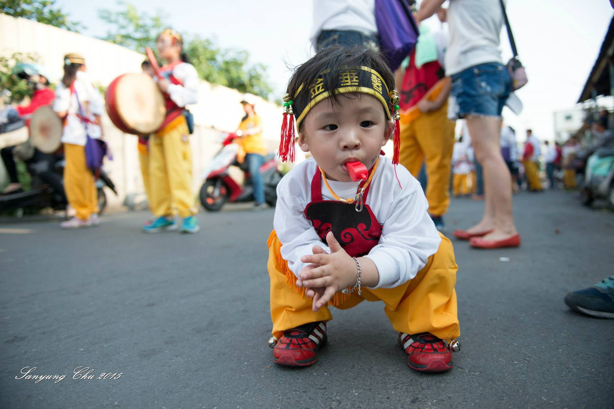
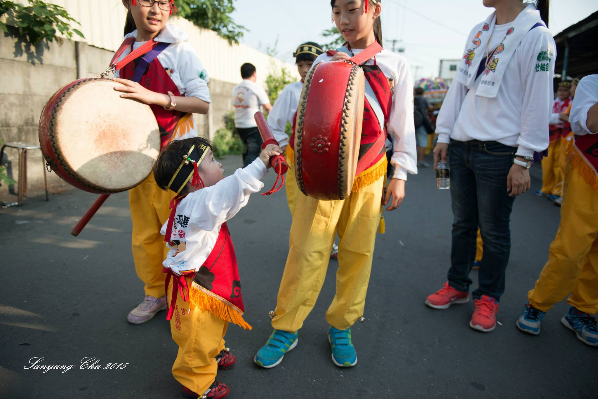

# 金垂髫

金垂髫太子爺會成立於公元1963年，由北港義勇消防隊成員組成。因義消在朝天宮設有金燭部販賣金紙，故組成本會。創會會長為許壬子先生。

初期太子爺會參加遶境時，神轎由小孩子來扛，參與扛轎的小孩頭戴髮帶，身圍肚兜，腳戴鈴鐺。由於小孩子較活潑，愛四處向民家搶炮，因此神轎常脫隊。後來因鞭炮的威力越來越強，常有小孩受傷（一說小孩容易累），必須由義消來接替。但遶境當天，義消要帶領陣頭、轎班，無法分身扛轎，故十多年前改將轎子放在推車上，請人來推。

民國八十七年再恢復舊制，由金垂髫轎班會的委員召集國小五年級以上及國中的學生150名來抬轎，原則上讓北港鎮各里的小孩子都有機會參加。轎子也改用較輕的藤轎，小孩扛轎無須特別訓練，只要在遶境前幾天排演一下就可以了。

▼ 朝天宮金垂髫太子爺神轎的小朋友 ([朱聖詠](https://www.facebook.com/profile.php?id=100000478842348) 攝)

初期太子爺會參加遶境時，神轎由小孩子來扛，參與扛轎的小孩頭戴髮帶，身圍肚兜，腳戴鈴鐺。由於小孩子較活潑，愛四處搶炮，因此神轎常脫隊亂跑，後來因鞭炮的威力越作越大，常有小孩受傷（一說小孩容易累），找不到人來接替，必須由義消人員來接替抬轎的工作，而義消人員在媽祖遶境當天又要帶領陣頭、轎班，實在無法再接替小孩來扛轎，因此在民國68年時重新製造一頂新轎，改用輪子請人來推。

民國85年於轎班會員大會決議恢復由小朋友來抬轎，由退休的義消人員提議組成轎班籌備委員會，當時的義消分隊長 呂家發先生擔任籌備會會長，開始對外招募委員及資金，從新打造一頂八人抬藤轎、製作太子爺小朋友團體服（紅肚兜、黃長褲、黑頭巾、白內衣），並于民國86年農曆元月15日上元媽祖遶境時，募集100多名國小五、六年級小朋友來抬轎，結果造成轟動。讓北港地區的民眾耳目一新，並在農曆的3月1日召開轎班委員會，正式取名北港朝天宮金垂髫太子爺轎班委員會，推選呂家發先生擔任會長，再募集150名國小五、六年級小朋友參加 北港三月十九、二十 北港迓媽祖，爾後每年的北港迓媽祖都會有**朝天宮金垂髫太子爺神轎**及小朋友的參與。

▼ 朝天宮金垂髫太子爺神轎的小朋友 ([朱聖詠](https://www.facebook.com/profile.php?id=100000478842348) 攝)

---

以上參考 [從笨港到北港](http://www.cuy.ylc.edu.tw/~cuy14/eBook/ch3-4.htm)

以上參考 [北港朝天宮金垂髫太子爺](https://www.facebook.com/pages/%E5%8C%97%E6%B8%AF%E6%9C%9D%E5%A4%A9%E5%AE%AE%E9%87%91%E5%9E%82%E9%AB%AB%E5%A4%AA%E5%AD%90%E7%88%BA/223356751026430)
