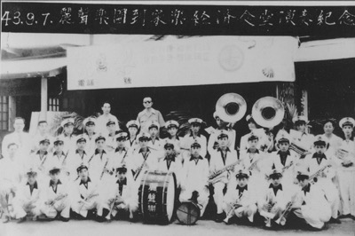

# 麗聲樂團

麗聲樂團創立於日據時期（民國二十五年），由當時「新協社」部分成員組成。初創會員180人之多，由於少有新會員加入，且會員年齡多半在五、六十歲以上，因此參加遶境時，除了會員，還會請麗聲樂團的老師及其學生教授北港農工或崇先高中學生來幫忙。

麗聲樂團過去借用義民廟旁房子當會館，後來該建物因老舊拆除改建，麗聲樂團因無會館，缺乏練習的場所，除了農曆三月十九、二十日的遶境活動外，幾乎少有活動，且遶閡之前亦須先開會決定是否參加遶境。有不少團員在三家電視台（台視、中視、華視）樂隊工作，遶境時都會回來幫忙。

▼ 麗聲樂團 (引自 [從笨港到北港](http://www.cuy.ylc.edu.tw/~cuy14/eBook/ch3-4.htm))

---

以上參考 [從笨港到北港](http://www.cuy.ylc.edu.tw/~cuy14/eBook/ch3-4.htm)
